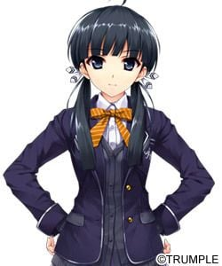

> [!bookinfo|noicon]+ **寻找失去的未来**
> 
>
| 日文名 | 失われた未来を求めて |
|:------: |:------------------------------------------: |
| 类型 | 游戏改 |
| 新番 | 2014 年 10 月 |
| 集数 | 共12话 |
| 官网 | [http://ushinawareta-mirai.com/](https://http://ushinawareta-mirai.com/) |
| 制作 | feel. |
| 导演 | 細田直人 |
| 脚本 | 村井さだゆき,篠塚智子,髙橋龍也 |
| 评分 | 5.8|
| 制片人 | 吉田啓祐 |

> [!abstract]+ **简介**
> 　　主人公·秋山奏隶属于学校的天文学会，而天文学会当中有着许多个性丰富的成员。他们在一起解决发生在内滨学园的各种怪异事件。而他之所以加入天文学会，也有着一段不为人知的故事：某天因为受伤的关系，他放学后不得不继续留在学校的保健室当中，这时他却听到教学楼方向传来奇怪的声音。而当他急忙赶到现场后，居然发现一名全裸的少女倒在地上！这个名叫古川唯的少女虽然没有明确表露身份，但似乎早就认识秋山奏的样子。第二天秋山奏就加入了天文学会，然后受到学生会的委托，开始与天文学会的成员一起调查学校周围发生的“校内幽灵事件”、“睡眠病”、“事故频发地区”等灵异事件…… 

> [!tip]+ **章节列表**
>- [ ] 第1话：失去的未来 (2014-10-04)
>- [ ] 第2话：她与幽灵的存在证明 (2014-10-11)
>- [ ] 第3话：会长晶莹的眼眸里映着梦想 (2014-10-18)
>- [ ] 第4话：万物在流转 (2014-10-25)
>- [ ] 第5话：量子猫与水滴的去向 (2014-11-01)
>- [ ] 第6话：笼中鸟的去向相谈 (2014-11-08)
>- [ ] 第7话：239万光年的思念 (2014-11-15)
>- [ ] 第8话：流星擦肩而过 (2014-11-22)
>- [ ] 第9话：通往过去的门 (2014-11-29)
>- [ ] 第10话：剩下的时间 (2014-12-06)
>- [ ] 第11话：明天 我们还能相见吧 (2014-12-13)
>- [ ] 第12话：有你的未来 (2014-12-20)
>- [ ] 第13话：追寻失去的暑假 (2015-05-27)

> [!tip]+ **主要角色**
> 
| 角色 | CV | 简介| 角色图片 |
|:----:|:---:|:---:|:--------:|
| 支倉愛理 | 瑞沢渓 | 天文学的会长，也是校内的第一才女。 大多数事都能轻松处理，但受不起奉承，很容易得意忘形。 可能是有练合气道，所以从以前起就是打架强得无人能敌。 ……但是，实际上在打架时几乎都是踢倒对方而不是用技巧打倒的。 |  |
| 佐々木佳織 | 高田初美 | 有着在以二年级生为对象的“想要取为新娘投票竞选赛”中取得前三甲的姿色。 内心坚强性格认真，可以说是学会内良心般的存在。 把奏看作是兄长一样，也同时憧憬着和他的恋人关系 |  |
| 古川ゆい | 友永朱音 | 与奏他们有冲击性的相遇，谜样的转校生。 文静，有少许天然呆之处。 天文学会室的看家公主。 |  |
| 華宮凪沙 | 民安ともえ | 和学园理事长有远房亲戚关系的大小姐。 举止优雅，和瞄准致命伤的语言攻击，和愛理在不同的意义上君临着天文学会。 个子小但有着相当好的身材。 |  |
| 秋山奏 | 寺島拓篤 | 本作的主人公。 双亲因工作经常不在家，所以在佳織家里的别屋借住。 装傻功夫很好！ 吐槽功夫也很好！ 是天文学会多样的话题负责人。 那很自然的温柔体贴是卖点 |  |
| 長船・KENNY・英太郎 | 山口勝平 | 说一口装腔作势的英语，从美国来的交换留学生。 多得他那不畏惧任何事豁达的心，让他成为了天文学会成员的玩具。 重视朋友，当朋友有危难时马上就赶到 |  |
| 佐々木詩織 | 後藤邑子 | 佳織の母親。奏の両親とは友人（同僚の研究者）で、その縁で奏を預かっている。普段は優しい人だが、奏や佳織が悪さをすると長時間の説教をすることもあり、2人はかなり恐れている。 |  |