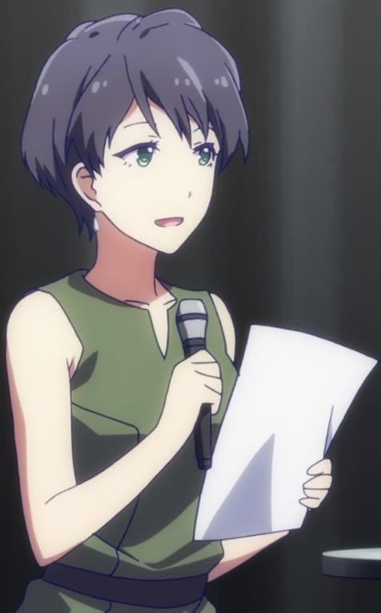

> [!bookinfo|noicon]+ **少女编号**
> 
>
| 日文名 | ガーリッシュ ナンバー |
|:------: |:------------------------------------------: |
| 类型 | 小说改 |
| 新番 | 2016 年 10 月 |
| 集数 | 共12话 |
| 官网 | [http://www.tbs.co.jp/anime/gn](https://http://www.tbs.co.jp/anime/gn) |
| 制作 | diomedéa |
| 导演 | 井畑翔太 |
| 脚本 | 菅原雪絵,渡航,さがら総 |
| 评分 | 6.6|
| 制片人 | 天野翔太 |

> [!abstract]+ **简介**
> 　　拥有可爱的外表以及蔑视世间内心的女大学生·乌丸千岁，在怀抱着梦想与希望与野心踏入的声优业界，她所见到的是，残酷业界的种种严苛现实——。无工作×无干劲的新人声优·千岁，究竟能否开辟通往人气声优的道路！？

> [!tip]+ **章节列表**
>- [ ] 第1话：混混噩噩的千岁与腐败不堪的行业 (2016-10-06)
>- [ ] 第2话：自负的千岁与无声的悲鸣 (2016-10-13)
>- [ ] 第3话：邪门歪道的千岁与剧情老套的发展 (2016-10-20)
>- [ ] 第4话：得意洋洋的千岁与兴高采烈的伙伴 (2016-10-27)
>- [ ] 第5话：受人表扬的千岁和攒锋聚镝的评价 (2016-11-03)
>- [ ] 第6话：海滨风光的千岁与批不下来的预算 (2016-11-10)
>- [ ] 第7话：看热闹的千岁与授课参观 (2016-11-17)
>- [ ] 第8话：爱睡懒觉的千岁与浴雾缭绕的旅情 (2016-11-24)
>- [ ] 第9话：焦躁不安的千岁与风驰电掣的新人 (2016-12-01)
>- [ ] 第10话：步入歧途的千岁与低眉倒运的废物 (2016-12-08)
>- [ ] 第11话：动摇的千岁与下定决心的悟净 (2016-12-15)
>- [ ] 第12话：乌丸千岁与…… (2016-12-22)

> [!tip]+ **主要角色**
> 
| 角色 | CV | 简介| 角色图片 |
|:----:|:---:|:---:|:--------:|
| アナウンス | 岩井映美里 | 各作品通用广播/播音员。 |  |
| 烏丸千歳 | 千本木彩花 | 本作的主人公，长相可爱但个性很差的新人声优。一边上大学一边在新人声优的道路上努力奋斗着。外表可爱，却对工作和人生采取轻蔑的态度。很容易得意忘形，很容易服输。对于尽在演些路人角色的现状有着危机感。 |  |
| 苑生百花 | 鈴木絵理 | 现役女高中生声优。在偶像、声优、音乐界都很活跃的高中生。双亲是业界的大人物，虽然也有着性格有些狂妄自大的一面，但比起千岁来还算是有常识。 |  |
| 柴崎万葉 | 大西沙織 | 自视甚高系声优。虽然很受欢迎，但却总接一些有关轻改动画以及除表演以外的工作，对于这一现状感到不满。作为艺人，对于声优过分执著，经常和周围发生冲突。 |  |
| 久我山八重 | 本渡楓 | 千岁在声优养成所的同期友人。体质容易发胖，因此一年到头总是在节食。 |  |
| 片倉京 | 石川由依 | 关西出身。和千岁隶属于同一事务所，却完全没法把自己推销出去，26岁还在靠打工维生。 |  |
| 九頭P | 中井和哉 | 企划·制作动画作品的精明干练制作人。外表与内在都相当轻浮。 |  |
| 烏丸悟淨 | 梅原裕一郎 | 千岁的哥哥与经纪人，对于妹妹的态度感到头痛。 |  |
| 十和田AP | 江口拓也 | 辅佐九头P的助手制作人。性格温和，由于上司很轻浮的缘故因而工作的样子很认真。 |  |
| 難波社長 | 堀内賢雄 | No.1 Produce的社长。性格豪爽又容易起劲。 |  |
| イベントMC | 榎吉麻弥 |  |  |
| 万葉マネ | 榎木淳弥 |  |  |