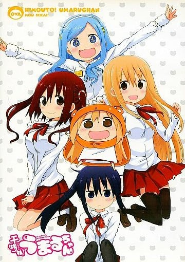
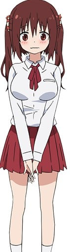

> [!bookinfo|noicon]+ **干物妹！小埋 OAD**
> 
>
| 日文名 | 干物妹! うまるちゃん OAD |
|:------: |:------------------------------------------: |
| 类型 | 漫改 |
| 新番 | 2015 年 10 月 |
| 集数 | 共2话 |
| 官网 |  |
| 制作 | 動画工房 |
| 导演 | 太田雅彦 |
| 脚本 | あおしまたかし |
| 评分 | 6.6|
| 制片人 |  |

> [!abstract]+ **简介**
> 单行本第7、10卷限定版同捆OAD

> [!tip]+ **章节列表**
>- [ ] 第13话：小埋 再一次！ (2015-10-19)
>- [ ] 第14话：小埋的秘密 (2017-04-19)

> [!tip]+ **主要角色**
> 
| 角色 | CV | 简介| 角色图片 |
|:----:|:---:|:---:|:--------:|
| 土間うまる | 田中あいみ | 本作主角，平时被称为小埋（うまる），亚麻色的长发。 荒矢田高中的学生，在学校时行为端庄靓丽，学习成绩和运动优秀的好女生，被形容为美妹（美妹（びもうと）），但回到家後，就会变成披着仓鼠型的睡衣，十分好吃懒惰和沉迷於ACG的乾物妹（干物妹（ひもうと）），形象被描绘为二头身的形象。起居基本由哥哥一手包办，十分依赖哥哥，但没有哥哥会十分寂寞。养有两只仓鼠，命名为仓鼠二郎和仓鼠三郎。]喜欢可乐丶方便面丶薯片等零食，不喜欢食青椒。外出购买ACG产品或前往游戏中心时会装扮成另一副模样隐藏自己（换上悠闲装，带上帽子并束起长发），在游戏中心的游戏玩家名为UMR（UMR（ユーエムアール）），曾经在游戏中心遇上希尔芬并为了不被认出而多加了眼罩。 切绘来小埋家找小埋被见到在家摸样的小埋但没被认出，并谎称自己为「小困」并和切绘成为在家时的好友；在游戏中心比赛时遇到史鲁芬而以UMR的身份成为好友并相互留有手机联系。 在校时被谣传为家境富有，後来去史鲁芬家时发现可能谣言与希尔芬的家境搞混了。 |  |
| 海老名菜々 | 影山灯 | 小埋的同班同学和朋友，小埋称呼其为「小海老名（海老名ちゃん）」，其他人则直呼其姓。和土间家住在同一座公寓。秋田县农家出身，巨乳，性格比较害羞没自信。食量很大，当见到食物时会忍不住肚子鸣叫，家里有厨房来自己煮食和两个冰箱来存放食材，感到好吃时会发出秋田口音。也是十分温柔的人。 太平曾经送了一个猫毛娃娃给她而隐约喜欢太平。  「キャラクター人気投票」の総合結果は第1位。 |  |
| 橘・シルフィンフォード | 古川由利奈 | 小埋的同学，蓝色长发和闪亮的眼睛。和小埋同样成绩优秀，视小埋为竞争对手，性格十分活跃，喜欢张扬自己，但又有少许的天然，所以缺少交往的朋友。 在一次游戏中心比赛时遇到了游戏中心打扮的小埋「UMR」，快赢到决赛时由於见到自己的哥哥怕被发现而逃离了，但之後和「UMR」身份的小埋相熟并相互留有联系，也因此接触到ACG文化而和哥哥有所交流。 |  |
| 本場切絵 | 白石晴香 | 小埋的同学，本场猛的妹妹，由於开学时打过前来参观的哥哥，而且平时眼神看上去很凶狠，所以被同学认为不好相处，但实际是相当怕生笨拙。 在起初因为最终鼓起勇气和在学校的小埋搭话而和小埋成为朋友。在一次小埋的学生证丢掉被她捡到送去小埋家时，见到了在家的小埋，但没认出并被小埋糊弄自己是小埋的妹妹「小困（こまる）」，被在家小埋的样子萌到而认在家小埋为师傅，并经常和小埋家玩，并与在外模样的小埋和海老名成为朋友。 |  |
| 土間大平 | 野島健児 | 小埋的哥哥。带着眼镜和比较平庸的样子，在一家信息技术运营支援公司工作，平时在家会照顾小埋的起居并因此十分熟练家务，虽然对小埋的在家宅女般生活十分不满，但认为是自己宠成的，仍十分喜欢小埋。对朋友也十分地温柔。有驾照，但没实际驾驶过。 故事发生10年前还是高中生时就已经成绩优秀。 |  |