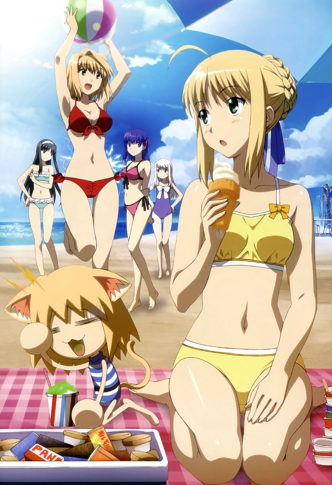
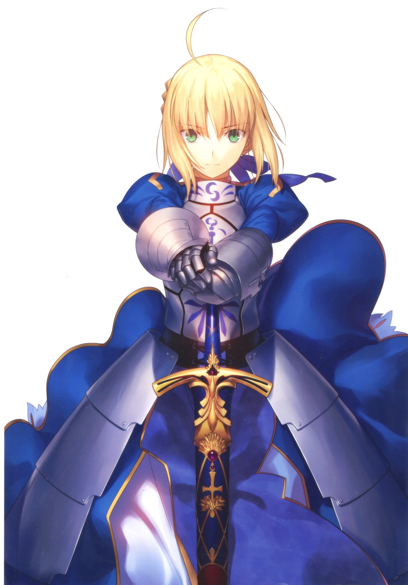
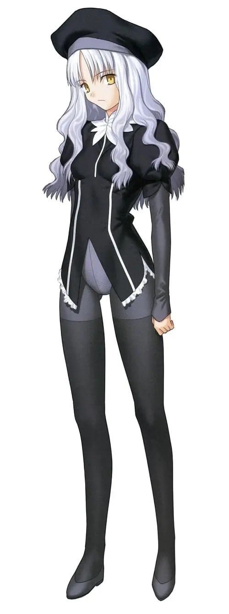
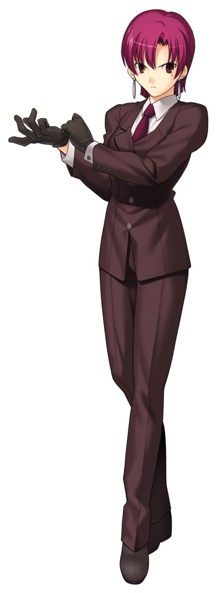
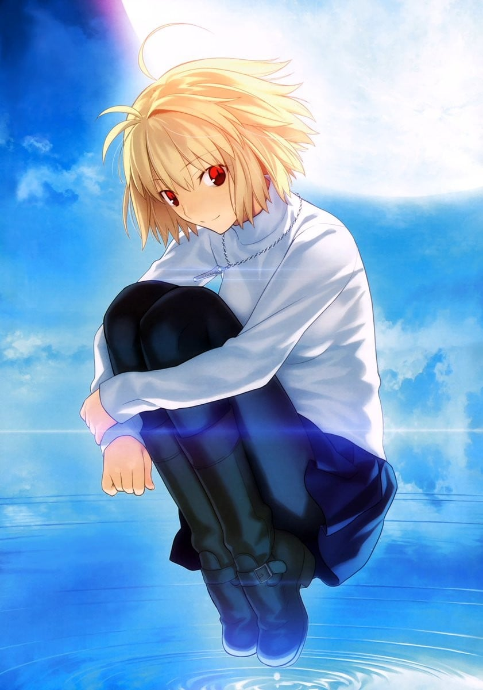
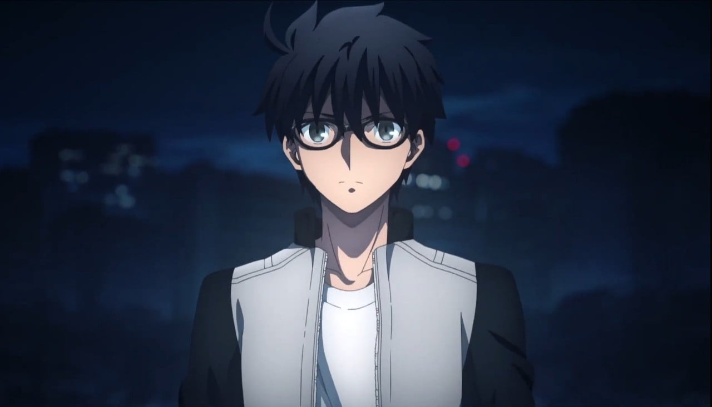
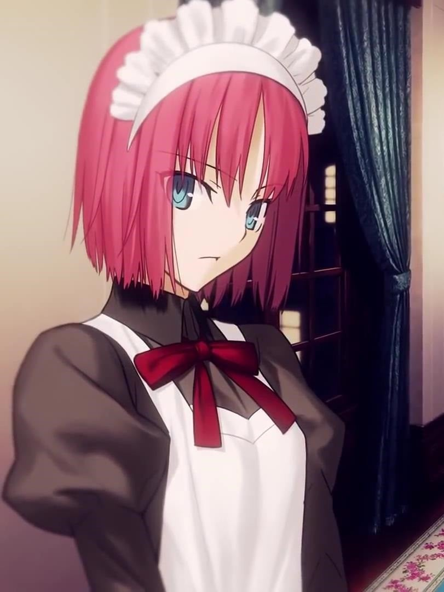
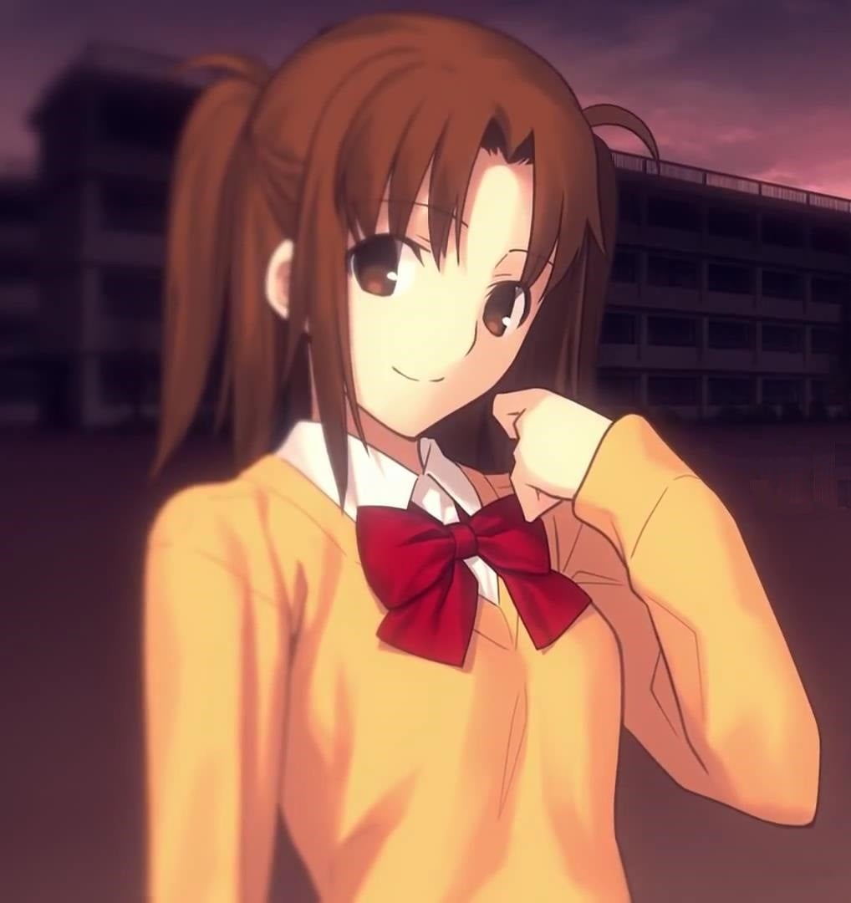
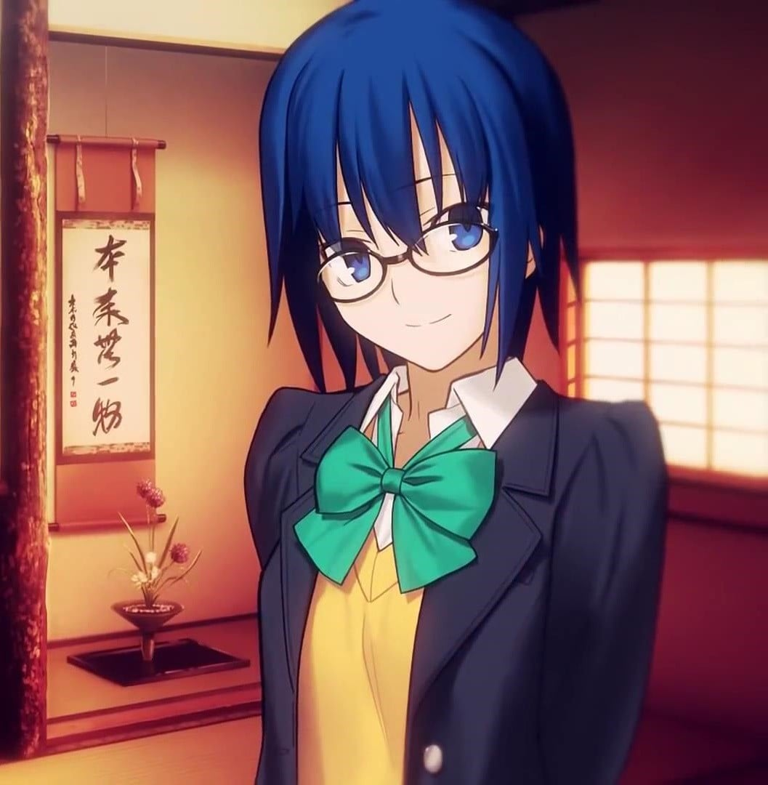

> [!bookinfo|noicon]+ **幻想嘉年华**
> 
>
| 日文名 | カーニバル・ファンタズム |
|:------: |:------------------------------------------: |
| 类型 | 游戏改 |
| 新番 | 2011 年 8 月 |
| 集数 | 共12话 |
| 官网 | [http://www.typemoon.com/products/cp/index.html](https://http://www.typemoon.com/products/cp/index.html) |
| 制作 | ラルケ |
| 导演 | 岸誠二 |
| 脚本 | 上江洲誠 |
| 评分 | 7.6|
| 制片人 |  |

> [!abstract]+ **简介**
> 在一间由猫经营的酒吧里，有一群猫在谈话。从他们的言谈之间可以隐约得知，一场可能会打破时空之间界限的狂凶之盛宴即将到来。
冬木市再度举行了让魔术师为之疯狂得“圣杯争霸战”，参与争夺的卫宫士郎、Saber、远坂凛、Archer、葛木宗一郎、Rider等人，结成不同的小组并且对圣杯都抱着势在必得的野心。然而出人意料的是，这一次必须改以网球、花牌、抽卡片、黑胡子等民间游戏来决定胜负。
就在所有参赛者纷纷于游戏中精疲力尽之时，圣杯赫然出现在大家面前。对圣杯痛恨无比的卫宫士郎，决定以投影出来的武器将之毁灭，不料被劈开的圣杯中竟然冒出了原本不属于这个时空里的猫姬！
随着猫姬的到来，一场将不同次元里的魔术师纠缠在一起的厮杀，无可避免地正式揭开了序幕。

> [!tip]+ **章节列表**
>- [ ] 第1话：第5次魔术师大激突圣杯战争 (2011-08-14)
>- [ ] 第2话：心跳☆Melty Blood (2011-08-14)
>- [ ] 第3话：哪里都是白日梦 (2011-08-14)
>- [ ] 第4话：心跳心跳约会大作战 (2011-08-14)
>- [ ] 第5话：Berserker的初次跑腿 (2011-10-28)
>- [ ] 第6话：型月晨间小说连续剧 樱 (2011-10-28)
>- [ ] 第7话：万能礼物 (2011-10-28)
>- [ ] 第8话：工作的Saber (2011-10-28)
>- [ ] 第9话：圣杯大奖赛 (2011-12-31)
>- [ ] 第10话：洗脑侦探返老还萝莉 (2011-12-31)
>- [ ] 第11话：FINAL DEAD LANCER (2011-12-31)
>- [ ] 第12话：心跳约会大作战 解答篇 (2011-12-31)
>- [ ] 第1话：风云伊莉雅城 (2011-10-28)

> [!tip]+ **主要角色**
> 
| 角色 | CV | 简介| 角色图片 |
|:----:|:---:|:---:|:--------:|
| アルトリア・ペンドラゴン | 川澄綾子 | Fate/stay night 被卫宫士郎召唤的英灵。作为三骑士之一的Saber，以「最优秀的剑之骑士」闻名。她曾在第四次圣杯战争中被召唤，当时士郎的养父——卫宫切嗣是她的Master。 她的真实身份是英格兰传说中的英雄——亚瑟王。从石中拔出选王之剑的少女「阿尔托莉雅」，为了成为理想的君主而隐瞒了自己的性别。然而，在内乱中目睹国土荒废的她，认为自己未能胜任王者之位，因此渴望借由圣杯重新选定合格的王，以拯救祖国不列颠。 她拥有不负传说之名的强大力量，但由于与士郎之间缺乏魔力的“通路”，常因魔力不足而陷入苦战。性格极其刻板认真，对于自己是女性的自觉也相当淡薄，以至于一开始总与士郎意见不合。但最终，她在与士郎的相处中肯定了自己的人生，并决心摧毁寄宿着“此世全部之恶”的圣杯。对她而言，能让自己镜像一般的士郎成为Master，或许是再幸运不过的事情了。  Fate/Zero 传说中的骑士王亚瑟现界的身姿，真名是阿尔托莉雅。卫宫切嗣召唤的从者，召唤时所用的圣遗物是Excalibur的剑鞘，她在第四次圣杯战争中保护着作为代理Master的爱丽丝菲尔。 传说中的亚瑟王是男性，那是因为她为了统治方便而隐瞒了性别。拔出选定之剑后身体便不再成长与老化，因此一直是少女的模样。高尚而廉洁、认真而顽固，怀抱的愿望是拯救曾经走上灭亡之路的祖国不列颠。  Fate/Grand Order 不列颠传说中的王。也被誉为骑士王。阿尔托莉雅是幼名，自从当上国王之后，就开始被称为亚瑟王了。在骑士道凋零的时代，手持圣剑，给不列颠带来了短暂的和平与最后的繁荣。史实上虽为男性，但在这个世界内却似乎是男装丽人，行为举止都以男性为标准，因此很不擅长应对异性向自己表达的好感。 崇尚万人眼中正确生活、正确人生的理想王者之一。锄强扶弱，是个无可非议的人物。冷静沉着，无论何时都十分认真的优等生。尽管如此……虽说从不愿意开口承认，但她却有着不服输的一面。对任何需要一争高下的事都不会手下留情，一旦败北则会非常懊悔。 她具有指挥军团的天生才能。在团体战斗中，可令我军的能力提升。贯彻清廉正直，大公无私的王。其公正令骑士们愿意守护于她的身旁，令民众们在对贫困的忍耐中看到了希望。她的王者之路并不是为了统帅少数强者，而是为了领导更多无力之人而存在的。 亚瑟王传说以骑士时代的终结为结局。亚瑟王虽然击退了异民族，但却无法回避不列颠土地的毁灭。圆桌骑士之一·莫德雷德的反叛导致国家一分为二，骑士之城卡美洛也失去了其辉煌。亚瑟王在卡姆兰之丘成功讨伐了莫德雷德，自己却也因负重伤而倒下。在去世前，她将圣剑交给了最后的心腹贝德维尔，离开了这个世界。死后她被送往了理想乡——不存于此世的乐园·阿瓦隆，并打算在遥远的未来再次拯救不列颠。 |  |
| カレン・オルテンシア | 小清水亜美 | 银发金瞳的美少女，冬木教会的代理司祭，Lancer和吉尔伽美什的Master。接替言峰绮礼，在第五次圣杯战争之后半年，由圣堂教会派到冬木市调查疑似圣杯的魔力波动的真相。  在重现夜之圣杯战争的无限往复的四天里，多次与被Avenger附体的卫宫士郎接触，不断给予他提示和引导，令他终于认识到自己的真身，并下决心终止“永续圣杯战争”的愿望。在故事的最后陪伴主人公登上天梯，使后者得以到达圣杯并同那里的巴泽特进行接触。 |  |
| バゼット・フラガ・マクレミッツ | 生天目仁美 | “夜之圣杯战争”的主人公/女主角。23岁，爱尔兰人。隶属魔术协会的封印指定执行者，被派遣到冬木市参加第五次圣杯战争，召唤出库丘林，Lancer英灵的原Master。 在圣杯战争开始之前被言峰偷袭，失去左臂连同与Lancer的契约。处于濒死状态的她，求生意念被圣杯感知，从而与重生的Avenger缔结契约，在后者的帮助下驻留灵魂并在无限的四日循环里参与由Avenger/圣杯重现的“圣杯战争”。 随着经历的积累，终于察觉自身处境的异样，并回忆起自己遭袭以及和Avenger契约的真相。但出于对现世的绝望，拒绝终止无限的四日，而宁可在虚假的世界里活下去。在故事最后，其徘徊在圣杯里的灵魂被Avenger说服，重拾向未来迈进的勇气并终止了四日循环。 现世中的巴泽特在假死半年后，事实上是被卡莲发现和救助，最终苏醒过来。 出身于被称为传承保菌者的魔术师家系，携带以后发先至、一击必杀为概念的迎击宝具——斩击战神之剑，加上本身出色的体术和魔术，具有同英灵正面对决的实力。有“人间凶器”的称号。 虽然外在强悍但内心非常软弱。与言峰绮礼在某次任务中相识，并很快对后者产生信任和倾慕的感情。对于来到远东参加圣杯战争抱有很大期待也是因为言峰的缘故。 |  |
| アルクェイド・ブリュンスタッド | 柚木涼香 | 生存了八百年以上的吸血鬼，真祖的公主。   《月姬》的故事开始时，Arcueid 来到远野志贵所住的城市，目的是消灭数百年来她不断追杀的一名吸血鬼。她在寻找目标时，偶然遇到了志贵；受退魔一族本能支配的志贵跟踪她回住处，以苏醒的杀人技巧和直死之魔眼瞬间将她分割成十七块。身为真祖的她虽然没死，却身受重创；本来想杀死志贵报仇，但在四周都是敌人及身体衰弱的情况下决定迫使志贵协助她。 |  |
| 遠野志貴 | 小林由美子 | 本作的男主角，个性上随和，因为八年前的事件而拥有可杀死万物的“直死之魔眼”。为避免带给脑部过大的负担，平常则是戴着“魔眼杀”的眼镜来抑止。  真实身分是退魔者七夜一族，被远野家灭族后发现，因与远野家长子四季名字同音而被收养（也是因为远野慎久想借七夜家遗孤来抑止自己的反转冲动）利用催眠窜改记忆，而当成自己的儿子收养。体能上其实相当优越，不过有偶发性的贫血，外貌看起来就像个文弱书生，和好友乾有彦有相当的深交。 |  |
| 遠野秋葉 | ひと美 | 远野志贵的妹妹，本作里篇的女主角之一，远野家的现任当家。无论是外表或是礼仪态度上都无懈可击，个性上十分刚强，小时候则是完全相反的柔弱性格。对志贵有相当的执著心，抱有着超越兄妹的感情，志贵回到远野家的也是秋叶的命令。  就读隔壁县的浅上女子学院，原本在浅上女子学院住宿，因为志贵搬回而改为通勤上课。在浅上有好友月姬苍香、三泽羽居，与具有未来视能力的学妹濑尾晶三人。  远野家实际上是混有鬼之血的一族，偶尔会出现像秋叶名为“红赤朱”的反转现象。红赤朱是远野家出现反转现象时所称之名，此时头发会变红，名为“槛发”，会拥有特殊能力“掠夺”，本作中秋叶用来掠夺对手的热。 |  |
| 巫淨翡翠 | 松来未祐 | 远野家的女仆，双子的妹，本作里篇的女主角之一，和姊姊琥珀从小被远野家收养，个性沉默寡言，不擅于表达自己的态度或意见。有着极度的洁癖症，在远野家担任除了厨房外的一切杂务（想自杀请让翡翠做饭=v=）。自从志贵回来后也负责照顾志贵的生活起居，不过有男性恐惧症。  翡翠属于两仪、浅神、巫净、七夜四家退魔一族中的巫净家，巫净家的能力不像其他三家仅能透过血缘继承，而可经由知识、技术教授。但翡翠和琥珀则是因为血缘关系而继承其能力。 |  |
| 巫淨琥珀 | 高野直子 | 远野家的烹饪妇，双子的姊，本作里篇的女主角之一，个性开朗明亮，和沉默的翡翠为正反的存在，但有着悲惨的过去。负责控管远野家金钱使用和健康管理，过去负责照顾远野前当家，因此现在也负责照顾秋叶的生活起居。  兴趣是研究药草和种植植物（有毒居多），其房间也是家里唯一有电视、监视器等电器设备的房间。  在远野家受害最深的人，早在慎久在生时便被迫受凌辱来抑止他的反转冲动，而现在又为秋叶提供血液抑止她的冲动。   琥珀也属于两仪、浅神、巫净、七夜四家退魔一族中的巫净家，巫净家的能力不像其他三家仅能透过血缘继承，而可经由知识、技术教授。但翡翠和琥珀则是因为血缘关系而继承其能力。 |  |
| 弓塚さつき | 南央美 | 志贵的同学，国中被志贵救了之后，从此对主角存有好感，据称原本应该有专属路线，但被删成为最悲情的路人。因意外成为吸血鬼，一脚踏进了非人的世界，最后被主角刺中死点死亡。  有成为吸血鬼的资质，百年难得一见的人才，一般人花数十年才能成为吸血鬼，她一夜即可达成，能够挑战27祖实力的有力候选人之一。拥有固有结界“枯竭庭园”，但实际使用上无法确定。 |  |
| シエル | 佐久間紅美 | 在《月姬》故事中突然出现于远野志贵等人身旁的学姐，就读三年级。对志贵周遭的大小事都相当关心，而志贵在遇到问题时也会寻求她的协助。咖哩魔人，每天三餐吃咖哩。  真正身份是埋葬机关中排名第七位的代行者，手持黑键，负责歼灭吸血鬼，拥有卓越的身体能力、魔术能力、庞大知识，以及毫无感情的冷彻。和其他的代行者完全处不来，通常都是单独行动居多。因为罗亚的缘故成为了不死者，自此不断的追杀罗亚。最大武器为第七圣典，概念能力是否定轮回，基本上是对罗亚专用武器。 |  |
| ギルガメッシュ | 関智一 | 号称拥有最强宝具的Servant，将其他所有人都蔑称为“杂种”的傲慢的王者。其真身乃是人类最古老的英灵——英雄王吉尔伽美什。 |  |
| 衛宮士郎 | 杉山紀彰 | 穗群原学园（Homurabara）高中部二年级学生及见习中的魔术师、10年前冬木市（Fuyuki）大火中的少数生还者之一。被身为魔术师的卫宫切嗣所救并收养，受卫宫切嗣的影响，是个英雄迷，并发誓长大之后一定要成为“正义的伙伴”拯救所有受到苦难的人们。所以只要是他人的请求他从不会拒绝。擅长分析物件构造（可以解析眼中所见的任何东西的构造）和修理电器。 虽然是魔术师，不过除了构造把握、强化和投影以外，并不会其他基本的魔术。因为十年前那场大火的关系，在右肩留下一道火烧的伤痕，在礼射时男性要露出右肩，以此原因而退出弓道社。早上为和食派，曾有一段时间教樱作饭，领悟性高的樱很快就学会了。在料理方面不管是日式还是西式都很擅长。在饮食方面对于红茶、日本茶及咖啡一律平等，唯独不喜欢喝梅昆布茶。酒量不好，顶多是撑一下的程度。爱好是修理东西，曾经帮藤村大河的祖父藤村雷画改造摩托车，而从雷画那里拿到大量的零用钱。而加入弓道部的契机，是因为看到体格劣于他人却不服输的性格，雷画推荐他学习弓道。在此之前的相扑似乎也是雷画推荐的。 天生就对剑特别喜好。此外弓术也早已到达了大师的境界，“箭矢呢，是在射出前就已经射中的”，因此他唯一的失误只是因为他本来就没有要让箭矢击中红心。拥有技能：投影魔术的实质与Archer相同，是其心象风景“固有结界—无限剑制”。由于本身的属性是剑，可以投影所有理解范围内的武器（限定为剑，也能投影防具，但通常需要二至三倍的魔力）。因此在UBW线中与英雄王匹敌。（因为本身魔力回路太少，所以透过跟远坂 凛进行性行为建立魔力回路以支撑结界）此外固有结界—无限剑制由于与Archer的心象风景不太相同，因此唱诵的咒文也有一些差别，此外虽然Archer与士郎有相当大的实力差距，但在此线与Archer对战的过程中士郎逐渐吸收了Archer的战斗经验，两人处于势均力敌的状态。 此外，虽然叫做投影，不过一般的投影可以在投影出和原型相似的某种物品后，在加上补强，但是士郎的投影是完全靠自己心中的想像来凭空制造物品，是将内心具现化的技能(同时也是固有结界-无限剑制的基础)。 根据投影的规则，就算完美的投影出宝具，也会比原先的宝具降低一个等级。但是在制剑过程中，会自然了解剑的一切，包含持有过剑的人的剑术武技虽然不到完全拷贝，所以只要投影出来的剑都能够立刻的上手使用，仿佛是自己曾用过的剑一样，但并不是变成真正的武学大师，还是有很大的部份依赖士郎本身学习到的剑术和战斗经验。 在HF线中失去了左手，因而接受了Archer的左手，绮礼曾对两人的肉体契合度异常之高感到惊讶，即使如此，由于Archer的左手拥有远远超越于现在的士郎所拥有的大量魔力回路、战斗经验、投影知识，所以需要以扼杀魔力的圣骸布紧紧封印住，借此骗过身体，若是轻率使用，反而会被手臂侵蚀，唯一的方法便是透过自身的锻炼，在未来成长至足以驾驭左手后，才能够将之自由使用。此外，士郎可使用手臂中所累积的投影知识，在与Rider联手与黑Saber的途中，也曾投影出英灵卫宫曾投影出的结界宝具－炽天覆七重圆环（Lo.Aias），在fate/hollow ataraxia中Archer在最后一日进行决战时，身上便携带当初用来封印左手的圣骸布，该Archer是否为此线中成长并且成功驾驭左手的英灵卫宫这点尚存争议，因HF线最后结局士郎原本的肉体已经崩坏，之后使用的身体是由樱变卖间桐的房子向苍崎橙子购买的人偶（仅有略为提到），其原因可推测为fate/hollow ataraxia是融合本作三线从而发展出类似续篇的关系，极有可能为圣杯所制造的矛盾现象。 士郎的自我治疗能力是来自他体内Excalibur的剑鞘“遗世独立的理想乡（Avalon）”，此宝具必须与Saber建立契约以及她的魔力才能发动，靠近Saber效果更明显。但在游戏中的死亡路线都派不上用场。 此外英雄王的乖离剑・Ea是在“剑”这一武器的概念出现之前所创造出来的，因此士郎无法理解其构造及投影。 |  |