> [!bookinfo|noicon]+ **废弃公主**
> 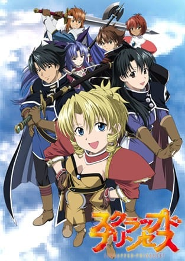
>
| 日文名 | スクラップド・プリンセス |
|:------: |:------------------------------------------: |
| 类型 | 小说改 |
| 新番 | 2003 年 4 月 |
| 集数 | 共24话 |
| 官网 | [https://www.bones.co.jp/work/scrapped-princess/](https://https://www.bones.co.jp/work/scrapped-princess/) |
| 制作 | BONES |
| 导演 | 増井壮一 |
| 脚本 | 土屋理敬,増井壮一,名田ユタカ,大和屋暁,吉田玲子 |
| 评分 | 7.2|
| 制片人 |  |

> [!abstract]+ **简介**
> 故事的主角是一个叫帕希菲卡的女孩。她是莱因布安(莱邦)王国被遗弃的公主。第5111个圣格林德预言说她是“毁灭世界的猛毒”，时间是当她满16周岁时。因为这样，当帕希菲卡还是婴儿时就被人从山崖上丢弃。直到她15岁时，无人知道她依然还活着。帕希菲卡被一位巫师所救并且被卡斯尔家族收养。卡斯尔(卡苏鲁)家族的长男和长女夏浓及拉克维尔更成为了她的保护者。夏浓是一位剑客，拉克维尔(拉寇儿)是位魔法师。他们的能力都很强。在整个故事中，他们一直跟着帕希菲卡，保护她免于遭到那些害怕预言结果的人杀害。另一方面，帕希菲卡却没有什么能力可以保护自己。随着故事的发展，预言的真相渐渐地浮上了水面。

> [!tip]+ **章节列表**
>- [ ] 第1话：弃猫公主的前奏曲 (2003-04-08)
>- [ ] 第2话：半熟骑士的进行曲 (2003-04-15)
>- [ ] 第3话：不可饶恕之人的骚动歌 (2003-04-22)
>- [ ] 第4话：相遇与离别的协奏曲 (2003-05-06)
>- [ ] 第5话：吟游诗人的摇篮曲 (2003-05-13)
>- [ ] 第6话：骑士们的迷走歌 (2003-05-20)
>- [ ] 第7话：弃犬少女的圆舞曲 (2003-05-27)
>- [ ] 第8话：羁绊和祈祷的夜想曲 (2003-06-03)
>- [ ] 第9话：献给异端者的镇魂歌 (2003-06-10)
>- [ ] 第10话：假公主的小夜曲 (2003-06-17)
>- [ ] 第11话：兽姬的狂诗曲 (2003-06-24)
>- [ ] 第12话：二位公主的战歌 (2003-07-01)
>- [ ] 第13话：遥远的追想曲 (2003-07-08)
>- [ ] 第14话：失去的五重奏 (2003-07-15)
>- [ ] 第15话：力量和谋略的歌剧 (2003-07-22)
>- [ ] 第16话：河畔的二重唱 (2003-07-29)
>- [ ] 第17话：短暂的世俗歌 (2003-08-05)
>- [ ] 第18话：胡同深处的哀歌 (2003-08-19)
>- [ ] 第19话：母亲的叹息之无言歌 (2003-08-26)
>- [ ] 第20话：神圣崩坏的序曲 (2003-09-02)
>- [ ] 第21话：孤独之神的受难曲 (2003-09-09)
>- [ ] 第22话：超越时空的轮舞曲 (2003-09-16)
>- [ ] 第23话：有限之人圣谭曲 (2003-09-30)
>- [ ] 第24话：守护者们的交响曲 (2003-10-07)

> [!tip]+ **主要角色**
> 
| 角色 | CV | 简介| 角色图片 |
|:----:|:---:|:---:|:--------:|
| シャノン・カスール | 三木眞一郎 | カスール家の長男。父親から剣士としての訓練を受けていて、片刃の太刀を愛用する（作中のラインヴァン王国では両刃の剣が一般的で、刀は珍しいという設定）。ラクウェルとは双子の姉弟で、ラクウェルの主張により弟ということになっている。 何から何まで面倒くさがる性格で、髪を切ることすら面倒くさがるが、パシフィカのことは大事に思っており、口ではあれこれ言いつつも彼女の危機には全力で立ち向かう。もしパシフィカが世界を滅ぼす存在だったら、その時は自分で彼女を殺す覚悟を決めている。 アニメでは描かれないが、意識領域（容量）…俗にいう潜在魔力が一般人よりはるかに大きい（※意識領域だけならラクウェルを上回る）。ただ、制御が出来ないため普通では魔法を使う事は出来ないが、ラクウェルに仮想制御意識（エミュレータ）の魔法をかけてもらい、魔法を使うことがある（RPG風に例えれば、MP・魔力は高いが、魔法を単独技能としては習得出来ない、といったところ）。 「竜機神（ドラグーン）」ゼフィリスの御者たる「竜騎士（D・ナイト）」でもあり、秩序守護者（ピース･メーカー）に対してのほぼ唯一の戦力として活躍する。極力、敵であっても殺すのは避ける傾向にある。 実は幼い頃は楽士を目指していたこともあり、音楽が本気で好き。歌はかなり上手くて、母親からリュートを習い、今でも趣味で弾いている。キノコが嫌いで、理由はカビの親戚と考えただけでも嫌だから。 | 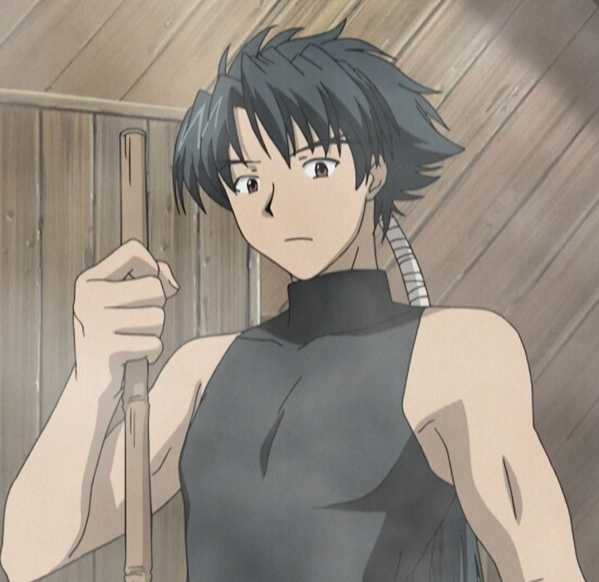 |
| ユーマ・ナンブ・カスール | 志村知幸 | カスール三姉弟妹の父/義父。 昔はラインヴァン王国軍史上最強とも言われた傭兵集団である第二外人部隊〈モータル・ストーム〉に所属していたこともあり、やたら強い。その実力はシャノン以上で、シャノンに剣術を教えた。ヴィルク曰く「個人的な戦闘技術で言えば間違いなく最強」。かなり明るくおちゃらけた性格だったらしく、その点は遺書にも反映されていた。 名前の由来はニューナンブや南部式自動拳銃のナンブから。 パシフィカが14歳の時に彼女を暗殺者から守るため死亡。物語の本編は彼の葬式の日から始まる。 | 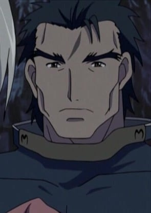 |
| ナタリイ | こおろぎさとみ | 個体名の由来は不明。 AIは女性型、対人インターフェイスの設定は10代後半。 生真面目で一途な性格だが、目的のためなら手段を選ばないような冷徹な一面ももつ。 〈律法破壊者〉計画に参加するが、封棄世界突入時に著しく損傷。 機体を維持できなくなり、AIのコピーをブラウニン機関の〈自由軌道要塞〉（ヴァンガード）の中枢制御システムに移植して生き延びる。 これにより、〈竜機神〉としての機能は失ったが、同時に制約も外れているため、本来禁止されている人間の精神への干渉を行うことが可能になってしまっていた。 封棄世界解放後、ブラウニン機関において修復作業の検討が行われている。 | 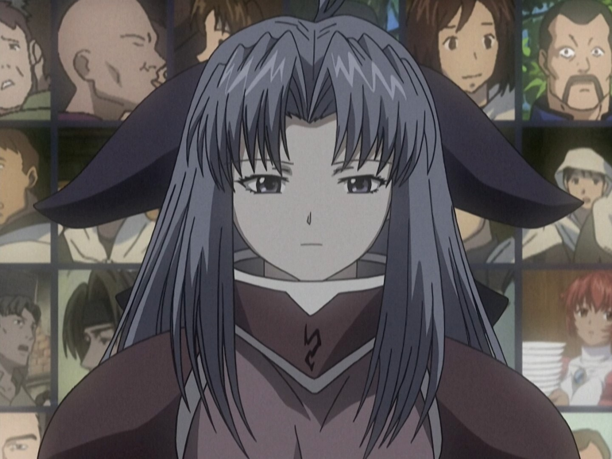 |
| スィン | 半場友恵 | シーズ・アーティラリイが復活する際、解凍途中で放り出されたために幼生となって出現した時の姿。 | 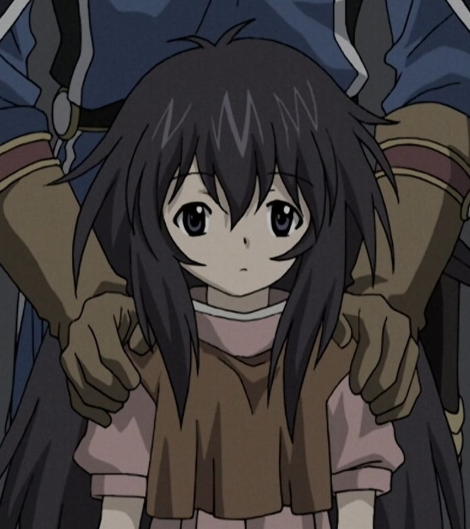 |
| シリア・マウゼル | 折笠富美子 |  | 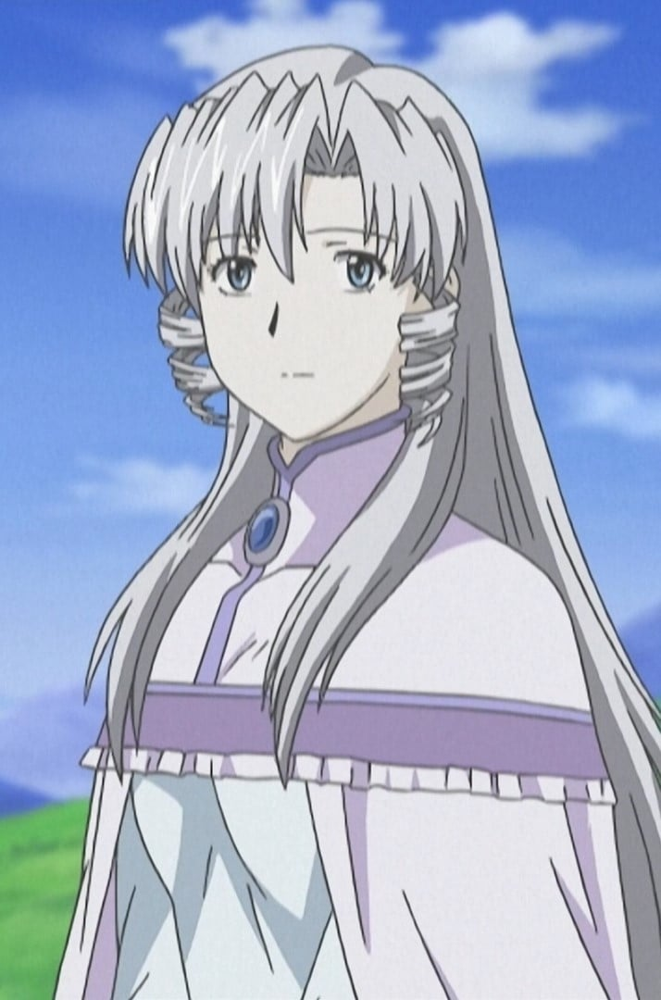 |
| レオポルド・スコルプス | 近藤隆 | タスコ領領主、名門スコルプス男爵家の長男。通称レオ。ドジで思い込みが激しい性格だが、正義感が強く、王宮騎士団〈アンヴァー・ナイツ〉の入団を目指し、騎士道を学ぶ修行をしている。長騎剣と呼ばれる槍のような長さの大剣を愛用し、剣技はシャノンが一目置く程の腕前である。 パシフィカを廃棄王女と知らずに一目惚れし、自分の中では彼女の婚約者になっている（実際には、きちんとした婚約者がいることが作中にて語られている）。 名前の由来は「レオポルド社（リューポルド社）」＋スコープとされる。彼の故郷「タスコ領」の元ネタはスコープ・ダットサイトの「タスコ社」。 | 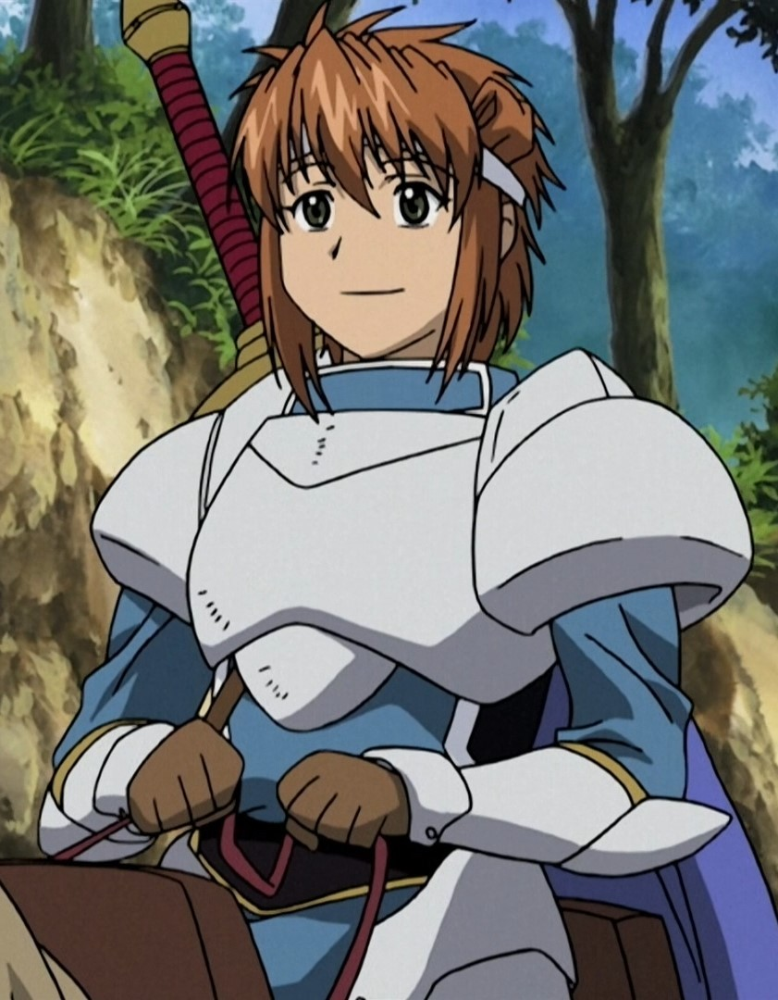 |
| セーネス・ルル・ギアット | 松岡由貴 | ギアット帝国第三皇女であり、ギアット帝国危機管理組織〈紅〉（スカーレット）局長でもある。通称＜獣姫＞。帝国でただ1人、マウゼル教の洗礼を拒んだ異端の皇女。すでに死亡している母親は皇帝が戯れに後宮へ召し上げた蛮族だったため、幼いころから家族に疎まれて育った。 ハスキー・ボイスで男勝りな性格と口調。「太刀」と魔法を使い、その実力はシャノンと同等に渡り合えるほど。 | 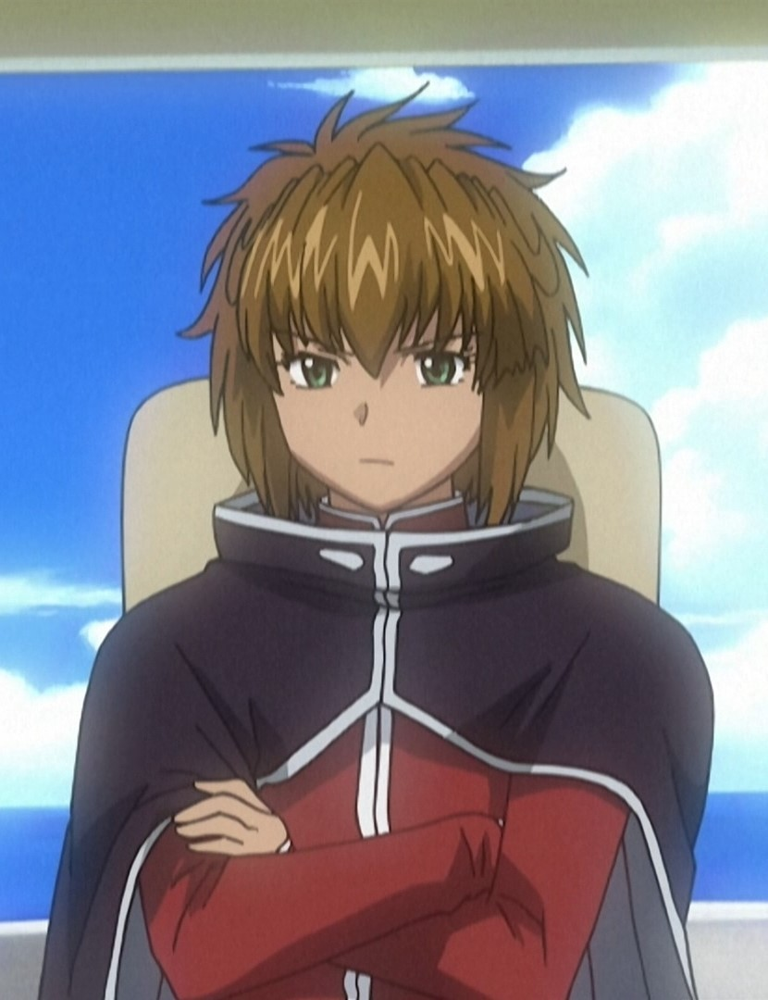 |
| フォルシス・ラインヴァン | 間島淳司 | ラインヴァン王国第一王子。パシフィカの双子の兄。 純粋でとても優しい性格。しかし、パシフィカと似て他人を気遣いすぎたり、責任感が非常に強い部分もある。 | 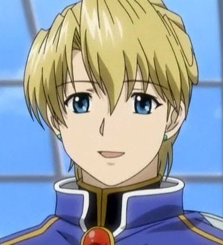 |
| フューレ・タクト | 小西克幸 | パシフィカが記憶を失った時に出会い共に生活をした青年。記憶のないパシフィカをパメラ（フューレの昔の友達が飼っていた猫の名前）と呼び、王国軍に居場所を突き止められるまで行動を共にした。 パシフィカを逃がす際囮となり息をひきとる。元王国軍特務処理班〈ブラックホーク〉所属、戦闘ではナイフを用いる。足技も多用している。 | 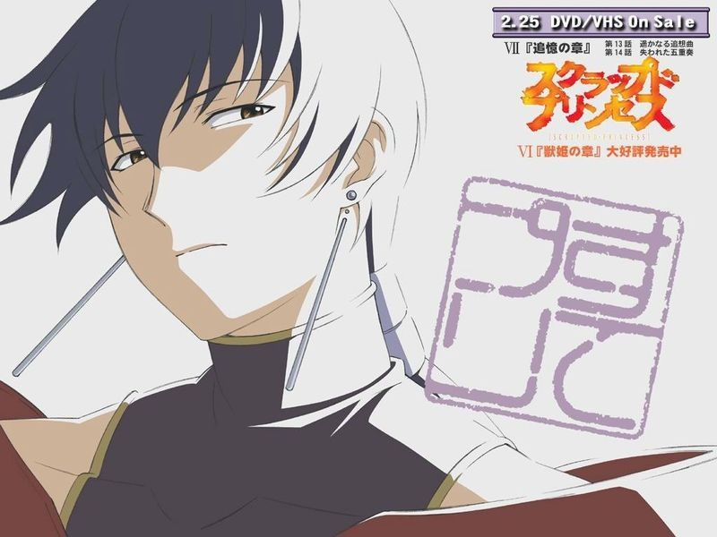 |
| パシフィカ・カスール | 折笠富美子 | カスール家の次女で廃棄王女。15歳。金髪碧眼でどこか猫を思わせる容姿と雰囲気の持ち主。ラインヴァン王国の王女だったが、グレンデルの託宣により「世界を滅ぼす猛毒」とされて殺されそうなところを実母の手によって逃され、保護先のユーマ・カスールとキャロル・カスールの養女となる。 自分のために人が傷つく事を嫌う優しさと、過酷な運命を受け入れ時に挫けそうになりながらもなおあがく強さとを合わせ持つ。通常戦闘において、兄姉のような特殊技能などはないが、秩序守護者による「律法」を打ち破る力を持っており、その力こそが秩序守護者にとっての脅威とされている。 「にゃ？」「んみゅ?」「んにゅ?」、驚いた時には「んにょわ〜」など意味不明な口癖がある。シャノンに対する傍若無人な台詞が目立つが、かなりのお兄ちゃん子。卵料理をこよなく愛する。音楽センスはあまり良くはなく、音痴である（本人も自覚している模様）。 | 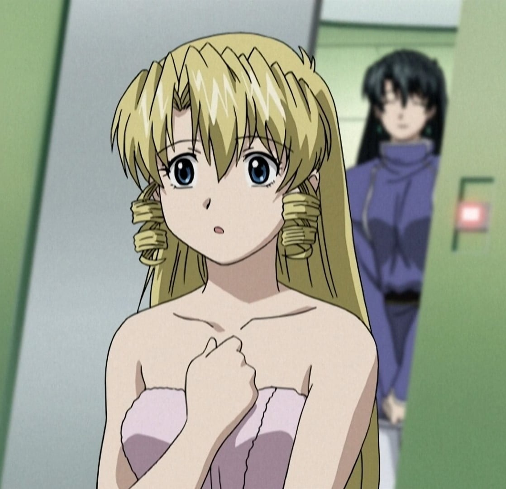 |
| ラクウェル・カスール | 大原さやか | カスール家の長女。魔法を得意とするが肉体労働は苦手。  シャノンとは双子だが、ラクウェルの主張により姉ということになっている。魔法を使う能力は母親ゆずりで非常に高いが魔法オタクの気があるらしく、ことあるごとに様々な魔法を試そうとする。おっとりのんびりした性格でどこかずれた天然なところがある。 パシフィカ・カスールとは出会って初めから仲良し。 | 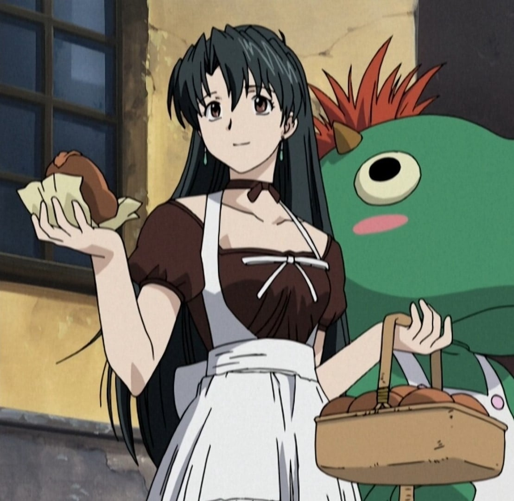 |
| ディアーナ | 佐藤しのぶ |  | 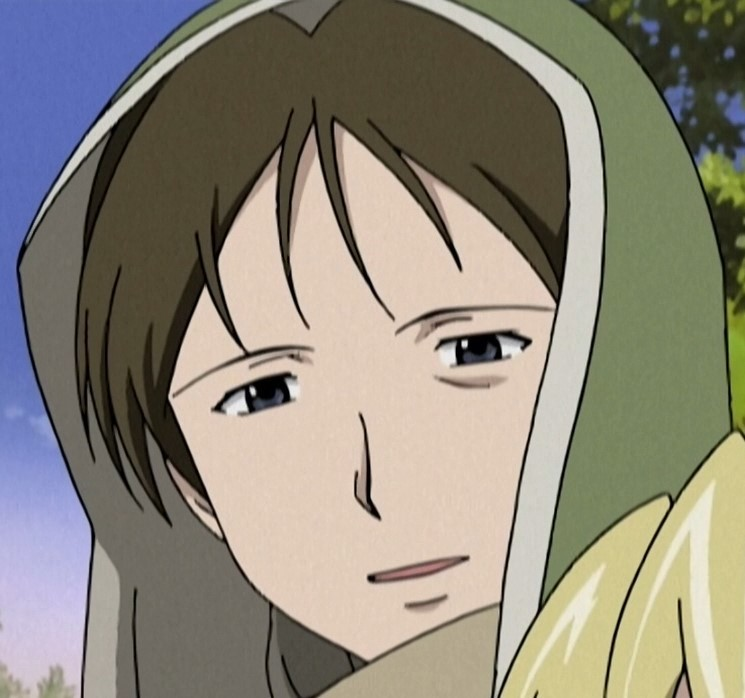 |