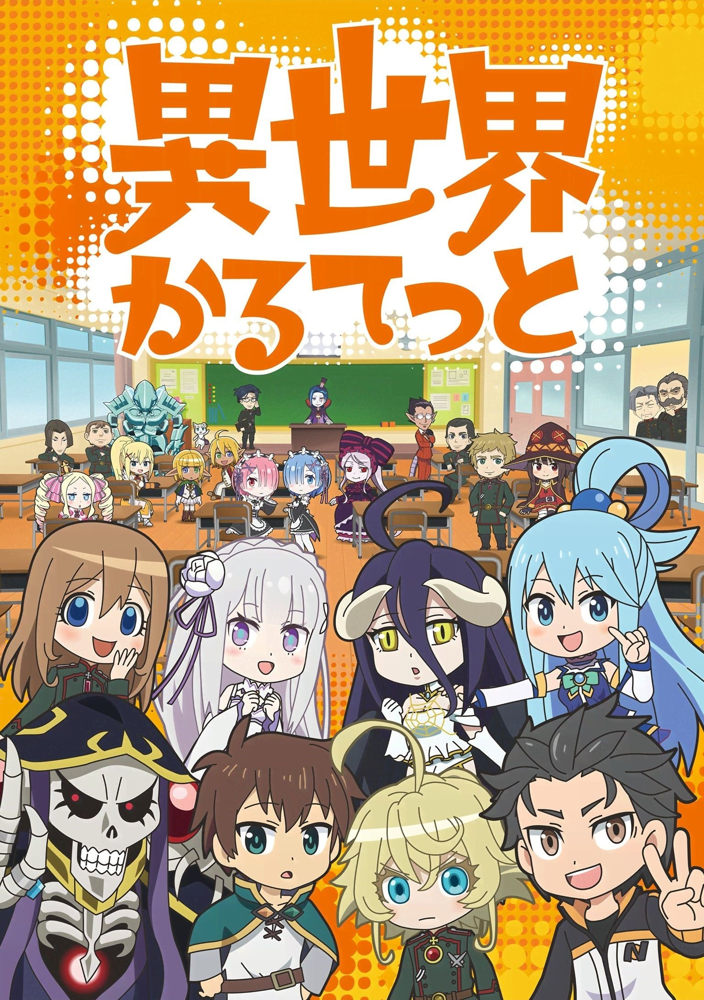
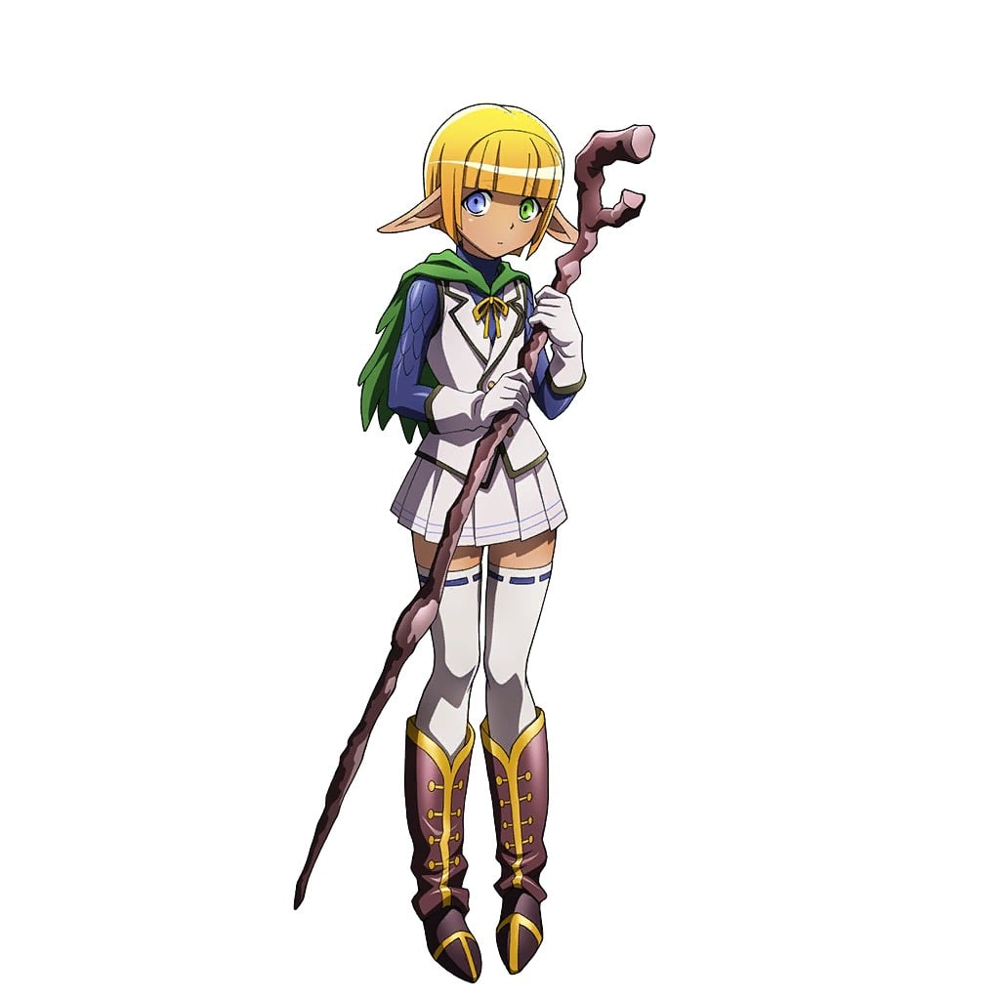
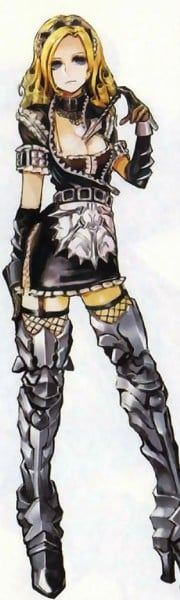
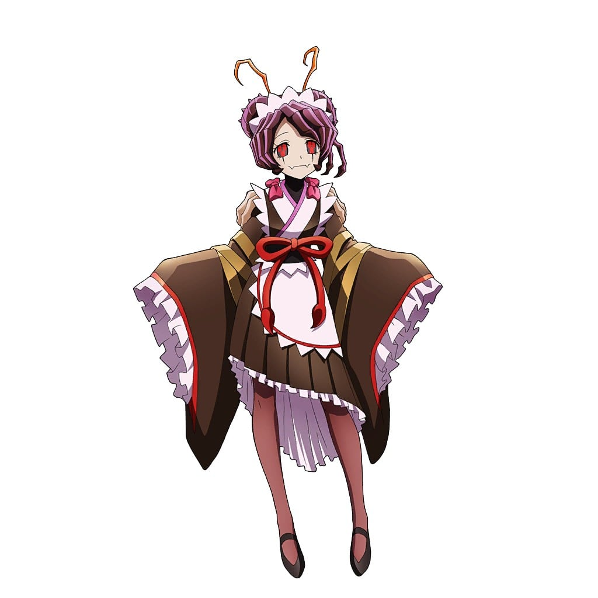

> [!bookinfo|noicon]+ **异世界四重奏**
> 
>
| 日文名 | 異世界かるてっと |
|:------: |:------------------------------------------: |
| 类型 | 小说改 |
| 新番 | 2019 年 4 月 |
| 集数 | 共12话 |
| 官网 | [http://isekai-quartet.com/](https://http://isekai-quartet.com/) |
| 制作 | スタジオぷYUKAI |
| 导演 | 芦名みのる |
| 脚本 | 芦名みのる |
| 评分 | 6.7|
| 制片人 |  |

> [!abstract]+ **简介**
> 「オーバーロード」「この素晴らしい世界に祝福を！」「Re:ゼロから始める異世界生活」「幼女戦記」。
総シリーズ累計1600万部超え、BD＆DVDシリーズ総売上枚数50万枚超えを誇る4作品が、
ぷちキャラアニメになって大暴れ！
ある日突如として現れた謎のボタン。ポチっと押すと、なんとさらなる異世界へ転移してしまう！！
そこには他世界から転移したキャラクターたちも大集合していて…！？
「ぷれぷれぷれあです」「Re:プチから始める異世界生活」「ようじょしぇんき」と、
ぷちキャラアニメ界を牽引してきたスタッフ陣が、異世界系ライトノベル4作品のクロスオーバーアニメーションに挑む！

> [!tip]+ **章节列表**
>- [ ] 第1话：集结！四重奏 (2019-04-09)
>- [ ] 第2话：紧迫！自我介绍 (2019-04-16)
>- [ ] 第3话：胶着！同班同学 (2019-04-23)
>- [ ] 第4话：邂逅！同班同学 (2019-04-30)
>- [ ] 第5话：炸裂！恳亲会 (2019-05-07)
>- [ ] 第6话：决定！班委 (2019-05-14)
>- [ ] 第7话：实行！班委 (2019-05-21)
>- [ ] 第8话：准备！临海学校 (2019-05-28)
>- [ ] 第9话：享受！临海学校 (2019-06-04)
>- [ ] 第10话：参战！对手们登场 (2019-06-11)
>- [ ] 第11话：协力！体育祭 (2019-06-18)
>- [ ] 第12话：团结！四重奏 (2019-06-25)

> [!tip]+ **主要角色**
> 
| 角色 | CV | 简介| 角色图片 |
|:----:|:---:|:---:|:--------:|
| アインズ・ウール・ゴウン | 日野聡 | 职位：至高无上的四十一位至尊 住处：纳萨力克地下大坟墓地下第九层的房间 属性：极恶↔正义值:-500 种族：骷髅魔法师(Skeleton Mage)Lv15 死者大魔法师(Elder Lich)Lv10 死之统治者(オーバーロード overlord)Lv5 职业：死灵法师(ネクロマンサー Necromancer)Lv10 巅峰不死者Lv10 持有：十一个世界级道具 公会武器：安兹乌尔恭之杖 <复活魔杖/wand of resurrection>(蘇生の短杖/ワンド・オブ・リザレクション) 无限背包(インフィニティ・ハヴァサック) 在网路游戏「YGGDRASIL」关闭运营的最后，依旧留在游戏中等待系统强制登出时，意外穿越至异世界的本书的主人公。现实世界当中是一名喜欢电玩的普通青年，在游戏中是一名拥有骷髅外表的最强魔法咏唱者，所属「安兹．乌尔．恭」公会。 元角色名音译为“莫莫伽”。 在第一卷中把自己的名字改为安兹·乌尔·恭，作为纳萨里克的象征及核心。 |  |
| アルベド | 原由実 | 职位：纳萨力克地下大坟墓的守护者总管 王妃(自称) 住处：王座之厅 纳萨力克地下大坟墓地下第九层的一个房间 属性：极恶↔正义值：-500 种族：小恶魔（インプ Imp）Lv10 职业：守护者(ガーディアン)Lv10 黑色护卫Lv5 邪恶骑士Lv10 护卫之主Lv5 持有：一个世界级道具 制作者：タブラ・スマラグディナ 由主角公会成员之一翠玉录所创建的NPC，职务为纳萨力克地下大坟墓的守护者总管 性格原本被设定成“贱人”，但飞鼠在游戏关闭运营的最后时刻抱着“反正是最后了”的心情更改为：爱着飞鼠 是主角的得力助手，在所有守护者中防御力最强。 |  |
| シャルティア・ブラッドフォールン | 上坂すみれ | 职位：纳萨力克地下大坟墓地下第一至三层守护者 住处：不明 属性：邪恶~极恶↔正义值：-450 种族：吸血鬼真祖(トゥルー・ヴァンパイア)Lv10 职业：被诅咒的骑士(カースドナイト)Lv5 持有：神器级武器-滴管长枪（能力是生命吸取） 制作者：ペロロンチーノ 守护者之中单挑最强，持有多种特殊能力和生命吸取，异常状态抗性等，令安兹陷入苦战。 |  |
| マーレ・ベロ・フィオーレ | 内山夕実 | 职位：纳萨力克地下大坟墓地下第六层守护者 住处：纳萨力克地下大坟墓地下第六层的大树 属性：中立～恶↔正义值：-100 种族：暗精灵 职业：森林祭司(ドルイド Druid)Lv10 高级森林祭司Lv10 大自然先锋Lv10 灾厄使徒Lv5 森林法师Lv10 制作者：ぶくぶく茶釜 亚乌菈的弟弟（伪娘），守护者中魔法系最强。给人印象胆小怕事，言行吞吞吐吐扭扭捏捏，但其实只是创造主给与的属性，行凶时只有表面的扭捏眼神毫无感情可言。 |  |
| アウラ・ベラ・フィオーラ | 加藤英美里 | 职位：纳萨力克地下大坟墓地下第六层守护者 住处：纳萨力克地下大坟墓地下第六层的大树 属性：中立～恶↔正义值：-100 种族：暗精灵 职业：游击兵Lv5 驯兽师(ビーストテイマー)Lv5 射手Lv5 狙击手Lv5 高级驯兽师Lv10 制作者：ぶくぶく茶釜 马雷的姐姐，假小子性格。拥有多种高级魔兽作为下仆，团战最强的存在。持有广域侦察技能，森林中的王者。 |  |
| デミウルゴス | 加藤将之 | 职位：纳萨力克地下大坟墓地下第七层守护者 住处：纳萨力克地下大坟墓地下第七层赤热神殿 属性：极恶↔正义值：-500 种族：小恶魔（インプ Imp）Lv10 最高阶恶魔(アーチデヴィル Archdevil)Lv5 职业：混沌(カオス)Lv10 黑暗王子Lv10 变形魔(Shapeshifter)Lv10 制作者：ウルベルト・アレイン・オードル 守护者中的军师，各种特殊能力，有着最精明的头脑，时常向安兹提出建言。对纳萨力克的同伴很温柔，些外则非常残忍无道并以此为乐，跟赛巴斯的关系不太好。 |  |
| コキュートス | 三宅健太 | 职位：纳萨力克地下大坟墓第五层守护者 住处：纳萨力克地下大坟墓第五层大白球(Snowball Earth) 属性：中立↔正义值：50 种族：昆虫战士(Insect Fighter)Lv10 虫王(Worm Lord)Lv10 职业：剑圣(ケンセイ)Lv10 阿修罗Lv5 尼福尔海姆骑士Lv5 制作者：武人武御雷 守护者中使用武器最强，武士性格，一根筋的角色。十分憧憬侍奉安兹的后代并陷入联想中。 |  |
| ユリ・アルファ | 五十嵐裕美 | 種族レベル：首無し騎士（デュラハン）Lv1ほか 職業レベル：ストライカーLv10など ナザリックにおいて戦闘能力を持つ6人のメイド、チーム「六連星（プレアデス）」の1人。 プレアデスの副リーダーであり、まとめ役。明確な序列を持たない他のメンバーからも姉として慕われている。棘付きのガントレットを装備し、格闘系の職業を取得している。 夜会巻きに伊達眼鏡と言った怜悧で知的な風貌に見合い、ナザリックでも珍しく属性が善側に寄った存在。素の口調はボクっ娘と思われる。　 なお、彼女を長姉とする6名のプレアデスメンバーとは別に区別される意味で人間の末妹の存在が示唆されており、それを含め「七姉妹（プレイアデス）」と呼ぶ括りが語られている。 |  |
| ナーベラル・ガンマ |  | 種族レベル：二重の影（ドッペルゲンガー）Lv1 職業レベル：ウォー・ウィザードLv10など ナザリックにおいて戦闘能力を持つ6人のメイド、チーム「プレアデス」の1人。 種族レベルを最低限の1に抑え、それを除くレベルの全てを職業クラスに割り振った生粋の魔法職。 ナザリックの全般的な傾向である人間蔑視の思想を強く持つ一人である。やや短気なところがあり、毒舌家。 真の姿はナザリックでは過半を占める異形種のものであるものの、彼の地では希少な人間と変わらない姿を常から取れるNPCであることを見込まれ、アインズの勅命を受ける。 ウェブ版では凡庸な姿をした男性「モモン」に姿を偽り、冒険者ギルドに潜入しての情報収集に従事する。 書籍版では普段の姿のままで漆黒の英雄「モモン」の相方、美姫「ナーベ」として活動する。こちらでは力を抑えてはいるが、本来の魔法詠唱者としてモモンをサポートする。しかし、崇拝する主人の傍らという環境もあってか人間を侮蔑する性格を全く隠しきれておらず、事ある度に敵意と暴言を飛ばすためアインズからは度々釘を差されている。 仮の姿はウェブ版ではサイドテール、書籍版ではポニーテールという違いはあるものの、黒髪の極めて端正な容姿をしていることに変わりはない。 |  |
| シズ・デルタ | 瀬戸麻沙美 | 種族レベル：自動人形（オートマトン）Lv5ほか 職業レベル：ガンナーLv10など ナザリックにおいて戦闘能力を持つ6人のメイド、チーム「プレアデス」の1人。 正式名称は「CZ2128・Δ（シーゼットニイチニハチ・デルタ）」、シズ・デルタは略称。 機械の型番のような名前や銃器の使用に適した職業クラス、何よりその種族からもわかるように無感情なメカ少女と言ったキャラクターメイキングをなされており、表情が動かされることはまずない。 外見的には翠玉の瞳に、もう片目を覆うアイパッチ、ミリタリー風味の飾り付けに赤金のロングヘアーと言ったところで、印象は無機質ではあるがプレアデスの例外なく非常に美しい容姿をしている。 ギミック考案を担当した制作者により、ナザリックのギミックとその解除法の全てを熟知しているとの設定を施されている。 |  |
| ソリュシャン・イプシロン |  | 種族レベル：不定形の粘液（ショゴス）Lv10ほか 職業レベル：アサシンLv2など ナザリックにおいて戦闘能力を持つ6人のメイド、チーム「プレアデス」の1人。 情報収集の一環として、後ろ暗い犯罪者を釣り出すべく執事役のセバスと組んだ縦ロールのわがままな令嬢の役としてナザリック外部へ派遣される。 ナーベラルと原理は異なるが美しい姿は擬態したもので、本性は異形種のもの。捕食型スライムと言う種族に由来する人間離れした挙動も可能とし、体内に幾つかのアイテムや大人一人分収納して外見になんら変化を来たさないと言った離れ業も易々と行う。盗賊・暗殺系の職業を修めたキャラメイクをされており、罠を看破することが出来る。 他の種族特性として物理攻撃への耐性を持ち、強弱の加減が出来る酸の分泌も可能である。 プレアデスではナーベラル同様に強く人間・亜人種を蔑視しているが、こちらは扱いが同じ虫けらでも嬉々として潰すタイプであり、個人的趣味の近似からシャルティアと仲が良い。 |  |
| エントマ・ヴァシリッサ・ゼータ |  | 種族レベル：蜘蛛人（アラクノイド）Lv10ほか 職業レベル：フジュツシLv10など 制作者：源次郎 ナザリックにおいて戦闘能力を持つ6人のメイド、チーム「プレアデス」の1人。精神系魔法詠唱者。 アインズの前ではかしこまっているものの、語尾をはじめ全体的に幼く甘ったるい喋り方をする。符術師と蟲使いの職業を修めている。 ソリュシャンと共に人間を食材として好むプレアデスメンバーであるが、嗜虐して楽しむ一面も持つ彼女とは違い単純な食料と捉える傾向が強い。通常は声同様に幼げで整った姿であり、和服調のメイド服を纏っているがその本性は異形。顔も声も蟲で擬態したものであり、シニヨンにした髪も偽毛とされている。 ウェブ版では、ほっそりとした体つきで艶やかな黒髪をサイドアップでまとめた、端正な顔立ちをした大人しげな女性。魔法戦士の職業を修めている。 書籍版では王都を舞台にした一大作戦「ゲヘナ」においてマーレと共にヒルマの屋敷を襲撃したが、その帰りに単独でいた所をガガーランと遭遇し、性格上見過ごせなかった彼女と交戦する羽目になる。レベルと種族としての地力や装備の差、召喚主とは独立して行動する蟲と自己強化・攻撃などに使用する符などによって、ティアの加勢後も彼女たちを終始翻弄した。 人間を侮り食料として捉えながらも油断することなく相手の出方を伺っては追い詰め、とどめの間際まで追い詰めるも自身と互角の強者であるイビルアイの乱入を受ける。彼女の発言に激昂し切り札を晒して襲い掛かるが、自分自身と使役する蟲武器の両方にとって特効となる殺虫魔法によって顔と声の両方を構成する蟲を殺されてしまう。 ここに至りなりふり構わず、蜘蛛の足や多種多様の糸など種族に由来する能力も加え全身で三人の蒼の薔薇チームと激闘を繰り広げるが手数と絆の差によって敗北。デミウルゴスの助けによって瀕死の状態で辛くも逃れる。イビルアイと再び対峙した際もその憎悪は衰えることはなかったが、顔の蟲は元通りでも声は彼女の嫌う本来のものそのままであった。 |  |