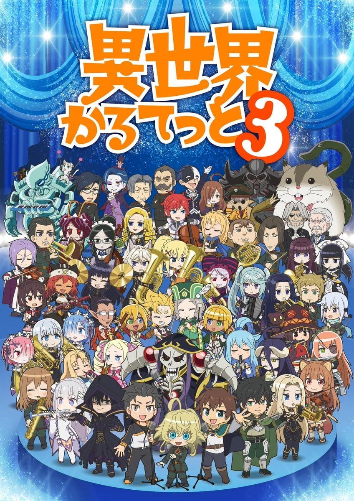
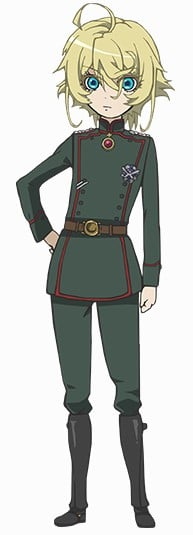
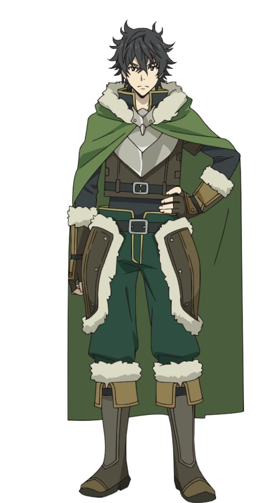
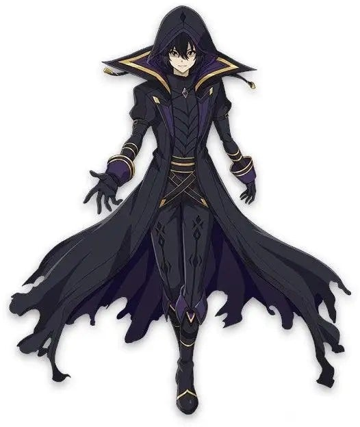

> [!bookinfo|noicon]+ **异世界四重奏 第三季**
> 
>
| 日文名 | 異世界かるてっと3 |
|:------: |:------------------------------------------: |
| 类型 | 原创 |
| 新番 | 2025 年 10 月 |
| 集数 | 共11话 |
| 官网 | [https://isekai-quartet.com/](https://https://isekai-quartet.com/) |
| 制作 | スタジオぷYUKAI |
| 导演 | 芦名みのる |
| 脚本 | 芦名みのる |
| 评分 | 6.5|
| 制片人 | 制作制片人：横山稔 |

> [!abstract]+ **简介**
> 2020年に第2期シリーズが放送された異世界系アニメクロスオーバーアニメ『異世界かるてっと』。本作の第3期シリーズ制作が決定。新たに参戦する『陰の実力者になりたくて！』も描かれたティザービジュアルが解禁された。公式XではA5ビジュアルカードが当たるフォロー＆RPキャンペーンを実施。2025年6月21日（土）・22（日）に開催される「ちゃやまち推しフェスティバル2025」のKADOKAWAアニメブースでも配布される。

> [!tip]+ **章节列表**
>- [ ] 第1话：集结！学园生活 (2025-10-13)
>- [ ] 第2话：潜伏！じつりょくしゃ (2025-10-20)
>- [ ] 第3话：協調！あさがおしいく (2025-10-27)
>- [ ] 第4话：混乱！ちょうりじっしゅう (2025-11-03)
>- [ ] 第5话：襲来！やりのゆうしゃ (2025-11-10)
>- [ ] 第6话：詮索！かげとあくま (2025-11-17)
>- [ ] 第7话：滑走！すきーがっしゅく！ (2025-11-24)
>- [ ] 第8话：流行！おんらいんげーむ (2025-12-01)
>- [ ] 第9话：結束！おんがくさい (2025-12-08)
>- [ ] 第10话：战栗！音乐节 (2025-12-15)
>- [ ] 第11话：旋律！音乐节 (2025-12-22)

> [!tip]+ **主要角色**
> 
| 角色 | CV | 简介| 角色图片 |
|:----:|:---:|:---:|:--------:|
| アインズ・ウール・ゴウン | 日野聡 | 职位：至高无上的四十一位至尊 住处：纳萨力克地下大坟墓地下第九层的房间 属性：极恶↔正义值:-500 种族：骷髅魔法师(Skeleton Mage)Lv15 死者大魔法师(Elder Lich)Lv10 死之统治者(オーバーロード overlord)Lv5 职业：死灵法师(ネクロマンサー Necromancer)Lv10 巅峰不死者Lv10 持有：十一个世界级道具 公会武器：安兹乌尔恭之杖 <复活魔杖/wand of resurrection>(蘇生の短杖/ワンド・オブ・リザレクション) 无限背包(インフィニティ・ハヴァサック) 在网路游戏「YGGDRASIL」关闭运营的最后，依旧留在游戏中等待系统强制登出时，意外穿越至异世界的本书的主人公。现实世界当中是一名喜欢电玩的普通青年，在游戏中是一名拥有骷髅外表的最强魔法咏唱者，所属「安兹．乌尔．恭」公会。 元角色名音译为“莫莫伽”。 在第一卷中把自己的名字改为安兹·乌尔·恭，作为纳萨里克的象征及核心。 |  |
| ナツキ・スバル | 小林裕介 | 無知無能にして無力無謀と四拍子欠けた主人公。突如として異世界に召喚され、訳の分からない状況に翻弄される。物怖じしない性質と持ち前の図々しさで、逆境に弱音を吐きつつも過酷な運命に立ち向かっていく。  誕生日は四月一日。誕生花は「カスミソウ」で、花言葉は「清らかな心」です。 |  |
| 佐藤和真 | 福島潤 | 本作的主人公，是个喜欢电玩、动画、漫画的茧居尼特高中生。某天偶尔外出时碰上交通意外而身亡（被车子吓死）之后，带着阿克娅一起转生到异世界去。 身高约165上下，黑头发黑眼睛，是个随处可见的16岁青少年，职业是冒险者。自称是“真正的男女平等主义者”，就算对方是女性也会毫不留情的“对付”，也因为这样而被其他人取了“鬼畜和真”“变态的鬼畜男”等等的绰号。职业是冒险者，因为异常高的幸运值以及偷窃技能而意外的活跃。不喜欢惹事生非但却因为同伴们的关系而常被卷入各种事件内。 |  |
| ターニャ・デグレチャフ | 悠木碧 | 生日：9月24日。在转生前是日本菁英上班族，就职于一间企业的人事部课长，遭到解雇的部员推下列车月台，遭火车辗毙前遇见“神”，但因和神进行论辩，称眼前的神为“存在X”并拒绝信仰（动画则是态度过于高高在上。），使得神相当愤怒，认为他因“生在科学的世界，身为一名男性。不知战争为何物，人生一帆风顺”而失去信仰的心，故以“在魔法的世界，做为一名女性。为了熟知战争。最好是走投无路”将他转生到异世界。 于异世界的统一历一九一四年七月十八日，作为一名名为谭雅·提古雷查夫的弃婴诞生，在孤儿院度过了七年的童年时光，后来被检验出了魔导的资质，进入了帝都柏卢魔导军官学校就学，文书上的生日为九月二十四日。日后作为准尉被分发到诺登地区进行实习课程，结束后升为少尉并被编入国境警备班就战斗配置，期间爆发大战，因作战功勋被授予“银翼突击勋章”，以军官学校第二名的成绩毕业。之后进入帝国中央的教导队和技术厂的试验团队，进行新型宝珠实验，并以评价成果的名目被派往莱茵战场，晋升中尉后受推荐进入帝都夏尔洛堡（日语：シャルロブルク）军大学就读，以第十二名的成绩毕业，名列军大学十二骑士之末席，并获得仅限一代使用的贵族冠名“冯”。 重视资源最大效率的运用及人才的筛选，主张要为帝国除去名为“无能”的疫病，在成为二〇三航空魔导大队的大队长后，（本来想靠激烈手段让训练兵全部放弃自己回家但失败了）开始注重培养及投资人力资源的品质，认为战争是种浪费人力及物质等宝贵资源的无效率行为，排斥联邦的共产政府，在帝国的官僚组织中建立了许多人脉。希望能平常地生活，但总是不如他所愿。不喜欢失去花费长时间栽培的部下，因此部下有危险都会去救，部下对她的信赖很深。 拥有四核心演算宝珠“艾连穆姆九五式”，该宝珠由阿德海特·冯·修格鲁研发（实际上是在神的帮助下被赋予奇迹的缺陷品），使用时产生的威力远超其他演算宝珠，但发动术式时都会进入无意识赞颂神的状态，并发精神恍惚甚而丧失记忆，故本人极度避免使用，一般使用同为修格鲁教授开发，但不具有精神污染的双核演算宝珠“艾连穆姆九七式”。 帝国军二〇三航空魔导大队的大队长暨第一中队长，本身即为击坠数突破五十的Ace of Aces，大队亦为所有队员皆配备艾连穆姆九七式演算宝珠，并直属于参谋本部、参与过所有方面的战场、执行过多种特殊作战并拥有多名Ace的精锐部队，于小说第4卷受命编制并指挥参谋本部直属试验战斗群，完成实验目的后解编，并在日后作为战斗群长指挥沙罗曼达战斗群，活跃于东部战场。 被敌军登录为代号“莱茵的恶魔”，由于获颁银翼突击勋章而被帝国政治宣传为“白银”的别名，不过亦被部分帝国军官及共和国敌军私下称为“锈银”（讽刺杀死敌人的战功数量多到连银都会生锈，以及表达对谭雅的畏惧）。持有银翼突击章、野战航空战技章、榭叶银翼突击章、白翼大十字勋章、野战突击章、战伤勋章、壕沟一级功劳奖章、近战特级突击章、一级铁十字勋章等多种战功勋章。曾在莱茵战场获得黄金剑白金十字章的受勋推荐，后因一起严重抗命未遂事件而取消。漫画74话，战后数十年的篇章中提及代号“白银”的魔导师为全帝国军击坠数排名第二。 军衔：准尉（军官学校）→少尉（联合实习修习完毕）→中尉（成为Ace of Aces(莱茵战争有功)）→上尉（军大学前十二名毕业）→少校（编制601编制部队功绩）→中校（发表论文《本次大战的部队运用与作战机动》） |  |
| 岩谷尚文 | 石川界人 | 盾の勇者。20歳のオタク大学生。『四聖武器書』を読んでいたところ、異世界に召喚される。絶大な防御力を誇るが、攻撃力はほとんどない。異世界で人間不信に陥ったことで、本来の穏やかさは消え、冷徹な人間に。 |  |
| シド・カゲノー / シャドウ | 山下誠一郎 | 憧憬「影之强者」、追求力量的转生少年。表面上是乡下贵族卡盖诺男爵家的二男，在米德加尔魔剑士学园享受着“龙套”生活，但背地里却作为影之组织「暗影庭园」的盟主暗影，与「黑暗教团」对峙着（以这样的设定遨游）。 |  |