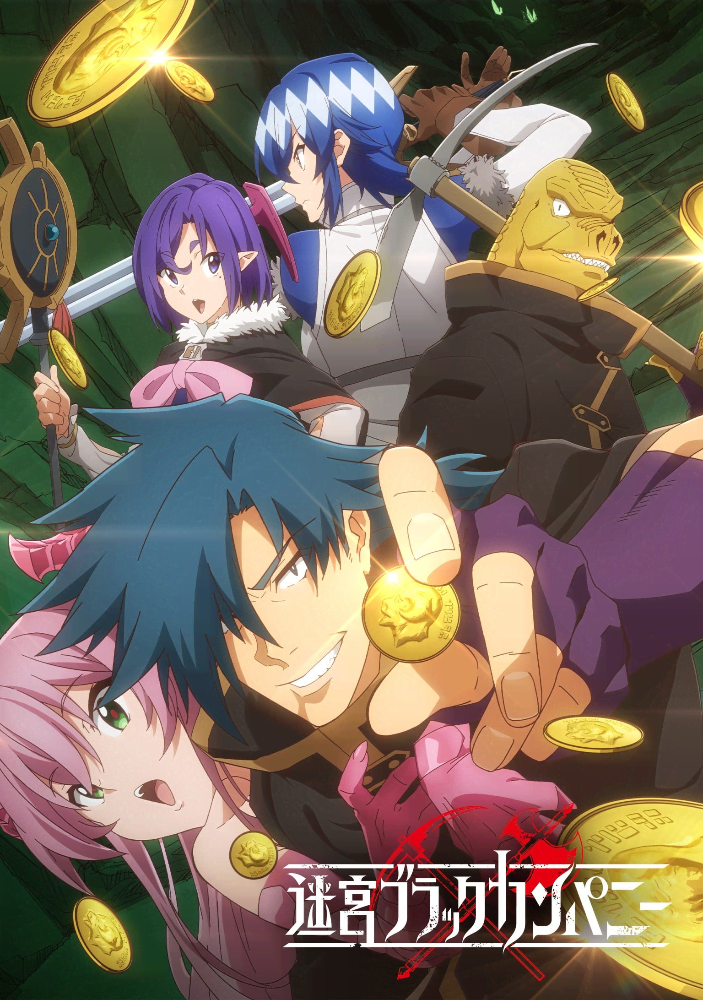
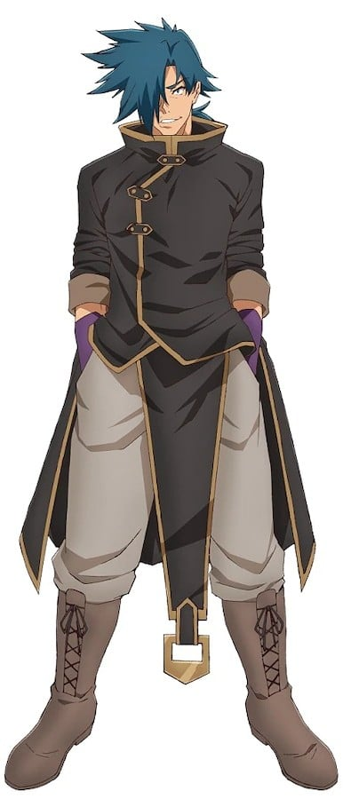
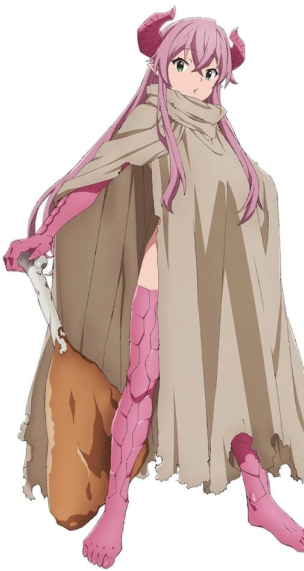
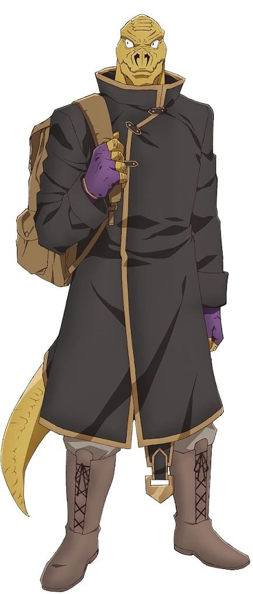
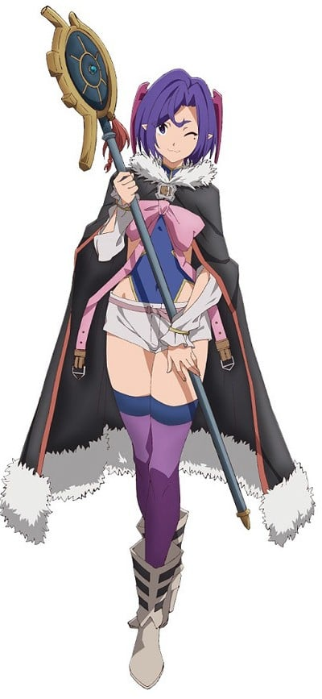
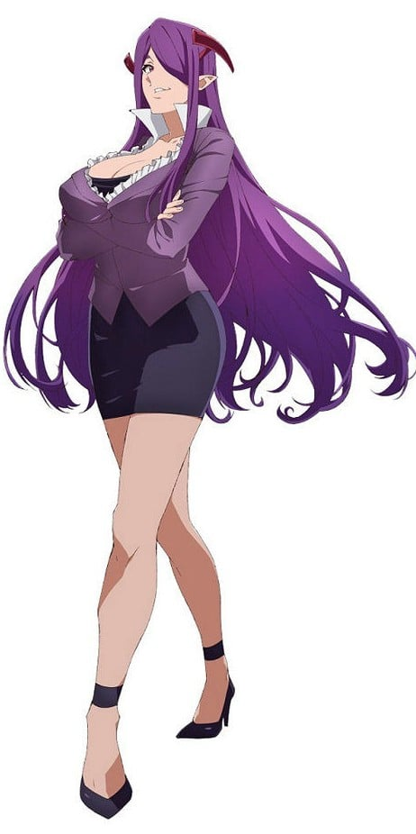
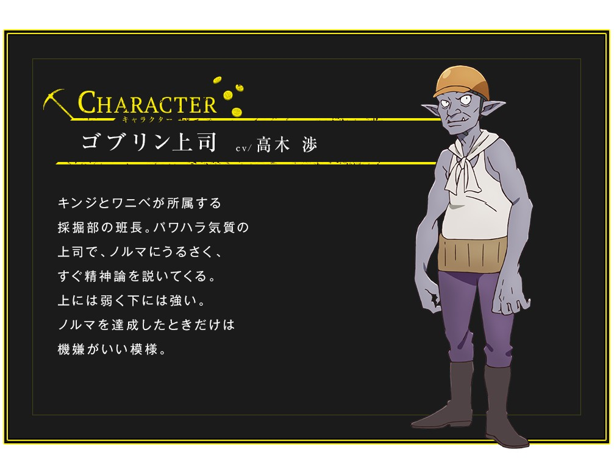
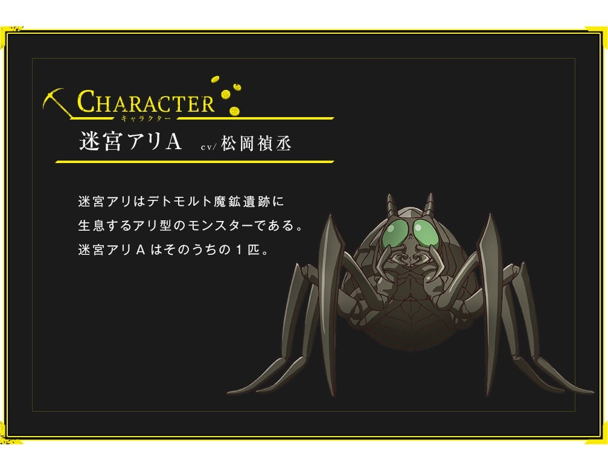

> [!bookinfo|noicon]+ **异世界迷宫黑心企业**
> 
>
| 日文名 | 迷宮ブラックカンパニー |
|:------: |:------------------------------------------: |
| 类型 | 小说改 |
| 新番 | 2021 年 7 月 |
| 集数 | 共12话 |
| 官网 | [https://meikyubc-anime.com](https://https://meikyubc-anime.com) |
| 制作 | SILVER LINK. |
| 导演 | 湊未來 |
| 脚本 | 三重野瞳,赤尾でこ(三重野瞳)、静原舞香、藤尾いなほ,藤尾いなほ,静原舞香 |
| 评分 | 6.7|
| 制片人 | 清水優人 |

> [!abstract]+ **简介**
> “不想工作！”
在这样的想法下不断努力，靠着不劳而获的收入成为了“上流家里蹲”的二之宫锦司。正在他打算到死为止都要这样懒惰地生活下去时，出于某种原因突然穿越到异世界。那里是一个“迷宫就是职场”的超级黑心企业。
优雅的生活突然改变，每天都要在曾经被称作“地下城”的地方不断劳动，过着流血流汗又流泪的日子。恶劣的工作环境、长时间的劳动、低薪。更过分的是上司的职权骚扰、洗脑、榨取人力价值。天天过着被各种瞧不起的“社畜”生活。
哪怕这样锦司也没有放弃。为了要夺回最强的家里蹲生活，有时就要不择手段、有时还要用一些阴谋诡计来让自己成功暴富……
这就是，唯我独尊又善用邪门歪道的青年不屈不挠奋斗的故事。“异世界迷宫”ד黑心企业”的社畜幻想故事，开幕。

> [!tip]+ **章节列表**
>- [ ] 第1话：欢迎来到社畜的世界 (2021-07-09)
>- [ ] 第2话：不可能的战斗 (2021-07-16)
>- [ ] 第3话：我们的快乐社员研修 (2021-07-23)
>- [ ] 第4话：疯狂的死亡竞赛 (2021-07-30)
>- [ ] 第5话：穿越 (2021-08-06)
>- [ ] 第6话：阳光愈烈，阴影愈浓 (2021-08-13)
>- [ ] 第7话：重返工作岗位 (2021-08-20)
>- [ ] 第8话：疯狂的兵器 (2021-08-27)
>- [ ] 第9话：安静的要塞 (2021-09-03)
>- [ ] 第10话：新・迷宫・天堂 (2021-09-10)
>- [ ] 第11话：破坏与变革 (2021-09-17)
>- [ ] 第12话：你好，再见 (2021-09-24)
>- [ ] 第1话：TVアニメ「迷宮ブラックカンパニー」未経験者大歓迎！キャスト生配信特番 (2021-07-03)
>- [ ] 第1话：NCOP - 染み
>- [ ] 第1话：NCED - ワールドイズマイン
>- [ ] 第2话：NCED2

> [!tip]+ **主要角色**
> 
| 角色 | CV | 简介| 角色图片 |
|:----:|:---:|:---:|:--------:|
| 二ノ宮キンジ | 小西克幸 | ニートの青年で、年齢は24歳。働かずして生きていける環境を作るために、投資で財産を築いたネオニートで、 目的のためなら手段を選ばない屈折した性格をしている。念願の不労所得を手にし、死ぬまで怠惰な生活を満喫しようと考えたが、その直後、異世界のアムリアに転移してしまう。 これによって無一文となり、デトモルド魔鉱遺跡のライザッハ鉱業で、低賃金で過酷な肉体労働を課せられる社畜となる。しかし傲岸不遜で口がうまく、同僚のワニベをそそのかし、迷宮で出会ったリムを丸め込み、迷宮アリの群れを言葉巧みに扇動して支配下に置くことに成功。同時にライザッハ鉱業の上層部への不満を募らせ、自らの手駒が増えたことで「迷宮ブラックカンパニー」を結成し、ライザッハ鉱業を乗っ取ろうともくろむ。その後、迷宮の謎の装置によって未来のアムリアに転移したあと、魔王に会って世界崩壊の真実を聞くこととなった。その際、日本への帰還を提示されるが、ベルザ・シューバッハらライザッハ鉱業の上層部を見返すという目的を掲げ、自らの意志で現代のアムリアに帰還する道を選んだ。 地球人であるため、魔力を扱う臓器の魔臓(まぞう)を持たず、戦闘能力は貧弱。戦闘能力を測定したところ、一般冒険者の総合評価が20だったのに対して5と、かなりの低水準だった。 |  |
| リム | 久野美咲 | 二ノ宮キンジが、デトモルド魔鉱遺跡の迷宮で出会った魔物。 食欲の権化のような存在で、食べる物を求めてさまよっていたところ、二ノ宮とワニベと遭遇。彼らを食べようとしたところ、二ノ宮から「地上の美味」と引き換えに「二ノ宮を食べない」という約束を交わし、彼らに同行する。当初は見上げるほど巨大なドラゴンの姿をしていたが、二ノ宮の仲間になってからは桃色の髪を長く伸ばした人間の少女のような姿となる。 ただし人間形態でも角を生やし、手足には爬虫類の鱗がある。人間の姿でもその戦闘能力は健在で、強力な魔物も難なく倒す実力を示す。また、本気を出すと成長した美女の姿となり、さらに強大な力を振るうことができる。ただし1日の食費は軽く5万G（ギリー）を超えるうえに燃費は悪く、何か仕事をさせるとすぐにお腹を空かすため、二ノ宮はあまり仕事をさせたがらない。 |  |
| ワニベ | 下野紘 | リザードマンの男性で、爬虫類型の亜人。 トカゲが人型になったような姿をしており、常人に比べて頑丈な体と厳つい外見をしている。しかし内気な性格で、周囲からも冴えない顔をしているとよく指摘される。 臆病ながら根はまじめなことを二ノ宮キンジに見抜かれ、そそのかされる形で彼の仕事に協力するようになるが、何かと二ノ宮が引き起こした事態の被害を受けている。要領が悪く、自分にはなんの取り柄もないと思っているが、実は田舎育ちで野草やキノコの知識が豊富。二ノ宮が未来のアムリアから帰還したあとは、彼から事情を聞き、相変わらず流されるように彼らに協力することとなる。 |  |
| キノウ・シア | 戸田めぐみ | ライザッハ鉱業所属の勇者。青みがかった髪をショートカットに整えた若い女性で、剣と魔法を武器に魔物と戦う。会社内では勇者と持ち上げられているが、その実態は会社のために働くことが幸せだと信じて疑わない「究極の社畜」。成果を果たすためならあらゆる犠牲を許容し、それを他者にまで強いる強引な性格をしている。ファリア支部からデトモルド支部に異動して探索3課に配属され、二ノ宮キンジの直属の上司となる。二ノ宮に強引なやり方を批判され、その後、彼に襲い掛かるがリムに敗北。彼に弱みをにぎられる形で協力していくこととなる。父親は「最悪の冒険王」と呼ばれた冒険者で、彼が世界各地の迷宮を攻略したことで、いくつもの迷宮が機能不全に陥って枯渇した。それによって職にあぶれた者たちから母親と共に迫害された過去を持ち、その境遇から救ってくれたライザッハ鉱業には多大な恩を感じている。ライザッハ鉱業にとって都合のいい現在の性格は、この父親への反感と会社への恩から生まれたものだが、そのことをのちに二ノ宮に指摘されて改善していく。会社への忠誠心も薄れてきており、二ノ宮たちが未来のアムリアから帰還し、事情を聞いたあとは彼に協力している。 |  |
| ランガ | M・A・O | 二ノ宮キンジが未来のアムリアで出会った少年。地下シェルターの中にある街、マルシアで勇者に仕える「巫女」として育てられたが、同世代で魔力を持つ子供がランガしかいなかったため、男にもかかわらず女性のような格好をしている。少女と見まごうばかりの紅顔の美少年で、女性として扱われるのも満更ではないと思っており、周囲には自分を女性とカンちがいさせるような言動をわざと取っている。マイペースで自由奔放な性格をしており、巫女の役割を引き受けたのも街の外に出るためだったが、二ノ宮のことを気に入り、彼と行動を共にする。実はベルザ・シューバッハの子孫で、世界滅亡の引き金を引いた者の末裔として謂れのない迫害を受け、マルシアでも正体を隠して生きてきた過去を持つ。ランガ自身のルーツから目を背け、逃げ続ける日々だったが、二ノ宮の言葉で立ち向かうことを決意。ベルザを一発殴るという目的を掲げ、二ノ宮に協力するようになる。魔王との謁見以降は二ノ宮について行く形で、現代のアムリアに転移する。職業は魔法使いで、攻撃魔法を使えるほかに幅広い魔法の知識を持つ。 |  |
| ベルザ・シューバッハ | 佐藤聡美 | ライザッハ鉱業のデトモルト支部迷宮長を務める妙齢の美女。髪を腰まで届かせるくらい長く伸ばし、前髪で左目をつねに隠している。側頭部からは2本の角を生やし、スーツ姿でいることが多い。外面は非常にいいが、内面は利益のためなら他者の命を犠牲にすることをなんとも思わない邪悪な性格をしており、部下を使い捨てにして利益の拡大をもくろむ。 |  |
| ゴブリン上司 | 高木渉 | キンジとワニベが所属する採掘部の班長。パワハラ気質の上司で、ノルマにうるさく、すぐ精神論を説いてくる。上には弱く下には強い。ノルマを達成したときだけは機嫌がいい模様。 |  |
| 迷宮アリA | 松岡禎丞 |  |  |