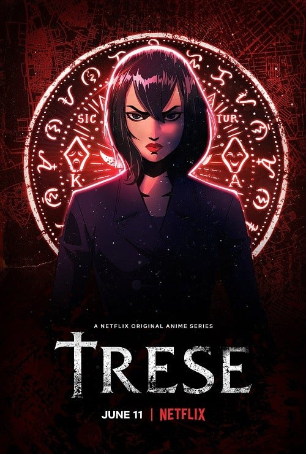

> [!bookinfo|noicon]+ **异界侦探 Trese**
> 
>
| 日文名 | Trese |
|:------: |:------------------------------------------: |
| 类型 | 漫改 |
| 新番 | 2021 年 6 月 |
| 集数 | 共6话 |
| 官网 | [https://www.netflix.com/title/81012541](https://https://www.netflix.com/title/81012541) |
| 制作 | BASE Entertainment |
| 导演 |  |
| 脚本 |  |
| 评分 | 5.5|
| 制片人 |  |

> [!abstract]+ **简介**
> 这是一个连警方也无计可施的可怕世界，主人公亚历珊卓·特瑞斯决定挺身而出，守护受到超自然族类威胁的马尼拉，与那些邪恶生物对峙，本作改编自菲律宾作家Budjette Tan的同名科幻恐怖图像小说。

フィリピン発のアニメシリーズで、バジェッテ・タン、カジョ・バルディッシモさん作の同名グラフィック小説が原作。

フィリピンに伝わる伝説の生物が人間の間に身を潜め暮らすマニラで、アレクサンドラ・トレースは邪悪な生き物がうごめく裏社会と対峙していく。

『異界探偵トレセ』はフィリピン制作のアニメシリーズ。

フィリピンの首都・マニラを舞台に、女探偵のアレクサンドラ・トレースが、邪悪な生き物がうごめく裏社会と対峙する物語となる。

原作はバジェッテ・タンさんとカジョ・バルディッシモさんによるグラフィックノベルで、フィリピンの賞を3度受賞している人気作。

アニメ化にあたっては、ジャカルタとシンガポールを拠点とする映画会社・BASEエンターテインメントのシャンティ・ハーマインさんとターニャ・ユソンさんがプロデューサーを担当。

製作総指揮を映画『ワンダーウーマン』に携わり、アニメ『バットマン：ダークナイト・リターンズ』で監督を務めたフィリピン系アメリカ人のアニメーターであるジェイ・オリヴァさんが務める。

ストリーミングサービスが全世界で展開されたことで、日本のアニメも世界に広がるが、海外発のアニメ作品も日本に入ってきやすくなっている。

日本ではまだ馴染みのないフィリピンのアニメがどのような作品になり、日本で受け入れられていくのか、期待が高まる。

> [!tip]+ **章节列表**
>- [ ] 第1话：
>- [ ] 第2话：
>- [ ] 第3话：
>- [ ] 第4话：
>- [ ] 第5话：
>- [ ] 第6话：

> [!tip]+ **主要角色**
> 
| 角色 | CV | 简介| 角色图片 |
|:----:|:---:|:---:|:--------:|
| - | - | - | - |