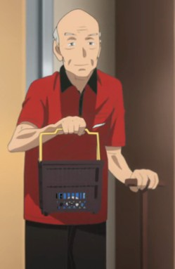

> [!bookinfo|noicon]+ **当不成勇者的我，只好认真找工作了。**
> 
>
| 日文名 | 勇者になれなかった俺はしぶしぶ就職を決意しました。 |
|:------: |:------------------------------------------: |
| 类型 | 小说改 |
| 新番 | 2013 年 10 月 |
| 集数 | 共12话 |
| 官网 | [http://www.yu-sibu.com/](https://http://www.yu-sibu.com/) |
| 制作 | アスリード |
| 导演 | よしもときんじ |
| 脚本 | 鈴木雅詞 |
| 评分 | 5.8|
| 制片人 | 平松巨規 |

> [!abstract]+ **简介**
> 魔王竟然在勇者测验前夕被打倒，导致少年劳尔没能成为勇者。梦想被破坏的他，就此过上了在王都某处的魔法商店工作的日子。直到某一天，一个拿着骇人履历书前来找工作的人出现在了店里——“虽然劳尔被指派为魔王之女·菲诺的指导，但是——“敬语这种东西，是能让人感到温馨的说话方式哦”“哇哈哈哈哈。真亏你们能寻着我的镭射波找到这里来啊，这群客人！”“停下！停下！先冷静一下吧。”原想成为勇者之人与魔王之女编织出的，爆笑工作喜剧！！

> [!tip]+ **章节列表**
>- [ ] 第1话：立志当勇者的我如今打著收银机。 (2013-10-04)
>- [ ] 第2话：魔王的女儿想要记住待客用语。 (2013-10-11)
>- [ ] 第3话：公司送来的可疑商品要当心。 (2013-10-18)
>- [ ] 第4话：魔王的女儿好像要去便利店打工。 (2013-10-25)
>- [ ] 第5话：没能成为勇者的我和魔王的女儿潜入竞争对手店中 (2013-11-01)
>- [ ] 第6话：一样当不成勇者的她，只好认真找工作了。 (2013-11-08)
>- [ ] 第7话：魔王的女儿似乎要去一般家庭打搅。 (2013-11-15)
>- [ ] 第8话：魔王的女儿好像要穿着泳装招揽客人。 (2013-11-22)
>- [ ] 第9话：关于魔王的女儿第一份薪水的有效利用。 (2013-11-29)
>- [ ] 第10话：想要成为勇者的我与不想成为魔王的她。 (2013-12-06)
>- [ ] 第11话：想当勇者的我前去营救魔王的女儿。 (2013-12-13)
>- [ ] 第12话：没能成为勇者的我无可奈何决定去工作。 (2013-12-20)

> [!tip]+ **主要角色**
> 
| 角色 | CV | 简介| 角色图片 |
|:----:|:---:|:---:|:--------:|
| フィノ・ブラッドストーン | 田所あずさ | 　　魔王の娘。魔王が倒されたためラウルの勤務するマジックショップ・レオン王都店でアルバイトとして働くことになった。最初はラウルに男だと勘違いされていた。 　　魔界に生まれた魔人のため少々猟奇的なところはあるが、根はとても素直な努力家。魔人たちのこれまでの生き方を鑑みて、これまでとは異なる魔人の「新しい生き方」（「奪って生きる」のではなく「作って生きて」いく）を模索し、それを学ぶために人間の都にやってきた。 　　血筋ゆえに、とてつもない潜在魔力を持っているが、まだ未覚醒のため、マジックアイテムを介さなければその魔力を使うことができない。また魔王直系の血筋であるために新たなる魔王の候補として他の魔人や魔王の存在を必要とする勢力から狙われる事もある。 　　ゴキブリア（ゴキブリによく似た虫）が大の苦手。 |  |
| ラウル・チェイサー | 河本啓佑 | 　　本作の主人公で元勇者志望。そして歴代勇者（勇者試験歴代首席合格者）とその業績を完全暗記し空で言えるほどの勇者オタク。そのハマりっぷりから実は故郷では変人扱いだった。 　　しかし言うだけの事はあり、勇者予備校で首席だったうえ、全国勇者模試で史上初のS判定を取るほどの才能を持っていたが、勇者試験直前に魔王が倒されたため勇者制度が廃止。 　　ショックで半年くらい引きこもった後、魔界崩壊不況による超就職氷河期の中、幾度となく職安に通い連続面接で学年主席のプライドもズタズタにへし折られた後、どうにか中小マジックアイテムチェーン店の内定をゲット。裏通りにあるマジックショップ・レオン王都店の正社員としてひっそりと働くことに。 　　夢をかなえられなかった現実に腐りながら覇気なく日々を生きていたが、アルバイトとしてやってきたフィノの教育係を任されるようになり、ちょっとずつ「夢をかなえられなくとも生きていくことは出来る」事を学んでいく。 　　有事には店の備品である、なまくら剣（実は店長の私物）で戦う事が多い。後に店長から、この剣を正式に譲られる事となる。 　　実家は王都から竜車で1週間近く乗り継いで、やっと到着できる（また、王都では当たり前となっている各種マジックアイテムの恩恵を受ける事ができない）ほどのド田舎にあり、家業はやくそうとコロニア芋（里芋みたいな芋）を生産している普通の零細専業農家。 |  |
| アイリ・オルティネート | 岩崎可苗 | 　　ラウルの勇者予備校時代のライバルの美少女。優秀で「オールA」のアイリと呼ばれていた。 　　家族を殺した魔人を憎んでいる。当初は、その復讐心から無差別に魔人たちを憎んでいたが、フィノとの交流や、逆に人間たちが魔王を失った魔人たちに対する差別を行う、その醜さを目の当たりにし、その態度は軟化しつつある。  劳尔在勇者补习班就读时的劲敌美少女，拥有“满贯王艾莉（ALL A）”的称号。 |  |
| セアラ・オーガスト | 島形麻衣奈 | 　　マジックショップ・レオン王都店の店長。どう見ても10代にしか見えない天使のような美少女。 　　柔和で優しいが、経営に関しては意外とシビア。 　　店内ミーティングで出されたフィノのトンデモ案を積極的に採用しようとするなど、少々変わったところがある。 　　実は魔法構築の大天才であり、個人で「教科書の記述を変える」レベルな国際賞授与モノの魔法をいくつも生み出しているが、その成果を放出・アピールする事が無いために、実は店員（ラウル・バイザー・フィノ）以外にはその事実はあまり知られていない。また人間の一般平均保有魔力の10倍近くの魔力量を保有する《持ちしもの》（ホルダー）でもある。  魔法商店·雷昂王都店的店长，也是只用了一个星期就打倒魔王的勇者。 |  |
| バイザー・クロスロード | 川原慶久 | 　　マジックショップ・レオン王都店の副店長。元ME（マジックエンジニア）で、マジックアイテムの《魔法領域》を《展開》して編集することができる。 　　ネガティブ思考であり、常に働きたくないオーラを漂わせるほど。しかしやる時はやる人物で、ラウルやセアラが窮地に立たされた際は少しの間だけだが男気を見せた。 　　セアラの兄の親友で、セアラとは幼なじみ。  魔法商店·雷昂王都店的副店长，原职业为魔法构筑士。 |  |
| ラムディミア・ド・アクセィメモール | 山田奈都美 |  |  |
| エルザ・クルーシアル | 新田恵海 | 魔法商店·雷昂王都店隔壁的便利商店店员。 疯狂的家电商品爱好者同时是位家电控，对家电的认识甚至已经超过身为店员的劳尔。 对劳尔有好感。 |  |
| ロア・ベリフェラル | 宝木久美 | 雷昂王都店的打工店员，主要负责送货及上门维修，因此平常都不在店里。擅长为硬件维修而非魔法构筑。 |  |
| 強盗 | 小山力也 |  |  |
| ヒラマツ老人 | 麦人 |  |  |
| ブレイズ・ディス | 烏田裕志 |  |  |
| クライン・アート |  |  |  |