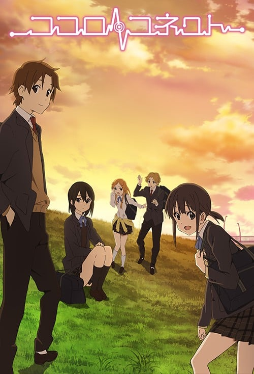
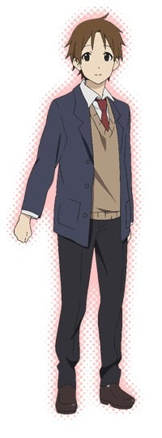
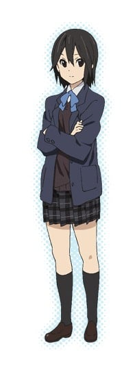
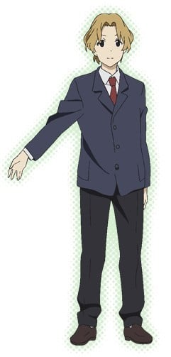
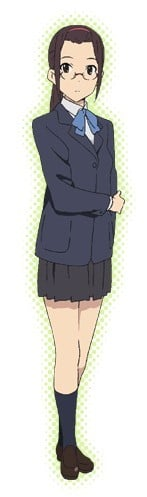
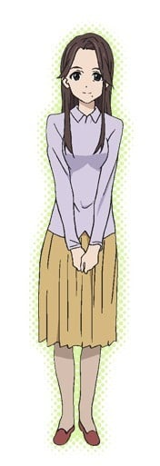
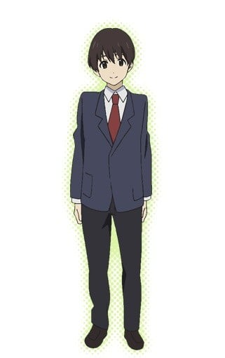
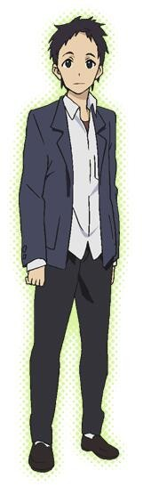

> [!bookinfo|noicon]+ **心灵链环**
> 
>
| 日文名 | ココロコネクト |
|:------: |:------------------------------------------: |
| 类型 | 小说改 |
| 新番 | 2012 年 7 月 |
| 集数 | 共17话 |
| 官网 | [http://www.kokoro-connect.com/](https://http://www.kokoro-connect.com/) |
| 制作 | SILVER LINK. |
| 导演 | 川面真也 |
| 脚本 | 志茂文彦 |
| 评分 | 7.4|
| 制片人 | 金子逸人,中川二郎,金子逸人 / 中川二郎 |

> [!abstract]+ **简介**
> 本作的舞台位于私立山星高中，在这所学校的文化研究部内，八重樫太一、永濑伊织、稻叶姬子、桐山唯、青木义文这五名成员目前面临着不可思议的现象。起初是成员中的唯及义文，在毫无前兆的情况下发生了人格交换，之后周围的其他成员也是如此。爱与青春的五角形喜剧从此正式开演了。

> [!tip]+ **章节列表**
>- [ ] 第1话：反应过来的时候就已经开始了的故事 (2012-07-07)
>- [ ] 第2话：相当有趣的人们 (2012-07-14)
>- [ ] 第3话：Jobber and Low Blow (2012-07-21)
>- [ ] 第4话：两种想法 (2012-07-28)
>- [ ] 第5话：某个告白，然后死亡就…… (2012-08-04)
>- [ ] 第6话：反应过来的时候就又已经开始了的故事 (2012-08-11)
>- [ ] 第7话：分崩离析 (2012-08-18)
>- [ ] 第8话：无人生还 (2012-08-25)
>- [ ] 第9话：停不下来停不下来停不下来 (2012-09-01)
>- [ ] 第10话：把那化成言语 (2012-09-08)
>- [ ] 第11话：留意的时候故事就又开始了 (2012-09-15)
>- [ ] 第12话：向下雪的地方 (2012-09-22)
>- [ ] 第13话：只要这五个人在的话 (2012-09-29)
>- [ ] 第14话：逐渐崩坏的每一天 (2012-12-30)
>- [ ] 第15话：什么都看不见 什么都不了解 (2012-12-30)
>- [ ] 第16话：觉悟与冰解 (2012-12-30)
>- [ ] 第17话：心相连在一起 (2012-12-30)

> [!tip]+ **主要角色**
> 
| 角色 | CV | 简介| 角色图片 |
|:----:|:---:|:---:|:--------:|
| 八重樫太一 | 水島大宙 | 一年三班学生，文研部部员。第一人称“俺”。 身高只比平均稍微高一点，爱自我牺牲。极度深爱着职业摔角。在开设文研部前打算加入“职业摔角研究会”，但因人数不足而失败。 喜欢伊织，在小说第一集误以为伊织即将死亡时，向伊织告白。而伊织也向太一告白，并且与太一接吻（借由稻叶的身体）。 有一名国小五年级的妹妹，与妹妹的感情还不错。 |  |
| 永瀬伊織 | 豊崎愛生 | 一年三班学生，文研部部长。第一人称“わたし”。 头发稍微及肩，束成低马尾，笑起来犹如春天来临一般。在开设文研部前因无法在众多社团中选择而在申请表写上“交给老师决定♥”，抱着这种破天荒的态度希望老师替其选择。结果在各种偶然跟条件重迭后成为文研部的一员。习惯称稻叶姬子为“稻叶儿（稲葉ん（いなばん））”。 喜欢太一，与太一知道彼此互相喜欢的心情。 |  |
| 稲葉姫子 | 沢城みゆき | 一年三班学生，文研部副部长。第一人称“あたし”。 留着黑色中长直发的女生，做事一丝不苟，个性尖锐而又冷漠，是因为自己没有办法信任他人，兴趣是收集情报并加以分析。在开设文研部前是打算进入“电脑社”，但因与社长性格不合而发生严重冲突而取回入社申请表，并打算复兴“情报处理部”，可惜因人数不足而失败。 喜欢太一，在伊织的鼓励下坦然面对自己的心情，于小说第二集向太一告白，并且在告白后亲吻太一。 有一名大学生的哥哥。 |  |
| 桐山唯 | 金元寿子 | 一年一班学生，文研部部员。第一人称“アタシ”。 身材娇小，只有150CM多点，天生发色是明亮栗子色，带滋润光泽的长发，平时有在锻炼身体，身躯柔软且结实，给人活泼的印象，但其实患有严重的男性恐惧症。国中时代为止一直埋头于空手道，进入高中后开始关注可爱的东西，在开设文研部前是打算进入“Fancy社”，但因人数不足而失败。 过去在“女子全接触空手道”中以压倒性的强悍而闻名，被称为“神童”。 虽然在一开始婉拒了青木的告白，但是在小说第二集中因为青木的鼓励，以及青木真挚的告白，似乎渐渐地愿意接受青木。 有一名妹妹，姐妹感情不错。 |  |
| 青木義文 | 寺島拓篤 | 一年一班学生，文研部部员。第一人称“オレ”。 有着稍微烫卷过且偏长的头发，身材高瘦，170cm以上，总是露出讨人喜欢的笑容，给人一种懒散而轻浮的印象。喜欢桐山唯，第一集时向她告白，却被委婉拒绝。因听闻类似是都巿传说的消息—山星高中设有“玩乐社”及“即使列表上未列出设社，但只要写上社名就能加入”这种消息，而觉得“感觉很有趣”而加入，但因连过去都没此被而当成申请新设社团，然而理所当然地凑不到人而失败。其后因各种巧合而加入文研社。 |  |
| 藤島麻衣子 | 伊藤静 | 1年3組で学級委員長を務めている生徒。  品行方正で委員長の責務をそつなくこなしており、成績優秀。教師からの人望も厚い。 |  |
| 後藤龍善 | 藤原啓治 | 1年3組の担任で文研部の顧問。 おおらかな性格で、悪く言えばテキトー。 生徒たちには「ごっさん」と呼ばれている。 |  |
| 八重樫莉奈 | 大亀あすか | 太一の妹。太一とはとても仲が良く、朝、寝ている彼を起こしに行くことも。  素直かつ明るい性格で、おませな少女。 兄からも大切にされているが、子供扱いされることには不満を示している。 |  |
| 桐山杏 | 佐倉綾音 | 唯の二歳年下の妹。  唯より身長が高く、活発で思いこみが激しい。 姉が空手を辞めた理由を知らない。 |  |
| 永瀬玲佳 | 田中敦子 | 伊織の母親。 現在は女手一つで伊織を育てているが、どこか世間離れをしているような印象も。 |  |
| 城山翔斗 | 市来光弘 | 太一・伊織・稲葉のクラスメイト。 温厚な性格で物腰も柔らかく、同級生に「王子」というニックネームで呼ばれている。 ジャズバンド部所属。 |  |
| 渡瀬伸吾 | 小野友樹 | 太一の友人でクラスメイト。サッカー部所属。 藤島に好意を持っている。 |  |