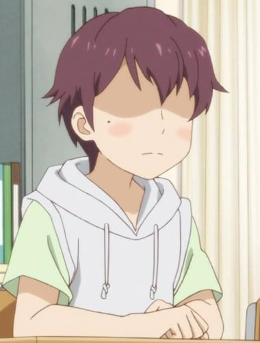

> [!bookinfo|noicon]+ **恋爱研究所**
> 
>
| 日文名 | 恋愛ラボ |
|:------: |:------------------------------------------: |
| 类型 | 漫改 |
| 新番 | 2013 年 7 月 |
| 集数 | 共13话 |
| 官网 | [http://www.love-lab.tv/](https://http://www.love-lab.tv/) |
| 制作 | 動画工房 |
| 导演 | 太田雅彦 |
| 脚本 | 杉原研二,鴻野貴光,あおしまたかし,子安秀明,あおしまたかし、子安秀明、杉原研二、鴻野貴光 |
| 评分 | 7.2|
| 制片人 |  |

> [!abstract]+ **简介**
> 　　原作是由漫画家宫原琉璃创作的轻松校园剧四格漫画，以著名的名门女子学校藤崎女子中学校（藤女）为舞台，描写爱上了“恋爱”的学生会成员们的恋爱研究及其实践。故事集中了运动娘、眼镜娘、腐女、傲娇大小姐等属性迥异的角色。

> [!tip]+ **章节列表**
>- [ ] 第1话：不期而遇的两人 (2013-07-04)
>- [ ] 第2话：怕羞少女与冰山与变态？ (2013-07-11)
>- [ ] 第3话：公开宣战的沙依和小榎 (2013-07-18)
>- [ ] 第4话：恋爱研究再开！不曾想…… (2013-07-25)
>- [ ] 第5话：这里是藤女恋爱电台 (2013-08-01)
>- [ ] 第6话：最差劲传说莉子 (2013-08-08)
>- [ ] 第7话：出阵仓桥家！ (2013-08-15)
>- [ ] 第8话：致狂野的你…… (2013-08-22)
>- [ ] 第9话：那个笑容…… (2013-08-29)
>- [ ] 第10话：精挑细选学生会（特殊摄制版） (2013-09-05)
>- [ ] 第11话：恋爱研究？ (2013-09-12)
>- [ ] 第12话：请永远做我的朋友吧 (2013-09-19)
>- [ ] 第13话：牵手 (2013-09-26)

> [!tip]+ **主要角色**
> 
| 角色 | CV | 简介| 角色图片 |
|:----:|:---:|:---:|:--------:|
| 倉橋莉子 | 沼倉愛美 | 通称「莉子」。私立藤崎女子中学2年级生，学生会会长助理。比男孩子还好胜好强，只要的朋友的请求一定会全力以赴的热心肠。因此被学生们称为「狂野帝」。不过不知道其本人如果知道来了这个绰号会怎么想？ |  |
| 真木夏緒 | 赤﨑千夏 | 通称「真木」。私立藤崎女子中学2年级生，学生会会长。容姿端正，成绩优秀。是个被众人憧憬，暗地里被称为「藤姬大人」的存在。但实际上这位「藤姬大人」一个人在学生会室内日以继夜的进行着「恋爱研究」。 |  |
| 棚橋鈴音 | 水瀬いのり | 通称「铃」。私立藤崎女子中学1年级生，学生会书记。是个不太会多想的单纯的女孩子。不是一点点而是非常的天然的主儿。时常会爆出一些让人不敢相信的傻劲儿。 |  |
| 榎本結子 | 佐倉綾音 | 通称「榎」。私立藤崎女子中学3年级生，学生会副会长。吸引人之处是「像和果子一样」松软诱人的发型。貌似是个对真木等人的“研究”感到很无聊的人，事实上却……？ |  |
| 水嶋沙依理 | 大地葉 | 通称「沙伊」。私立藤崎女子中学3年级生，学生会会计。超拜金。有些诸如因此爱财如命所以当了会计的传闻。对“研究”是否有兴趣则不得而知。冷淡腹黑型，在学生会负责吐槽和戏弄人。 |  |
| 凪野智史 | 水島大宙 | 莉子的青梅竹马，2年级生。莉子以前以“沙将”称呼。补习班属于普通班。曾在足球社与莉子为队友，于小三时转学。之后有一段时间没与莉子见面。曾向莉子告白并惨遭拒绝。莉子连同被告白的事完全忘了他。数年后再会时，因为莉子完全忘了自己而生气闹鳖扭。 |  |
| 池澤雅臣 | 松岡禎丞 | 眼镜冷面男，2年级生，小凪和莉子的朋友，学生会副会长。头脑聪明，但相对的性格略糟糕，毒舌。 |  |
| 南桃香 | 秋奈 | 新闻同好会3年级生。总是面带笑容，冷静腹黑。 |  |
| 市川奈々 | 日高里菜 | 新闻同好会2年级生。 |  |
| 桐山美花 | 諏訪彩花 | 莉子的同班同学及好友。 |  |
| エノ兄 | 杉田智和 |  |  |
| 山崎佑 | 村瀬歩 |  |  |