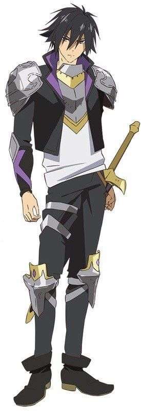
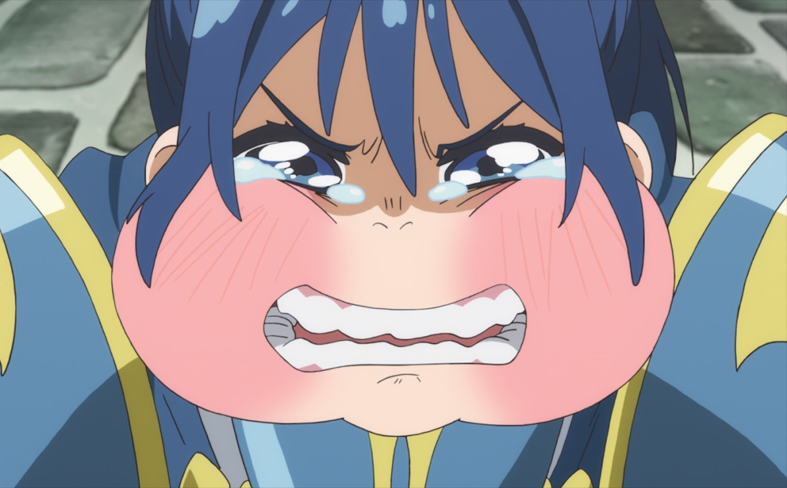

> [!bookinfo|noicon]+ **慎重勇者 ～这个勇者明明超强却过分慎重～**
> 
>
| 日文名 | 慎重勇者 ～この勇者が俺TUEEEくせに慎重すぎる～ |
|:------: |:------------------------------------------: |
| 类型 | 小说改 |
| 新番 | 2019 年 10 月 |
| 集数 | 共12话 |
| 官网 | [http://shincho-yusha.jp/](https://http://shincho-yusha.jp/) |
| 制作 | WHITE FOX |
| 导演 | 迫井政行 |
| 脚本 | 猪原健太 |
| 评分 | 6.9|
| 制片人 | 吉川綱樹 |

> [!abstract]+ **简介**
> 废柴女神莉丝塔要负责拯救超难模式的世界。
虽然成功召唤出能力值高到犯规的勇者圣哉，
没想到他却谨慎到超乎想像……
「我要三副盔甲。一副拿来穿，一副备用，还有一副是备用不见时的备用。」
不仅囤积异常的库存，还自主训练到满等为止，
谨慎到连打史莱姆都全力以赴！
如此谨慎的勇者和被他耍得团团转的女神，即将展开冒险旅程！

> [!tip]+ **章节列表**
>- [ ] 第1话：这个勇者过于傲慢 (2019-10-02)
>- [ ] 第2话：对新人女神负担太重 (2019-10-09)
>- [ ] 第3话：这个勇者过于自说自话 (2019-10-23)
>- [ ] 第4话：同伴什么的过于不需要 (2019-10-30)
>- [ ] 第5话：这个女神过于惊悚 (2019-11-06)
>- [ ] 第6话：明明是龙王却过于赖皮 (2019-11-13)
>- [ ] 第7话：这女骑士过于像狗 (2019-11-20)
>- [ ] 第8话：看似清纯却过于淫乱 (2019-11-27)
>- [ ] 第9话：死神过于无敌 (2019-12-04)
>- [ ] 第10话：明明是老人却过于厉害 (2019-12-18)
>- [ ] 第11话：这个真相过于沉重 (2019-12-25)
>- [ ] 第12话：这个勇者明明超强却过分慎重 (2019-12-27)
>- [ ] 第9.5话：总集篇 (2019-12-11)

> [!tip]+ **主要角色**
> 
| 角色 | CV | 简介| 角色图片 |
|:----:|:---:|:---:|:--------:|
| セルセウス | 斧アツシ | 筋骨隆々の剣神。 常に素振りなどの鍛錬を欠かさないなど努力家。 |  |
| 竜宮院聖哉 | 梅原裕一郎 | 新米女神のリスタルテに召喚された、ありえないほど慎重な勇者。能力値は高いが、異常なまでに用心深い。 |  |
| リスタルテ | 豊崎愛生 | 治癒の能力を持った新米の女神。難度Sの世界・ゲアブランデを救うべく聖哉を召喚したが、聖哉の異常なほど慎重な性格に、いつも振り回されている。 |  |
| マッシュ | 河西健吾 | 竜族の血を引く戦士。 魔王討伐を目指して仲間になるが、 聖哉からは荷物扱いされる。 |  |
| エルル | 古賀葵 | マッシュと幼なじみの竜族の血を引く魔法使い。 聖哉からはマッシュ同様に荷物扱いされる。 |  |
| アリアドア | 山村響 | 封印の能力を持ったリスタルテの先輩女神。 過去にいくつもの異世界を救済してきたベテラン。 |  |
| アデネラ | 井澤詩織 | 軍神。剣技はセルセウスを上回る。特技は連撃剣。いつもボロボロの服と髪で、とても女神には見えない。 |  |
| ロザリー=ロズガルド | 花守ゆみり | 戦帝の娘で、ロズガルド騎士団の守備隊長。偉大な父親を尊敬しており、慎重すぎる聖哉が勇者であることに不満を持つ。 |  |
| ウォルクス＝ロズガルド | 小野友樹 | 戦帝と呼ばれる『ゲアブランデ』の最強騎士。 帝都ロズガルドを統治し、騎士団を率いて魔王軍と戦い続けている。 |  |
| ニーナ | 高野麻里佳 |  |  |
| ケオス・マキナ | たかはし智秋 | 勇者・聖哉と女神・リスタルテの前に立ちはだかる、魔王軍四天王の一人 |  |
| 武器屋の店主 | 村上裕哉 |  |  |