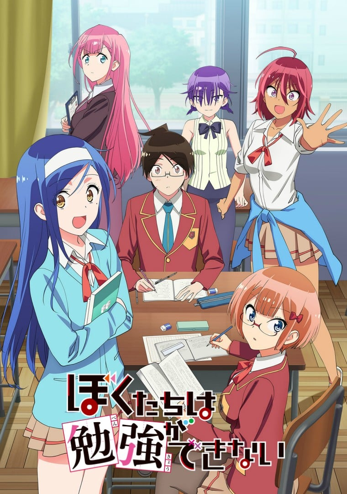
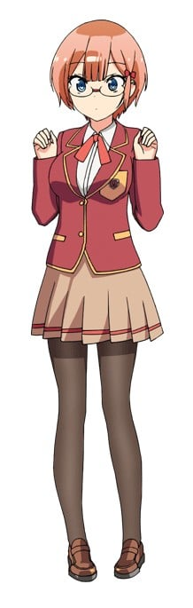
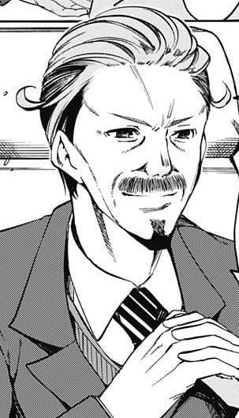
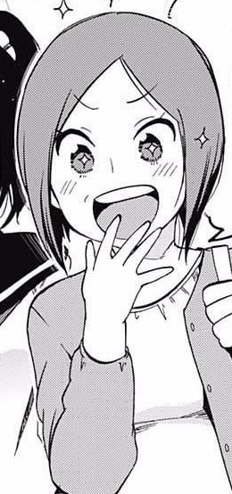
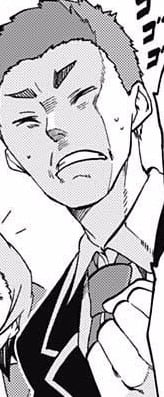
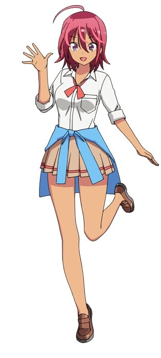

> [!bookinfo|noicon]+ **我们真的学不来**
> 
>
| 日文名 | ぼくたちは勉強ができない |
|:------: |:------------------------------------------: |
| 类型 | 漫改 |
| 新番 | 2019 年 4 月 |
| 集数 | 共13话 |
| 官网 | [https://boku-ben.com/](https://https://boku-ben.com/) |
| 制作 | アルボアニメーション |
| 导演 | 岩崎良明 |
| 脚本 | 雑破業 |
| 评分 | 6.3|
| 制片人 | 井田和行,カルキ ラジープ |

> [!abstract]+ **简介**
> 刻苦学习的高中3年生·唯我成幸，为了获得免缴大学学费的“特别VIP推荐”资格，而要去担任为备考而苦战的同级生们的教育指导员。教导的对象是“文学之森的睡美人”古桥文乃和“机关精巧的拇指姑娘”绪方理珠这两位学园顶尖的天才美少女！原本以为她们的学习能力完美无缺，没想到对于不擅长的学科却完全无能……！？成幸一边被充满个性的“学不来女孩”们玩弄于股掌之间，一边为了让她们努力通过大学考试！无论学习还是恋爱都“学不来”的天才们的恋爱喜剧，就此开幕！！

> [!tip]+ **章节列表**
>- [ ] 第1话：天才与[X]表里一体 (2019-04-06)
>- [ ] 第2话：若有鱼心（若有好感），天才亦有[X]心 (2019-04-13)
>- [ ] 第3话：天才明白[X]也能心意相通 (2019-04-20)
>- [ ] 第4话：她向天才所期望的东西即是[X] (2019-04-27)
>- [ ] 第5话：林间的天才迷失于[Ｘ] (2019-05-04)
>- [ ] 第6话：天才[X]们因此而学不来 (2019-05-11)
>- [ ] 第7话：前任的秘密领域惨如[Ｘ] (2019-05-18)
>- [ ] 第8话：天才的举手投足有时将[Ｘ]耍得团团转 (2019-05-25)
>- [ ] 第9话：他在禁地为[Ｘ]奋战 (2019-06-01)
>- [ ] 第10话：迷失在新天地的羔羊与[Ｘ]邂逅 (2019-06-08)
>- [ ] 第11话：威严的前任有时会服侍[Ｘ] (2019-06-15)
>- [ ] 第12话：天才有时会与[Ｘ]共同追忆 (2019-06-22)
>- [ ] 第13话：天才的眼中天之光都是[ x ] (2019-06-29)

> [!tip]+ **主要角色**
> 
| 角色 | CV | 简介| 角色图片 |
|:----:|:---:|:---:|:--------:|
| 緒方理珠 | 富田美憂 | 数学・物理においては敵う者がいないと言われる通称「機械仕掛けの親指姫」。容姿は薄いピンクのショートヘアに眼鏡を掛けており、低身長（143cm）の割に胸は大きい（うるかの見立てではFカップ）。低身長は本人も気にしているのか、うるかに指摘された際には「ちんまくありません！」と言い返している。 |  |
| 古橋文乃 | 白石晴香 | 現代文・古文・漢文を得意とする通称「文学の森の眠り姫」。容姿は黒髪ロングで、モデル並みにスタイルも良いが、胸が小さいためにそれを指摘されると落ち込む。また手先がかなり不器用である。利き手は左手。授業中に居眠りをしていることが多い |  |
| 唯我成幸 | 逢坂良太 | 本作品の主人公。幼少期から要領が悪かったが努力を重ねることで成績を伸ばし、努力型の秀才として、常に上位の成績をキープしているが、天才である文乃と理珠の前では一歩及ばないこともあって目立たず、当初は2人からも名前を憶えて貰えなかった（後に憶えて貰い、名前で呼ばれるようになる）。 |  |
| 学園長 | 土田大 | 一ノ瀬学園の学園長。成幸の秀才ぶりを評価した上で特別VIP推薦の資格を認めたものの、その条件として文乃や理珠、うるかの教育係に成幸を任命し、その上で彼女らを志望する大学に進学させる事といった難題を（文乃いわく「実績と保身のために」）叩きつける。 なお、これまで教師が務めていた文乃と理珠の教育係を成幸に依頼した理由は不明。 |  |
| 唯我葉月 | 峯田茉優 | 成幸の次妹と弟。双子で葉月が姉、和樹が弟。 理珠と文乃の二人に対し、『いつ嫁にくんの？』と瞳を輝かせ訊いていたことから、二人をすこぶる気に入った様子。 |  |
| 唯我和樹 | 藤原夏海 | 成幸の次妹と弟。双子で葉月が姉、和樹が弟。 理珠と文乃の二人に対し、『いつ嫁にくんの？』と瞳を輝かせ訊いていたことから、二人をすこぶる気に入った様子。 |  |
| 唯我水希 | 高野麻里佳 | 成幸の長妹。黒髪を後ろで束ねポニーテールにしており、唯我家の家事洗濯炊事の大部分を引き受けている。 |  |
| 唯我花枝 | 川澄綾子 | 成幸の母。気さくで人が良く、家を訪れた理珠と文乃を、お人形さんみたいと気に入り「りっちゃん」「ふみちゃん」の愛称で呼び始めていた。 |  |
| 大森奏 | 内匠靖明 | 成幸のクラスメイト。のんきかつ気楽な性格で、よく成幸にノートを貸して貰っている。成幸が古橋、緒方と仲良くなったことを羨むシーンが多い。 |  |
| 武元うるか | 鈴代紗弓 | 成幸の中学時代からの顔馴染みで、通称「白銀の漆黒人魚姫」。活発な性格で、常にハイテンション且つマイペースな行動ばかりが目立っており、他人の発言を全く理解できないなどの抜けた一面や勉強の場を掻き乱して迷惑を掛ける等の空気の読めない一面もあるが、友人とじゃれるのが好きなために多少の反撃は笑って受け入れる。反面では成幸の真意を知った時には素直になったり、時には周囲を察して空気を読む。 |  |
| 関城紗和子 | 大西沙織 | 化学部部長。理系のテストでは理珠に次ぐ2位である為彼女をライバル視しており（最初は理珠からは名前さえも憶えてもらえていなかった）、ツンツンしたような態度を取っているが、実際は彼女と友達になりたいという感情から来ているらしく、成幸との会話で「同じ大学に進みたい」という本心を明かしている。制服の上から重ね着した白衣がトレードマーク。 |  |
| 小林陽真 | 河西健吾 | 成幸のクラスメイト。成幸とは中学時代からの付き合いで、『成ちゃん』と呼んでいる。うるかとも同じ中学からの付き合いである縁からか、彼女の成幸への恋心に気付いている節がある。 |  |