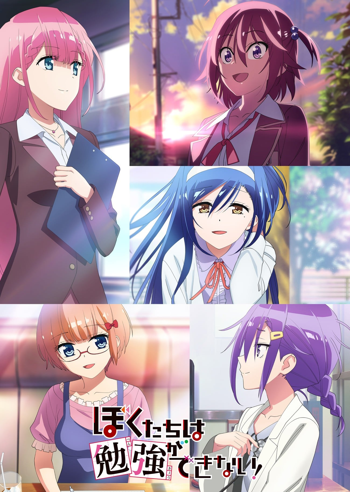
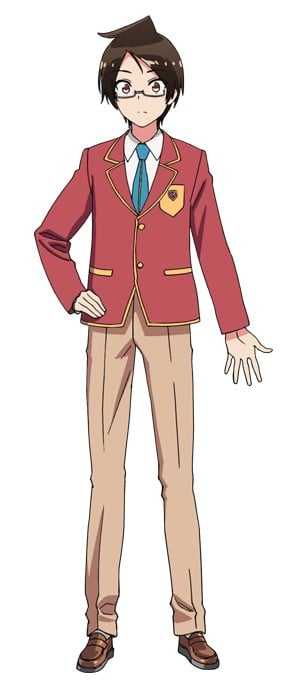
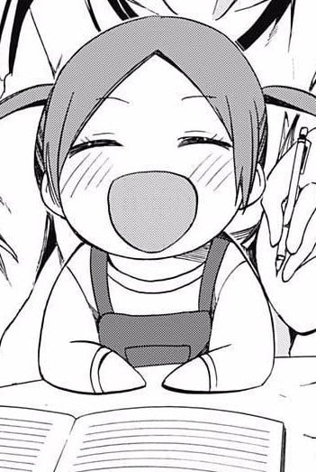
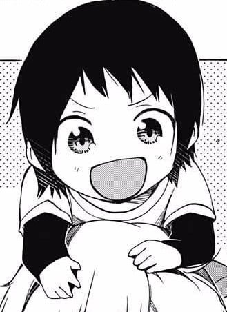
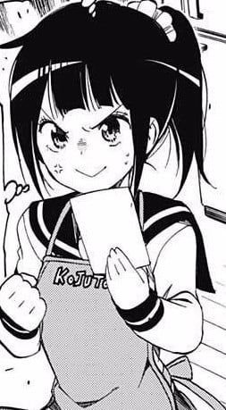
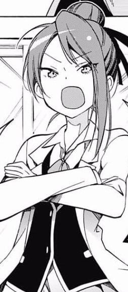
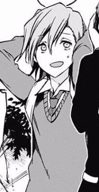
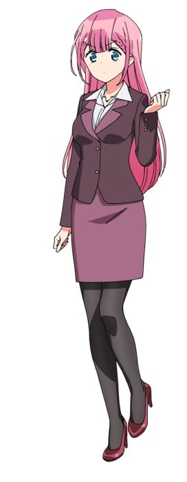
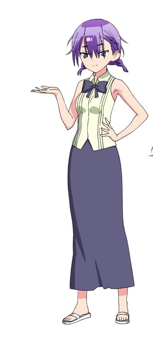

> [!bookinfo|noicon]+ **我们真的学不来！**
> 
>
| 日文名 | ぼくたちは勉強ができない！ |
|:------: |:------------------------------------------: |
| 类型 | 漫改 |
| 新番 | 2019 年 10 月 |
| 集数 | 共13话 |
| 官网 | [https://boku-ben.com/](https://https://boku-ben.com/) |
| 制作 | アルボアニメーション |
| 导演 | 岩崎良明 |
| 脚本 | 雑破業 |
| 评分 | 6|
| 制片人 | 井田和行,カルキ ラジープ |

> [!abstract]+ **简介**
> 

> [!tip]+ **章节列表**
>- [ ] 第1话：天才与他对何为[x]有各自的判断 (2019-10-05)
>- [ ] 第2话：前人的自尊偶尔与[x]等人的情况背道而驰 (2019-10-12)
>- [ ] 第3话：天才为季节的变换与[x]的脸色而烦忧 (2019-10-19)
>- [ ] 第4话：天才偶尔会与受限的[x]中奋斗 (2019-10-26)
>- [ ] 第5话：尽心的礼物偶尔会成为[X]的错综 (2019-11-02)
>- [ ] 第6话：他们安知所面[x]之志哉 (2019-11-09)
>- [ ] 第7话：天才默默地为他们的忖度而[x] (2019-11-16)
>- [ ] 第8话：[x]如水 川流不息 (2019-11-23)
>- [ ] 第9话：为最爱的星赋予[x]之名（前篇） (2019-11-30)
>- [ ] 第10话：为最爱的星赋予[x]之名（后篇） (2019-12-07)
>- [ ] 第11话：庆典伊始[x]便接踵而至 (2019-12-14)
>- [ ] 第12话：庆典喧闹不止[x]等人踏上荆棘之路 (2019-12-21)
>- [ ] 第13话：留下寂寞与华美的庆典尾声为[x]等人送上祝福 (2019-12-28)

> [!tip]+ **主要角色**
> 
| 角色 | CV | 简介| 角色图片 |
|:----:|:---:|:---:|:--------:|
| 緒方理珠 | 富田美憂 | 数学・物理においては敵う者がいないと言われる通称「機械仕掛けの親指姫」。容姿は薄いピンクのショートヘアに眼鏡を掛けており、低身長（143cm）の割に胸は大きい（うるかの見立てではFカップ）。低身長は本人も気にしているのか、うるかに指摘された際には「ちんまくありません！」と言い返している。 |  |
| 古橋文乃 | 白石晴香 | 現代文・古文・漢文を得意とする通称「文学の森の眠り姫」。容姿は黒髪ロングで、モデル並みにスタイルも良いが、胸が小さいためにそれを指摘されると落ち込む。また手先がかなり不器用である。利き手は左手。授業中に居眠りをしていることが多い |  |
| 唯我成幸 | 逢坂良太 | 本作品の主人公。幼少期から要領が悪かったが努力を重ねることで成績を伸ばし、努力型の秀才として、常に上位の成績をキープしているが、天才である文乃と理珠の前では一歩及ばないこともあって目立たず、当初は2人からも名前を憶えて貰えなかった（後に憶えて貰い、名前で呼ばれるようになる）。 |  |
| 唯我葉月 | 峯田茉優 | 成幸の次妹と弟。双子で葉月が姉、和樹が弟。 理珠と文乃の二人に対し、『いつ嫁にくんの？』と瞳を輝かせ訊いていたことから、二人をすこぶる気に入った様子。 |  |
| 唯我和樹 | 藤原夏海 | 成幸の次妹と弟。双子で葉月が姉、和樹が弟。 理珠と文乃の二人に対し、『いつ嫁にくんの？』と瞳を輝かせ訊いていたことから、二人をすこぶる気に入った様子。 |  |
| 唯我水希 | 高野麻里佳 | 成幸の長妹。黒髪を後ろで束ねポニーテールにしており、唯我家の家事洗濯炊事の大部分を引き受けている。 |  |
| 唯我花枝 | 川澄綾子 | 成幸の母。気さくで人が良く、家を訪れた理珠と文乃を、お人形さんみたいと気に入り「りっちゃん」「ふみちゃん」の愛称で呼び始めていた。 |  |
| 武元うるか | 鈴代紗弓 | 成幸の中学時代からの顔馴染みで、通称「白銀の漆黒人魚姫」。活発な性格で、常にハイテンション且つマイペースな行動ばかりが目立っており、他人の発言を全く理解できないなどの抜けた一面や勉強の場を掻き乱して迷惑を掛ける等の空気の読めない一面もあるが、友人とじゃれるのが好きなために多少の反撃は笑って受け入れる。反面では成幸の真意を知った時には素直になったり、時には周囲を察して空気を読む。 |  |
| 関城紗和子 | 大西沙織 | 化学部部長。理系のテストでは理珠に次ぐ2位である為彼女をライバル視しており（最初は理珠からは名前さえも憶えてもらえていなかった）、ツンツンしたような態度を取っているが、実際は彼女と友達になりたいという感情から来ているらしく、成幸との会話で「同じ大学に進みたい」という本心を明かしている。制服の上から重ね着した白衣がトレードマーク。 |  |
| 小林陽真 | 河西健吾 | 成幸のクラスメイト。成幸とは中学時代からの付き合いで、『成ちゃん』と呼んでいる。うるかとも同じ中学からの付き合いである縁からか、彼女の成幸への恋心に気付いている節がある。 |  |
| 桐須真冬 | Lynn | 一ノ瀬学園の教師。文乃と理珠の初代教育係（ちなみに、成幸は7人目）。「怠慢」「論外」など、二字熟語を発してから喋るのが特徴。過去に一時の感情で才能を捨て後悔した経験から「教育者は生徒の感情の如何によらず才ある道に導くべき」という考え持ち、成幸の教育方針を一切認めておらず、「天才を凡人へ育てるなど愚の骨頂」などと発言している。一方では山で迷子になった理珠を自分の手が傷だらけになりながらも探し出そうと懸命になるなどの優しい一面もある。 |  |
| 小美浪あすみ | 朝日奈丸佳 | 成幸たちが通う一ノ瀬学園の学年が一つ上の卒業生。中学生と間違われるほどの小柄な体格（理珠よりは若干背が高い）をしている。実家の診療所を継ぐために国公立医大を目指しているが、配点の大きい理科を苦手科目としているために一浪しており、現在は予備校に通っている。理科が苦手という事もあり医者の父親には医学部受験を快く思われていなかった。 やや口は悪いが努力家で、予備校代や学費を稼ぐ目的で、授業が無い時はメイド喫茶でアルバイトをしており、そこでは「小妖精メイドあしゅみぃ」と名乗っており、店の人気No.1のメイドを務めている。 たまたま予備校に来た成幸に諸々の事情を知られたことで、彼から受験対策を受けることになる。 |  |