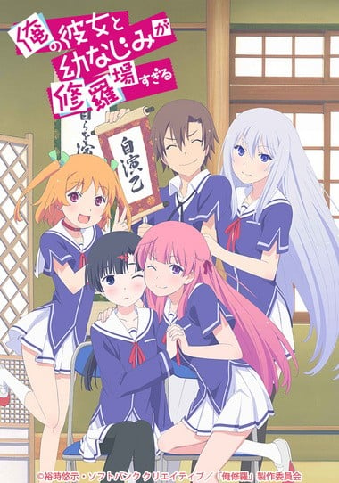
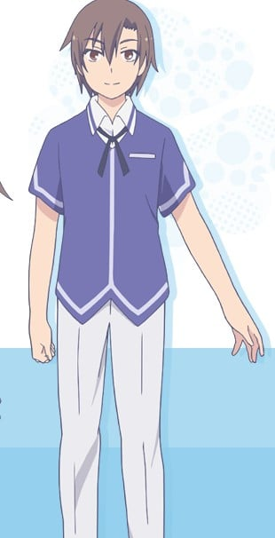
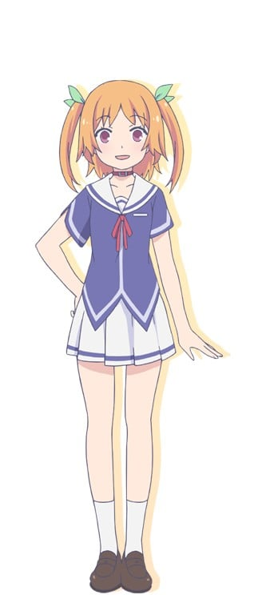
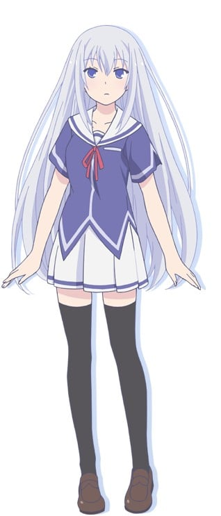
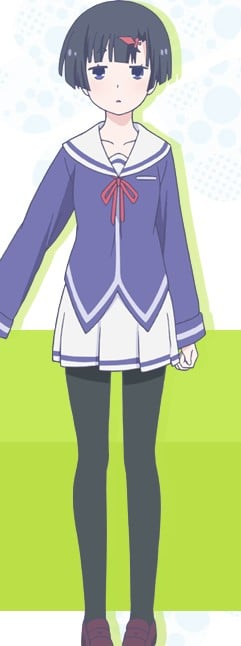
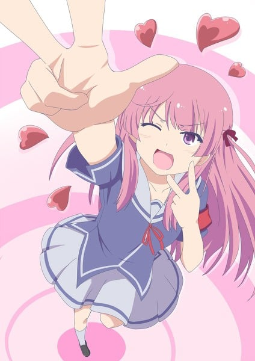
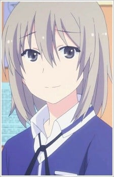
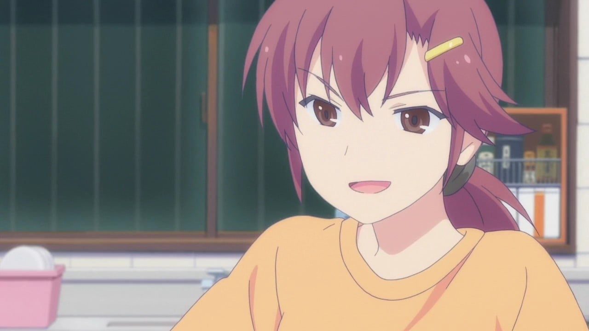
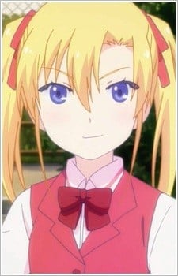

> [!bookinfo|noicon]+ **我女友与青梅竹马的惨烈修罗场**
> 
>
| 日文名 | 俺の彼女と幼なじみが修羅場すぎる |
|:------: |:------------------------------------------: |
| 类型 | 小说改 |
| 新番 | 2013 年 1 月 |
| 集数 | 共13话 |
| 官网 | [http://www.oreshura.net/](https://http://www.oreshura.net/) |
| 制作 | A-1 Pictures |
| 导演 | 亀井幹太 |
| 脚本 | 浦畑達彦,亀井幹太,冨田頼子,裕時悠示 |
| 评分 | 6.4|
| 制片人 | 五十嵐守 |

> [!abstract]+ **简介**
> 主人公季堂锐太是个成绩优秀的高中一年级学生，同时也是个恋爱反对派。本来是和像自己妹妹一般的青梅竹马一起过着普通的高中生活的，但某天却被校内公认的第一美人，归国子女夏川真凉表白了。然而真凉的真实意图却是为了骗过众人而需要锐太与她假扮情侣。被真凉掌握了自己的某个“秘密”的锐太被迫假扮“男友”这一角色……之后“前女友”姬香、“未婚妻”爱衣也加了进来，围绕锐太的壮烈修罗场就此拉开帷幕！

> [!tip]+ **章节列表**
>- [ ] 第1话：高中生活的开端是修罗场 (2013-01-05)
>- [ ] 第2话：新社团的成立是修罗场 (2013-01-12)
>- [ ] 第3话：青梅竹马的眼泪是修罗场 (2013-01-19)
>- [ ] 第4话：男人的战斗是修罗场 (2013-01-26)
>- [ ] 第5话：情书的真相是修罗场 (2013-02-02)
>- [ ] 第6话：斩裂灰色世界的修罗场 (2013-02-09)
>- [ ] 第7话：明明是暑期补习却是修罗场 (2013-02-16)
>- [ ] 第8话：电影院双重约会是修罗场 (2013-02-23)
>- [ ] 第9话：回想起来的约定是修罗场 (2013-03-02)
>- [ ] 第10话：暑假合宿会议是修罗场 (2013-03-09)
>- [ ] 第11话：合宿前夜的兴奋是修罗场 (2013-03-16)
>- [ ] 第12话：战略的终结是修罗场 (2013-03-23)
>- [ ] 第13话：通向新世界的修罗场 (2013-03-30)
>- [ ] 第0话：～自らを演出する乙女の特番～ (2012-12-29)

> [!tip]+ **主要角色**
> 
| 角色 | CV | 简介| 角色图片 |
|:----:|:---:|:---:|:--------:|
| 季堂鋭太 | 逢坂良太 | 本作主角，15岁，就读县立羽根山高中1年1班。以附近的国立大学医学系为目标，为了取得推甄权，从刚入学就致力于学习，成绩维持全校第一名。 双亲于国3夏天丢下自己各自和自己的恋人建立新的家庭，让他对恋爱抱持着强烈的不信任感。双亲感情还很好的时候，内心总想出锋头，常有中二病思想，成绩也只有中下程度。双亲离婚及千和出车祸后，价值观大幅改变，立志成为医生治好千和的伤。 把国中时代充满中二病思想的日记藏在动物图鉴的盒子里，结果日记被卖到中古书店后落入真凉手中，让他无法反抗真凉。 双亲离家后由姑姑冴子担任监护人，因为工作而常常不在家，家事都交给锐太处理。 人生第一次被告白的经验是10年前就读若叶幼稚园星组时被爱衣告白。 |  |
| 春咲千和 | 赤﨑千夏 | 锐太的青梅竹马，住在锐太隔壁。15岁，就读羽根山高中1年级5班。名字发音让人联想到小狗，加上体型迷你，被取了“吉娃娃”这个绰号。 从小1开始练习剑道，曾经强到足以出席全国大赛，但在国3夏天出车祸时受了重伤，其中腰部的伤害让她无法进行激烈运动，不得不放弃剑道。 升高中后因为被锐太“青梅竹马怎么可能变成女朋友”的发言激怒，宣示要让自己变得大受男生欢迎，不过一直没有实现。锐太和真凉假装交往后，激起千和强烈的对抗心，不断于各种场面找真凉挑战，后来还被真凉怂恿加入自演乙之会。 料理技巧非常差，但本人并没有自觉，企图让锐太吃下自己亲手做的料理，但最后都变成反而是千和吃擅长料理的锐太所做的菜。 小学入学前3个月搬到锐太家隔壁，交情从当时一直持续到现在。 |  |
| 夏川真涼 | 田村ゆかり | 锐太的同学，15岁，就读羽根山高中1年级1班。在国外住9年后回到日本，银色的长发相当显眼。 被评为校内第一美女，入学后不断的被男同学告白，拒绝久了之后觉得很烦，于是找同样对谈恋爱没兴趣的锐太伪装成情侣。千和因为两人交往而敌视真凉，两人经常吵架，后来真凉为了帮千和找男朋友，找教古文的教师系谷担任顾问，成立“自我演出的乙女之会”（简称自演乙之会），担任部长一职。 老家在瑞典，家里很有钱，但真凉能自由使用的钱很少。 回日本是因为要等她的母亲。 料理技术和千和不相上下。非常喜欢《JoJo的奇妙冒险》。 讲话毒舌，尤其看到锐太和其他女生友好时会加倍毒舌。 |  |
| 秋篠姫香 | 金元寿子 | 就读羽根山高中1年2班，15岁。 有中二病倾向，看到锐太残存的中二痕迹后对他产生好感。 原本给人认真、不太爱说话的印象，但遇到锐太之后，行动变的很积极。 |  |
| 冬海愛衣 | 茅野愛衣 | 就读羽根山高中1年3班，担任风纪委员。个性认真，成绩排名全校第3。因为自演乙之会引发很多问题，企图解散自演乙之会，但后来自己也跟着加入。和薰同国小，从小1同班到小4，于小5第1学期搬到外县市，在高1春天再度搬回羽根山市。和父亲、弟弟住在一起，因为父亲工作需要而经常搬家。 10年前和锐太一起就读若叶幼稚园星组，当年夏天向锐太告白，并于当年夏天搬家而转学。 |  |
| 遊井カオル | 種田梨沙 | 鋭太の『親友』。愛衣の幼馴染。同じ1年1組のクラスメイトで生徒会書記。中性的な外見をした男子生徒で、成績は学年20位。 中学3年の時に鋭太と同じクラスになってからの付き合いで、鋭太や千和の家庭の事情をある程度知りながら踏み込んでこない。鋭太曰く「聞き上手」「人間関係の達人」。 千和とも付き合いがあり応援しているが、小学校で同級生だった愛衣のことも応援している。さらに自分自身も鋭太に対する『好意』を見せることがある。何らかの『秘密』があるらしく、愛衣はその真相を知っている模様。 カオルとは双子だと主張する、遊井カオリと名乗る妹がいる。外見も受ける印象もカオルとそっくりであるため、鋭太はカオルが女装したのではないかと疑っていたが、愛衣の弟の勇樹がカオリを知っていたため、確信を持てずにいる。バナナパフェが好物。 |  |
| 桐生冴子 | 名塚佳織 | 鋭太の伯母で独身。両親の身勝手で孤独の身となった彼を引き取り、保護者となっている。ゲーム会社「ソフトダンク」のゲームクリエーター。ギャルゲーや乙女ゲームの制作（シナリオ、プログラム、グラフィック、音楽、その他）を担当する自称「なんでも屋」。 仕事がキツイと『へろへろモード』に陥るが、帰宅して鋭太の手料理を摂取すれば、スタイル美人の『覚醒モード』となる。 初対面で鋭太と真涼の関係を「フェイク」と言い当て、「自演乙の会」会員を動揺させる。さらに鋭太に『あたしも攻略しろ』と参戦意図を垣間見せている。 |  |
| 夏川真那 | 東山奈央 | サブヒロイン。真涼の妹。隣町の名門、私立ネナカ女学院中等部の3年生。金髪碧眼で髪型はツインテール。 かなりの毒舌家で、真涼とは互いの両親のわだかまりを背負った経緯がある模様だが、悪い人間ではない。真涼に対し苛立ちを持ちながらも親愛の情を抱いており、鋭太に対し「お姉ちゃんのカレシ」として内心を覗かせている。姉に続き鋭太とキスを交わした一人だが、他のヒロインよりも一歩引いた立場となっている。鋭太を童貞呼ばわりしている。 初対面でぶつかった姫香とは同じ妹という立場で通ずるものがあり、友人関係を結んでいる。 |  |