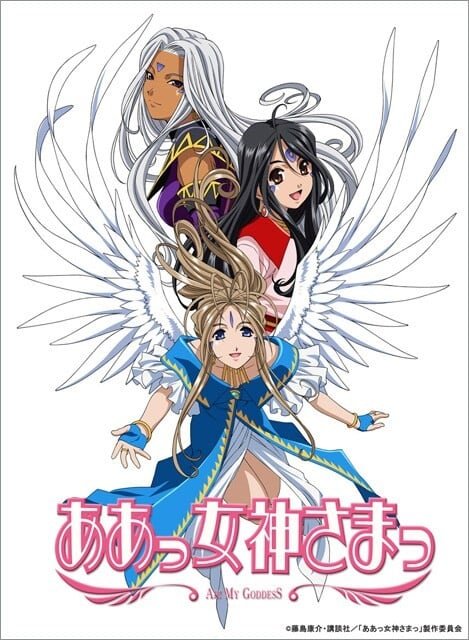
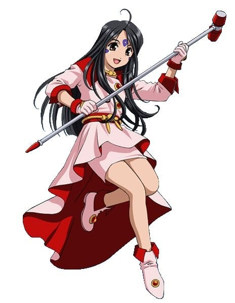
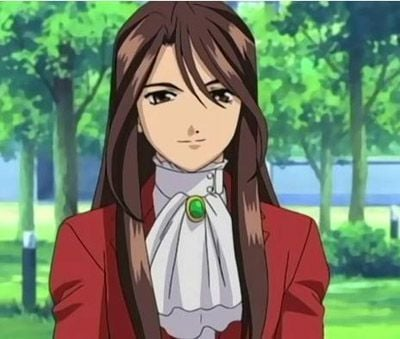
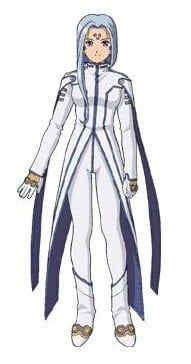
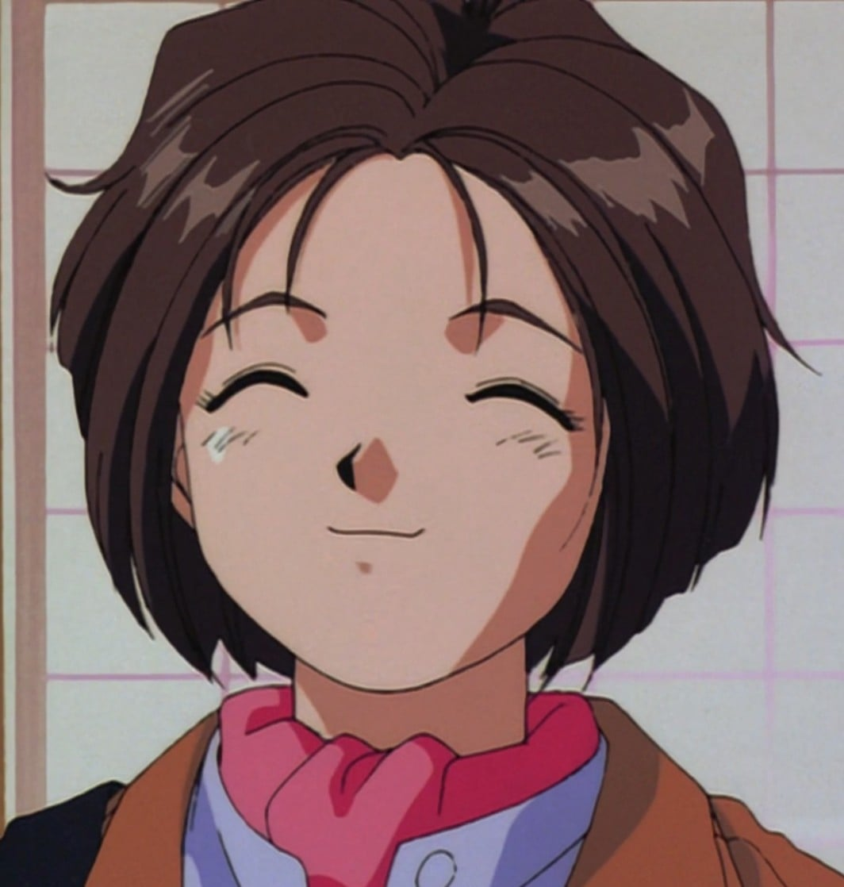
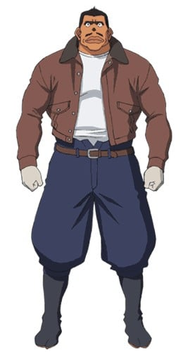

> [!bookinfo|noicon]+ **我的女神**
> 
>
| 日文名 | ああっ女神さまっ |
|:------: |:------------------------------------------: |
| 类型 | 漫改 |
| 新番 | 2005 年 1 月 |
| 集数 | 共26话 |
| 官网 | [https://www.tbs.co.jp/megamisama/megami1/index-j.html](https://https://www.tbs.co.jp/megamisama/megami1/index-j.html) |
| 制作 | AICデジタル |
| 导演 | 合田浩章 |
| 脚本 | 合田浩章,渡辺陽,日暮茶坊,あおしまたかし,花田十輝 |
| 评分 | 7.2|
| 制片人 |  |

> [!abstract]+ **简介**
> 舞台在位于千叶县猫实（ねこみ）市的猫实工业大学与其周边。此外“猫实”这个地名于千叶县浦安市猫实（ねこざね）确实存在着。
故事从主人公（连载开始当初）猫实工大学生的森里萤一打错电话到‘我的女神事务所’开始（虽然萤一以为是自己打错电话号码，事实并非如此，是世界树的功能运作为了救赎萤一而产生的必然）。
萤一因为发现自己打错电话而惊慌，电话里首先传出“我现在就立刻过来”的说话，然后在镜中有名自称蓓儿丹娣的女神出现。蓓儿丹娣问萤一有什么愿望，萤一于是说出“希望像你这样的女神、能够一直留在我的身边”这句话。这个愿望得到天上界的答应。自此之后，萤一就与蓓儿丹娣一同生活了。

> [!tip]+ **章节列表**
>- [ ] 第1话：“啊！你是女神？”
>- [ ] 第2话：啊！信者得救？
>- [ ] 第3话：啊！修行、我家和女神
>- [ ] 第4话：啊！女王和女神
>- [ ] 第5话：啊！同一屋檐下
>- [ ] 第6话：啊！便宜有好货？
>- [ ] 第7话：啊！传达情意之处
>- [ ] 第8话：啊！从偏差值30开始的恋爱考试
>- [ ] 第9话：啊！女王殿下和女神的秘密
>- [ ] 第10话：啊！自动车部能赢吗？
>- [ ] 第11话：啊！恶魔来了灾祸降临？
>- [ ] 第12话：啊！女神和女王孰轻孰重？
>- [ ] 第12.5话：ああっ女神さまっとの交換日記っ? (2005-03-11)
>- [ ] 第13话：啊！姐姐是谁的？
>- [ ] 第14话：啊！以决斗为名的教育实习？
>- [ ] 第15话：啊！心被女神夺走了？
>- [ ] 第16话：啊！灾祸来到茶梗会竖起来？
>- [ ] 第17话：才能和努力是什么？
>- [ ] 第18话：啊！在月下做出命运的告白
>- [ ] 第19话：啊！别那样看着我好吗？
>- [ ] 第20话：啊！是男人就去救女神？
>- [ ] 第21话：啊！憧憬的白色翅膀天使
>- [ ] 第22话：啊！恶魔的私语和壶在一起？
>- [ ] 第23话：啊！救世主随着笛音出现？
>- [ ] 第24话：啊！永远和你在一起 (2005-07-07)
>- [ ] 第25话：啊！兀儿德的小恋曲 (2005-08-20)
>- [ ] 第26话：啊！心跳加速就是大人的滋味？ (2005-12-23)
>- [ ] 第1话：ああっ女神さまっとの交換日記っ？

> [!tip]+ **主要角色**
> 
| 角色 | CV | 简介| 角色图片 |
|:----:|:---:|:---:|:--------:|
| 森里螢一 | 菊池正美 | 猫実工業大学に通う大学２年生（９話から大学３年生に進級）。イマイチもてなかった高校生活に別れを告げ、北海道から単身、猫実工業大学に進学。彼女と一緒に憧れのキャンパスライフを送ることを夢見ていたが、入学早々『学園の女王さま』三嶋沙夜子をデートに誘い、見事撃沈！　先輩が皆一癖も二癖もある強烈キャラ揃いの自動車部に入ってしまい、さらに女性と縁遠い生活を送るハメに。 ２年の冬まで、格安という理由で入居した猫実工大学生寮で先輩たちにこき使われ暮らしていたが、ある日のこと、彼の不幸っぷりを見かねた天上界のシステム【ユグドラシル】に選ばれ、『天上界の恵を得る権利』を手にする。 その使者としてやって来た女神『ベルダンディー』に、『君のような女神に、ずっと側にいて欲しい』と言ってしまい、それからは女神さまと一緒の共同生活へ。 天性のお人好しと言われるだけあって、困っている人を見ると放っておけない性格。その結果、どんどん不幸に拍車がかかっていくのだが、それをマイナスと感じないポジティブな部分もある。 夢は『自分の好きなバイク』を作ること。もっとも当面の夢は、いかに『ベルダンディーとの仲を発展させるか』だが……。 |  |
| ベルダンディー | 井上喜久子 | 『お助け女神事務所』に所属する、『１級神２種非限定』の女神さま。 ユグドラシルに選ばれた人々の元に現れ『願いを叶える』という女神としての職務に従事していたが、ある日冴えない大学生である森里螢一から『君のような女神に、ずっと側にいて欲しい』と言われ、それが受理されてしまう。以来、地上界で螢一と共に生活をすることに。 女神としての能力はもちろん、洗濯料理裁縫といった家事全般もパーフェクト！　だが、性格的に人を疑うことをしない上、地上界の一般常識に疎いこともあって、時たま大胆な行動をとることもある。それをして沙夜子や恵に『天然』と突っ込まれることもしばしば。 ベルダンディーと共にいる人は、そのはほんわかとした性格に引っ張られ、気付いたときには、彼女のペースに巻き込まれていることが多い。 天上界でも高位の女神であるため、本来使える力は大きいのだが、地上ではあまりにも強力すぎるため、左耳の封環（ピアス）によって約千分の一程度に力を制限されている。 また、風の属性を持つ天使『ホーリーベル』を持っており、彼女と共に唱える法術は、通常時のベルダンディーが唱える物より強力である。 |  |
| ウルド | 冬馬由美 | ベルダンディーの姉で、『２級神管理限定』の女神さま。 普段は天上界のシステムである【ユグドラシル】の管理業務に従事しているが、あまりに進展しない螢一とベルダンディーの仲に業を煮やして、職務を放って地上界へとやってくる。以降、森里家に居着き、スキあらば怪しい薬を使って二人の仲を取り持とうと画策している。 性格は、ワガママで自分勝手。マイペースという部分では、ベルダンディーと一緒だが、ウルドの場合、楽しければ何でもアリという享楽的な部分が大きく、その点ではずいぶん違う。また『目的のためには手段を選ばない』のだが、『その目的を忘れて』行動しがち。その結果、螢一など周りの人々に迷惑を及ぼすことも多々ある。 しかし、三姉妹の長女だけあり、誰よりも深く二人の妹のことを大切に思っているのも事実。螢一に対しても、厳しいことを言っているようで、実はちゃんと的確なアドバイスを送っていることが多い。 女神としての格は、ベルダンディーの下ではあるが、内在する能力は遙かにベルダンディーを上回る。それは、彼女の生まれに起因しており、『半神半魔』のウルドは、神族の父親と魔族の母親（母親は大魔界長ヒルド）の間に生まれた、ベルダンディーとは異母姉妹であることが起因しているようだ。 |  |
| スクルド | 久川綾 | ベルダンディーの妹で、『２級神１種限定』の女神さま。 ベルダンディーのことが大好きで、ウルドの言いつけは聞かずとも、ベルダンディーの言うことだけは素直に聞く三姉妹の末っ子。 契約のため地上界に行ったままのベルダンディーの身を常日頃から案じ、窮地を察し、意を決して地上へ！　以後、ウルド同様、森里家に居着くことになる。 趣味は発明で、メカや機械いじりが大好き。少しでもベルダンディーの力になろうと、日々、様々な便利アイテムを作製するが、その成果はイマイチ現れていないよう・・・。 しかし、恵に負けまいという一身やベルダンディーをマーラーから護りたいという気持ちが加わると、時にはとんでもない発明をしたりもする。 ただ、物事が上手くいかなかったり怒られたりすると、すぐに懐から『スクルドボム』を取り出し、相手を亡き者にしようとする強引な一面も持っている。 好物はアイスクリームである。 |  |
| 三嶋沙夜子 | 能登麻美子 | 猫実工業大学の２年生（９話から大学３年生に進級）で、美術部に所属。 その類いまれなる美貌と、三嶋財閥のお嬢様という血筋から、言い寄る男は数知れず。それをして、自らを『学園の女王さま』と呼んではばからない。実際に、大学入学時から『ミス猫実工大コンテスト』で堂々の２連覇をしており、自他共に認める女王さまである。 しかし、ベルダンディーが大学に現れてからは、彼女の周囲は激変！　今まで男性に囲まれていた生活だったのが、気付いたときには、『いかにしてベルダンディーを大学から追い出すか』ばかり考えているよう。 そんな中、ベルダンディーを追い出すために近づいた『森里螢一』の男らしい部分に触れ、だんだんと螢一に惹かれ始めていく。 ただそれも彼女にしてみれば『あくまでベルダンディーを追い出すための手段』だと、言い張ってはいるが……。 |  |
| 長谷川空 | 大谷育江 | 猫実工業大学の１年生（９話から大学２年生に進級）で、自動車部唯一の女性部員。 消極的で、あまり前に出ようとしない性格ではあるが、それでも自動車部でやっていけるだけの個性の持ち主。特に時折漏らす強烈なつっこみは、田宮や大滝ですら黙らせるほどだ。 |  |
| リンド | 伊藤美紀 | 1級神特務限定。戦闘専門の女神。 |  |
| マーラー | 高乃麗 | 『１級魔非限定』の悪魔。 以前、度を超えた悪さを働いた罰で神さまにより『神と悪魔のＣＤ』に封印されていたが、田宮と大滝がその封印を解いてしまったため、復活！ 以降、（魔属のシェア拡大の）邪魔者である女神たちを地上界から追い出そうと、ベルダンディーたちと敵対することに。 １級魔だけに、その能力はベルダンディーに匹敵するものを持っているが、どこか抜けているところがあり、なかなか成果が上がらない。 いつもいいところまで女神たちを追い込むのだが、、その度ごとに『縁起物アレルギー』や『ロックを聴くと踊り出してしまう』などの弱点をつかれ、失敗してしまう。 |  |
| 森里めぐみ | 渕崎ゆり子 | 北海道の高校に通う螢一の妹。 この春から（話数で言うと９話から）螢一が通う猫実工大に入学することになり、ひとり暮らし用の家を探すために、トラック数台をヒッチハイクで乗り継いで上京。螢一の家に転がり込み、そこでベルダンディーと出会う。 最初、螢一が女性と同居しているのに驚いたが、細かいことを気にしない性格ということもあって、深い理由も聞かず、二人の仲を応援することに。 螢一やベルダンディーが、何かしら困ったことがあるとき、恵に相談することが多いのも、そんな理由から。 もしくは、恵が必要以上、螢一の家にご飯を食べに来ているから？ 螢一なみにメカに詳しいが、本人は自動車部に入らず、ソフトボール部へ。 現在は、螢一たちと一緒に探し出した守り神付き（ネズミの姿をした三級地霊）のアパートで暮らしている。 |  |
| 田宮寅一 | 梁田清之 | 森里螢一の所属する自動車部の先輩。 何においても『自動車部』が一番で、常に自動車部のことを考えている。 トレードマークは、どんな季節でも変わらない、ニッカポッカ。 |  |
| 大滝彦左衛門 |  | 森里螢一の所属する自動車部の先輩。 |  |