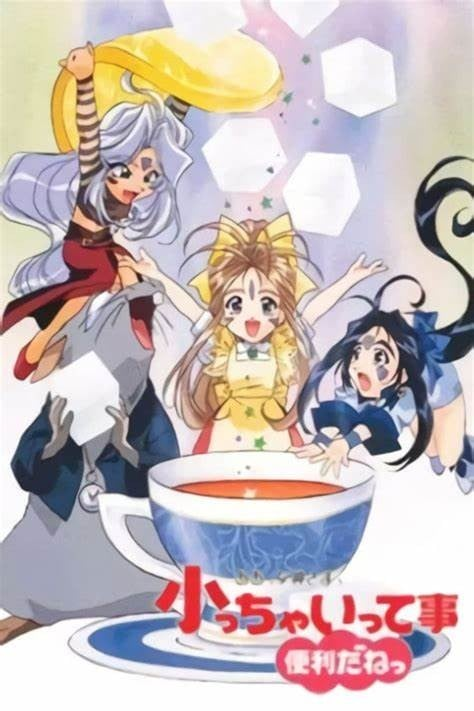

> [!bookinfo|noicon]+ **我的女神 小不隆咚便利多多**
> 
>
| 日文名 | ああっ女神さまっ 小っちゃいって事は便利だねっ |
|:------: |:------------------------------------------: |
| 类型 | 漫改 |
| 新番 | 1998 年 4 月 |
| 集数 | 共48话 |
| 官网 |  |
| 制作 | OLM |
| 导演 | 松村やすひろ |
| 脚本 | 北条千夏,米村正二,冨岡淳広,高橋英吉,横手美智子,藤田伸三,田中哲生 |
| 评分 | 6.9|
| 制片人 |  |

> [!abstract]+ **简介**
> 1998年4月6日 - 1999年3月29日に、WOWOWのアニメコンプレックス枠内で全48話が放送された。2007年12月7日からTOKYO MXにてセレクション放送（地上波初放送）。キッズステーションでも放送されている。

この作品はコミックに掲載されていた外伝的なもので、螢一やベルダンディーはあまり登場せず、ウルド、スクルド、岩ちゃんがメインであり、ナレーションは『奥さまは魔女』で有名な中村正である。

第1-13話ではベルダンディー役の井上喜久子が産休を取っており、岡村明美が代役を務めた。また、放送当時はまだセルアニメが多かった事に対し、本作では全編がデジタルアニメで制作されているのも特徴である。

> [!tip]+ **章节列表**
>- [ ] 第1话：占いしようよっ
>- [ ] 第2话：屋根裏の秘宝・前編
>- [ ] 第3话：屋根裏の秘宝・後編
>- [ ] 第4话：空を飛ぼうよっ
>- [ ] 第5话：宇宙を翔ぼうよっ
>- [ ] 第6话：スリムでGO!
>- [ ] 第7话：大怪獣ガビラ・誕生篇
>- [ ] 第8话：大怪獣ガビラ・決戦篇
>- [ ] 第9话：〜誰が為に鐘は鳴る〜 缶詰の謎…?
>- [ ] 第10话：〜誰が為に鐘は鳴る〜 ダイヤの秘密
>- [ ] 第11话：大怪獣ガビラ・逆襲篇
>- [ ] 第12话：野球やろうぜっ
>- [ ] 第13话：ウルドの子守日記
>- [ ] 第14话：プロポーズ大作戦ですだ
>- [ ] 第15话：新婚さんいらっしゃい!! ですだ
>- [ ] 第16话：デンワしてダーリンっ
>- [ ] 第17话：大雪原SOS・前編
>- [ ] 第18话：大雪原SOS・後編
>- [ ] 第19话：キッチンファイター
>- [ ] 第20话：岩ちゃんの華麗なる日々
>- [ ] 第21话：ああっ仏さまっ
>- [ ] 第22话：岩ちゃんの骨まで愛して
>- [ ] 第23话：バンドやろうぜ A面
>- [ ] 第24话：バンドやろうぜ B面
>- [ ] 第25话：チュウ・ハード岩ちゃん絶体絶命
>- [ ] 第26话：チュウ・ハード2 魔王降臨
>- [ ] 第27话：ウルドでPON!
>- [ ] 第28话：RainyDay
>- [ ] 第29话：夢で逢いましょう
>- [ ] 第30话：月曜ワイドサスペンス劇場 女名探偵スクルドの事件簿(1)
>- [ ] 第31话：盗まれた三つの秘宝の謎 湯煙に隠された危険な罠!
>- [ ] 第32话：女神 愛の劇場 女神の剣
>- [ ] 第33话：こちら他力本願寺内 すぐやる課
>- [ ] 第34话：釣りバス日誌
>- [ ] 第35话：我に僕を
>- [ ] 第36话：忍びのオキテ・上の巻
>- [ ] 第37话：忍びのオキテ・下の巻
>- [ ] 第38话：ウルドVSウルド
>- [ ] 第39话：岩ちゃん選挙に立つ・立志編
>- [ ] 第40话：岩ちゃん選挙に立つ・風雲編
>- [ ] 第41话：ウルド究極ダイエット
>- [ ] 第42话：ハッピーバースディ岩ちゃん
>- [ ] 第43话：ああっ平凡な大学生っ
>- [ ] 第44话：こんな事もあるんだねっ
>- [ ] 第45话：機関車岩ちゃん
>- [ ] 第46话：味噌の壺
>- [ ] 第47话：DX人生すごろく★衛星編
>- [ ] 第48话：きらめきメモリアル

> [!tip]+ **主要角色**
> 
| 角色 | CV | 简介| 角色图片 |
|:----:|:---:|:---:|:--------:|
| ベルダンディー | 井上喜久子 | 『お助け女神事務所』に所属する、『１級神２種非限定』の女神さま。 ユグドラシルに選ばれた人々の元に現れ『願いを叶える』という女神としての職務に従事していたが、ある日冴えない大学生である森里螢一から『君のような女神に、ずっと側にいて欲しい』と言われ、それが受理されてしまう。以来、地上界で螢一と共に生活をすることに。 女神としての能力はもちろん、洗濯料理裁縫といった家事全般もパーフェクト！　だが、性格的に人を疑うことをしない上、地上界の一般常識に疎いこともあって、時たま大胆な行動をとることもある。それをして沙夜子や恵に『天然』と突っ込まれることもしばしば。 ベルダンディーと共にいる人は、そのはほんわかとした性格に引っ張られ、気付いたときには、彼女のペースに巻き込まれていることが多い。 天上界でも高位の女神であるため、本来使える力は大きいのだが、地上ではあまりにも強力すぎるため、左耳の封環（ピアス）によって約千分の一程度に力を制限されている。 また、風の属性を持つ天使『ホーリーベル』を持っており、彼女と共に唱える法術は、通常時のベルダンディーが唱える物より強力である。 |  |
| ウルド | 冬馬由美 | ベルダンディーの姉で、『２級神管理限定』の女神さま。 普段は天上界のシステムである【ユグドラシル】の管理業務に従事しているが、あまりに進展しない螢一とベルダンディーの仲に業を煮やして、職務を放って地上界へとやってくる。以降、森里家に居着き、スキあらば怪しい薬を使って二人の仲を取り持とうと画策している。 性格は、ワガママで自分勝手。マイペースという部分では、ベルダンディーと一緒だが、ウルドの場合、楽しければ何でもアリという享楽的な部分が大きく、その点ではずいぶん違う。また『目的のためには手段を選ばない』のだが、『その目的を忘れて』行動しがち。その結果、螢一など周りの人々に迷惑を及ぼすことも多々ある。 しかし、三姉妹の長女だけあり、誰よりも深く二人の妹のことを大切に思っているのも事実。螢一に対しても、厳しいことを言っているようで、実はちゃんと的確なアドバイスを送っていることが多い。 女神としての格は、ベルダンディーの下ではあるが、内在する能力は遙かにベルダンディーを上回る。それは、彼女の生まれに起因しており、『半神半魔』のウルドは、神族の父親と魔族の母親（母親は大魔界長ヒルド）の間に生まれた、ベルダンディーとは異母姉妹であることが起因しているようだ。 |  |
| スクルド | 久川綾 | ベルダンディーの妹で、『２級神１種限定』の女神さま。 ベルダンディーのことが大好きで、ウルドの言いつけは聞かずとも、ベルダンディーの言うことだけは素直に聞く三姉妹の末っ子。 契約のため地上界に行ったままのベルダンディーの身を常日頃から案じ、窮地を察し、意を決して地上へ！　以後、ウルド同様、森里家に居着くことになる。 趣味は発明で、メカや機械いじりが大好き。少しでもベルダンディーの力になろうと、日々、様々な便利アイテムを作製するが、その成果はイマイチ現れていないよう・・・。 しかし、恵に負けまいという一身やベルダンディーをマーラーから護りたいという気持ちが加わると、時にはとんでもない発明をしたりもする。 ただ、物事が上手くいかなかったり怒られたりすると、すぐに懐から『スクルドボム』を取り出し、相手を亡き者にしようとする強引な一面も持っている。 好物はアイスクリームである。 |  |
| 岩 | 岩田光央 |  |  |
| マーラー |  | 『１級魔非限定』の悪魔。 以前、度を超えた悪さを働いた罰で神さまにより『神と悪魔のＣＤ』に封印されていたが、田宮と大滝がその封印を解いてしまったため、復活！ 以降、（魔属のシェア拡大の）邪魔者である女神たちを地上界から追い出そうと、ベルダンディーたちと敵対することに。 １級魔だけに、その能力はベルダンディーに匹敵するものを持っているが、どこか抜けているところがあり、なかなか成果が上がらない。 いつもいいところまで女神たちを追い込むのだが、、その度ごとに『縁起物アレルギー』や『ロックを聴くと踊り出してしまう』などの弱点をつかれ、失敗してしまう。 |  |