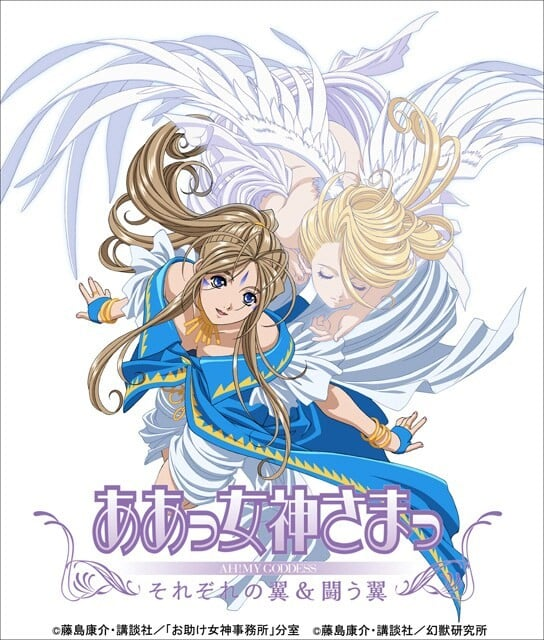

> [!bookinfo|noicon]+ **我的女神 战斗之翼**
> 
>
| 日文名 | ああっ女神さまっ 闘う翼 |
|:------: |:------------------------------------------: |
| 类型 | 漫改 |
| 新番 | 2007 年 12 月 |
| 集数 | 共2话 |
| 官网 |  |
| 制作 | AICデジタル |
| 导演 | 合田浩章 |
| 脚本 | 渡辺陽 |
| 评分 | 7.1|
| 制片人 | 福家日左夫 |

> [!abstract]+ **简介**
> 2007年12月8日に「20th Anniversary ああっ女神さまっ 闘う翼」がTBS及びBS-iで放送。当作品連載開始20周年記念企画と銘打っている。2006年4月から9月までに放送されたTVアニメ第2期「それぞれの翼」のその後の話となっており、今作では2話完結の前後編として綴られている。今回は戦闘部の女神・リンドを中心に物話を繰り広げる回で、天使を喰われたウルド、ペイオース、そしてベルダンディーを救うため、螢一、スクルド、リンドは、魔属のヒルド達と対立する。コミックス24巻から26巻のストーリーが描かれることになっている。今回は神属と魔属との戦いを中心としているため、螢一を除いた人間は登場しなかったが、EDの映像には主な人物達が登場する。

> [!tip]+ **章节列表**
>- [ ] 第1话：啊啊 单翼天使降临 (2007-12-08)
>- [ ] 第2话：啊啊 共享喜悦的两人 (2007-12-08)

> [!tip]+ **主要角色**
> 
| 角色 | CV | 简介| 角色图片 |
|:----:|:---:|:---:|:--------:|
| 森里螢一 | 菊池正美 | 猫実工業大学に通う大学２年生（９話から大学３年生に進級）。イマイチもてなかった高校生活に別れを告げ、北海道から単身、猫実工業大学に進学。彼女と一緒に憧れのキャンパスライフを送ることを夢見ていたが、入学早々『学園の女王さま』三嶋沙夜子をデートに誘い、見事撃沈！　先輩が皆一癖も二癖もある強烈キャラ揃いの自動車部に入ってしまい、さらに女性と縁遠い生活を送るハメに。 ２年の冬まで、格安という理由で入居した猫実工大学生寮で先輩たちにこき使われ暮らしていたが、ある日のこと、彼の不幸っぷりを見かねた天上界のシステム【ユグドラシル】に選ばれ、『天上界の恵を得る権利』を手にする。 その使者としてやって来た女神『ベルダンディー』に、『君のような女神に、ずっと側にいて欲しい』と言ってしまい、それからは女神さまと一緒の共同生活へ。 天性のお人好しと言われるだけあって、困っている人を見ると放っておけない性格。その結果、どんどん不幸に拍車がかかっていくのだが、それをマイナスと感じないポジティブな部分もある。 夢は『自分の好きなバイク』を作ること。もっとも当面の夢は、いかに『ベルダンディーとの仲を発展させるか』だが……。 |  |
| ベルダンディー | 井上喜久子 | 『お助け女神事務所』に所属する、『１級神２種非限定』の女神さま。 ユグドラシルに選ばれた人々の元に現れ『願いを叶える』という女神としての職務に従事していたが、ある日冴えない大学生である森里螢一から『君のような女神に、ずっと側にいて欲しい』と言われ、それが受理されてしまう。以来、地上界で螢一と共に生活をすることに。 女神としての能力はもちろん、洗濯料理裁縫といった家事全般もパーフェクト！　だが、性格的に人を疑うことをしない上、地上界の一般常識に疎いこともあって、時たま大胆な行動をとることもある。それをして沙夜子や恵に『天然』と突っ込まれることもしばしば。 ベルダンディーと共にいる人は、そのはほんわかとした性格に引っ張られ、気付いたときには、彼女のペースに巻き込まれていることが多い。 天上界でも高位の女神であるため、本来使える力は大きいのだが、地上ではあまりにも強力すぎるため、左耳の封環（ピアス）によって約千分の一程度に力を制限されている。 また、風の属性を持つ天使『ホーリーベル』を持っており、彼女と共に唱える法術は、通常時のベルダンディーが唱える物より強力である。 |  |
| ウルド | 冬馬由美 | ベルダンディーの姉で、『２級神管理限定』の女神さま。 普段は天上界のシステムである【ユグドラシル】の管理業務に従事しているが、あまりに進展しない螢一とベルダンディーの仲に業を煮やして、職務を放って地上界へとやってくる。以降、森里家に居着き、スキあらば怪しい薬を使って二人の仲を取り持とうと画策している。 性格は、ワガママで自分勝手。マイペースという部分では、ベルダンディーと一緒だが、ウルドの場合、楽しければ何でもアリという享楽的な部分が大きく、その点ではずいぶん違う。また『目的のためには手段を選ばない』のだが、『その目的を忘れて』行動しがち。その結果、螢一など周りの人々に迷惑を及ぼすことも多々ある。 しかし、三姉妹の長女だけあり、誰よりも深く二人の妹のことを大切に思っているのも事実。螢一に対しても、厳しいことを言っているようで、実はちゃんと的確なアドバイスを送っていることが多い。 女神としての格は、ベルダンディーの下ではあるが、内在する能力は遙かにベルダンディーを上回る。それは、彼女の生まれに起因しており、『半神半魔』のウルドは、神族の父親と魔族の母親（母親は大魔界長ヒルド）の間に生まれた、ベルダンディーとは異母姉妹であることが起因しているようだ。 |  |
| スクルド | 久川綾 | ベルダンディーの妹で、『２級神１種限定』の女神さま。 ベルダンディーのことが大好きで、ウルドの言いつけは聞かずとも、ベルダンディーの言うことだけは素直に聞く三姉妹の末っ子。 契約のため地上界に行ったままのベルダンディーの身を常日頃から案じ、窮地を察し、意を決して地上へ！　以後、ウルド同様、森里家に居着くことになる。 趣味は発明で、メカや機械いじりが大好き。少しでもベルダンディーの力になろうと、日々、様々な便利アイテムを作製するが、その成果はイマイチ現れていないよう・・・。 しかし、恵に負けまいという一身やベルダンディーをマーラーから護りたいという気持ちが加わると、時にはとんでもない発明をしたりもする。 ただ、物事が上手くいかなかったり怒られたりすると、すぐに懐から『スクルドボム』を取り出し、相手を亡き者にしようとする強引な一面も持っている。 好物はアイスクリームである。 |  |
| ペイオース | 佐久間レイ | 1級神2種非限定。ベルダンディーたちが所属する「お助け女神事務所」のライバル事務所、「アースお助けセンター」に所属する女神。 薔薇を使った法術を多用するところから察せられるように、プライドが高くナルシスト。 天使の名前は「ゴージャスローズ」。 |  |