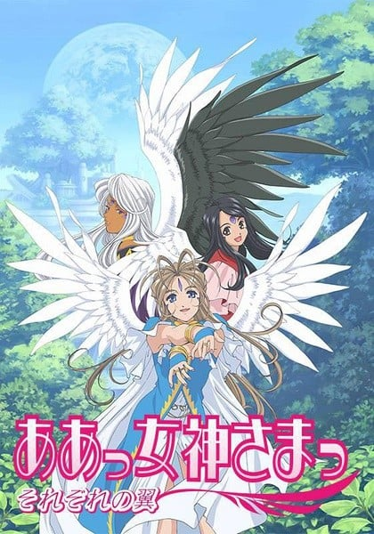
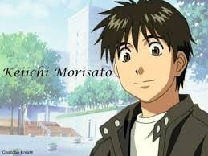
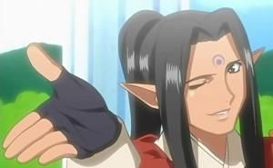
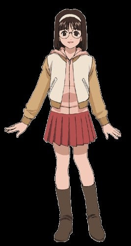
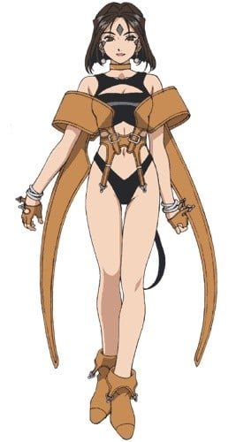
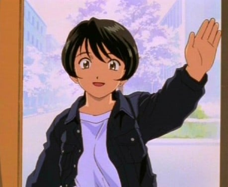
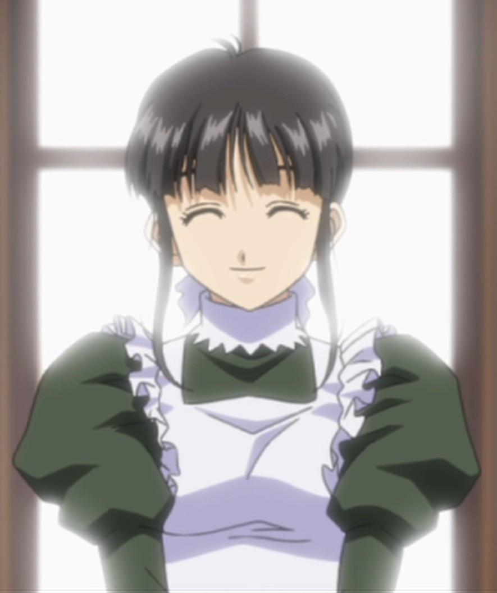

> [!bookinfo|noicon]+ **我的女神 缤纷之翼**
> 
>
| 日文名 | ああっ女神さまっ それぞれの翼 |
|:------: |:------------------------------------------: |
| 类型 | 漫改 |
| 新番 | 2006 年 4 月 |
| 集数 | 共24话 |
| 官网 | [https://www.tbs.co.jp/megamisama/megami2/index-j.html](https://https://www.tbs.co.jp/megamisama/megami2/index-j.html) |
| 制作 | AICデジタル |
| 导演 | 合田浩章 |
| 脚本 | 上江洲誠,合田浩章,渡辺陽,日暮茶坊,あおしまたかし,花田十輝 |
| 评分 | 7.3|
| 制片人 |  |

> [!abstract]+ **简介**
> 　　恐怖大王的威胁消除了，本院寺有恢复了平凡的日常生活。
　　在这座寺庙，住着一位大学生森里萤一，与三位女神。一年前，萤一打电话错打到女神事务所，并与女神贝璐丹蒂开始了同居生活，之后贝璐丹蒂的两位妹妹也住进了寺庙。
　　这一天，救助女神事务所的数据出现了问题，萤一的契约可能会被取消！而唯一恢复契约的方式就是萤一再次说出一年前的愿望，可是萤一却忘了当时所说的话。
　　到底当时萤一许下了什么愿望，他与贝璐丹蒂的幸福生活还能否继续？为了明天的幸福，今天一定要想起当时许下的心愿。
　　根据藤岛康介同名漫画改编的TV版动画第2季。

> [!tip]+ **章节列表**
>- [ ] 第1话：啊！许愿吧 再一次 (2006-04-06)
>- [ ] 第2话：啊！让人烦恼的复仇女王殿下 (2006-04-13)
>- [ ] 第3话：啊！在圣诞夜献上这份思念！ (2006-04-20)
>- [ ] 第4话：啊！想要让世界充满幸福！ (2006-04-27)
>- [ ] 第5话：啊！互相吸引的恋爱波长 (2006-05-04)
>- [ ] 第6话：啊！那就是嫉妒！？ (2006-05-11)
>- [ ] 第7话：啊！将你的愿望实现 (2006-05-18)
>- [ ] 第8话：啊！想帮上你的忙 (2006-05-25)
>- [ ] 第9话：啊！女神的话就用约会来决胜负 (2006-06-01)
>- [ ] 第10话：啊！没能说出的那一句话 (2006-06-08)
>- [ ] 第11话：啊！用那双手抓住梦想 (2006-06-15)
>- [ ] 第12话：啊！女神的眼泪和他的梦想 (2006-06-22)
>- [ ] 第13话：啊！觉醒吧！那份感情 (2006-06-29)
>- [ ] 第14话：啊！我亲爱的丘比特 (2006-07-06)
>- [ ] 第15话：啊！半神半魔的我？ (2006-07-13)
>- [ ] 第16话：啊！不畏黑暗 闪耀光芒 (2006-07-20)
>- [ ] 第17话：啊！大魔界长降临 (2006-07-27)
>- [ ] 第18话：啊！魔族的威信何在？ (2006-08-03)
>- [ ] 第19话：啊！女神的爱拯救忍者 (2006-08-10)
>- [ ] 第20话：啊！不管在哪里 只要有你在 (2006-08-31)
>- [ ] 第21话：啊！我成为魔族也可以吗？ (2006-09-07)
>- [ ] 第22话：啊！女神的告白 (2006-09-14)
>- [ ] 第23话：啊！缤纷的命运 (2006-12-29)
>- [ ] 第24话：啊！喜欢是震摇心灵之歌 (2006-12-29)

> [!tip]+ **主要角色**
> 
| 角色 | CV | 简介| 角色图片 |
|:----:|:---:|:---:|:--------:|
| 森里螢一 | 菊池正美 | 猫実工業大学に通う大学２年生（９話から大学３年生に進級）。イマイチもてなかった高校生活に別れを告げ、北海道から単身、猫実工業大学に進学。彼女と一緒に憧れのキャンパスライフを送ることを夢見ていたが、入学早々『学園の女王さま』三嶋沙夜子をデートに誘い、見事撃沈！　先輩が皆一癖も二癖もある強烈キャラ揃いの自動車部に入ってしまい、さらに女性と縁遠い生活を送るハメに。 ２年の冬まで、格安という理由で入居した猫実工大学生寮で先輩たちにこき使われ暮らしていたが、ある日のこと、彼の不幸っぷりを見かねた天上界のシステム【ユグドラシル】に選ばれ、『天上界の恵を得る権利』を手にする。 その使者としてやって来た女神『ベルダンディー』に、『君のような女神に、ずっと側にいて欲しい』と言ってしまい、それからは女神さまと一緒の共同生活へ。 天性のお人好しと言われるだけあって、困っている人を見ると放っておけない性格。その結果、どんどん不幸に拍車がかかっていくのだが、それをマイナスと感じないポジティブな部分もある。 夢は『自分の好きなバイク』を作ること。もっとも当面の夢は、いかに『ベルダンディーとの仲を発展させるか』だが……。 |  |
| ベルダンディー | 井上喜久子 | 『お助け女神事務所』に所属する、『１級神２種非限定』の女神さま。 ユグドラシルに選ばれた人々の元に現れ『願いを叶える』という女神としての職務に従事していたが、ある日冴えない大学生である森里螢一から『君のような女神に、ずっと側にいて欲しい』と言われ、それが受理されてしまう。以来、地上界で螢一と共に生活をすることに。 女神としての能力はもちろん、洗濯料理裁縫といった家事全般もパーフェクト！　だが、性格的に人を疑うことをしない上、地上界の一般常識に疎いこともあって、時たま大胆な行動をとることもある。それをして沙夜子や恵に『天然』と突っ込まれることもしばしば。 ベルダンディーと共にいる人は、そのはほんわかとした性格に引っ張られ、気付いたときには、彼女のペースに巻き込まれていることが多い。 天上界でも高位の女神であるため、本来使える力は大きいのだが、地上ではあまりにも強力すぎるため、左耳の封環（ピアス）によって約千分の一程度に力を制限されている。 また、風の属性を持つ天使『ホーリーベル』を持っており、彼女と共に唱える法術は、通常時のベルダンディーが唱える物より強力である。 |  |
| ウルド | 冬馬由美 | ベルダンディーの姉で、『２級神管理限定』の女神さま。 普段は天上界のシステムである【ユグドラシル】の管理業務に従事しているが、あまりに進展しない螢一とベルダンディーの仲に業を煮やして、職務を放って地上界へとやってくる。以降、森里家に居着き、スキあらば怪しい薬を使って二人の仲を取り持とうと画策している。 性格は、ワガママで自分勝手。マイペースという部分では、ベルダンディーと一緒だが、ウルドの場合、楽しければ何でもアリという享楽的な部分が大きく、その点ではずいぶん違う。また『目的のためには手段を選ばない』のだが、『その目的を忘れて』行動しがち。その結果、螢一など周りの人々に迷惑を及ぼすことも多々ある。 しかし、三姉妹の長女だけあり、誰よりも深く二人の妹のことを大切に思っているのも事実。螢一に対しても、厳しいことを言っているようで、実はちゃんと的確なアドバイスを送っていることが多い。 女神としての格は、ベルダンディーの下ではあるが、内在する能力は遙かにベルダンディーを上回る。それは、彼女の生まれに起因しており、『半神半魔』のウルドは、神族の父親と魔族の母親（母親は大魔界長ヒルド）の間に生まれた、ベルダンディーとは異母姉妹であることが起因しているようだ。 |  |
| スクルド | 久川綾 | ベルダンディーの妹で、『２級神１種限定』の女神さま。 ベルダンディーのことが大好きで、ウルドの言いつけは聞かずとも、ベルダンディーの言うことだけは素直に聞く三姉妹の末っ子。 契約のため地上界に行ったままのベルダンディーの身を常日頃から案じ、窮地を察し、意を決して地上へ！　以後、ウルド同様、森里家に居着くことになる。 趣味は発明で、メカや機械いじりが大好き。少しでもベルダンディーの力になろうと、日々、様々な便利アイテムを作製するが、その成果はイマイチ現れていないよう・・・。 しかし、恵に負けまいという一身やベルダンディーをマーラーから護りたいという気持ちが加わると、時にはとんでもない発明をしたりもする。 ただ、物事が上手くいかなかったり怒られたりすると、すぐに懐から『スクルドボム』を取り出し、相手を亡き者にしようとする強引な一面も持っている。 好物はアイスクリームである。 |  |
| ヒルド | 高島雅羅 |  |  |
| トルバドール | 山寺宏一 |  |  |
| 三嶋沙夜子 | 能登麻美子 | 猫実工業大学の２年生（９話から大学３年生に進級）で、美術部に所属。 その類いまれなる美貌と、三嶋財閥のお嬢様という血筋から、言い寄る男は数知れず。それをして、自らを『学園の女王さま』と呼んではばからない。実際に、大学入学時から『ミス猫実工大コンテスト』で堂々の２連覇をしており、自他共に認める女王さまである。 しかし、ベルダンディーが大学に現れてからは、彼女の周囲は激変！　今まで男性に囲まれていた生活だったのが、気付いたときには、『いかにしてベルダンディーを大学から追い出すか』ばかり考えているよう。 そんな中、ベルダンディーを追い出すために近づいた『森里螢一』の男らしい部分に触れ、だんだんと螢一に惹かれ始めていく。 ただそれも彼女にしてみれば『あくまでベルダンディーを追い出すための手段』だと、言い張ってはいるが……。 |  |
| 長谷川空 | こおろぎさとみ | 猫実工業大学の１年生（９話から大学２年生に進級）で、自動車部唯一の女性部員。 消極的で、あまり前に出ようとしない性格ではあるが、それでも自動車部でやっていけるだけの個性の持ち主。特に時折漏らす強烈なつっこみは、田宮や大滝ですら黙らせるほどだ。 |  |
| ペイオース | 佐久間レイ | 1級神2種非限定。ベルダンディーたちが所属する「お助け女神事務所」のライバル事務所、「アースお助けセンター」に所属する女神。 薔薇を使った法術を多用するところから察せられるように、プライドが高くナルシスト。 天使の名前は「ゴージャスローズ」。 |  |
| マーラー | 高乃麗 | 『１級魔非限定』の悪魔。 以前、度を超えた悪さを働いた罰で神さまにより『神と悪魔のＣＤ』に封印されていたが、田宮と大滝がその封印を解いてしまったため、復活！ 以降、（魔属のシェア拡大の）邪魔者である女神たちを地上界から追い出そうと、ベルダンディーたちと敵対することに。 １級魔だけに、その能力はベルダンディーに匹敵するものを持っているが、どこか抜けているところがあり、なかなか成果が上がらない。 いつもいいところまで女神たちを追い込むのだが、、その度ごとに『縁起物アレルギー』や『ロックを聴くと踊り出してしまう』などの弱点をつかれ、失敗してしまう。 |  |
| 藤見千尋 | 今井由香 | 自動車部のOGで初代部長。現在はモーターサイクルショップ「WHIRL WIND」経営者。ショートカットで凛とした顔立ちをしている。 かなりのメカフェチ。また猫好き、子供好きでもある。クラウザー ドマーニSSiというバイクに乗っている。ほかのバイクショップに顔が広いようで、一般市場に出回らないような物でも自分の趣味で仕入れてくることもしばしば。また時折「間違っても売れない」ような珍品まで仕入れている。 かつて大手のワークスショップに在籍していたが、自分の望んだ方向と食い違っているところに悩んでいた際、当時自動車部部長であった螢一の何気ない一言をきっかけに独立を決意。開店に際しては、単位が足りずに卒業し損なった螢一を救う（拾う）形で採用している。ただし主な理由は「その腕が必要だったから」であり、その辺りは公私をしっかり切り分ける性格である。またお金に関してはシビアで、ベルダンディーを時給500円で働かせ、倒れたベルダンディーとヴェルスパー（少年体）を休ませるために螢一の早退を認めながら、その分の時給はカットするほど。 さっぱりした姐さん風の美女だがかなりいい加減、かつ強引で豪放、極めて自己中心的な性格で、田宮・大滝の両後輩は彼女をひどく恐れているが、これは両者が過去に彼女に告白し、ふられた（千尋がどちらかを選ぶことによって部内の雰囲気を壊すことを恐れたため）ことに起因している。また自称「これでもエンジニアの端くれ」として職人気質に憧れを抱いており、職人肌の螢一の父親を尊敬している。 何だかんだで面倒見がよく、特に自分の過去の面影が見いだせる螢一に対しては、かつての自分を重ね合わせるように温かく見守っている。というより半ば私物化しつつある（かつて「あげないわよ、私が見つけたんだから」と公言したこともある）。 |  |
| 本田智恵子 | 本多知恵子 | 螢一の祖父・螢ノ助の知り合いが営んでいた古い高原ホテルに居ついていた思念体。螢ノ助と交わした約束が叶わぬままこの世を去ったが、想いが残り思念体となった。またその約束に関係する想い出のバイクとして、螢ノ助の愛車であった二輪のロールスロイスとも呼ばれる「ブラフ・シューペリア」が登場している。 キャラクター名は、原作者が声優の本多知恵子のファンだったためその名前を引用したもので、後にアニメ化された際、本多が声を担当している。 |  |