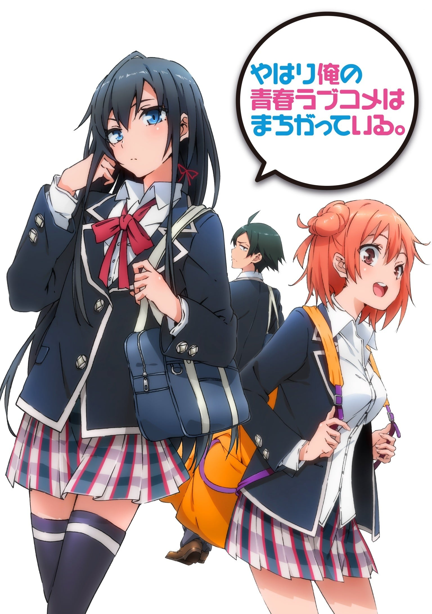
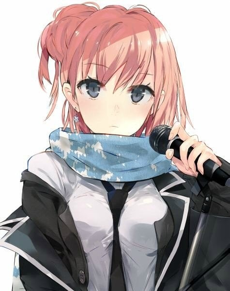
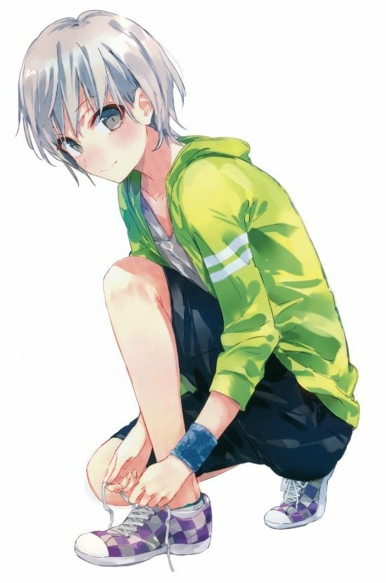
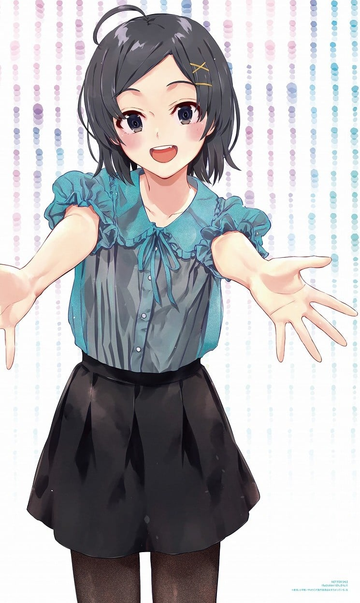
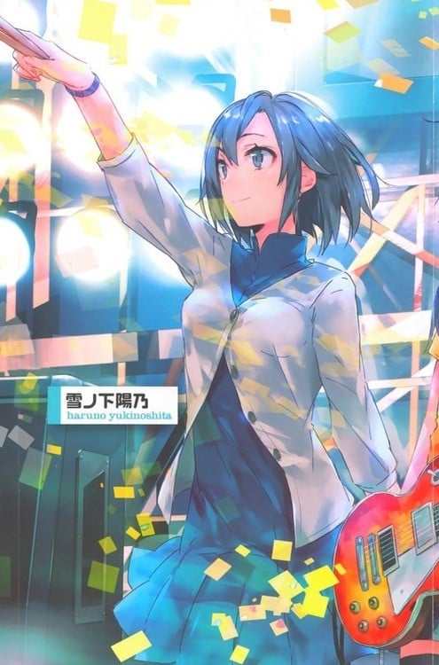
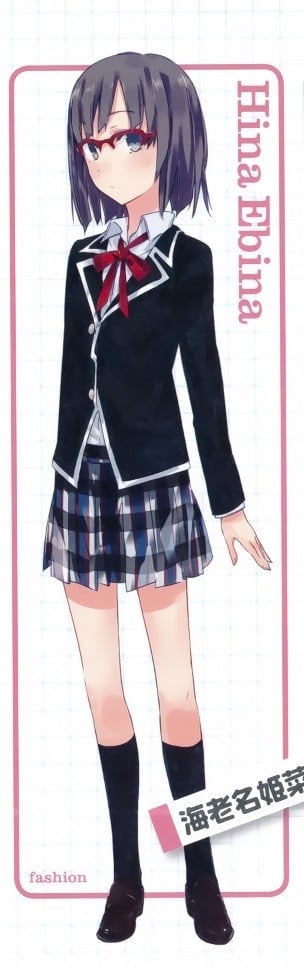
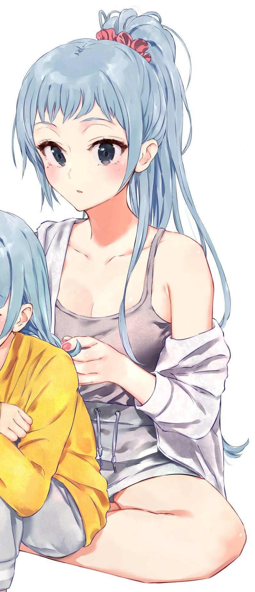
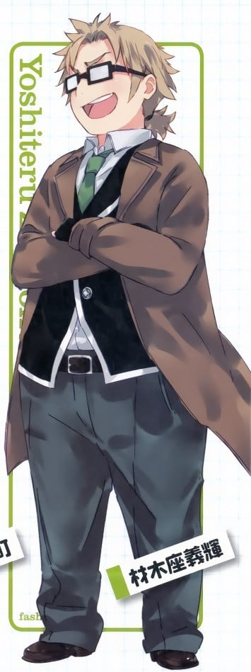

> [!bookinfo|noicon]+ **我的青春恋爱物语果然有问题**
> 
>
| 日文名 | やはり俺の青春ラブコメはまちがっている。 |
|:------: |:------------------------------------------: |
| 类型 | 小说改 |
| 新番 | 2013 年 4 月 |
| 集数 | 共13话 |
| 官网 | [http://www.tbs.co.jp/anime/oregairu/1st](https://http://www.tbs.co.jp/anime/oregairu/1st) |
| 制作 | Brain's Base |
| 导演 | 吉村愛 |
| 脚本 | 渡航,高山カツヒコ,待田堂子,菅正太郎 |
| 评分 | 7.5|
| 制片人 | 平野強 |

> [!abstract]+ **简介**
> 　　别扭的，没有朋友，没有女朋友，对着那些讴歌青春的同学吐槽着“他们都是骗子，都在说谎，快点爆发把我”的男主角的爱情物语，将来的梦想是“不工作”——
　　这样的高中生八幡被生活指导老师的带到了学校第一美少女雪乃所属的“侍奉部”，与美少女意想不到的相遇……怎么想都是恋爱故事的展开吧！？
　　但是雪乃却无论如何都原谅不了八幡那令人残念的糟糕性格！
　　不断轮回着的充满问题的青春——我的青春，到底怎么了！？

> [!tip]+ **章节列表**
>- [ ] 第1话：于是他错误的青春开始了。 (2013-04-04)
>- [ ] 第2话：无论谁肯定都会和大家一样有烦恼。 (2013-04-11)
>- [ ] 第3话：恋爱喜剧之神偶尔会做好事。 (2013-04-18)
>- [ ] 第4话：也就是说，他朋友很少。 (2013-04-25)
>- [ ] 第5话：再一次，他走上了回头路。 (2013-05-02)
>- [ ] 第6话：他和她的开始终于要结束了。 (2013-05-09)
>- [ ] 第7话：不管怎样，暑假不能好好休息这可不行啊。 (2013-05-16)
>- [ ] 第8话：总有一天他们会知道真相。 (2013-05-23)
>- [ ] 第9话：第三次，他的生活回归原轨。 (2013-05-30)
>- [ ] 第10话：他们之间的距离依然不变，节日即将狂欢。 (2013-06-06)
>- [ ] 第11话：于是，各自的舞台拉开帷幕，学园祭正值精彩时刻。 (2013-06-13)
>- [ ] 第12话：就这样他和她和她的青春一直搞错下去。 (2013-06-20)
>- [ ] 第13话：番外篇 所以，他们的祭典不会结束。 (2013-06-27)

> [!tip]+ **主要角色**
> 
| 角色 | CV | 简介| 角色图片 |
|:----:|:---:|:---:|:--------:|
| 比企谷八幡 | 江口拓也 | 本作的主人公。总武高校2年F组所属。从小就是孤独一人，至今留下无数心灵创伤，也因此常玩自问自答的猜谜或脑筋急转弯，偶尔会自言自语。根据雪乃及结衣的说法，常一边看书一边傻笑。 思想非常成熟，非常了解人际关系的复杂和险恶。干脆地把自己孤立起来并非出于什么伤痕，而是其性格本身的抉择，即使现在已和一众其它角色较为友好，但其实还是暗地里保持着一定的距离。 由于总是单独一人，在班上反而有种特殊的存在感，在因完全不跟人说话而非常显眼的同时，又很容易被人忽略，在团体活动中也由于沉默而让人较难察觉，常自嘲可以做忍者。 |  |
| 雪ノ下雪乃 | 早見沙織 | 本作的女主角之一。总武高校2年J组（国際教養科）所属。侍奉部部长，十全十美的美少女，但个性教人不敢恭维，非常毒舌。 包括运动在内各方面都拥有极出色的天赋，但这反使她不惯于努力，在基础体力上有缺陷。  各方面都和比企谷很相似，但两人被孤立的原因并不一样，家中情况也不同，因此其性格和比企谷在很多细节上都有差异，自我隔离的情况貌似也没有比企谷彻底（从成绩得以流传开推断）。  和同学表面上相处的不错，但常常遭人嫉妒。小学时室内鞋被人藏了快六十次，其中有五十次是班上女生做的。 虽然嘴上说难以相处，但真心把由比滨视为朋友。 在过去非常了解雪之下的叶山看来，很在意比企谷。  家中很有钱，父亲是地方议员。 但与母亲和姐姐阳乃关系不好，故搬出本家，另在父亲名下的某高级公寓独自居住。  童年时代与叶山，姐姐阳乃一同度过。  喜欢猫但害怕狗。另外还特别喜欢名为“熊猫潘先生”的迪士特尼卡通人物。 方向感很差。 审美观不同于现世的高中女生，购买衣服时注重做工和材质的强度和耐久度（被比企谷吐槽为“注重防御力”）。 |  |
| 由比ヶ浜結衣 | 東山奈央 | 本作的女主角之一。总武高校2年F组所属。发言欠气质（会在不注意的情况下掀开别人的心里创伤），料理很差。     虽然各方面有点天然呆，但其实非常善于看人脸色，也常常看人脸色做事。同样非常了解人际关系的复杂和险恶，但即便在此之上也是个非常温柔的人。     在开学当天不小心把牵着的狗放跑，狗在撞过马路时险些被一辆豪华轿车撞到，被踩自行车上学的比企谷路过救起，事后向比企谷送了饼干以表心意，但被小町一个人吃光了并且到了事后很久才向比企谷提起。本人则一直记着这件事，这也解释了为何她在第一次和比企谷说话时就会用较亲近的称呼（ヒッキ）。     对比企谷抱有相当的好感，被比企谷察觉。但比企谷则指出她“十分温柔”，而他“最讨厌温柔的女生了”，虽然没有告白但变相被甩掉。和比企谷的相处因此一度变得尴尬，后来在雪之下的话语说服下关系才回到正常。 |  |
| 戸塚彩加 | 小松未可子 | 总武高校2年F组所属。网球社社员。长相可爱，言行举止都很接近女生，但却是个男生，本人亦不希望被弄错性别。由于非常可爱，在班中被女生称为“王子”。 |  |
| 比企谷小町 | 悠木碧 | 八幡的妹妹，初中3年级。 |  |
| 平塚静 | 柚木涼香 | 国文老师，喜欢少年漫画。擅长格斗技。非常关心比企谷，是标准的奔三。很在意自己年龄和未婚的现状，虽然极力隐瞒但总是会不经意的说出来。 动画中，爱车是一辆左驾红色 ASTON MARTIN V8 Vantage |  |
| 雪ノ下陽乃 | 中原麻衣 | 雪乃的姊姊。19岁。总武高中毕业生，平冢老师的学生。昵称平冢为“小静”。在本地的国立大学的理工系学部就读。姿容端丽的完美超人。待人接物的态度非常好。但由于常参与社交场合，要负责家中的一部分对外场合，学会长期带着伪装。 |  |
| 海老名姫菜 | ささきのぞみ | 八幡のクラスメイト。7月14日生まれ。AB型。他の葉山グループ同様、八幡を「ヒキタニくん」と呼ぶ。座右の銘「ホモが嫌いな女子なんていません！」。 葉山グループに所属している。肩まである黒髪に赤いフレームの眼鏡をした図書室が似合いそうな清楚可憐な美少女だが、いわゆる腐女子であり、妄想が極まって興奮すると鼻血を噴出する。三浦曰く「（結衣とは逆で）空気を読まないで合わせる」。 戸部らの男性グループおよび八幡を隼人狙いのBLな関係と妄想しており、一度妄想が始まると優美子ですら止めに入るほど暴走する。戸部の想いに気付いてはいるが、自分の置かれている環境に満足しており、八幡（奉仕部）および葉山にそれを壊さないで欲しいという願いを暗に相談していた。現在のような心地よい環境は久しぶりだとも発言している。 腐女子の顔の裏にほの暗い部分を隠し持っており、八幡の抱えているものを理解し、共感している節がある。また自らも八幡に対してかなり素の部分を見せている。 |  |
| 葉山隼人 | 近藤隆 | 比企谷八幡的同班同学。 在班上甚至全校都有很高人气，班内现充圈的核心人物。足球部的王牌。成绩优秀，文科仅次于雪之下。人长得又帅，又是现充，可谓是与八幡完全相反的存在。  其家族与雪之下家族关系密切，在孩提时代就与雪之下姐妹相互认识和一起玩耍。其父在雪之下父亲的企业中担任法律顾问，母亲则是医生。 |  |
| 川崎沙希 | 小清水亜美 | 八幡的同班同学。 在班上释放出不让人靠近的气场，乍看好似不良少女。 禅师级裁缝，自己改造了校服，文化祭和体育祭中分别负责为班上和活动项目制作服装。 家中弟弟妹妹众多。  对猫过敏。 |  |
| 材木座義輝 | 檜山修之 | 総武高校二年C組。 中二病，因与幕府将军足利义辉同名，自我设定为“剑豪将军”。 因为没有朋友，在体育课上两两组队时与八幡相识。 写过轻小说；有段时间想要做游戏，认识游戏部的两人，了解了做游戏的辛苦之后又放弃了。 |  |
| 三浦優美子 | 井上麻里奈 | 比企谷八幡的同班同学，班内现充组的核心。 说话语气凌厉高傲，但意外的有“大妈”的一面，对海老名和由比滨多有照料。  与雪之下存在对抗心理，但只在胸部大小的比较中获得了唯一的一次完胜。 |  |