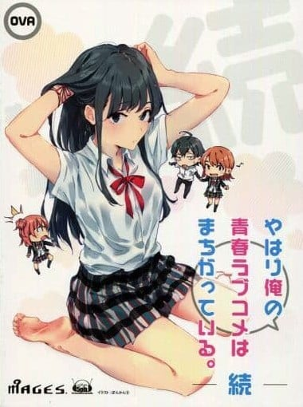
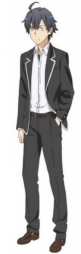
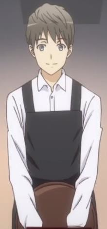
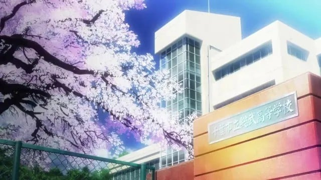

> [!bookinfo|noicon]+ **我的青春恋爱物语果然有问题 续 OVA**
> 
>
| 日文名 | やはり俺の青春ラブコメはまちがっている。続 OVA |
|:------: |:------------------------------------------: |
| 类型 | 小说改 |
| 新番 | 2016 年 10 月 |
| 集数 | 共1话 |
| 官网 | [www.tbs.co.jp/anime/oregairu/2nd](https://www.tbs.co.jp/anime/oregairu/2nd) |
| 制作 | feel. |
| 导演 | 及川啓 |
| 脚本 | 大知慶一郎 |
| 评分 | 7.3|
| 制片人 |  |

> [!abstract]+ **简介**
> PSV游戏「果然在游戏里我的青春恋爱物语也有问题。续」2016年10月27日发售，限定版将同捆新作OVA，讲述原作10.5卷中以一色彩羽为中心的故事。

> [!tip]+ **章节列表**
>- [ ] 第1话：想必，女孩子是由砂糖、辛香料和某些美好的东西组成的吧。 (2016-10-27)

> [!tip]+ **主要角色**
> 
| 角色 | CV | 简介| 角色图片 |
|:----:|:---:|:---:|:--------:|
| 比企谷八幡 | 江口拓也 | 本作的主人公。总武高校2年F组所属。从小就是孤独一人，至今留下无数心灵创伤，也因此常玩自问自答的猜谜或脑筋急转弯，偶尔会自言自语。根据雪乃及结衣的说法，常一边看书一边傻笑。 思想非常成熟，非常了解人际关系的复杂和险恶。干脆地把自己孤立起来并非出于什么伤痕，而是其性格本身的抉择，即使现在已和一众其它角色较为友好，但其实还是暗地里保持着一定的距离。 由于总是单独一人，在班上反而有种特殊的存在感，在因完全不跟人说话而非常显眼的同时，又很容易被人忽略，在团体活动中也由于沉默而让人较难察觉，常自嘲可以做忍者。 |  |
| 雪ノ下雪乃 | 早見沙織 | 本作的女主角之一。总武高校2年J组（国際教養科）所属。侍奉部部长，十全十美的美少女，但个性教人不敢恭维，非常毒舌。 包括运动在内各方面都拥有极出色的天赋，但这反使她不惯于努力，在基础体力上有缺陷。  各方面都和比企谷很相似，但两人被孤立的原因并不一样，家中情况也不同，因此其性格和比企谷在很多细节上都有差异，自我隔离的情况貌似也没有比企谷彻底（从成绩得以流传开推断）。  和同学表面上相处的不错，但常常遭人嫉妒。小学时室内鞋被人藏了快六十次，其中有五十次是班上女生做的。 虽然嘴上说难以相处，但真心把由比滨视为朋友。 在过去非常了解雪之下的叶山看来，很在意比企谷。  家中很有钱，父亲是地方议员。 但与母亲和姐姐阳乃关系不好，故搬出本家，另在父亲名下的某高级公寓独自居住。  童年时代与叶山，姐姐阳乃一同度过。  喜欢猫但害怕狗。另外还特别喜欢名为“熊猫潘先生”的迪士特尼卡通人物。 方向感很差。 审美观不同于现世的高中女生，购买衣服时注重做工和材质的强度和耐久度（被比企谷吐槽为“注重防御力”）。 |  |
| 由比ヶ浜結衣 | 東山奈央 | 本作的女主角之一。总武高校2年F组所属。发言欠气质（会在不注意的情况下掀开别人的心里创伤），料理很差。     虽然各方面有点天然呆，但其实非常善于看人脸色，也常常看人脸色做事。同样非常了解人际关系的复杂和险恶，但即便在此之上也是个非常温柔的人。     在开学当天不小心把牵着的狗放跑，狗在撞过马路时险些被一辆豪华轿车撞到，被踩自行车上学的比企谷路过救起，事后向比企谷送了饼干以表心意，但被小町一个人吃光了并且到了事后很久才向比企谷提起。本人则一直记着这件事，这也解释了为何她在第一次和比企谷说话时就会用较亲近的称呼（ヒッキ）。     对比企谷抱有相当的好感，被比企谷察觉。但比企谷则指出她“十分温柔”，而他“最讨厌温柔的女生了”，虽然没有告白但变相被甩掉。和比企谷的相处因此一度变得尴尬，后来在雪之下的话语说服下关系才回到正常。 |  |
| 一色いろは | 佐倉綾音 | 初登场于7.5卷，总武高一年级生，足球部经理，似乎对叶山隼人有好感。 本篇中因被同学捉弄，未经本人确认就成为了学生会会长的唯一候选人，因此经平冢老师建议，前往侍奉部寻求对策。  7.5巻から登場。サッカー部のマネージャーをする傍ら、本人曰く「友達の悪ノリ」と静曰く「人の話を聞かない担任」のせいで1年生ながらにして生徒会長候補に立候補してしまったために、静、めぐりと共に自身を生徒会長候補から脱落させるよう依頼する。その過程で修学旅行の1件以来、八幡のやり方に納得が出来ていない雪乃、結衣が生徒会長に立候補しかける事態に発展してしまう。 八幡曰く「可愛くない小町且つ劣化版陽乃さん且つニセめぐり且つ超強化相模且つタイプ別折本」というキャラクター性で、依頼についても惰性で生徒会長になるのが嫌なだけであったため、それを見越した八幡の建策により能動的に生徒会長になることを決意、めぐりの後任として生徒会長に就任。この出来事は同時に修学旅行以降、瓦解しかけていた奉仕部の亀裂こそ一旦は埋めた。 八幡（後に奉仕部）に海浜総合高校との合同クリスマスパーティーへの準備を依頼するも、中々進まない現状に悩んでいたが、本音を曝け出した八幡たち3人に触発され、パーティーの成功に向けて邁進するようになる。同時に前後して八幡たちと行った東京ディスティニーワールドにて隼人に告白するも振られてしまうが、その後は自分を変えたきっかけとなった八幡への感情をも匂わせている。 |  |
| 店員 | 工藤雅久 |  |  |
| 千葉市立総武高等学校 |  | 是渡航创作的轻小说《我的青春恋爱物语果然有问题》及其衍生作品中的一所虚构的学校。其蓝本为千叶市立稻毛高等学校。   总武高等学校是位于千叶市的市立高中，是千叶市偏差值最高的重点学校。三次元原型为千叶市立稻毛高等学校。最初大老师发奋考取此学校，便是为了重置继承自初中的残念人生。 |  |