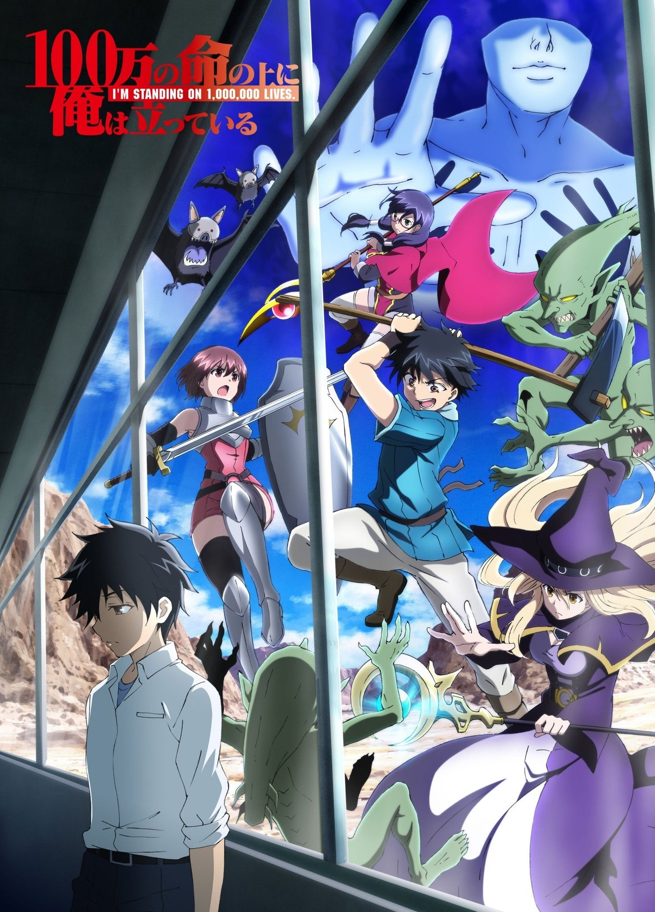
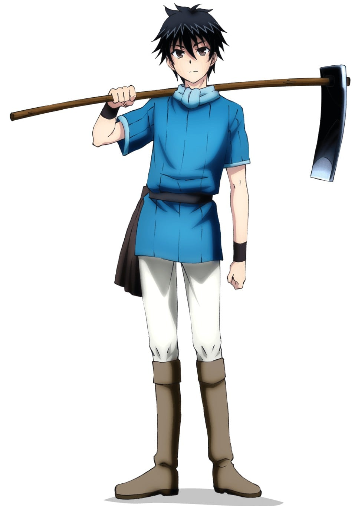
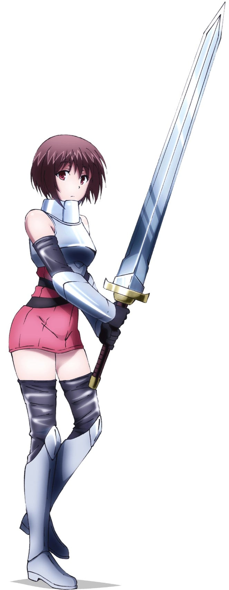
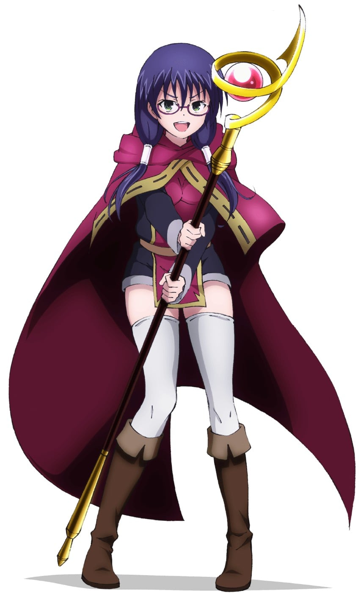
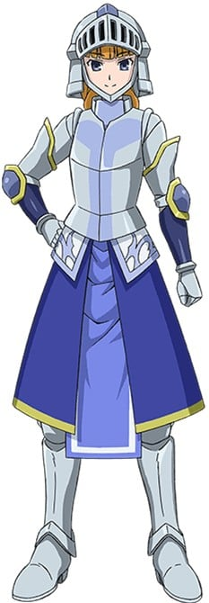
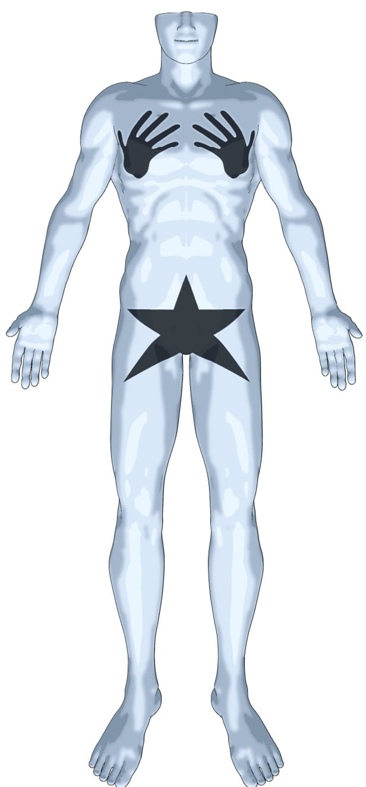
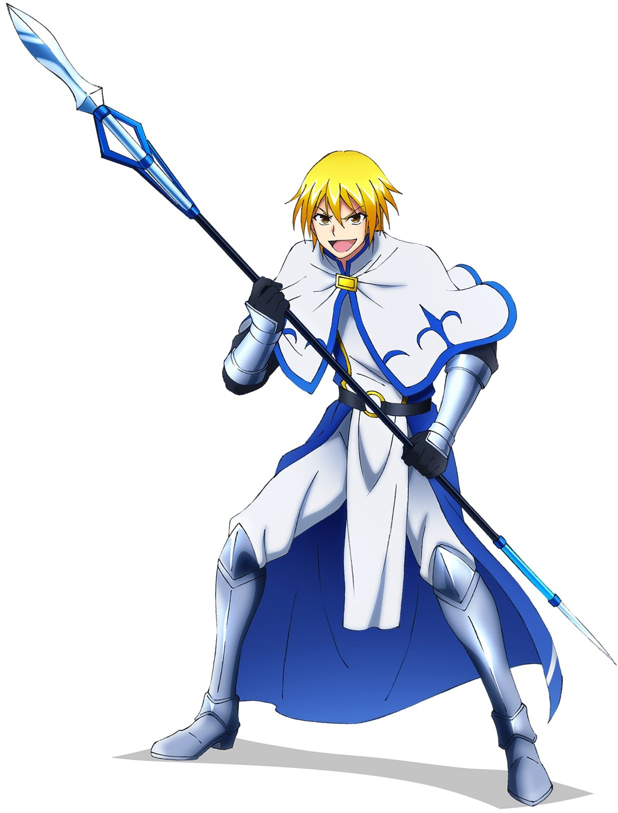

> [!bookinfo|noicon]+ **我立于百万生命之上**
> 
>
| 日文名 | 100万の命の上に俺は立っている |
|:------: |:------------------------------------------: |
| 类型 | 小说改 |
| 新番 | 2020 年 10 月 |
| 集数 | 共12话 |
| 官网 | [http://1000000-lives.com/](https://http://1000000-lives.com/) |
| 制作 | MAHO FILM |
| 导演 | 羽原久美子 |
| 脚本 | 羽良俊馬,吉岡たかを,平林佐和子,伊神貴世 |
| 评分 | 5.9|
| 制片人 | 向井悠樹 |

> [!abstract]+ **简介**
> 重视合理、喜欢单独行动的中学3年生四谷友助，某天穿越到了游戏风格的异世界——
他与同样穿越到异世界的同班同学新堂衣宇、箱崎红末一起行动，作为第3名玩家，开始挑战赌上性命的游戏任务。四谷舍弃感情论，对所有要素一视同仁，有时甚至将同伴的性命当作棋子来使用。这样的他能否从袭来的魔物、棘手的事件以及暗中活跃的强敌手中避免队伍全灭，并成功通关这个游戏呢？

> [!tip]+ **章节列表**
>- [ ] 第1话：勇者失格 (2020-10-02)
>- [ ] 第2话：最讨厌的这座城市 (2020-10-09)
>- [ ] 第3话：救救我 (2020-10-16)
>- [ ] 第4话：柯鲁多内尔的卡哈贝尔 (2020-10-23)
>- [ ] 第5话：生命的价值 (2020-10-30)
>- [ ] 第6话：古代遗迹赫兹·巴尼亚扎特·阿拉古茨 (2020-11-06)
>- [ ] 第7话：光之战士与暗之旁人 (2020-11-13)
>- [ ] 第8话：NPC杀手 (2020-11-20)
>- [ ] 第9话：心跳不已的登出 (2020-11-27)
>- [ ] 第10话：四谷友助之死 (2020-12-04)
>- [ ] 第11话：永远的魔法派 (2020-12-11)
>- [ ] 第12话：杀人犯的夏天 (2020-12-18)

> [!tip]+ **主要角色**
> 
| 角色 | CV | 简介| 角色图片 |
|:----:|:---:|:---:|:--------:|
| 四谷友助 | 上村祐翔 | 物語の主人公で中学3年生。ある日の放課後、何者かによって異世界に転送された。最初の職業は農民。クレバーで大人びているが、ハーレムを夢想する年相応な部分もある。自然あふれる田舎に暮らしていたためサバイバル能力は高い。  農民ランク：1            下半身 > 110% 用植物の知識を得る   不随意筋 > 120% 体力 > 150%               強度 > 150% 上半身 > 200% |  |
| 新堂衣宇 | 保科李沙 | 四谷のクラスメイトで雑誌モデルをつとめるほどの美少女。異世界での職業は魔術師（風）。使える魔術は空気を動かす風魔法1種のみ。最初に異世界に転送され、以降クエストをクリアして箱崎と四谷が仲間になった。  魔術師【風】ランク：３   下半身 > 83% 風魔法の使用が可能          不随意筋 > 83% 体力 > 83%                        強度 > 83% 上半身 > 83% |  |
| 箱崎紅末 | 和氣あず未 | 四谷より先に異世界に転送されたクラスメイト。職業は戦士（剣）。もともと虚弱だったため、戦闘能力は高くない。病弱な自分に負い目を感じており、病気の心配をしなくてもよい異世界では、自分を変えたいと考えている。  戦士【剣】ランク：1   不随意筋 > 170% 体力 > 220%                 強度 > 190 上半身 > 190% 下半身 > 180% |  |
| 時舘由香 | 小市眞琴 | 四谷が与えられたミッションによって知り合った女子高生にして4人目の仲間。職業は魔術師（熱）。使える熱魔法は杖の先10cmの範囲の温度を少しだけ上げるもの。女性向けゲームに熱中するいわゆるオタクである。  魔術師【熱】ランク：1   下半身 >80% 熱魔法の使用が可能         不随意筋 > 80% 体力 > 80%                       強度 >80% 上半身 > 80% |  |
| カハベル | 斎藤千和 | 四谷が異世界で出会った女騎士。生きた肉を切るのが好きという変人だが、他は至ってまともで部下からの人望も厚い。四谷たちの旅に同行し、剣の稽古をつけさせてほしいと提案する。 |  |
| ゲームマスター | 速水奨 | 四谷たちを異世界に転送した未来人を自称する謎の存在。異世界で周回ごとにクエストを課す。クエストにクリアすると質問にひとつ答えてくれる。語尾の途切れた独特な口調で話す。 |  |
| 鳥井啓太 | 豊永利行 | 現実世界で四谷に助けられ、その後異世界に転送された5人目のプレイヤー。職業は戦士（槍）。中学を中退（自称）しており、年齢はパーティで一番高い。考えることは苦手だが陽気で人懐こく四谷とは真逆の性格で、腕っぷしも強い。 |  |
| アォユー | 悠木碧 | もうひとりの田楽巫女。当初四谷たちを傭兵と勘違いしていたが、違うと分かると手の平を返す現金な性格。同世代のヤーナと特に仲が良い。 |  |
| カンティル | 三木眞一郎 | オーク討伐のため、ジフォン島民に雇われた傭兵のひとり。オークとの戦いを唯一経験しており、実績と経験から、傭兵たちのリーダーを務める。 |  |