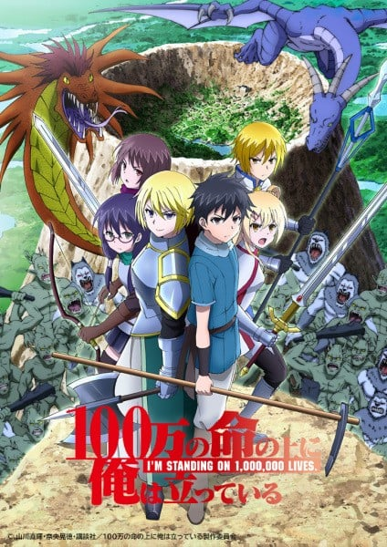
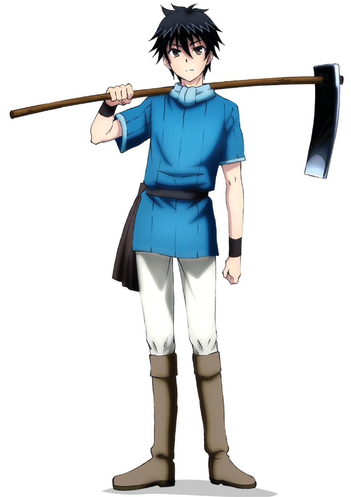
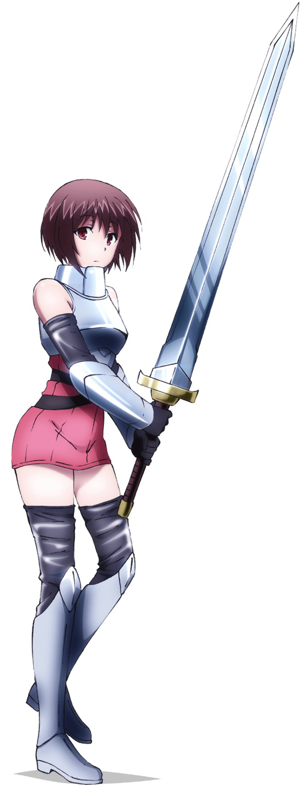
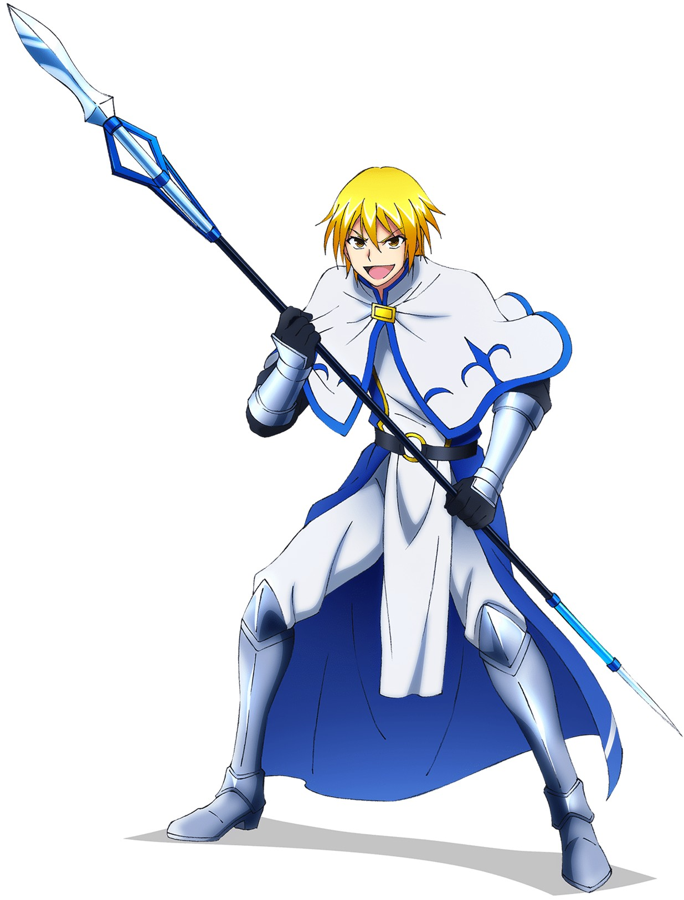
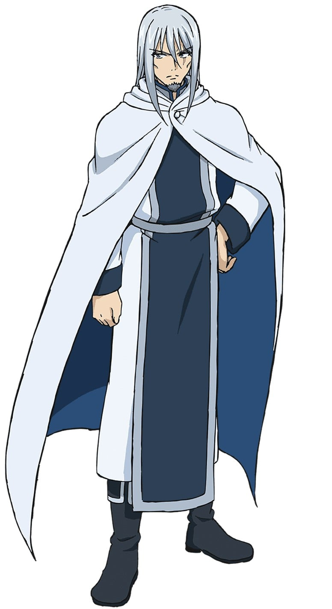

> [!bookinfo|noicon]+ **我立于百万生命之上 第二季**
> 
>
| 日文名 | 100万の命の上に俺は立っている 第2シーズン |
|:------: |:------------------------------------------: |
| 类型 | 漫改 |
| 新番 | 2021 年 7 月 |
| 集数 | 共12话 |
| 官网 | [https://1000000-lives.com/](https://https://1000000-lives.com/) |
| 制作 | MAHO FILM |
| 导演 | 羽原久美子 |
| 脚本 | 羽良俊馬,吉岡たかを,平林佐和子,伊神貴世 |
| 评分 | 6.1|
| 制片人 | 向井悠樹 |

> [!abstract]+ **简介**
> 

> [!tip]+ **章节列表**
>- [ ] 第13话：对了、去基佛岛吧。 (2021-07-09)
>- [ ] 第14话：亚娜＆奥由 两人是维克达姆 (2021-07-16)
>- [ ] 第15话：无法成为正义的伙伴 (2021-07-23)
>- [ ] 第16话：流动的岛 (2021-07-30)
>- [ ] 第17话：oo很有精神 (2021-08-06)
>- [ ] 第18话：他们能做的 只有抬头仰望 (2021-08-13)
>- [ ] 第19话：短篇电影和六个勇者 (2021-08-20)
>- [ ] 第20话：死亡之旅 (2021-08-27)
>- [ ] 第21话：魔兽总进击 (2021-09-03)
>- [ ] 第22话：灭亡的意识 (2021-09-10)
>- [ ] 第23话：龙主教 (2021-09-17)
>- [ ] 第24话：百万生命之上 (2021-09-24)
>- [ ] 第12.5话：第一季总集篇 (2021-07-02)

> [!tip]+ **主要角色**
> 
| 角色 | CV | 简介| 角色图片 |
|:----:|:---:|:---:|:--------:|
| 静凛 |  | 静凛とは、いちから株式会社が提供するアプリ「にじさんじ」の公式バーチャルライバーである。  “高校三年生。学園モノのキャラクター達の先輩的なポジション。性格は穏やかで後輩を優しく指導する皆から頼られるお姉さん。学校問わず多くの男子からアプローチを受けるが、さらりとかわす。”  ーー公式サイトより引用ーー  ミディアムボブに紫のリボンがチャームポイント。最高学年らしい落ち着いたトーンで話す。  魅力的な声でリクエストにも気さくに答えてくれる優しいカウントダウン先輩。  雑談・ゲーム実況の他、にじさんじのＪＫ組とのコラボも行っている。 |  |
| 樋口楓 |  | 樋口楓とは、いちから株式会社が提供するアプリ「にじさんじ」の公式バーチャルライバーである。  “高校二年生。長身でスタイル抜群。劇団に所属している。本人は、劇の役にハマるために学校でも役っぽく振舞っていたが、素の自分に戻しづらくなった。「カッコいい」より「かわいい」と言われると照れる。”  ーー公式サイトより引用ーー  銀髪のポニーテールに白いリボンがチャームポイント。笑い声は特徴的な引き笑い。  本人は標準語で話すことを心掛けているが、よく関西弁が出てしまう。  （バーチャル界の関西圏出身）  あだ名は「でろーん」（学校の授業中にでろーんとした体制で寝ているから）  将来の夢は生ライブ  初投稿の自己紹介動画で「かえでろーん」という単語が誕生。同動画で絵が苦手なのが発覚。 初生放送配信でオンラインゲーム「マビノギ」をプレイ。配信後半、苦手なお絵描きを始めるがよくわからない絵が並んだ。 頻繁にクレヨンしんちゃんのキャラクター「ボーちゃん」の声真似を披露。他にも多くの声真似を披露している。 絵が苦手だが、「お絵描きの森」プレイを頻繁に放送。 ゲーム内の「お絵描きリレー」では、トランポリンの絵をUFOと間違えたり、前者の絵を自分なりにアレンジしたりする。 学校では授業中でも居眠りしている。「涎を垂らすからタオルを持っていく、イビキをかくと先生に笑われる、指名される前に友達に起こしてもらう」 オンラインゲームは小学２年生の時からやっているとのこと。「ネトゲにはお金を惜しまない。」 パソコン環境はノートパソコンのデュアルモニタ。キーボード、マウスはショートカットを組めるもの（Razer製） にじさんじJK組の中では、最も女子高生らしい言葉使いをする。  2月20日同じバーチャルライバー「える」とコラボ。「エルフの森を燃やせ！」  2月25日のお絵描きの森配信では、バーチャルYouTuber「ディープブリザード」とコラボ。 |  |
| 四谷友助 | 上村祐翔 | 物語の主人公で中学3年生。ある日の放課後、何者かによって異世界に転送された。最初の職業は農民。クレバーで大人びているが、ハーレムを夢想する年相応な部分もある。自然あふれる田舎に暮らしていたためサバイバル能力は高い。  農民ランク：1            下半身 > 110% 用植物の知識を得る   不随意筋 > 120% 体力 > 150%               強度 > 150% 上半身 > 200% |  |
| 新堂衣宇 | 保科李沙 | 四谷のクラスメイトで雑誌モデルをつとめるほどの美少女。異世界での職業は魔術師（風）。使える魔術は空気を動かす風魔法1種のみ。最初に異世界に転送され、以降クエストをクリアして箱崎と四谷が仲間になった。  魔術師【風】ランク：３   下半身 > 83% 風魔法の使用が可能          不随意筋 > 83% 体力 > 83%                        強度 > 83% 上半身 > 83% |  |
| 箱崎紅末 | 和氣あず未 | 四谷より先に異世界に転送されたクラスメイト。職業は戦士（剣）。もともと虚弱だったため、戦闘能力は高くない。病弱な自分に負い目を感じており、病気の心配をしなくてもよい異世界では、自分を変えたいと考えている。  戦士【剣】ランク：1   不随意筋 > 170% 体力 > 220%                 強度 > 190 上半身 > 190% 下半身 > 180% |  |
| 時舘由香 | 小市眞琴 | 四谷が与えられたミッションによって知り合った女子高生にして4人目の仲間。職業は魔術師（熱）。使える熱魔法は杖の先10cmの範囲の温度を少しだけ上げるもの。女性向けゲームに熱中するいわゆるオタクである。  魔術師【熱】ランク：1   下半身 >80% 熱魔法の使用が可能         不随意筋 > 80% 体力 > 80%                       強度 >80% 上半身 > 80% |  |
| カハベル | 斎藤千和 | 四谷が異世界で出会った女騎士。生きた肉を切るのが好きという変人だが、他は至ってまともで部下からの人望も厚い。四谷たちの旅に同行し、剣の稽古をつけさせてほしいと提案する。 |  |
| ゲームマスター | 玄田哲章 | 四谷たちを異世界に転送した未来人を自称する謎の存在。異世界で周回ごとにクエストを課す。クエストにクリアすると質問にひとつ答えてくれる。語尾の途切れた独特な口調で話す。 |  |
| 鳥井啓太 | 豊永利行 | 現実世界で四谷に助けられ、その後異世界に転送された5人目のプレイヤー。職業は戦士（槍）。中学を中退（自称）しており、年齢はパーティで一番高い。考えることは苦手だが陽気で人懐こく四谷とは真逆の性格で、腕っぷしも強い。 |  |
| ヤーナ | 竹達彩奈 | ジフォン島の田楽巫女。後任をオークに食われてしまったため、27歳となった現在も巫女を続けている。婚期の逃してしまっていることを気にしている。 |  |
| アォユー | 悠木碧 | もうひとりの田楽巫女。当初四谷たちを傭兵と勘違いしていたが、違うと分かると手の平を返す現金な性格。同世代のヤーナと特に仲が良い。 |  |
| カンティル | 三木眞一郎 | オーク討伐のため、ジフォン島民に雇われた傭兵のひとり。オークとの戦いを唯一経験しており、実績と経験から、傭兵たちのリーダーを務める。 |  |