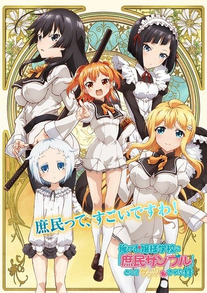
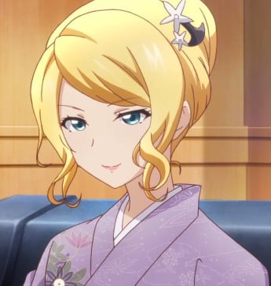
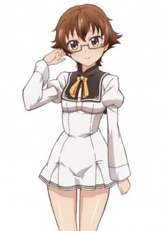
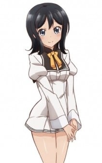
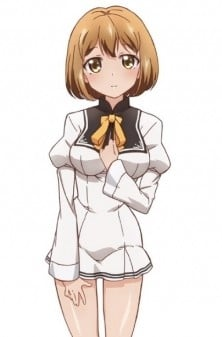

> [!bookinfo|noicon]+ **我被绑架到贵族女校当「庶民样本」**
> 
>
| 日文名 | 俺がお嬢様学校に「庶民サンプル」としてゲッツされた件 |
|:------: |:------------------------------------------: |
| 类型 | 小说改 |
| 新番 | 2015 年 10 月 |
| 集数 | 共12话 |
| 官网 | [http://syominsample-anime.jp/](https://http://syominsample-anime.jp/) |
| 制作 | SILVER LINK. |
| 导演 | 神保昌登 |
| 脚本 | 下山健人 |
| 评分 | 5.5|
| 制片人 | 金子逸人、伏見宣人,金子逸人,伏見宣人 |

> [!abstract]+ **简介**
> 平凡的高中生神乐坂公人，某一天忽然被绑架到“清华院女子学校”。在那里都是各个名门的大小姐和她们的专属女仆。除了父亲之外，她们对男性一无所知，同时也完全不了解外界的情况。为了让她们习惯跟庶民一起生活，因此把公人绑架到学校。之后，公人与因为孤独一人而相信“亲吻庶民就能实现愿望”的大小姐天空桥爱佳相遇并认识，知道爱佳的烦恼后，决定与爱佳共组“庶民社”。公人在清华院女子学校的生活就此开始。

> [!tip]+ **章节列表**
>- [ ] 第1话：欢迎你庶民 (2015-10-07)
>- [ ] 第2话：丽子大人是我们的憧憬 (2015-10-14)
>- [ ] 第3话：感觉就像是伊甸园 (2015-10-21)
>- [ ] 第4话：茶会事件 (2015-10-28)
>- [ ] 第5话：只是朋友 (2015-11-04)
>- [ ] 第6话：到外面去 (2015-11-11)
>- [ ] 第7话：纯傲小姐的本领 (2015-11-18)
>- [ ] 第8话：爱佳小姐朋友很多 (2015-11-25)
>- [ ] 第9话：神乐坂大人来了 (2015-12-02)
>- [ ] 第10话：我之前就很在意 Get's 是什么意思？ (2015-12-09)
>- [ ] 第11话：公人大人以前所见的天空不是这样的吗？ (2015-12-16)
>- [ ] 第12话：小女子不才，还请您永生多加指教。 (2015-12-23)
>- [ ] 第1话：九条小姐的抖S相谈室动画版 (2016-01-06)
>- [ ] 第2话：ねえ、何でこの靴下こんなにゆるいの？ (2016-02-02)
>- [ ] 第3话：無理しない程度に大食い大会致しましょう♪ (2016-03-02)
>- [ ] 第4话：庶民魔法って知ってるか? (2016-04-02)
>- [ ] 第5话：私ぎゅうどんいっぱいに興味がありますわ♪ (2016-05-03)
>- [ ] 第6话：イチズレシピ 庶民部Ver. (2016-06-02)

> [!tip]+ **主要角色**
> 
| 角色 | CV | 简介| 角色图片 |
|:----:|:---:|:---:|:--------:|
| 神楽坂公人 | 田丸篤志 | 男主角，高中一年级生。本来是普通高中生（庶民），后被绑架到清华院女子学校。 成绩为平均水准，擅于料理，有个姐姐。喜欢照顾其他人，因此在国中时有“赛巴斯汀”的称号。 除了善于料理之外，做手工艺的技巧亦在水准之上。但对于需要细心的事物反而略感不擅长。 本身是恋女性大腿狂，但在清华院女子学校必须装成自己是恋男性肌肉狂（因为被恐吓如不说此类的言语会被抓去阉）。 与九条家的下任家主“九条一”长得一模一样，所以在小四时两人曾经互换身份生活过一次，因此曾在九条家生活了一段时间，期间亦成为了九条美雪的哥哥（伪冒）。之后因为发烧而失去了在九条家生活的记忆，且被送回自己家。于第6卷恢复部分记忆，并与美雪的关系好了起来。 第6卷后半开始，在周遭没其他人时，会被九条美雪称为“哥哥大人”（但有其他人在时会被美雪“虐待”）。 |  |
| 有栖川麗子 | 立花理香 | 高中一年级生，庶民社成员，公人就读班级的班长。有个恋妹的哥哥。曾经在浴室中与公人裸体相见，进而对第一次看见的裸男公人有好感。 气质优雅温柔身材出众的大小姐，同时也很受欢迎，让没有朋友的爱佳把她当成劲敌，与爱佳常处于敌对关系。 厨艺有专家级的水准，唯一的缺点是有着地狱般的歌声，能够使完美的料理变成毒物。 |  |
| 汐留白亜 | 桑原由気 | 国中二年级生，体格娇小，庶民社成员。拥有专属实验室，甚至让各国企业争相委托研究开发的天才。 能够瞬间写出高深复杂的算式，但只要一集中精神就会脱光衣服。喜欢在公人的身体上读书，且只会吃公人喂的零食。 被公人招待跟照顾后对公人有好感。 |  |
| 神領可憐 | 森永千才 | 高中一年级生，庶民社成员。常常携带着武士刀，并创造自己的流派“可怜式”。有个姊控的妹妹。 初登场时因误会而与公人对决，但在巧合下认为自己输给身为庶民的公人，所以决定听从公人的命令，但自己也说当觉得有机会可以杀掉公人时就会动手。 喜欢可爱的东西，尤其是兔子还有体型娇小的白亚，但对白亚示好时总会被她躲避。 “野兔君”事件后和爱佳成为朋友。 与公人同年出生，但比公人大半个多月。被公人命令换上庶民的女高中生装扮后，被夸奖而产生好感。 |  |
| 九条みゆき | 大西沙織 | 清华院女子学校女仆长，公人的专属女仆。 实为有巨大影响力的名门九条家的大小姐。 9岁时与来到九条家的公人同住，在学校被同学欺负时因为公人主动伸出援手而对公人开始有了好感。 虽然小时候只与公人相处了一个月时间，对他的爱慕却足以让她用手段将公人“绑架”到自己身边。 年纪比公人还小，虽然修完了大学课程但夜间还得学习九条家的帝王学。 记忆恢复之后私下称公人为“哥哥”，同时会向公人撒娇，变回“好妹妹”，但只要有其他人时会立刻恢复扑克脸，变回能干有威严的女仆长，为了不让其他人知道和公人的关系而对公人采取施虐狂女王一般的态度。 日常大小事物都非常细心。基本上除了上课时间在学校之外，周末会回家（不过目前家中的长辈似乎想要让美雪把公人带回家再见面一次）。 |  |
| 花江恵理 | 原由実 | 公人的青梅竹马，目前是人气偶像声优。视声优堀江由衣为目标，并给予其很高的评价。 有着腹黑的一面，似乎是提供证词让公人被认为热爱男性肌肉的罪魁祸首。 对于美雪很介意，把公人当时与美雪的相识情况讲清楚，视美雪为“情敌”。 目前只要有空，都会到清华院女子学校找公人，因此被学校的大部分的千金大小姐们奉为“偶像”。 |  |
| 有栖川鳳子 | 恒松あゆみ | 麗子の母親で、公人曰く「麗子を二段階くらい進化させた感じ」「麗子がお姫様ならお妃様」。 外見は非常に若々しく、スタイルもいい。一方で御三家本流としての風格と威厳も兼ね備えている。 5巻の挿絵では（登場していないにも関わらず）本来麗子がいる位置にカラーで描かれた。 |  |
| 有栖川正臣 | 鳥海浩輔 | 麗子の兄で、大学に通っておりアメフト部のエースを務めている。 容姿端麗、大学主席を修め身体能力も高く、特別扱いされることを嫌い、誰に対しても分け隔てなく紳士的に接するため人望が高い等、絵に描いた様な完璧超人。公人曰く「ほんといい体してんな（彼に触れた時の感想）」とのこと。 しかし、その実態は妹の麗子を死ぬほど愛してる極度のシスコン。そのため、どんなに言い寄ってくる女性に全く興味を示さず、しかも公人みたいに鈍感なため、小鞠の好意にも気付いてない。一方、麗子に近づく男には口も態度も悪くなり、「庶民ごときが麗子に近づくな！」と怒鳴り散らすなど、特に公人を異常なほど毛嫌いしている。後にシスコンであるのを小鞠に知られたことで弱みを握られてしまい、それ以後は彼女専用の人間椅子にさせられている。 |  |
| 末広瑞穂 | 杉浦しおり | 「やばい空気」が読める文学眼鏡っ子。 意外に足が速い。 |  |
| 東城香絵 | 相坂優歌 | アイドルの様な明るい雰囲気を持つ。 麗子、瑞穂、麻矢とは幼稚園から続いてる間柄で、よくお茶会を4人で行っている。 あるお茶会で公人と愛佳の話題で麗子を怒らせてしまった際、酷く落ち込んで泣いてしまっていたが、公人によって無事仲直りする。 |  |
| 壬生麻矢 | 松田利冴 | ふんわりとした雰囲気でお喋り好き。 また、寂しがり屋で泣き虫でもある。 |  |
| 崎守 | 藤村歩 | 白亜専属のメイド。 清華院女学校に勤務2年目でメイドの中では若手の方だが、すぐに根を上げると言われた白亜の専属メイドを一年以上続けているなど意外に優秀。 白亜が公人に恋心を抱いていることを知ると、ラボのメイド達を総動員して公人と白亜をくっ付けようと画策し、様々な罠を張り巡らせている。逆に他のヒロイン達には妨害に掛かっている。 |  |