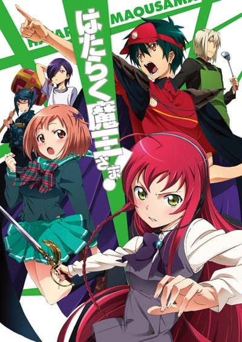
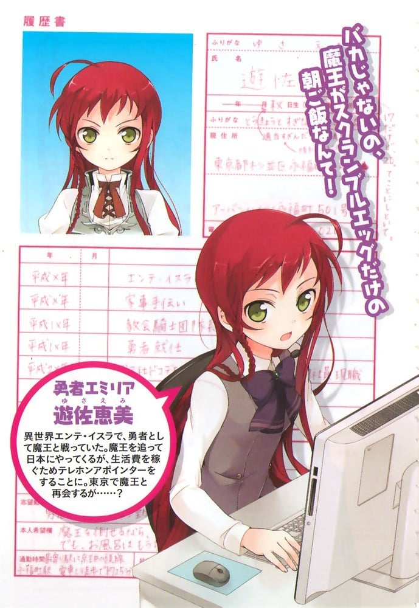
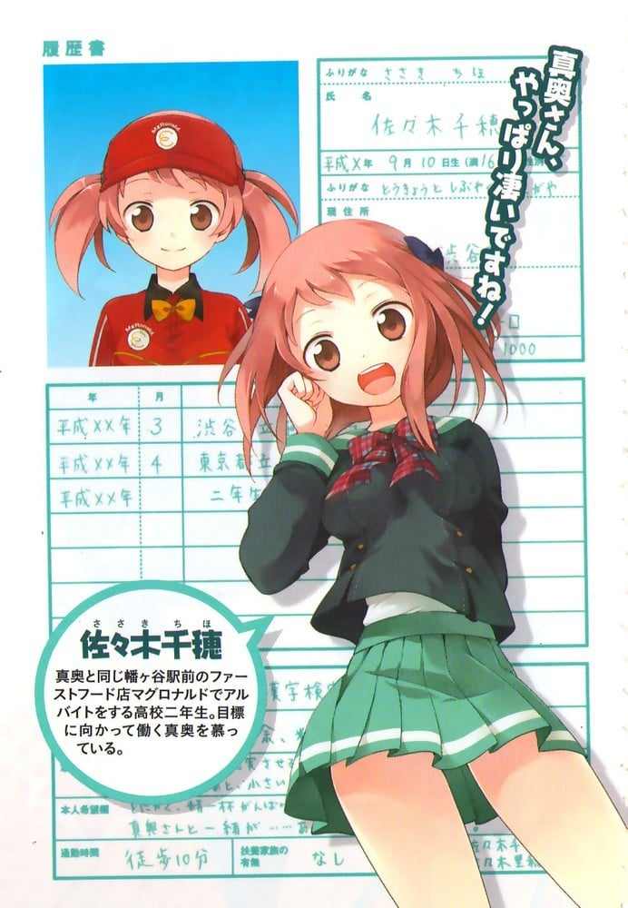
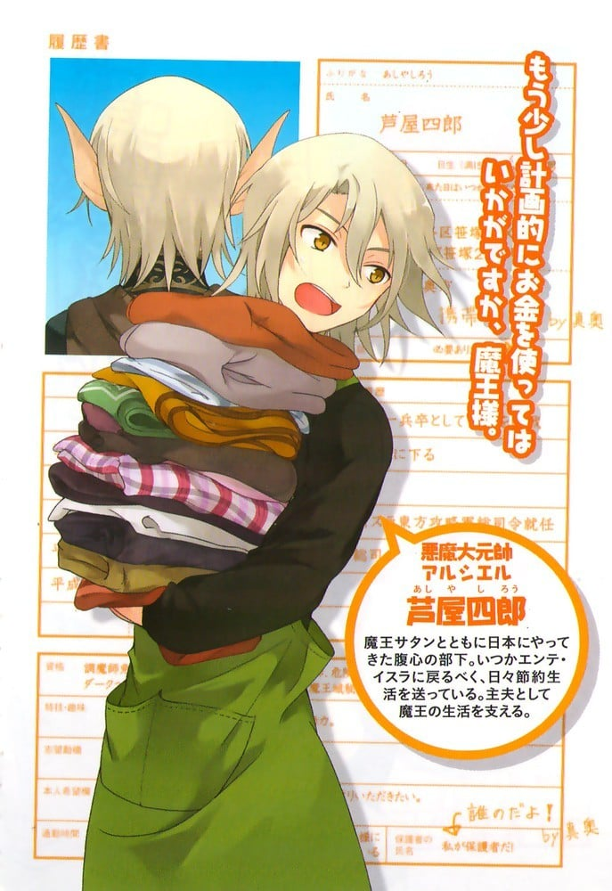
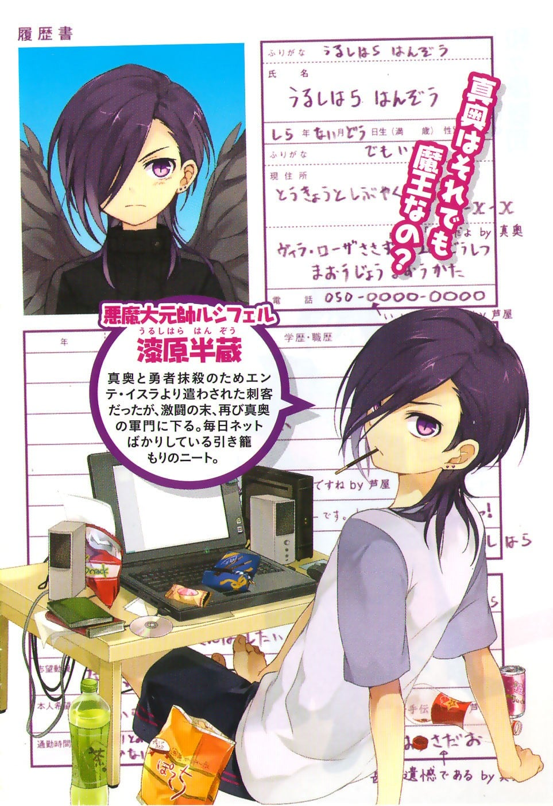
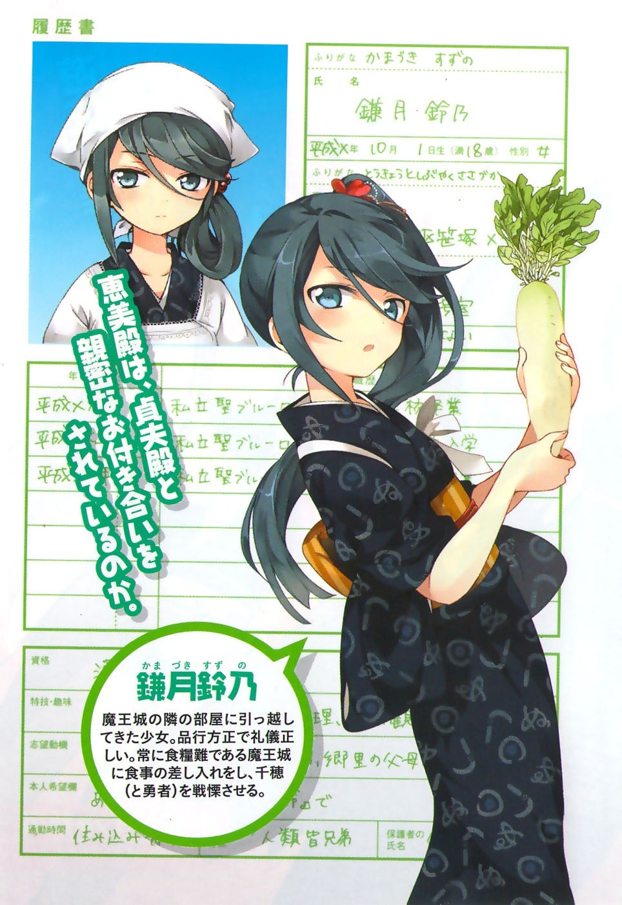
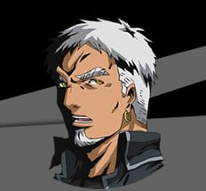

> [!bookinfo|noicon]+ **打工吧！魔王大人**
> 
>
| 日文名 | はたらく魔王さま! |
|:------: |:------------------------------------------: |
| 类型 | 小说改 |
| 新番 | 2013 年 4 月 |
| 集数 | 共13话 |
| 官网 | [http://maousama.jp/](https://http://maousama.jp/) |
| 制作 | WHITE FOX |
| 导演 | 細田直人 |
| 脚本 | 下山健人,待田堂子,横谷昌宏 |
| 评分 | 7.1|
| 制片人 | 吉川綱樹 |

> [!abstract]+ **简介**
> 管你是魔王还是勇者，想填饱肚子就得工作！
原本即将征服世界的魔王撒旦却遭勇者击败，被迫漂流到异世界“日本”。为了赚取生活费，魔王将三坪大的公寓当成临时魔王城，开始过着打工族的生活。没想到勇者竟追随他的脚步穿越时空而来……一出平民路线的奇幻故事就此展开！

> [!tip]+ **章节列表**
>- [ ] 第1话：魔王，屹立于笹塚 (2013-04-04)
>- [ ] 第2话：勇者，以工作为重留宿魔王城 (2013-04-11)
>- [ ] 第3话：魔王，在新宿和后辈约会 (2013-04-18)
>- [ ] 第4话：勇者，体会心的温度 (2013-04-25)
>- [ ] 第5话：魔王和勇者，拯救笹塚 (2013-05-02)
>- [ ] 第6话：魔王，踏上学校的楼梯 (2013-05-09)
>- [ ] 第7话：魔王，邻居送礼 家计减负 (2013-05-16)
>- [ ] 第8话：勇者，闯入修罗场 (2013-05-23)
>- [ ] 第9话：勇者，体验修罗场 (2013-05-30)
>- [ ] 第10话：魔王和勇者，度过不同以往的日常 (2013-06-06)
>- [ ] 第11话：勇者，贯彻自己的信念 (2013-06-13)
>- [ ] 第12话：魔王，履行自己的职责 (2013-06-20)
>- [ ] 第13话：魔王和勇者，认真地努力工作 (2013-06-27)

> [!tip]+ **主要角色**
> 
| 角色 | CV | 简介| 角色图片 |
|:----:|:---:|:---:|:--------:|
| 真奥貞夫 | 逢坂良太 | 本作男主角。在异世界安特·伊苏拉时名为撒旦·加科布。实际年龄约300岁，在日本伪装成20岁。身形与在安特·伊苏拉时的模样差非常多，一旦恢复魔力，身形会比现实高壮许多，代表恶魔的山羊角和足也会重新出现。 过去出生于魔界一个弱小的部族，当时跟哥布林差不多脆弱。有一天整个部族遭其他魔族灭族，真奥父母双亡的同时还身受重伤、奄奄一息地在哭泣，一个路过的天使（莱拉）以第一次看到恶魔在哭为理由救了他，在疗伤过程中天使告诉他许多知识与见闻，并在临行前送给他一个宝石（基础的碎片），真奥凭着当时所得到的知识成为日后的魔王撒旦。 企图征服人类的世界安特·伊苏拉，却败在勇者艾米莉亚手下。为了能东山再起，在艾尔西尔的建议下开启了异世界之门逃到现代日本，却因为日本没有魔力之故受困于此。在利用残存的魔力伪造了身份后，和芦屋四郎与漆原半藏同住在东京都涉谷区笹冢的“Villa．Rosa笹冢”的201号室。最初以领日薪的人力派遣工作谋生，后来辗转打过许多种工，终于在半年前进入大型快餐连锁店麦丹劳工作。十分优秀的打工人员，才开始工作半年时薪升到A级人员水准，也获选店内员工的本月MVP，之后受命成为特定时间段的负责人。 他不使用魔力在几天内习得日语，也学会了说流利的英语。身为魔王，对其他人的阴谋与恶意敏感具有洞察力和观察力，经常能提前推断出敌方目的。适应能力很高，一年以内已经适应了在地球上的生活。即使多次遇上了危机都能借由他的机智转危为安，但另一方面对于却女性心理比较迟钝。 自从来到地球后精神上有很大的转变，待人温和又认真，并努力融入人类社会，对身为消灭魔王军的最大仇敌惠美不但毫无敌意，甚至为救他人愿意消耗自己残存的魔力，让勇者一行人和铃乃一开始都不敢相信他是以前肆虐安特·伊苏拉的魔王。曾说过去不了解人类，在听到惠美因魔王军而失去父亲时对她道歉。 对于知道自己真实身份还出于自己的意志喜欢上自己而且平时会在各方面支持自己的打工的后辈千穗十分感谢，但受不了千穗哭。 因阿拉丝·拉姆斯将之认为爸爸，艾米莉亚为妈妈而无奈让她住在“魔王城”。曾带艾米莉亚与阿拉斯去过游乐园。在阿拉斯与加百列对战中损坏了“魔王城”。 第四卷中，因“魔王城”损坏，需维修一周，而搬去在铫子大黑天祢的海之屋帮忙，在四卷末，卡米奥带来用魔王的断角碎片制成的剑，魔王便以之恢复了艾尔西尔，路西菲尔，卡米奥与自己的魔物身体，训斥西里亚特时让西里亚特带话给魔界随后搂住艾米利亚，说“我手上已经有了基础碎片”，并打开gate送回卡米奥与西里亚特的军队，又取下剑上的魔力“基础”碎片。 拉贵尔事件中，小千因加百列与拉贵尔受伤，真奥在玲乃，艾尔西尔和惠美的帮助下寻找，后因小千从莱拉处得到圣法气而给予的力量，恢复魔王身体，与艾尔西尔一起对付加百列与拉贵尔，但力不从心，由小千与惠美救下。 为了遣返法尔法雷洛，指定了艾米莉亚，贝尔，路西菲尔，艾尔西尔和佐佐木千穗为新四天王（虽然被吐槽是五个），并由恶魔传回消息，后来又在第八卷惠美回安特·伊苏拉后失去联系期间里，芦屋指出他这一决定是“牺牲了艾米莉亚和玲乃在安特·伊苏拉的安全，换取佐佐木小姐在日本的安全。” 在考驾照的时候遇见了艾米莉亚的父亲诺尔德·尤斯提纳和阿拉斯·拉姆斯的妹妹亚西艾斯·安拉，并带他们回了“Villa·Rosa笹冢”的201号室又与亚西艾斯去救援千穗并与艾西斯融合，完胜卡麦尔。回来时，从意料外出现的大黑天祢处得知芦屋和诺尔德被加百利抓走的事。 此后，由玲乃开的门成功回到安特·伊苏拉，但未恢复魔力，同时使用圣剑时有排斥反应（本人会呕吐），又在这时向贝尔吐露了侵占安特·伊苏拉的原因。 其后，因苍天盖的战斗骑摩托车闯进战场，在亚西艾丝·安拉融合了芦屋铠甲上适应了魔力的基础碎片后恢复魔力使用圣剑轻松完胜3个天使，后遇到“神”（天使长イグノラ），在其强力的引力不得因下狠狠地勒住了加百利，在房东的帮助下回到日本。 回到地球后向惠美讨要于去安特伊苏拉的经费，共30万日元，其实是想为惠美提供工作机会，但因为惠美没有拒绝还钱而苦恼，后因惠美阴差阳错去麦丹劳工作而差点不想上班。在看望漆原听世界的因由的时候，发现莱拉并和其它人一起抓住了她。 |  |
| 遊佐恵美 | 日笠陽子 | 本作女主角。在异世界安特·伊苏拉时名为“艾米莉亚·尤斯提纳（エミリア·ユスティーナ）”，为大法神教会的勇者。实际年龄为17岁，在日本伪装成20岁。 半天使，人类父亲诺尔德与大天使母亲莱拉的混血女儿。能够自在操作在其身体中寄宿著天界金属“天银”所构成的“进化圣剑·片翼（ベターハーフ）”。普通状态以下的头发为玫红色，而使用圣法气后会因为天使血脉而变为银白色。头上有根呆毛。 出身于西大陆的乡下农村，曾经只是个普通的农家女儿，直到12岁时魔王军的侵略中因其真正身份而被大法神教会带走。与父亲分开以后，农村就在魔王军的侵略下烧毁。认为父亲已经死亡的她，为了向魔王复仇而学习剑术和法术，一年后以教会骑士的身份投身于对魔王军的战斗。在16岁时得到“进化圣剑·片翼”以后正式成为勇者后，接连击败了魔王军的三位元帅，号召全人类攻入魔王城所在的中部大陆。 在魔王城只差一点就能够打倒魔王撒旦和手下艾尔西尔，却让他们逃到异世界，为了追击而来到日本，却被其伙伴奥尔巴背叛而抛弃。而且与魔王的情况相似的是，因为日本没有圣法气之故而受困于此，因而开始一般日本人的打工生活。 性格爱恨分明，虽然本性正直、温柔、善良、责任感强，而且会为友人着想，但受到过去影响而在面对任何魔界之人时都毫不留情。即使在日本，在面对魔王时的固执和急躁情绪仍然相当明显，面对恶魔们时常口出如黑社会般的恐吓台词，因此总被魔王吐嘈“不像勇者”。 喜欢Relax Bear，连钱包都是印有白色小熊以及黄色小鸟图案的折叠式LV钱包。另外亦喜欢日本时代剧，以时代剧的主题曲为其智能手机的铃声。非常在意自己不算丰满的身材，一旦被提起绝对会发火，因为这个原因第三卷差点杀死魔王。 在大型手机电信公司—“DOCODEMO”集团担任契约员工，担当客服中心中意见处理领域的电话客服接线员，住在东京都杉并区永福町的“Urban·Heights永福町”的501号室。 曾经被千穗当作真奥的前女友。 沙利叶事件中千穗被沙利叶挟持，被逼问要求交出圣剑，后被魔王解救。 第三卷被天降“苹果”阿拉斯·拉姆斯当成母亲，后与魔王去了游乐场，在与抢夺阿拉斯·拉姆斯的天使加百利战斗时，与阿拉斯·拉姆斯融合打断了加百列的剑，并在加百列的手臂上留下伤口。 在与加百列战斗后跟魔王等人去了“大黑屋”，在海上与恶魔交战却未杀一个恶魔，后在魔王赶到训斥恶魔时，被魔王搂住。 在寻找拉贵尔的过程中遇见加百列，并被告知父亲活着，逐渐失去了杀死魔王的信念。 其后决定回安特·伊苏拉，在家乡因阿拉斯发出的力量被天使发现并被抓获，曾哭着想让魔王救他。从艾尔西尔的信中谜语得知魔王会来救他们流泪，之后与艾尔西尔战斗，被后来的魔王所救。在失去工作后开始在麦丹劳打工。探望漆原期间，在医院抓住莱拉之后因莱拉之前给他们惹了太多麻烦而用左手将莱拉的脸扇成像“拿破仑鱼和浪人鯵混杂一般”的样子。 加百列质问真奥期间因听到了真奥的告白，在真奥回来扑入真奥怀中。此后，因为纠结如何与莱拉交谈几乎24小时黏在真奥附近。 |  |
| 佐々木千穂 | 東山奈央 | 东京都立笹幡北高校的2年生，16岁。住在东京都涉谷区幡之谷，父亲佐佐木千一是原宿警察局巡查部长。魔王在麦丹劳打工的晚辈店员。 身高一般，但胸部发育比勇者好，连铃乃和勇者都一脸羡慕和嫉妒。 对魔王有好感，更一度认为勇者是魔王的前女友。可惜由于魔王的感情上迟钝，加上总会遇上突发事件而不太感受到她的心意。 在被路西菲尔劫持为人质、目睹魔王、艾尔西尔与勇者和路西法与奥尔巴以真面目交战以后，成为第一个（第二个是铃木梨香）得知魔王与勇者的真正身份的一般人，同时也是双方的共同友人。会为了无法帮助魔王而烦恼，担心有一天魔王和勇者等人要回到安特·伊苏拉了断。魔王曾建议将那些记忆消除，而铃乃更曾经强硬表明要把那些记忆以及安特·伊苏拉在日本的痕迹一并消除，但她却拒绝并表明不愿忘记和她们这段时间所相处的时光。 |  |
| 芦屋四郎 | 小野友樹 | 在异世界安特·伊苏拉时名为“艾尔西尔（アルシエル，Alsiel）”，高等恶魔，魔王手下的四大心腹之一，四天王中最具谋略的智将。恶魔形态时沉默寡言，绝不说多余的话。实际年龄为1500岁，却在日本与魔王一样伪装成20岁。履历表上的字体写得很仔细，似乎使用浅显的笔书写。日常娱乐是看书以充实知识。 负责异世界安特·伊苏拉的东部大陆侵略军，并在最早阶段已经将其压制，但在其他恶魔大元帅相继败亡后领军撤回中央大陆，欲加固中央大陆防御以迎战人类联军。在魔王军被勇者艾米莉亚打败以后，为唯一与魔王逃到现代日本的手下。作为人类形态的外表是高大的身形银色长发青年。在日本担任专业主夫，和真奥（魔王）及漆原（路西菲尔）住在一起。 原本与魔王一样以人力派遣工作谋生，但因为公司被取缔，而接受魔王的建议：由魔王来工作，而他则负责找出恢复魔力的方法。 除负责家务外还四处寻找回复魔力的方法，同时管理真奥的金钱开销，对任何额外消费都会斤斤计较。对魔王乱花钱的行为会进行长时间的说教。漆原来了后，由于需要漆原在电脑上的能力，所以至今为止漆原在电脑上的花费都是芦屋在外面兼职补贴。在外面兼职教授日语、电话销售。 其后加百列带到东大陆，恢复原型，为了将计就计与艾米利亚大战。是防御力最高的魔物，只凭身上的盔甲就可抵御艾米莉亚的圣剑，两人大战10小时不分胜负。 |  |
| 漆原半蔵 | 下野紘 | 在异世界安特·伊苏拉时名为“路西菲尔（ルシフェル，Lucifer）”，堕天使，魔王的心腹手下之一——四天王的一员。被加百列说过其以前的实力非常强大，是被称为晓之子的大天使之首，但由于太无聊而堕落成堕天使，成为堕天使后加入魔王军。 因为曾经是大天使，所以魔王指派熟悉天界的他负责侵略广布大法神教会势力的西部大陆，但结果被勇者艾米莉亚以其圣剑击败，成为最先失势的恶魔大元帅。原以为已经身亡，但事实上却被奥尔巴暗中救下而存活。与奥尔巴达成协议，以回归天界做为报酬答应与其来到日本抹杀魔王与勇者，结果反被击败，在力量尽失后重新归入魔王军。但是作为神话中的原大天使长，他的战斗力，智慧都极其强悍。 现与真奥（魔王）与芦屋（艾尔西尔）住在一起，整天在家闲晃过着尼特族的生活。因他具有电子设备及电脑黑客的技术，为了充分利用其能力，真奥特别为他购买一台笔记本电脑，并要他以网络寻找回复魔力的方法。可是他对于要使用一台以低廉价格买来的旧式电脑感到不满。而由于他除了不做家事以外，还常常以真奥（魔王）的名义在网上订些乱七八糟的东西并且要魔王支付而增加财政压力，再加上低劣颓废的家里蹲生活态度与不看气氛情况说话的白目个性，不只让他受到作为敌对关系的镰月和惠美与个性温和的千穗等女性所轻视，连做为同伴的芦屋也对他十分头疼。也因此，漆原的待遇明显非常的差，真奥与芦屋外出吃烧肉却只带便宜的猪肉丼便当回去给他；当众人在真奥家吃饭时，漆原不只因为桌子太小而被排除在外，连碗筷不够的情况下都只给他用过的免洗餐盒与免洗筷。就算如此漆原在危急时刻还是为了朋友而战斗。 受房东志波的影响，头发变成了银色中掺着蓝色的接近透明的颜色（天使形态）。在讨论中表明听远古的大魔王讲过第十一质点。 |  |
| 鎌月鈴乃 | 伊藤かな恵 | 搬到真奥隔壁的新住户。对外界不了解，以为suica是西瓜，并且连超商都不知道。真正身份是大法神教会订教审议会的第一审问官——克里斯蒂娅·贝尔（クレスティア·ベル）”，以暗杀手段解决教会所认为的异端者，因此她持有“死神之镰·贝尔”的别名。武器是头上的发簪，可用“武身铁光”技能变成大锤。 |  |
| 水島由姫 | 能登麻美子 | 麦格劳福岛园分店的店长，与木崎真弓同期，习惯以“能干”来称赞员工。 |  |
| 木崎真弓 | 内山夕実 |  |  |
| アナウンス | 櫻井浩美 | 各作品通用广播/播音员。 |  |
| 鈴木梨香 | 西明日香 | 恵美の勤め先の同僚。21歳。千穂を除けば、恵美にとって日本での少ない人間関係のなかで唯一親友と呼べる存在。 神戸出身で、小学生のころ兵庫県南部地震（阪神・淡路大震災）に被災した経験を持ち、好奇心で被災時の出来事を聞かれることを嫌がっているために普段は共通語で話す。闊達で明るく、知り合いの知り合いはもうタメ口と非常にサバサバした性格。実家は会社組織で靴屋の工場を経営。ゆくゆくは家業を支えたいと考えており、上京し働く目的はそのための進学資金を貯めるため。新宿地下街崩落時、彼女の親切に触れた恵美はエンテ・イスラでは感じたことのない心地よさを体感し、聖法気の源が人の心である可能性を見せた。運動神経はよく、高校時代には水泳で国体選抜メンバーになったことがある。 自身の経験から他人の過去を詮索はしないが、「色恋は別」として恵美と真奥の関係に興味を持ち、なにかとお節介を焼く。そうして真奥達と関わっていく中で徐々に芦屋に想いを寄せるようになっていく。芦屋との初対面時、真奥達のことは「起業し夢破れた若手実業家であり、恵美とは商売敵同士」と紹介される。千穂とは違いあくまでエンテ・イスラのことを知らない一般人であったが、後にオルバに軟禁された恵美より「概念送受」を受信。相談のためヴィラ・ローザ笹塚を訪れたところをエンテ・イスラの騒動に巻き込まれ、恵美や真奥達の素性を知ることとなる。目の前で芦屋を連れ去られ自身も心に深い傷を負ったが、真実を知ってなお、恵美の友人であり続けることを決意し、帰還した彼女を変わらぬ笑顔で受け入れた。その後はエンテ・イスラから訪れたエメラダとも親交を持つようになるなど、千穂同様異世界の住人達との距離を縮めていくようになる。 エンテ・イスラ騒動後、携帯電話購入のため芦屋からデートに誘われた際に腹を決め、ついに告白する。対して芦屋は悪魔としての本当の姿を彼女に見せ、種族の壁を理由に彼女を受け入れることはしなかった。が、悪魔の姿を目の当たりにしてもなお芦屋への想いは変わることなく、諦めきれない自身の心に整理をつけられないでいる。 なお、彼女の神戸でのエピソードは作者和ヶ原の友人の体験談がもとになっている。東京都新宿区高田馬場コンフォートグランディール早稲田205号室在住。 |  |
| エメラダ・エトゥーヴァ | 浅倉杏美 | 西大陆—圣·埃雷帝国的宫廷法术师，艾米莉亚的伙伴。 小个子，具有一头蓬松、发梢有些卷曲的碧绿色短发，以及跟头发相同颜色的瞳孔，说话的口气童言童语；虽给人一副文静的印象，但实际上却是比艾米莉亚年长、实力高强的法术使用者，另外亦熟悉安特･伊苏拉的政治局势。穿着染成红、橙等华丽的色调，背后则是用金线刺绣而成的圣·埃雷帝国国徽的长袍。 受教会威胁而被囚禁，脱出后为警告艾米莉亚而来到日本。在了解她要留在日本的想法后回到安特·伊苏拉，并为她提供回复圣法力的手段。拿了一台超薄手机做为概念收发的媒介，让两人能在分隔两个世界的状态下保持联系，经常向她报告安特･伊苏拉的现况，同时亦注意艾米莉亚和魔王的关系。 |  |
| アルバート・エンデ | 安元洋貴 | エミリアの仲間、愛称は「アル」。元北大陸精鋭部隊「岳仙兵団」第十五次戦団長で、深山で木こりを営んでいた仙術道士。白髪・白髭に色黒の肌、筋肉を強調するようにレザースーツを纏った30過ぎの男性。豪胆で思ったことは何でも口に出す性格。エミリアには格闘術の手解きも行なっていた。エミリアを探すべく数回にわたり地球へ「概念送受」を発信したのち、エメラダと共に日本へ降り立つ。来日の際立ち寄った回転寿司屋では日本の食文化に舌鼓を打つ外国人よろしく大げさなリアクションを見せていた。 魔王軍侵攻時は北方大元帥アドラメレクと交戦し敗北。戦士としても為政者としても自身の上をいく彼を理想としており、そのため早くから悪魔に対する偏見を持っていなかった。恵美がオルバに軟禁された後、エンテ・イスラに一時帰還した真奥・鈴乃らと合流。鈴乃・ルーマックとともに背教審理にかけられていたエメラダを救い出し、蒼天蓋にてオルバの身柄を拘束することに成功した。 |  |