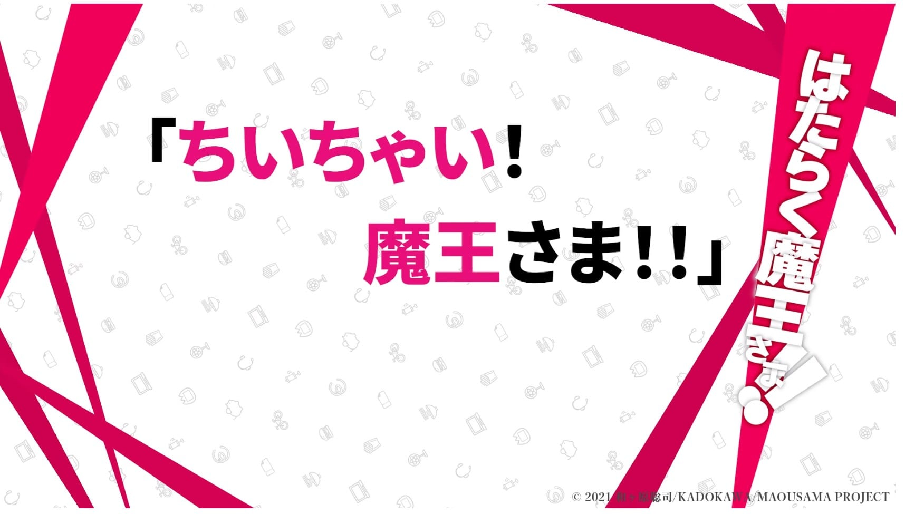
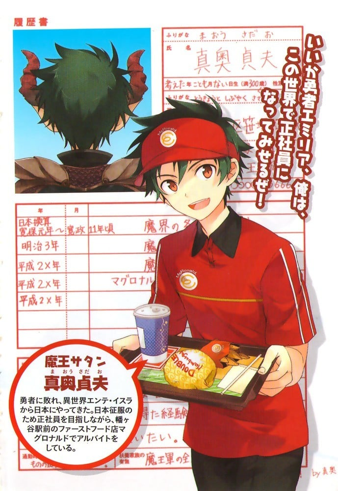

> [!bookinfo|noicon]+ **打工吧！魔王大人 第二季 动画小剧场**
> 
>
| 日文名 | ちいちゃい！魔王さま！！ |
|:------: |:------------------------------------------: |
| 类型 | 小说改 |
| 新番 | 2022 年 7 月 |
| 集数 | 共24话 |
| 官网 | [https://maousama.jp](https://https://maousama.jp) |
| 制作 |  |
| 导演 |  |
| 脚本 |  |
| 评分 | 5.1|
| 制片人 |  |

> [!abstract]+ **简介**
> 

> [!tip]+ **章节列表**
>- [ ] 第1话：
>- [ ] 第2话：
>- [ ] 第3话：
>- [ ] 第4话：
>- [ ] 第5话：
>- [ ] 第6话：
>- [ ] 第7话：
>- [ ] 第8话：
>- [ ] 第9话：
>- [ ] 第10话：
>- [ ] 第11话：
>- [ ] 第12话：
>- [ ] 第13话：
>- [ ] 第14话：
>- [ ] 第15话：
>- [ ] 第16话：
>- [ ] 第17话：
>- [ ] 第18话：
>- [ ] 第19话：
>- [ ] 第20话：
>- [ ] 第21话：
>- [ ] 第22话：
>- [ ] 第23话：
>- [ ] 第24话： (2023-10-01)

> [!tip]+ **主要角色**
> 
| 角色 | CV | 简介| 角色图片 |
|:----:|:---:|:---:|:--------:|
| 真奥貞夫 |  | 本作男主角。在异世界安特·伊苏拉时名为撒旦·加科布。实际年龄约300岁，在日本伪装成20岁。身形与在安特·伊苏拉时的模样差非常多，一旦恢复魔力，身形会比现实高壮许多，代表恶魔的山羊角和足也会重新出现。 过去出生于魔界一个弱小的部族，当时跟哥布林差不多脆弱。有一天整个部族遭其他魔族灭族，真奥父母双亡的同时还身受重伤、奄奄一息地在哭泣，一个路过的天使（莱拉）以第一次看到恶魔在哭为理由救了他，在疗伤过程中天使告诉他许多知识与见闻，并在临行前送给他一个宝石（基础的碎片），真奥凭着当时所得到的知识成为日后的魔王撒旦。 企图征服人类的世界安特·伊苏拉，却败在勇者艾米莉亚手下。为了能东山再起，在艾尔西尔的建议下开启了异世界之门逃到现代日本，却因为日本没有魔力之故受困于此。在利用残存的魔力伪造了身份后，和芦屋四郎与漆原半藏同住在东京都涉谷区笹冢的“Villa．Rosa笹冢”的201号室。最初以领日薪的人力派遣工作谋生，后来辗转打过许多种工，终于在半年前进入大型快餐连锁店麦丹劳工作。十分优秀的打工人员，才开始工作半年时薪升到A级人员水准，也获选店内员工的本月MVP，之后受命成为特定时间段的负责人。 他不使用魔力在几天内习得日语，也学会了说流利的英语。身为魔王，对其他人的阴谋与恶意敏感具有洞察力和观察力，经常能提前推断出敌方目的。适应能力很高，一年以内已经适应了在地球上的生活。即使多次遇上了危机都能借由他的机智转危为安，但另一方面对于却女性心理比较迟钝。 自从来到地球后精神上有很大的转变，待人温和又认真，并努力融入人类社会，对身为消灭魔王军的最大仇敌惠美不但毫无敌意，甚至为救他人愿意消耗自己残存的魔力，让勇者一行人和铃乃一开始都不敢相信他是以前肆虐安特·伊苏拉的魔王。曾说过去不了解人类，在听到惠美因魔王军而失去父亲时对她道歉。 对于知道自己真实身份还出于自己的意志喜欢上自己而且平时会在各方面支持自己的打工的后辈千穗十分感谢，但受不了千穗哭。 因阿拉丝·拉姆斯将之认为爸爸，艾米莉亚为妈妈而无奈让她住在“魔王城”。曾带艾米莉亚与阿拉斯去过游乐园。在阿拉斯与加百列对战中损坏了“魔王城”。 第四卷中，因“魔王城”损坏，需维修一周，而搬去在铫子大黑天祢的海之屋帮忙，在四卷末，卡米奥带来用魔王的断角碎片制成的剑，魔王便以之恢复了艾尔西尔，路西菲尔，卡米奥与自己的魔物身体，训斥西里亚特时让西里亚特带话给魔界随后搂住艾米利亚，说“我手上已经有了基础碎片”，并打开gate送回卡米奥与西里亚特的军队，又取下剑上的魔力“基础”碎片。 拉贵尔事件中，小千因加百列与拉贵尔受伤，真奥在玲乃，艾尔西尔和惠美的帮助下寻找，后因小千从莱拉处得到圣法气而给予的力量，恢复魔王身体，与艾尔西尔一起对付加百列与拉贵尔，但力不从心，由小千与惠美救下。 为了遣返法尔法雷洛，指定了艾米莉亚，贝尔，路西菲尔，艾尔西尔和佐佐木千穗为新四天王（虽然被吐槽是五个），并由恶魔传回消息，后来又在第八卷惠美回安特·伊苏拉后失去联系期间里，芦屋指出他这一决定是“牺牲了艾米莉亚和玲乃在安特·伊苏拉的安全，换取佐佐木小姐在日本的安全。” 在考驾照的时候遇见了艾米莉亚的父亲诺尔德·尤斯提纳和阿拉斯·拉姆斯的妹妹亚西艾斯·安拉，并带他们回了“Villa·Rosa笹冢”的201号室又与亚西艾斯去救援千穗并与艾西斯融合，完胜卡麦尔。回来时，从意料外出现的大黑天祢处得知芦屋和诺尔德被加百利抓走的事。 此后，由玲乃开的门成功回到安特·伊苏拉，但未恢复魔力，同时使用圣剑时有排斥反应（本人会呕吐），又在这时向贝尔吐露了侵占安特·伊苏拉的原因。 其后，因苍天盖的战斗骑摩托车闯进战场，在亚西艾丝·安拉融合了芦屋铠甲上适应了魔力的基础碎片后恢复魔力使用圣剑轻松完胜3个天使，后遇到“神”（天使长イグノラ），在其强力的引力不得因下狠狠地勒住了加百利，在房东的帮助下回到日本。 回到地球后向惠美讨要于去安特伊苏拉的经费，共30万日元，其实是想为惠美提供工作机会，但因为惠美没有拒绝还钱而苦恼，后因惠美阴差阳错去麦丹劳工作而差点不想上班。在看望漆原听世界的因由的时候，发现莱拉并和其它人一起抓住了她。 |  |
| 遊佐恵美 |  | 本作女主角。在异世界安特·伊苏拉时名为“艾米莉亚·尤斯提纳（エミリア·ユスティーナ）”，为大法神教会的勇者。实际年龄为17岁，在日本伪装成20岁。 半天使，人类父亲诺尔德与大天使母亲莱拉的混血女儿。能够自在操作在其身体中寄宿著天界金属“天银”所构成的“进化圣剑·片翼（ベターハーフ）”。普通状态以下的头发为玫红色，而使用圣法气后会因为天使血脉而变为银白色。头上有根呆毛。 出身于西大陆的乡下农村，曾经只是个普通的农家女儿，直到12岁时魔王军的侵略中因其真正身份而被大法神教会带走。与父亲分开以后，农村就在魔王军的侵略下烧毁。认为父亲已经死亡的她，为了向魔王复仇而学习剑术和法术，一年后以教会骑士的身份投身于对魔王军的战斗。在16岁时得到“进化圣剑·片翼”以后正式成为勇者后，接连击败了魔王军的三位元帅，号召全人类攻入魔王城所在的中部大陆。 在魔王城只差一点就能够打倒魔王撒旦和手下艾尔西尔，却让他们逃到异世界，为了追击而来到日本，却被其伙伴奥尔巴背叛而抛弃。而且与魔王的情况相似的是，因为日本没有圣法气之故而受困于此，因而开始一般日本人的打工生活。 性格爱恨分明，虽然本性正直、温柔、善良、责任感强，而且会为友人着想，但受到过去影响而在面对任何魔界之人时都毫不留情。即使在日本，在面对魔王时的固执和急躁情绪仍然相当明显，面对恶魔们时常口出如黑社会般的恐吓台词，因此总被魔王吐嘈“不像勇者”。 喜欢Relax Bear，连钱包都是印有白色小熊以及黄色小鸟图案的折叠式LV钱包。另外亦喜欢日本时代剧，以时代剧的主题曲为其智能手机的铃声。非常在意自己不算丰满的身材，一旦被提起绝对会发火，因为这个原因第三卷差点杀死魔王。 在大型手机电信公司—“DOCODEMO”集团担任契约员工，担当客服中心中意见处理领域的电话客服接线员，住在东京都杉并区永福町的“Urban·Heights永福町”的501号室。 曾经被千穗当作真奥的前女友。 沙利叶事件中千穗被沙利叶挟持，被逼问要求交出圣剑，后被魔王解救。 第三卷被天降“苹果”阿拉斯·拉姆斯当成母亲，后与魔王去了游乐场，在与抢夺阿拉斯·拉姆斯的天使加百利战斗时，与阿拉斯·拉姆斯融合打断了加百列的剑，并在加百列的手臂上留下伤口。 在与加百列战斗后跟魔王等人去了“大黑屋”，在海上与恶魔交战却未杀一个恶魔，后在魔王赶到训斥恶魔时，被魔王搂住。 在寻找拉贵尔的过程中遇见加百列，并被告知父亲活着，逐渐失去了杀死魔王的信念。 其后决定回安特·伊苏拉，在家乡因阿拉斯发出的力量被天使发现并被抓获，曾哭着想让魔王救他。从艾尔西尔的信中谜语得知魔王会来救他们流泪，之后与艾尔西尔战斗，被后来的魔王所救。在失去工作后开始在麦丹劳打工。探望漆原期间，在医院抓住莱拉之后因莱拉之前给他们惹了太多麻烦而用左手将莱拉的脸扇成像“拿破仑鱼和浪人鯵混杂一般”的样子。 加百列质问真奥期间因听到了真奥的告白，在真奥回来扑入真奥怀中。此后，因为纠结如何与莱拉交谈几乎24小时黏在真奥附近。 |  |