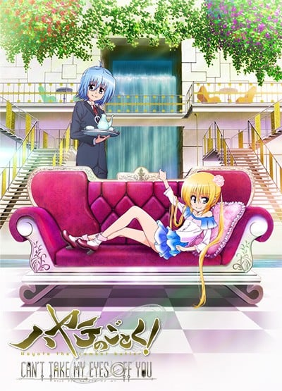
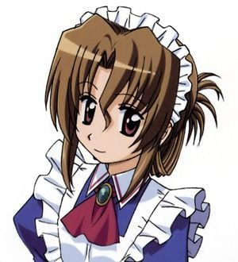

> [!bookinfo|noicon]+ **旋风管家 CAN'T TAKE MY EYES OFF YOU**
> 
>
| 日文名 | ハヤテのごとく! CAN'T TAKE MY EYES OFF YOU |
|:------: |:------------------------------------------: |
| 类型 | 漫改 |
| 新番 | 2012 年 10 月 |
| 集数 | 共12话 |
| 官网 | [http://www.hayate-project.com/](https://http://www.hayate-project.com/) |
| 制作 | Manglobe |
| 导演 | 工藤昌史 |
| 脚本 | 小鹿りえ |
| 评分 | 6.2|
| 制片人 | 河内山隆 |

> [!abstract]+ **简介**
> 在即将结束的暑假，三千院家突然接到了美国内华达州警方的来电，原来那里发现了三千院凪父亲的遗产！不想上课的三千院凪逮到这个机会，热血沸腾地提议要前往美国。在管家绫崎飒的泼冷水阻挡之下，三千院凪为表达抗议竟然负气”离家出走”，没想到竟遭绑架！万能的旋风管家绫崎飒将大小姐平安顺利救回来，这时，一位自称是三千院凪的妹妹的人出现了。

> [!tip]+ **章节列表**
>- [ ] 第1话：第一夜 (2012-10-03)
>- [ ] 第2话：第二夜 (2012-10-10)
>- [ ] 第3话：第三夜 (2012-10-17)
>- [ ] 第4话：第四夜 (2012-10-24)
>- [ ] 第5话：第五夜 (2012-10-31)
>- [ ] 第6话：第六夜 (2012-11-07)
>- [ ] 第7话：第七夜 (2012-11-14)
>- [ ] 第8话：第八夜 (2012-11-21)
>- [ ] 第9话：第九夜 (2012-11-28)
>- [ ] 第10话：第十夜 (2012-12-05)
>- [ ] 第11话：第十一夜 (2012-12-12)
>- [ ] 第12话：最終夜 (2012-12-19)

> [!tip]+ **主要角色**
> 
| 角色 | CV | 简介| 角色图片 |
|:----:|:---:|:---:|:--------:|
| 三千院ナギ | 釘宮理恵 |  |  |
| マリア | 田中理恵 |  |  |
| 桂ヒナギク | 伊藤静 | 动漫作品《旋风管家》中的主要角色之一，外形是粉红色长发，眼晴为黄绿色，为了活动方便，裙下常穿着安全裤。一年级就当上白皇学院高中部的学生会长，与担任教师的姐姐有着完全不一样的评价。家中有养父、养母、亲姐姐雪路。是个才色兼备，任何事情都很努力的女孩，但无法克服自己的惧高症。 |  |
| 鷺ノ宮伊澄 | 松来未祐 |  |  |
| 綾崎ハヤテ | 白石涼子 |  |  |
| 愛沢咲夜 | 植田佳奈 | 三千院家的表亲戚，典型的关西人，性格爽朗，爱好是漫才，还喜欢用折扇打别人的脑袋。 与小凪和伊澄不同，不仅在常识上，在态度上也完全看不出大小姐的架子。 |  |
| 貴嶋サキ | 中島沙樹 |  |  |
| 橘ワタル | 井上麻里奈 |  |  |
| 桂雪路 | 生天目仁美 |  |  |
| 西沢歩 | 高橋美佳子 |  |  |
| 瀬川泉 | 矢作紗友里 |  |  |
| 花菱美希 | 中尾衣里 |  |  |