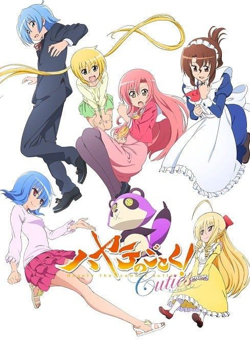

> [!bookinfo|noicon]+ **旋风管家 Cuties**
> 
>
| 日文名 | ハヤテのごとく! Cuties |
|:------: |:------------------------------------------: |
| 类型 | 漫改 |
| 新番 | 2013 年 4 月 |
| 集数 | 共12话 |
| 官网 |  |
| 制作 | Manglobe |
| 导演 | 工藤昌史 |
| 脚本 | 小鹿りえ,高橋ナツコ |
| 评分 | 6.5|
| 制片人 | 河内山隆 |

> [!abstract]+ **简介**
> 《旋风管家！Cuties》是根据日本漫画家畑健二郎连载于《周刊少年SUNDAY》上的人气漫画《旋风管家！》改编的电视动画，亦是《旋风管家》系列电视动画的第4期作品，描写大小姐三千院凪和为偿还借款而打工的管家绫崎飒的“管家恋爱喜剧”。其前作《旋风管家！ CAN'T TAKE MY EYES OFF YOU》在2012年10月播放，而在《周刊少年SUNDAY》2013年第14号上则宣布了《旋风管家！Cuties》动画化的消息，电视动画将于2013年4月8日开始播放。

据官网消息，这次新作动画将采用单元剧的形式，每话以不同角色为主角，例如第1话的主角是绫崎飒，第2话是三千院凪，第3话是天王州雅典娜，第4话是鹭之宫伊澄和爱泽咲夜等等，有些类似部分GALGAME改编动画的感觉，用这种人人有份的方式，来让各路角色FANS满意。除此之外，动画ED每话也各不相同，而OP则将由人气声优伊藤静以其配音角色桂雏菊的身份演唱。

> [!tip]+ **章节列表**
>- [ ] 第1话：綾崎ハヤテ (2013-04-08)
>- [ ] 第2话：三千院ナギ (2013-04-15)
>- [ ] 第3话：天王州アテネ (2013-04-22)
>- [ ] 第4话：鷺ノ宮伊澄と愛沢咲夜 (2013-04-29)
>- [ ] 第5话：桂ヒナギク (2013-05-06)
>- [ ] 第6话：瀬川泉と他2人 (2013-05-13)
>- [ ] 第7话：水蓮寺ルカ (2013-05-27)
>- [ ] 第8话：西沢歩 (2013-06-03)
>- [ ] 第9话：春風千桜と剣野カユラ (2013-06-10)
>- [ ] 第10话：玛丽亚 (2013-06-17)
>- [ ] 第11话：ドアをノックするのは誰だ？ (2013-06-24)
>- [ ] 第12话：愛し愛されて生きるのさ (2013-07-01)

> [!tip]+ **主要角色**
> 
| 角色 | CV | 简介| 角色图片 |
|:----:|:---:|:---:|:--------:|
| 三千院ナギ | 釘宮理恵 |  |  |
| マリア | 田中理恵 |  |  |
| 桂ヒナギク | 伊藤静 | 动漫作品《旋风管家》中的主要角色之一，外形是粉红色长发，眼晴为黄绿色，为了活动方便，裙下常穿着安全裤。一年级就当上白皇学院高中部的学生会长，与担任教师的姐姐有着完全不一样的评价。家中有养父、养母、亲姐姐雪路。是个才色兼备，任何事情都很努力的女孩，但无法克服自己的惧高症。 |  |
| 鷺ノ宮伊澄 | 松来未祐 |  |  |
| 綾崎ハヤテ | 白石涼子 |  |  |
| 愛沢咲夜 | 植田佳奈 | 三千院家的表亲戚，典型的关西人，性格爽朗，爱好是漫才，还喜欢用折扇打别人的脑袋。 与小凪和伊澄不同，不仅在常识上，在态度上也完全看不出大小姐的架子。 |  |
| 貴嶋サキ | 中島沙樹 |  |  |
| 橘ワタル | 井上麻里奈 |  |  |
| 桂雪路 | 生天目仁美 |  |  |
| 西沢歩 | 高橋美佳子 |  |  |
| 瀬川泉 | 矢作紗友里 |  |  |
| 花菱美希 | 中尾衣里 |  |  |