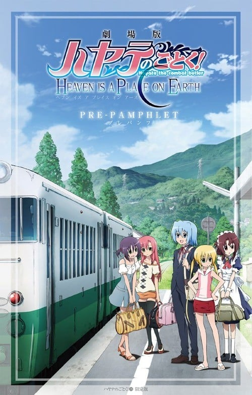

> [!bookinfo|noicon]+ **旋风管家 HEAVEN IS A PLACE ON EARTH**
> 
>
| 日文名 | 劇場版 ハヤテのごとく! HEAVEN IS A PLACE ON EARTH |
|:------: |:------------------------------------------: |
| 类型 | 漫改 |
| 新番 | 2011 年 8 月 |
| 集数 | 共1话 |
| 官网 | [http://www.hayate-project.com/](https://http://www.hayate-project.com/) |
| 制作 | Manglobe |
| 导演 | 小森秀人 |
| 脚本 | 小林靖子 |
| 评分 | 6.5|
| 制片人 | 河内山隆 |

> [!abstract]+ **简介**
> 在暑假快将完结的时候，管家绫崎飒和他的主人三千院凪大小姐，连同一众好友来到西泽步的乡村田舍。在没有动画和游戏，以致手提电话讯号不清的状况下，管家和大小姐等人卷入了奇怪的事当中……

> [!tip]+ **章节列表**
>- [ ] 第1话：剧场版 旋风管家 HEAVEN IS A PLACE ON EARTH (2011-08-27)

> [!tip]+ **主要角色**
> 
| 角色 | CV | 简介| 角色图片 |
|:----:|:---:|:---:|:--------:|
| 三千院ナギ | 釘宮理恵 |  |  |
| マリア | 田中理恵 |  |  |
| 桂ヒナギク | 伊藤静 | 动漫作品《旋风管家》中的主要角色之一，外形是粉红色长发，眼晴为黄绿色，为了活动方便，裙下常穿着安全裤。一年级就当上白皇学院高中部的学生会长，与担任教师的姐姐有着完全不一样的评价。家中有养父、养母、亲姐姐雪路。是个才色兼备，任何事情都很努力的女孩，但无法克服自己的惧高症。 |  |
| 鷺ノ宮伊澄 | 松来未祐 |  |  |
| 綾崎ハヤテ | 白石涼子 |  |  |
| 愛沢咲夜 | 植田佳奈 | 三千院家的表亲戚，典型的关西人，性格爽朗，爱好是漫才，还喜欢用折扇打别人的脑袋。 与小凪和伊澄不同，不仅在常识上，在态度上也完全看不出大小姐的架子。 |  |
| 橘ワタル | 井上麻里奈 |  |  |
| 桂雪路 | 生天目仁美 |  |  |
| 西沢歩 | 高橋美佳子 |  |  |
| 天王州アテネ |  | 飒的青梅竹马，也是夺去了飒的初吻的女角色。似乎拥有神奇的力量，激发起飒体内异能的人。小雅是飒对她的称呼。     住在“王族的庭城”，是原本只有一个人住的神秘空间。后来飒来到时挽留了他。对飒十分的爱护，但因为给飒的约定戒指遭飒父母拿去典当，曾不惜一切让飒不要回到父母身边（因为自己出不去），最终抱憾分离。其后即时被从飒手中拿到王玉的战救出，战在此后一直失踪，而雅典娜和飒也到了黄金周事件时才再次见面。     现任白皇学园理事长之一，与帝有谜样的合作关系。曾想过回到庭院调查战是否安全的出来，结果在黄金周在雅典和小飒相遇。     飒表明雅典娜是他最喜欢的人，是唯一被承认的女朋友。但雅典娜察觉到飒当上管家后对凪的感情，所以决心与他正式分手。然后又决定回日本。其实两者明确说明十几年前是互相喜欢，两者还没有表示现在是否还喜欢，这样看来雅典娜是现在还是喜欢飒。至于凪是飒的救命恩人，飒曾数次起誓要永远守护凪。     飒也有说过目前的他没有权利能选择跟谁在一起。     目前由于不明原因，丧失了“天王州雅典娜”的力量和部分记忆而成为小孩子的模样，由于“天王州雅典娜”信任小飒所以依附他并且需要借助白樱之力恢复力量，因此以爱丽丝的假名与雏菊暂时住进紫之馆三个月。     目前也是可以看见神父的人（请见漫画第346话）。 |  |
| 白皇学院 |  | 借金執事ラブコメマンガ『ハヤテのごとく!』に登場する小中高一貫校。  国内有数の進学校であり、作中の登場人物の多くが在籍している（のだが、ヒロインの三千院ナギがロクに授業に出ないので学園が舞台になることはさほど多くない）。主人公の綾崎ハヤテもナギに雇用されてから勉強を積み無事編入試験に合格した。  敷地は東京都杉並区全域に及ぶほど広大であり、校風はかなり自由。在籍生徒は1000名。  前述のようにナギが授業にほぼ全欠席していても、進学に支障が無い事から、進級においては定期テストで高得点さえ取っていれば（また成績が悪くても芸能やスポーツなどの課外活動などで学校の知名度向上に貢献していれば）出席日数の評価は全く関係ない進学システムとなっている。また、そのために出席日数の評定は、ほぼ赤点生徒の救済措置という傾向が強い。  台湾版では大学に変更されているが全く違和感が無い。そのくらいだだっ広い。  作画者が同じである事から『それが声優!』にも登場する学校だが、同作においては『ハヤテのごとく!』とはシステム上異なる部分が多々あり、同じ学校と考えるには無理がある。（後述） |  |