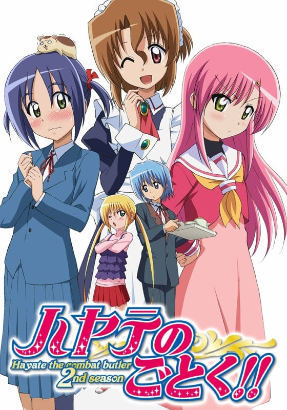
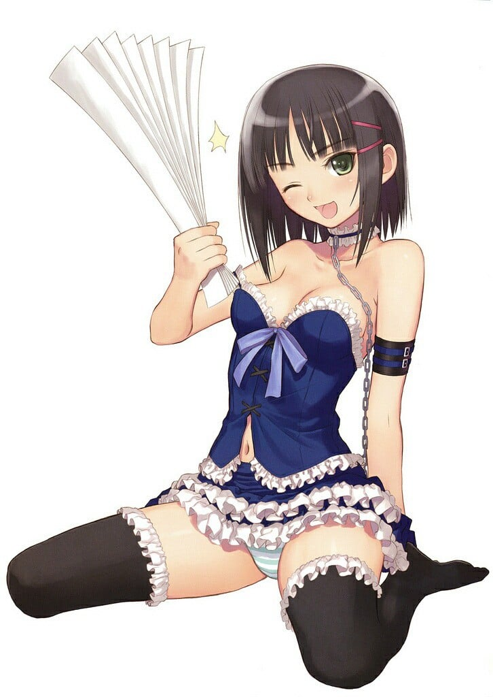
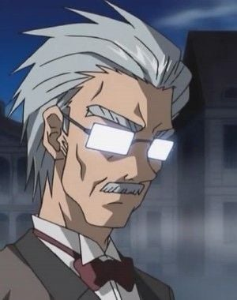

> [!bookinfo|noicon]+ **旋风管家 第二季**
> 
>
| 日文名 | ハヤテのごとく!! |
|:------: |:------------------------------------------: |
| 类型 | 漫改 |
| 新番 | 2009 年 4 月 |
| 集数 | 共25话 |
| 官网 |  |
| 制作 | J.C.STAFF |
| 导演 | 岩崎良明 |
| 脚本 | ヤスカワショウゴ,白根秀樹,黒田洋介,髙橋龍也,中野麻衣,兵頭一歩,伊藤美智子 |
| 评分 | 7.3|
| 制片人 | 柏田真一郎 |

> [!abstract]+ **简介**
> 恋爱与管家的大骚动!!

这部电视动画的第二季改编自一部受欢迎的漫画。高中生绫崎飒为了替父母偿还他们所欠下的1亿5000万日元债务，成为了大富豪千金三千院凪的管家。为了侍奉凪、保护凪，以及偿还对凪的债务，绫崎日夜努力，立志成为一流的管家。

恋に執事に大騒ぎ!!

人気コミックを原作にしたTV第2シリーズ。高校生の綾崎ハヤテは両親の作った借金1億5000万円を肩代わりしてくれた大富豪のお嬢さまである三千院ナギに執事として仕えることに。ナギに仕え、ナギを守り、そしてナギに借金を返すため、日夜一流の執事となるべく努力しているのだった。

> [!tip]+ **章节列表**
>- [ ] 第1话：禁断的自由马拉松！ (2009-04-03)
>- [ ] 第2话：招财虎 (2009-04-10)
>- [ ] 第3话：虽然无法成为传说 (2009-04-17)
>- [ ] 第4话：你与我相似 (2009-04-24)
>- [ ] 第5话：心连心 (2009-05-01)
>- [ ] 第6话：你的乐园 (2009-05-08)
>- [ ] 第7话：吃醋是烧烤着的日本 (2009-05-15)
>- [ ] 第8话：白野威来了 (2009-05-22)
>- [ ] 第9话：少女心所求之物是…… (2009-05-29)
>- [ ] 第10话：礼物的行踪 (2009-06-05)
>- [ ] 第11话：女儿节之时 (2009-06-12)
>- [ ] 第12话：残酷的大白痴行动纲领 (2009-06-19)
>- [ ] 第13话：感受自由 (2009-06-26)
>- [ ] 第14话：鹭之宫家一族 (2009-07-03)
>- [ ] 第15话：下田温泉的蒸汽旅情 (2009-07-10)
>- [ ] 第16话：星屑的回忆 (2009-07-17)
>- [ ] 第17话：在樱花树下 (2009-07-24)
>- [ ] 第18话：白色情人节没吃够苦头的人们 (2009-07-31)
>- [ ] 第19话：瞄准王者之座 (2009-08-07)
>- [ ] 第20话：无法完成女仆转身 (2009-08-14)
>- [ ] 第21话：不管怎么说 还是自己家的猫最可爱 (2009-08-21)
>- [ ] 第22话：保持梦想 (2009-08-28)
>- [ ] 第23话：我们的行踪 (2009-09-04)
>- [ ] 第24话：距离 (2009-09-11)
>- [ ] 第25话：因为是管家和大小姐的故事 (2009-09-18)

> [!tip]+ **主要角色**
> 
| 角色 | CV | 简介| 角色图片 |
|:----:|:---:|:---:|:--------:|
| 三千院ナギ | 釘宮理恵 |  |  |
| マリア | 田中理恵 |  |  |
| 桂ヒナギク | 伊藤静 | 动漫作品《旋风管家》中的主要角色之一，外形是粉红色长发，眼晴为黄绿色，为了活动方便，裙下常穿着安全裤。一年级就当上白皇学院高中部的学生会长，与担任教师的姐姐有着完全不一样的评价。家中有养父、养母、亲姐姐雪路。是个才色兼备，任何事情都很努力的女孩，但无法克服自己的惧高症。 |  |
| 鷺ノ宮伊澄 | 松来未祐 |  |  |
| 綾崎ハヤテ | 白石涼子 |  |  |
| 牧村志織 | 佐藤利奈 |  |  |
| 愛沢咲夜 | 植田佳奈 | 三千院家的表亲戚，典型的关西人，性格爽朗，爱好是漫才，还喜欢用折扇打别人的脑袋。 与小凪和伊澄不同，不仅在常识上，在态度上也完全看不出大小姐的架子。 |  |
| 貴嶋サキ | 中島沙樹 |  |  |
| 橘ワタル | 井上麻里奈 |  |  |
| 桂雪路 | 生天目仁美 |  |  |
| 西沢歩 | 高橋美佳子 |  |  |
| 倉臼征史郎 | 三宅健太 |  |  |