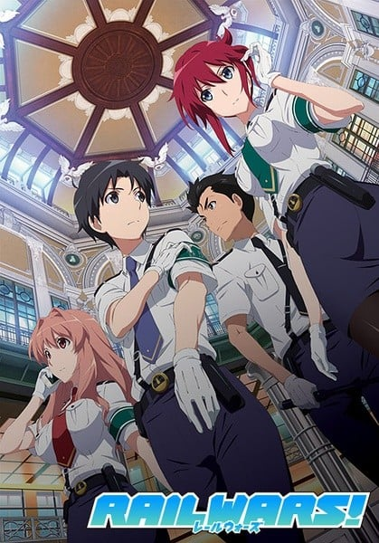
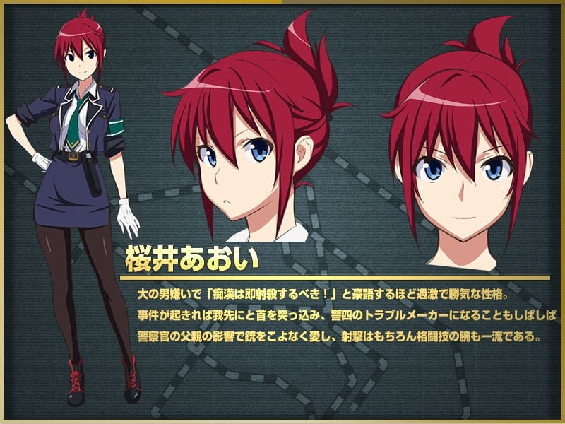
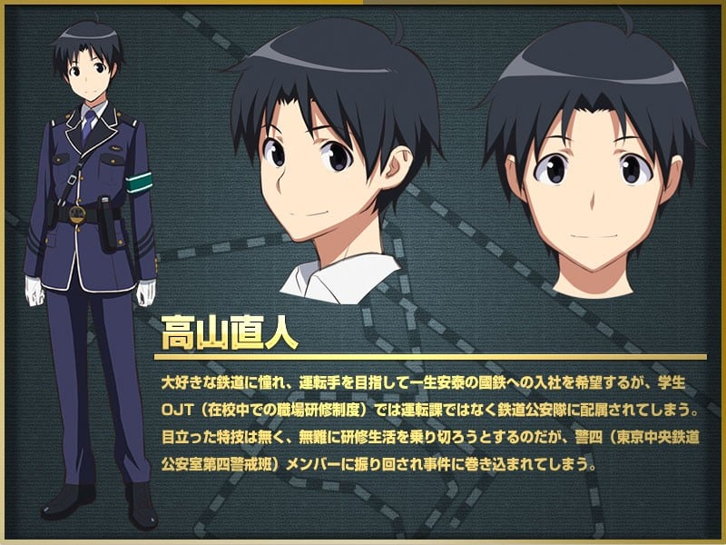
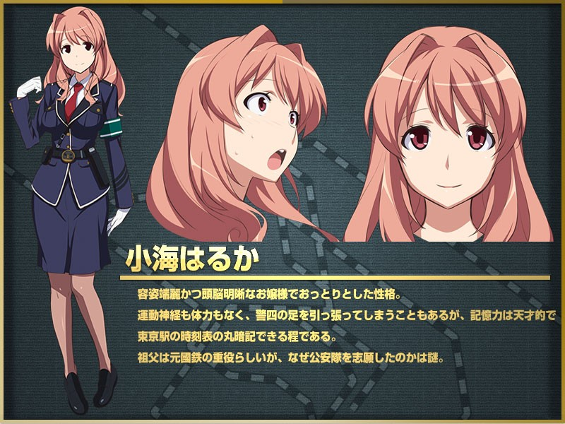
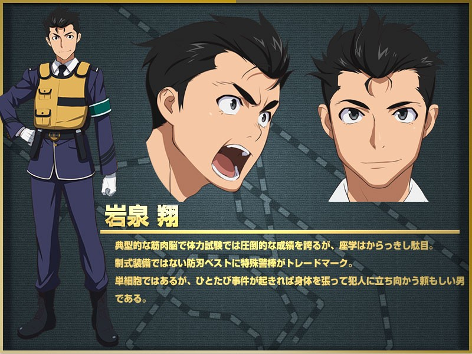
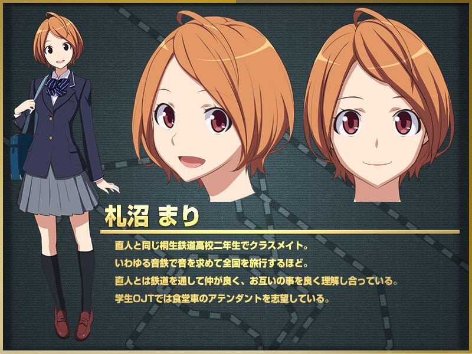
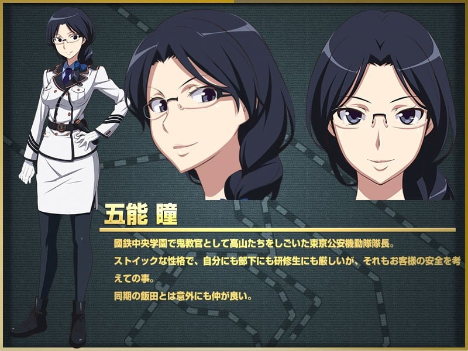

> [!bookinfo|noicon]+ **日本国有铁道公安队**
> 
>
| 日文名 | RAIL WARS! |
|:------: |:------------------------------------------: |
| 类型 | 小说改 |
| 新番 | 2014 年 7 月 |
| 集数 | 共12话 |
| 官网 | [http://www.tbs.co.jp/anime/railwars](https://http://www.tbs.co.jp/anime/railwars) |
| 制作 | パッショーネ |
| 导演 | 末田宜史 |
| 脚本 | ももいさくら,野嵜雅信,鈴木雅詞 |
| 评分 | 5.9|
| 制片人 | 林瑛介 |

> [!abstract]+ **简介**
> 以国铁没有民营化的另一个日本为舞台，描写梦幻的铁道天国娱乐故事！梦想着就职于超巨大优良企业“国铁”，而获得安定未来的平凡高中生高山直人。终于成为国铁实习生后却发现，自己所在的是以讨厌男人的樱井为首，满是奇怪家伙的“铁道公安队”，而且每天对企图铁路民营化的过激派“RJ”的阴谋诡计应接不暇。高山直人便与同为研修生的同伴岩泉翔、樱井爱生、小海春鹿合力解决各种各样的事件。

> [!tip]+ **章节列表**
>- [ ] 第1话：欢迎来到警四！ (2014-07-03)
>- [ ] 第2话：让我这样稍微待会儿 (2014-07-10)
>- [ ] 第3话：很帅气喔 (2014-07-17)
>- [ ] 第4话：说不定有点儿喜欢了呢 (2014-07-24)
>- [ ] 第5话：不许偷看哟 (2014-07-31)
>- [ ] 第6话：我会保护你的 (2014-08-07)
>- [ ] 第7话：我觉得挺合适的 (2014-08-14)
>- [ ] 第8话：由我来送达！ (2014-08-21)
>- [ ] 第9话：谢谢 (2014-08-28)
>- [ ] 第10话：可以帮我保密吗？ (2014-09-04)
>- [ ] 第11话：我就陪陪你吧 (2014-09-11)
>- [ ] 第12话：大家都等着哦 (2014-09-18)

> [!tip]+ **主要角色**
> 
| 角色 | CV | 简介| 角色图片 |
|:----:|:---:|:---:|:--------:|
| 桜井あおい | 沼倉愛美 | 本作女主角，樱花女子高中二年级生，讨厌男性（属于存有偏见的类型），但对直人意外的有信任，似乎存有好感。加入公安队的理由是“想要射杀色狼”，刚进学生铁道OJT时因为新人不会被派遣危险任务而感到相当失望。 由于受父亲期待成为女警的缘故，从小就在海外进行射击训练与合气道。 姓氏取自樱井线。 |  |
| 高山直人 | 福山潤 | 本作主人公，桐生铁路高中二年级生（旅客运输科），被任命担任警四的代理班长。 一心想进入国铁工作，一方面是自身就是铁道迷，小时候就很喜欢铁道，也对铁道相关的资讯非常清楚，并希望成为新干线或磁浮列车的驾驶，另一方面是本性较追求安稳的生活，国铁福利制度完善，又不会有裁员危机，因此国铁工作十分适合自己需求。然而刚进学生铁道OJT时得知自己是被排在公安队顿时感到失望，认为与本追求安稳的国铁生活完全不符，不过因为新人不会被派遣危险任务而让他暂时松口气，对公安队的工作仍然十分尽职。 小时候曾被一位DD51型的驾驶救过一命，这也成为他如此憧憬当国铁驾驶的原因之一。 每天早上都在房间里用超大规模的铁道模型练习驾驶。 姓氏取自高山本线。 |  |
| 小海はるか | 内田真礼 | 容姿端丽、天然纯真、头脑明晰的巨乳少女。白精华高中二年级生。有着能够记住东京车站全部列车时刻表的记忆力。对直人表示想国铁工作是为了见某人。年幼时曾在交通博物馆受困于仓库中后被直人所救，因此对直人有好感与恩情，但直人本身已不太记得此事。 缺乏运动神经，短期研修进行射击训练时曾经打中天花板。 姓氏取自小海线。 |  |
| 岩泉翔 | 日野聡 | 樱堤高中二年级生，做事不会详细思考的行动派。体能杰出，研修时体力测验往往能够拿到高分，文科方面的成绩却惨不忍睹，常常要补考或补修。 解决问题时会以武力为优先，因此常身着防刺背心，并随身携带附电击枪功能的两根新型特殊警棒。 姓氏取自岩泉线。 |  |
| 札沼まり | 五十嵐裕美 | 与直人同样就读桐生铁路高中的二年级生，是一名音铁（“音鉄”，指对列车行驶声、车内广播特别有兴趣的铁道迷），喜欢随身带着粉红色小型录音笔旅行全国各地，录下铁路的声音。 梦想是成为服务员，因此加入了专门以车内服务为主的“日本食堂公司”进行实务训练。 在北斗星号列车担任食堂车服务员时被卷入事件，对于当时救了她的翔有好感。 姓氏取自札沼线。 |  |
| 五能瞳 | 中原麻衣 | 东京公安机动队队长，总是站在最前线进行镇压工作。 直人等人进行短期研修时的教官，并对他们进行严格指导，与警四班长的奈奈为同期。 姓氏取自五能线。 |  |
| 飯田奈々 | 堀江由衣 | 警四的班长，个性温柔，对于仍是高中生的直人等人给予高度信任。 与机动队队长五能瞳是同期研修生，曾经一起行动。研修时代不论是射击或测验都胜过瞳。 姓氏取自饭田线。 |  |
| 鹿島乃亜 | 茅原実里 | 高中生，四人偶像团体“unoB”的主唱，并负责作词、作曲。 曾担任一周的铁道公安队长。 姓氏取自鹿岛线。 |  |
| アナウンス | 末柄里恵 | 各作品通用广播/播音员。 |  |
| ベルニナ | 今野宏美 | 地中海小国阿特拉王国的王子，家族王位继承顺位为第五位，金发碧眼的美少年。也是一名铁路迷。 为了拜访友好城市札幌市而搭乘北斗星号列车前往并由警四负责护送，结果途中遭可疑份子袭击。 与遥过去就认识（说是在英国留学时的同学）。真实性别其实是女性，似乎因特别原因才冒充成男性，该秘密目前仅有王族中少数人与直人知道。似乎对直人有好感。 |  |