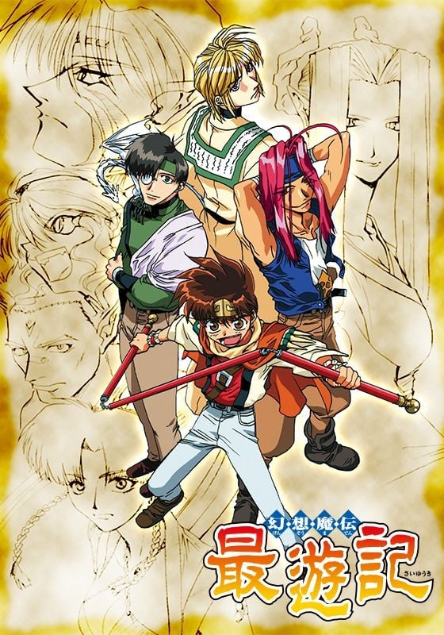
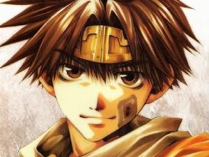
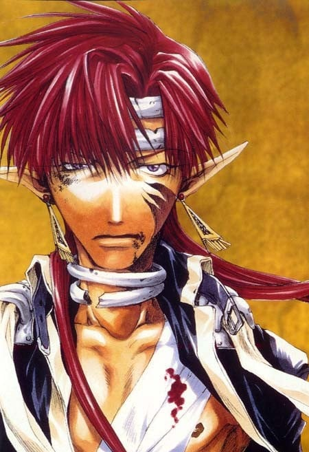
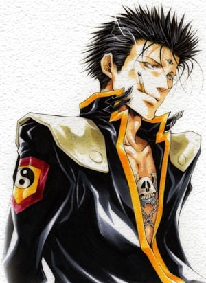
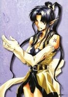
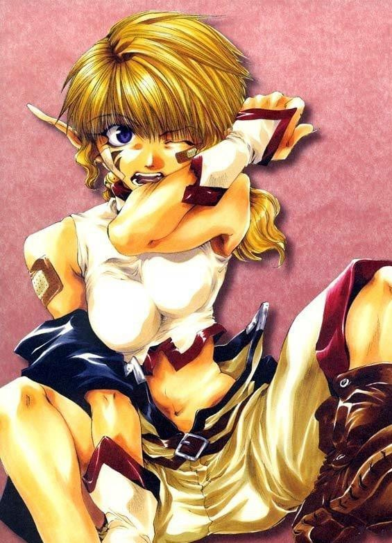
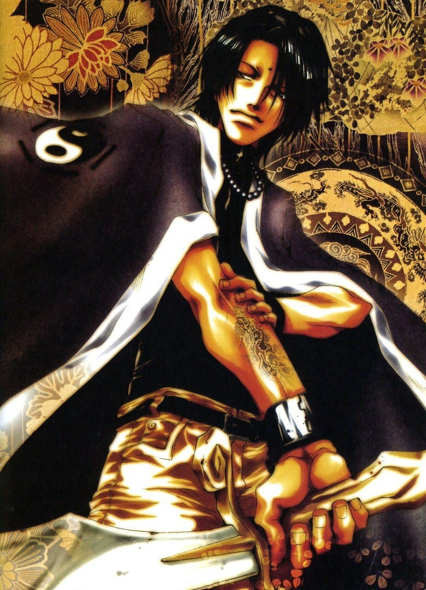

> [!bookinfo|noicon]+ **最游记**
> 
>
| 日文名 | 幻想魔伝 最遊記 |
|:------: |:------------------------------------------: |
| 类型 | 漫改 |
| 新番 | 2000 年 4 月 |
| 集数 | 共50话 |
| 官网 | [https://www.tv-tokyo.co.jp/anime/saiyuki/](https://https://www.tv-tokyo.co.jp/anime/saiyuki/) |
| 制作 | ぴえろ |
| 导演 | 伊達勇登 |
| 脚本 | 大和屋暁,西園悟,横手美智子,隅沢克之,矢島大輔 |
| 评分 | 6.9|
| 制片人 | 朴谷直治 |

> [!abstract]+ **简介**
> 一个宗教和文明起源的地方——桃源乡，人类和妖怪在那里和平共处，但反派角色玉面公主想让牛魔王苏醒而引发怪物突然作乱，致使桃源的妖怪们变得狂暴，世界失去了平衡！为取回妖怪们的自我意识，也为了让桃源乡恢复原状，观世音菩萨命令三藏一行人前往西域找出原因，并阻止事情的恶化！

> [!tip]+ **章节列表**
>- [ ] 第1话：往遥远的西方去 Go to the west (2000-04-04)
>- [ ] 第2话：带领通往黄泉路之人 Frist game (2000-04-11)
>- [ ] 第3话：His god My god 〜神のいる場所〜 (2000-04-18)
>- [ ] 第4话：Crimson 〜茜色の涙〜 (2000-04-25)
>- [ ] 第5话：Pure Assassin 〜美しき暗殺者〜 (2000-05-02)
>- [ ] 第6话：Shower of Bullets(Rancorous exchange) 〜呪符の怪僧〜 (2000-05-09)
>- [ ] 第7话：Good Night〜黄昏の別れ〜 (2000-05-16)
>- [ ] 第8话：Confront 〜死を占う男〜 (2000-05-23)
>- [ ] 第9话：Lethal Trap 〜戦いの宴〜 (2000-05-30)
>- [ ] 第10话：Fake the Face 〜偽りの救世主〜 (2000-06-06)
>- [ ] 第11话：Tragic Revenge〜笑う死神〜 (2000-06-13)
>- [ ] 第12话：Wandering Destiny 〜闇との攻防〜 (2000-06-20)
>- [ ] 第13话：Crude Counterfeit 〜死を呼ぶ果実〜 (2000-06-27)
>- [ ] 第14话：Sweet Client 〜ふたりの約束〜 (2000-07-04)
>- [ ] 第15话：Fated Guys 〜紅（あか）の呪縛〜 (2000-07-11)
>- [ ] 第16话：Be There 〜生者への讃歌〜 (2000-07-18)
>- [ ] 第17话：Eden 〜終わりなき楽園〜 (2000-07-25)
>- [ ] 第18话：Vice or Justice 〜正義の真実〜 (2000-08-01)
>- [ ] 第19话：Don't Go Alone 〜嘆きの乙女たち〜 (2000-08-08)
>- [ ] 第20话：Sandstorm 〜流砂の罠〜 (2000-08-15)
>- [ ] 第21话：Selfish 〜破滅への暴走〜 (2000-08-22)
>- [ ] 第22话：Devastation 〜闘いの果て〜 (2000-08-29)
>- [ ] 第23话：Scapegoat 〜服従の代価〜 (2000-09-05)
>- [ ] 第24话：Mother 〜紅（あか）の絆〜 (2000-09-12)
>- [ ] 第25话：Tomfool! Tomboy! 〜戦慄の刺客!〜 (2000-09-19)
>- [ ] 第26话：Calling 〜届かざる叫び〜 (2000-09-26)
>- [ ] 第27话：Advent 〜降臨・闘神太子〜 (2000-10-03)
>- [ ] 第28话：Lonely War 〜反逆の狼煙〜 (2000-10-10)
>- [ ] 第29话：Unexpected Defeat 〜吠登城・陥落〜 (2000-10-17)
>- [ ] 第30话：Undertaker 〜地獄への招待状〜 (2000-10-24)
>- [ ] 第31话：Ambition 〜神々の驕り〜 (2000-10-31)
>- [ ] 第32话：Fake Star Strike Back 〜道化師の誇り〜 (2000-11-07)
>- [ ] 第33话：Faraway Dream 〜枯れた泪〜 (2000-11-21)
>- [ ] 第34话：Second Contact 〜闘神再び〜 (2000-11-28)
>- [ ] 第35话：Solitude 〜孤独の魂〜 (2000-12-05)
>- [ ] 第36话：Brotherhood 〜紅い花〜 (2000-12-12)
>- [ ] 第37话：Taciturnity 〜閉ざされた微笑〜 (2000-12-19)
>- [ ] 第38话：Fleeting Vision 〜はたせぬ約束〜 (2000-12-26)
>- [ ] 第39话：Misty Rain 〜雨〜 (2000-01-09)
>- [ ] 第40话：Twilight 〜不機嫌な太陽〜 (2000-01-16)
>- [ ] 第41话：Collage 〜静かなる波紋〜 (2000-01-23)
>- [ ] 第42话：Festival 〜忘れえぬ風景〜 (2000-01-30)
>- [ ] 第43话：Tears 〜虚像の街〜 (2000-02-06)
>- [ ] 第44话：Plunderer 〜経文強奪〜 (2000-02-13)
>- [ ] 第45话：Glorious Days 〜夜明け前〜 (2000-02-20)
>- [ ] 第46话：Chaos 〜揺らぐ大地〜 (2000-02-27)
>- [ ] 第47话：Guilty or Not Guilty 〜戒罪〜 (2000-03-06)
>- [ ] 第48话：Absolutely Heaven 〜自由への扉〜 (2000-03-13)
>- [ ] 第49话：Missing Desire 〜輝く楽園〜 (2000-03-20)
>- [ ] 第50话：Alone 〜西へ〜 (2000-03-27)

> [!tip]+ **主要角色**
> 
| 角色 | CV | 简介| 角色图片 |
|:----:|:---:|:---:|:--------:|
| 孫悟空 | 保志総一朗 | 五百年前从花果山岩石中诞生的奇异生命体，观音把他交给金蝉童子（三藏前世）抚养，后与哪吒、卷帘大将、天蓬元帅成为好友。由于犯下罪过，天界上级要求观音抹去悟空的所有记忆，但观音自私地违背命令，保留了金蝉为他取的名字——孙悟空。悟空不像其它三人一样有前世，他根本就没有死过，只是在五行山被关押了五百年。五百年后被三藏释放，随后被其收养。 爱好为吃东西，而且食量异常惊人，总是肚子饿。性格单纯，思维方式简单直接。虽然看上去没有心计又很笨又很迷糊的样子，但是实际上可以在无意间准确地洞察事情和人的本质。 身材矮小但健壮，精力充沛。头上佩戴的金箍是妖力控制装置，卸下之后妖力会得到无限释放，成为妖怪“齐天大圣”。同时，他的外形也会发生变化（头发、耳朵、指甲变长变尖），整个人此时完全失去理智，无法克制自己想要杀人、破坏的欲望。这个状态下，悟空的力量、速度、恢复力都是惊人的，他通过吸收大地灵气可快速自愈。戴回金箍后会变回原来的样子，也会丧失变身这段时间的记忆。 |  |
| 猪八戒 | 石田彰 | 原名猪悟能，自幼生长在孤儿院，长大后的恋人花喃居然是自己失散多年的的姐姐（二人并不知情）。后来花喃因美貌被百眼魔王抓走做了妻子。为了救她，悟能杀光了百眼魔王府上大大小小全部的妖怪。然而花喃因为受辱怀孕的原因在他面前自尽了。由于淋了一千个妖怪的血，悟能自己也变成了妖怪。重伤的他在雨夜倒在路边，被路过的悟净所救。在逮捕他的三藏帮助下，他的谋杀罪被三佛神赦免，改名“八戒”，开始新的生活。 幼年性格孤僻冷漠，后来变得和善开朗。为人温柔善良，内心细腻，但有些腹黑。八戒博学多才，思考问题细致全面，总能观察出他人心中所想。八戒是西行的司机，照顾着全组人的饮食起居，算是个名符其实的男保姆。 八戒的右眼是义眼，所以在右侧佩戴单片镜片作为掩饰。八戒没有武器，他使用气功与体术结合作战。气功不仅可以用于进攻，还可以用气功制作防护壁以及为人疗伤。左耳的三个耳夹是妖力控制装置，卸下之后头发、耳朵、指甲变长变尖，妖力成倍释放，全身上下布满青藤花纹，可使用青藤花纹束缚对手。人与妖的两种状态之间，八戒的意识是较为清醒的。 前世为天界军中的天蓬元帅。 |  |
| 玄奘三蔵 | 関俊彦 | 原是河里漂来的弃儿，被金山寺的光明三藏所救并抚养长大，随后收为弟子。最初取名为“江流”。自幼受僧人歧视，却天赋秉异。众妖攻陷金山寺时师父被杀，三藏带着继承自师傅的“魔天经文”逃离，在江湖流浪多年寻找失去的“圣天经文”，到达长安后辗转成为庆云院的住持。在观世音菩萨与三佛神的指引下，与悟空、悟净与八戒三人前往天竺国阻止牛魔王复活实验。 完全不像个出家人的样子，嗜烟酒。性格傲慢，叛逆不羁，意志坚定，不愿受任何人的束缚。外冷内热，外表冷静，实际上冲动易怒，经常被悟空和悟净的胡闹而惹火，生气时会掏出扇子打人或是朝两人射击。 金发紫瞳，身着三藏法师标准法衣，肩上背负着五部“天地开元经文”之一的“魔天经文”，终极奥义是“魔界天净”，有着净化魔物的能力。三藏常用武器是一把手枪，枪法很准。 前世为天界的金蝉童子。 |  |
| 沙悟浄 | 平田広明 | 悟净是半妖，是妖怪（父）与人类（母）生下的“禁忌之子”。他由父亲的妖怪正妻带大，但是童年却常受她虐待。悟净八岁那年，正妻终因忍受不了而想劈死他。同父异母的哥哥沙慈燕为救悟净杀了自己的亲生母亲，随后失踪。此后悟净一人流浪四处，做过小混混。遇见八戒他们前，一直过着颓废的生活。 性格恶劣、风流好色，喜好美女、啤酒和香烟，也喜欢赌博。讲话很没口德，喜欢与人对着干。但同时又有为人豪爽直率的一面，很为他人着想，是个烂好人，常为他人打抱不平。 由于是“禁忌之子”，悟净有着红色的长发和双眼，也没有生育能力（可以肆无忌惮地纵情声色）。头顶有两根很长的呆毛，常被悟空吐槽为“蟑螂的触须”。半妖的体质赋予他很强的战斗力，四肢强健有力，使用的是锡月杖，镰刃的一头可以携带锁链飞出，杀伤力极强。 前世为天界军中的卷帘大将。 |  |
| 紅孩児 | 草尾毅 | 红发红瞳的妖怪，牛魔王与罗刹女的独生子。因其超凡地位和人格魅力成为妖怪们心中的偶像型人物。500年前与其父牛魔王一同被封印于天竺国吠登城，后被玉面公主解开封印。因一心想救出被封印的母亲罗刹女而甘愿被玉面公主利用，带领手下团队收集四散各地的天地开元经文，期间与三藏一行相识，成为了亦敌亦友的对手。他与自己的团队总是正大光明地与三藏一行决斗，从不不趁人之危，尽管常常不能得手，但他遵循着自己的决斗方式。一度被你建一洗脑，丧失自我，与三藏一行再次交手后恢复神智。 性格外冷内热，看似冷漠，实则非常关心在乎家人与朋友。同时坚韧不拔，无惧失败。早先在酷酷的外表下常流露出困惑的神情，与悟空一战过后从悟空那里学到了为自己而战的道理，坚定了自己拯救母亲的信念。 作战从不使用武器，有着很强大的拳脚功夫和火焰法术，也常常召唤契约兽参与作战。 |  |
| 金蟬童子 | 関俊彦 | 观世音菩萨的侄子。在天界地位颇高。 通晓书頖，是文弱书生。 典型的默默做事，对外物感觉起伏不大。 体力很差，不甚通晓世俗。 悟空的出现，再受到天蓬和卷帘的影响，性格也开始改变。决定改变过去不理不睬的态度，追求自己想保护的东西。 |  |
| 捲簾大将 | 平田広明 | 天界西方军的大将，喜欢酒、花和女人的无赖。 原属东方军的武将，因与上司的妻子通奸而被降职至西方军，成为天蓬元帅的部下。 性格大胆，充满男子气概。 对于世事通晓，喜欢下界事物，最爱钓鱼，有恐高症。 对小孩和部下，是一个“大哥哥”的存在。 与天蓬以夫妻相称。 对天界的事物和主张存有怀疑。 动画中与转生沙悟净有相同的红发红眼，但峰仓和也在彩图中是黑发蓝眼。 |  |
| 天蓬元帥 | 石田彰 | 天界西方军元帅。 喜欢读书，房间西南楼常常被书淹埋。 喜欢下界的东西，会把下界的“美型艺术品”带回天界；但所谓“美型艺术品”在别人眼中却是怪异的造型。 飘泊不定的性格，令人难以捉摸，只相信自己。 有书卷气息，常穿着实验室白袍，头发及肩，相貌端正，但会因读书而不打理自己。 是一位有名的军人，战斗时冷静沈著，有很高的战斗力和洞察力。 别人眼中的怪胎。 动画中与转生猪八戒有相同的绿眼，但峰仓和也在彩图中眼睛有多种颜色，有琥珀色、紫色，其中紫色最常见。 |  |
| 八百鼡 | 皆口裕子 | 黑发黑瞳（略带些蓝色或紫色光泽）的纯血妖怪，红孩儿的手下直属药师。八百鼠生在一个双亲皆为药师的妖怪家庭，父母被百眼魔王所杀，她本人因为美貌被做为贡品送给百眼魔王做妻子。她在红孩儿的帮助下脱离了魔爪，此后便作为部下一直追随红孩儿。八百鼠性格善良温柔，也自立自强，对待红孩儿忠心耿耿，非常在乎他。与八戒也有些缘分，每次与三藏一行交战，八百鼠都会选择与八戒做对手。有着天然呆的温柔性格，同时也有着冒失的 八百鼠的武器为细杆长枪和炸药，精通毒药及各种方剂的使用，也擅长为人疗伤。 |  |
| 李厘 | 茂呂田かおる | 金发绿瞳的妖怪少女，牛魔王与玉面公主的女儿（红孩儿的同父异母的妹妹，一直被红孩儿所照顾）。性格天真可爱，爱好为吃东西（和悟空一样，食欲惊人旺盛）和给三藏一行（尤其是三藏）找麻烦。向往母爱，但亲生母亲玉面公主一直在利用她。因为要利用她的基因复活牛魔王，玉面公主强制用她进行实验，最后被红孩儿救出。 李厘没有武器，善用拳脚。因为父母的缘故，天生怪力，能一拳将巨大的怪物击倒。 |  |
| 焔 | 森川智之 | TV原创人物，天界的斗神太子，是玉帝的亲戚，但他的母亲是天女，父亲却是人类，他生下来双眼颜色不同，一紫一黄，黄金眼在天界被视为异端，被人看不起。从小生活在暗无天日的地牢里，后来与天女菱丽相恋，但却被天帝无情地摧毁，菱丽被罚转世受轮回之苦，焰则被命为新的斗神太子代替哪吒，做着受人鄙视的杀人行当。他发誓要摧毁昏庸的天界，建立自由的“新天地”，为此他必须得到“天地开元经文”和有着金眼和强大妖力的悟空……焰由于他的特殊身份总是带着琐链，和当年的悟空一样。更不幸的是他自身的不完整性使他不能像其它神一样不老不死，他的生命是有限的，他建新天地的原因之一也是他不想死在那让他厌恶的天界，这一切都在他与悟空的决斗后实现了。 |  |
| 白竜 | 茂呂田かおる | 原作並びにOVA版では「ジープ」と呼ばれるが、『幻想魔伝 最遊記』以降のアニメ版では「白竜」と呼ばれる。 禁断の汚呪と呼ばれる、「化学と妖術の合成」によって作り出された存在であり、その証として赤紅色の眼を持つ。小説版では百眼魔王の城から紛失した宝具であることが書かれている。 普段は翼を持つ白い竜で、ジープに変身できる。変身後もある程度は自身の意思で動くことが可能。アニメ版では、火を吹いたことがある。 一度だけ、偶然出会った兄妹たちを元気付けるために内緒で夜遊びしたことがある。帰って来てから「この大きな人たち（三蔵一行）が一番放っておけない」という考えに至ったらしい。三蔵達は律儀なジープが勝手に居なくなったため、盗まれたか家出したかと心配し夜の町を探しまわっていた。 悟浄と同居していた頃に、八戒が森の中で弱っているジープを拾って以来、彼のペットになる。自動車形態での運転も基本的に八戒が行う[注 9]。悟浄とは当初、あまり仲は良くなかったが、「禁忌の存在同士」という共通点で仲良くなる。しかし、三蔵は偉い人、八戒は飼い主、悟空は自身と同等、悟浄のことは自分より下に見ているらしい。 小説版では、拾われてしばらくは「白竜」と呼ばれたが、その後“「白竜」では見た目そのままな気がする”という八戒の考えで「ジープ」と命名された経緯が書かれている。 |  |