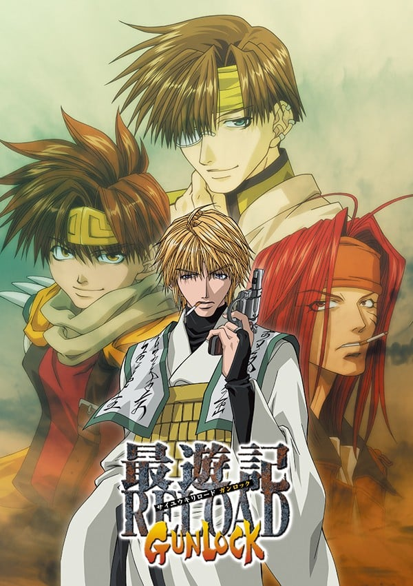
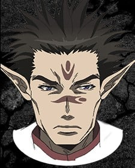
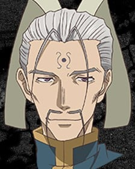
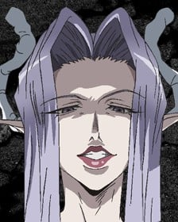

> [!bookinfo|noicon]+ **最游记RELOAD GUNLOCK**
> 
>
| 日文名 | 最遊記RELOAD GUNLOCK |
|:------: |:------------------------------------------: |
| 类型 | 漫改 |
| 新番 | 2004 年 4 月 |
| 集数 | 共26话 |
| 官网 |  |
| 制作 | ぴえろ |
| 导演 | えんどうてつや |
| 脚本 | えんどうてつや,浅川美也,山口伸明,池田日出子,友永コリエ,待田堂子 |
| 评分 | 6.8|
| 制片人 |  |

> [!abstract]+ **简介**
> 『最遊記RELOAD』の放送終了から間を置かずに、放送時間を深夜に移し、タイトルを『最遊記RELOAD GUNLOCK』と改題して2004年4月1日から2004年9月23日まで全26話が放送された。13話からはヘイゼルとガトは登場し、最終回までは「ヘイゼル篇」。話の展開や結末は現時点ではアニメオリジナルである。原作（2-6、10、13、14話）の内容を忠実に準拠、大半は『RELOAD』と同じくアニメ独自のストーリーで展開される。

> [!tip]+ **章节列表**
>- [ ] 第1话：魔物が棲む寺 〜nest〜
>- [ ] 第2话：放たれた悪夢 〜rabbits〜
>- [ ] 第3话：激流 〜against the stream〜
>- [ ] 第4话：遭遇 〜fake〜
>- [ ] 第5话：闘争 〜the opponent〜
>- [ ] 第6话：覚醒 〜back〜
>- [ ] 第7话：呪いの双六 〜inevitable game〜
>- [ ] 第8话：紅い髪の女 〜stupid woman〜
>- [ ] 第9话：対決 〜muzzle〜
>- [ ] 第10话：埋もれた夢 〜Snow drop〜
>- [ ] 第11话：八戒の家出!? 〜reflection〜
>- [ ] 第12话：からくりの館 〜two faces〜
>- [ ] 第13话：西から来た男 〜open your eyes〜
>- [ ] 第14话：奇跡の行方 〜pilgrim〜
>- [ ] 第15话：追悼の果てに 〜death wish〜
>- [ ] 第16话：再生 〜sympathy〜
>- [ ] 第17话：襲撃 〜intruder〜
>- [ ] 第18话：疑念 〜hesitation〜
>- [ ] 第19话：追憶 〜deprivation〜
>- [ ] 第20话：亀裂 〜misunderstanding〜
>- [ ] 第21话：蘇りし男 〜desperado〜
>- [ ] 第22话：策略 〜checkmate〜
>- [ ] 第23话：突破口 〜battle royal〜
>- [ ] 第24话：死闘 〜sunny day〜
>- [ ] 第25话：守るべきもの 〜truth〜
>- [ ] 第26话：慟哭 〜close your eyes〜

> [!tip]+ **主要角色**
> 
| 角色 | CV | 简介| 角色图片 |
|:----:|:---:|:---:|:--------:|
| 孫悟空 | 保志総一朗 | 五百年前从花果山岩石中诞生的奇异生命体，观音把他交给金蝉童子（三藏前世）抚养，后与哪吒、卷帘大将、天蓬元帅成为好友。由于犯下罪过，天界上级要求观音抹去悟空的所有记忆，但观音自私地违背命令，保留了金蝉为他取的名字——孙悟空。悟空不像其它三人一样有前世，他根本就没有死过，只是在五行山被关押了五百年。五百年后被三藏释放，随后被其收养。 爱好为吃东西，而且食量异常惊人，总是肚子饿。性格单纯，思维方式简单直接。虽然看上去没有心计又很笨又很迷糊的样子，但是实际上可以在无意间准确地洞察事情和人的本质。 身材矮小但健壮，精力充沛。头上佩戴的金箍是妖力控制装置，卸下之后妖力会得到无限释放，成为妖怪“齐天大圣”。同时，他的外形也会发生变化（头发、耳朵、指甲变长变尖），整个人此时完全失去理智，无法克制自己想要杀人、破坏的欲望。这个状态下，悟空的力量、速度、恢复力都是惊人的，他通过吸收大地灵气可快速自愈。戴回金箍后会变回原来的样子，也会丧失变身这段时间的记忆。 |  |
| 猪八戒 | 石田彰 | 原名猪悟能，自幼生长在孤儿院，长大后的恋人花喃居然是自己失散多年的的姐姐（二人并不知情）。后来花喃因美貌被百眼魔王抓走做了妻子。为了救她，悟能杀光了百眼魔王府上大大小小全部的妖怪。然而花喃因为受辱怀孕的原因在他面前自尽了。由于淋了一千个妖怪的血，悟能自己也变成了妖怪。重伤的他在雨夜倒在路边，被路过的悟净所救。在逮捕他的三藏帮助下，他的谋杀罪被三佛神赦免，改名“八戒”，开始新的生活。 幼年性格孤僻冷漠，后来变得和善开朗。为人温柔善良，内心细腻，但有些腹黑。八戒博学多才，思考问题细致全面，总能观察出他人心中所想。八戒是西行的司机，照顾着全组人的饮食起居，算是个名符其实的男保姆。 八戒的右眼是义眼，所以在右侧佩戴单片镜片作为掩饰。八戒没有武器，他使用气功与体术结合作战。气功不仅可以用于进攻，还可以用气功制作防护壁以及为人疗伤。左耳的三个耳夹是妖力控制装置，卸下之后头发、耳朵、指甲变长变尖，妖力成倍释放，全身上下布满青藤花纹，可使用青藤花纹束缚对手。人与妖的两种状态之间，八戒的意识是较为清醒的。 前世为天界军中的天蓬元帅。 |  |
| 玄奘三蔵 | 関俊彦 | 原是河里漂来的弃儿，被金山寺的光明三藏所救并抚养长大，随后收为弟子。最初取名为“江流”。自幼受僧人歧视，却天赋秉异。众妖攻陷金山寺时师父被杀，三藏带着继承自师傅的“魔天经文”逃离，在江湖流浪多年寻找失去的“圣天经文”，到达长安后辗转成为庆云院的住持。在观世音菩萨与三佛神的指引下，与悟空、悟净与八戒三人前往天竺国阻止牛魔王复活实验。 完全不像个出家人的样子，嗜烟酒。性格傲慢，叛逆不羁，意志坚定，不愿受任何人的束缚。外冷内热，外表冷静，实际上冲动易怒，经常被悟空和悟净的胡闹而惹火，生气时会掏出扇子打人或是朝两人射击。 金发紫瞳，身着三藏法师标准法衣，肩上背负着五部“天地开元经文”之一的“魔天经文”，终极奥义是“魔界天净”，有着净化魔物的能力。三藏常用武器是一把手枪，枪法很准。 前世为天界的金蝉童子。 |  |
| 沙悟浄 | 平田広明 | 悟净是半妖，是妖怪（父）与人类（母）生下的“禁忌之子”。他由父亲的妖怪正妻带大，但是童年却常受她虐待。悟净八岁那年，正妻终因忍受不了而想劈死他。同父异母的哥哥沙慈燕为救悟净杀了自己的亲生母亲，随后失踪。此后悟净一人流浪四处，做过小混混。遇见八戒他们前，一直过着颓废的生活。 性格恶劣、风流好色，喜好美女、啤酒和香烟，也喜欢赌博。讲话很没口德，喜欢与人对着干。但同时又有为人豪爽直率的一面，很为他人着想，是个烂好人，常为他人打抱不平。 由于是“禁忌之子”，悟净有着红色的长发和双眼，也没有生育能力（可以肆无忌惮地纵情声色）。头顶有两根很长的呆毛，常被悟空吐槽为“蟑螂的触须”。半妖的体质赋予他很强的战斗力，四肢强健有力，使用的是锡月杖，镰刃的一头可以携带锁链飞出，杀伤力极强。 前世为天界军中的卷帘大将。 |  |
| 紅孩児 |  | 红发红瞳的妖怪，牛魔王与罗刹女的独生子。因其超凡地位和人格魅力成为妖怪们心中的偶像型人物。500年前与其父牛魔王一同被封印于天竺国吠登城，后被玉面公主解开封印。因一心想救出被封印的母亲罗刹女而甘愿被玉面公主利用，带领手下团队收集四散各地的天地开元经文，期间与三藏一行相识，成为了亦敌亦友的对手。他与自己的团队总是正大光明地与三藏一行决斗，从不不趁人之危，尽管常常不能得手，但他遵循着自己的决斗方式。一度被你建一洗脑，丧失自我，与三藏一行再次交手后恢复神智。 性格外冷内热，看似冷漠，实则非常关心在乎家人与朋友。同时坚韧不拔，无惧失败。早先在酷酷的外表下常流露出困惑的神情，与悟空一战过后从悟空那里学到了为自己而战的道理，坚定了自己拯救母亲的信念。 作战从不使用武器，有着很强大的拳脚功夫和火焰法术，也常常召唤契约兽参与作战。 |  |
| 八百鼡 |  | 黑发黑瞳（略带些蓝色或紫色光泽）的纯血妖怪，红孩儿的手下直属药师。八百鼠生在一个双亲皆为药师的妖怪家庭，父母被百眼魔王所杀，她本人因为美貌被做为贡品送给百眼魔王做妻子。她在红孩儿的帮助下脱离了魔爪，此后便作为部下一直追随红孩儿。八百鼠性格善良温柔，也自立自强，对待红孩儿忠心耿耿，非常在乎他。与八戒也有些缘分，每次与三藏一行交战，八百鼠都会选择与八戒做对手。有着天然呆的温柔性格，同时也有着冒失的 八百鼠的武器为细杆长枪和炸药，精通毒药及各种方剂的使用，也擅长为人疗伤。 |  |
| 李厘 |  | 金发绿瞳的妖怪少女，牛魔王与玉面公主的女儿（红孩儿的同父异母的妹妹，一直被红孩儿所照顾）。性格天真可爱，爱好为吃东西（和悟空一样，食欲惊人旺盛）和给三藏一行（尤其是三藏）找麻烦。向往母爱，但亲生母亲玉面公主一直在利用她。因为要利用她的基因复活牛魔王，玉面公主强制用她进行实验，最后被红孩儿救出。 李厘没有武器，善用拳脚。因为父母的缘故，天生怪力，能一拳将巨大的怪物击倒。 |  |
| 白竜 | 岡嶋妙 | 原作並びにOVA版では「ジープ」と呼ばれるが、『幻想魔伝 最遊記』以降のアニメ版では「白竜」と呼ばれる。 禁断の汚呪と呼ばれる、「化学と妖術の合成」によって作り出された存在であり、その証として赤紅色の眼を持つ。小説版では百眼魔王の城から紛失した宝具であることが書かれている。 普段は翼を持つ白い竜で、ジープに変身できる。変身後もある程度は自身の意思で動くことが可能。アニメ版では、火を吹いたことがある。 一度だけ、偶然出会った兄妹たちを元気付けるために内緒で夜遊びしたことがある。帰って来てから「この大きな人たち（三蔵一行）が一番放っておけない」という考えに至ったらしい。三蔵達は律儀なジープが勝手に居なくなったため、盗まれたか家出したかと心配し夜の町を探しまわっていた。 悟浄と同居していた頃に、八戒が森の中で弱っているジープを拾って以来、彼のペットになる。自動車形態での運転も基本的に八戒が行う[注 9]。悟浄とは当初、あまり仲は良くなかったが、「禁忌の存在同士」という共通点で仲良くなる。しかし、三蔵は偉い人、八戒は飼い主、悟空は自身と同等、悟浄のことは自分より下に見ているらしい。 小説版では、拾われてしばらくは「白竜」と呼ばれたが、その後“「白竜」では見た目そのままな気がする”という八戒の考えで「ジープ」と命名された経緯が書かれている。 |  |
| 独角兕 |  | 黑发黑瞳的纯血妖怪，红孩儿的手下直属剑客。原名沙尔燕，是悟净同父异母的兄长。因为长相酷似父亲，所以曾与母亲发生过不伦的关系。为保护弟弟，亲手杀死了自己的亲生母亲。后来被红孩儿收为近身剑客，改名“独角兕”。与八百鼠一样视红孩儿为唯一主人，以性命托付。在生活里把红孩儿看做自己的弟弟，对其爱称为“红”。由于各为其主，不得已与异母弟弟悟净成为对手（但在其心底还是很爱护弟弟的）。最后，为了救红孩儿被哪吒杀死。 独角兕的武器为一把长着一只眼睛的怪刀。 |  |
| 観世音菩薩 |  | 天界を司る五大菩薩の一人。慈愛と慈悲の象徴の神であるが、言葉づかいも悪く、思うままに振る舞う唯我独尊的性格。三蔵一行を西へ向かうよう仕向けた張本人。三蔵一行の旅路を楽しんでいるように見えるが、五百年前からずっとその生き様を「見守る」役に徹している。 |  |
| 二郎神 | 石井隆夫 | 観世音菩薩のお目付役。いつも観世音菩薩には振り回されている。 |  |
| 玉面公主 | 佐藤しのぶ | 牛魔王の妾で、桃源郷を狂わせた異変の元凶となる、牛魔王蘇生実験を企てた張本人。 |  |