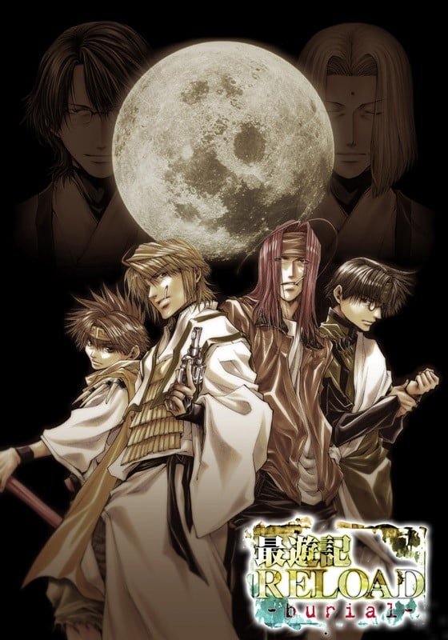
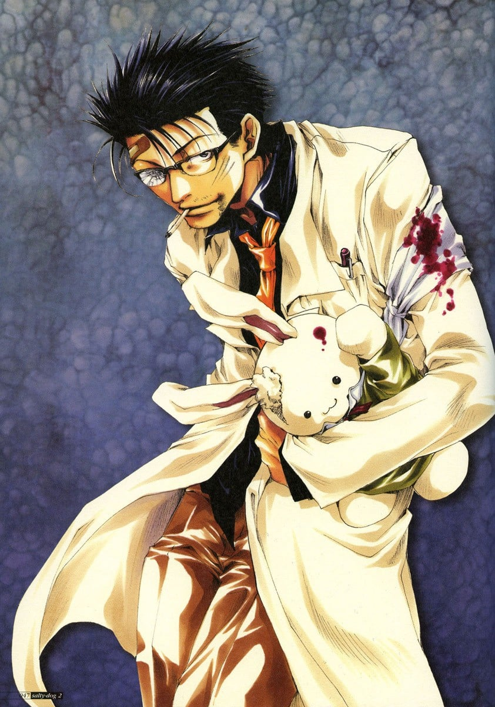
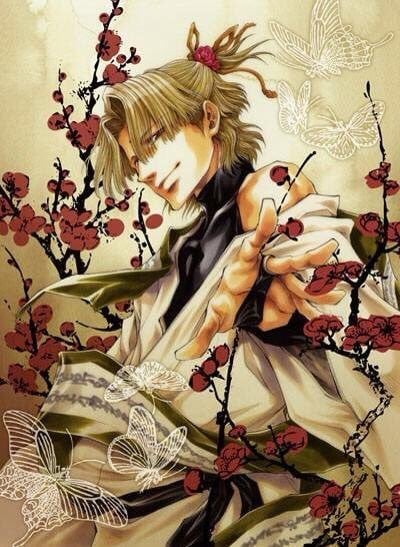

> [!bookinfo|noicon]+ **最游记RELOAD 埋葬篇**
> 
>
| 日文名 | 最遊記RELOAD -burial- |
|:------: |:------------------------------------------: |
| 类型 | 漫改 |
| 新番 | 2007 年 4 月 |
| 集数 | 共3话 |
| 官网 | [http://saiyuki-ova.net/web/top.htm](https://http://saiyuki-ova.net/web/top.htm) |
| 制作 | ぴえろ |
| 导演 | 大畑晃一 |
| 脚本 | 隅沢克之 |
| 评分 | 7.3|
| 制片人 |  |

> [!abstract]+ **简介**
> 第壱巻～三蔵法師の章～
「烏哭の章」
「玄奘三蔵の章」
第弐巻～孫悟空の章～
第参巻～悟浄＆八戒の章～

玄奘三藏之章（2007.4.27）

《最游记RELOAD－burial－》的第一卷OVA《三藏法师之章》有两个故事，第一个故事名为《~乌哭三藏之章~》，讲述的是二十年前，光明三藏法师去拜访有刚内三藏所在的禅奥寺。对于自己已经身患重病，剩下的时间所剩无已的事情有所觉悟的刚内，在光明三藏的见证下，正式选出了继续无天经文的候选者。但是，对于这个人选有异议的健邑对刚内动了粗。然后到了最终考验之日……一只乌鸦哭了……
第二个故事名为《玄奘三藏之章》，故事讲述了自十二年事前金山寺被烧已经过了4年之后，一路寻找被抢走的圣天经文的玄奘三藏为了拜谒三佛神而赶往斜阳殿。三佛神同意协助调查圣天经文的下落,但要他在调查期间留在庆云院。他在这里与大僧正待觉相识了，但在三藏决定了再度启程的深夜中，以三藏的性命为目标的团伙袭击了庆云院……三藏第一次品味的香烟，微笑的老人，也许日后烟不离手的他恍惚间也会回想起这一段过往...... 

孙悟空之章 (2007.12.21)

OVA的第二卷名为《孙悟空之章》。故事讲述的是三藏听到了一声呼唤，为了寻找在五百多年前就被封印在山下的妖怪，登上了这座五行山，并与这个声音的主人——一个孩子相遇了。三藏将他带下山，并让他秘密住进庆云院中。但由三佛神那里得知，这个孩子是拥有与神相等力量的传说中的妖怪——“混沌的象征”齐天大圣孙悟空。……当晚，被僧侣们发现的孙悟空遭到了他们的追赶。

八戒?悟浄之章 (2008.3.28)

第三卷OVA是由女孩子们心目中的大众情人悟净与八戒共同出演。
悟净在大雨中捡到了重伤的八戒，故事就这样开始了……两个寂寞惯了的人，忽然闯进对方的生活并不习惯，却也彼此汲取着温暖。直到有一天，悟净的朋友忽然上门拜访，而他的目的似乎又于三藏的委托有关……

> [!tip]+ **章节列表**
>- [ ] 第1话：~三藏法师之章~ (2007-04-27)
>- [ ] 第2话：~孙悟空之章~ (2007-12-21)
>- [ ] 第3话：~悟净&amp;八戒之章~ (2008-03-28)

> [!tip]+ **主要角色**
> 
| 角色 | CV | 简介| 角色图片 |
|:----:|:---:|:---:|:--------:|
| 孫悟空 | 保志総一朗 | 五百年前从花果山岩石中诞生的奇异生命体，观音把他交给金蝉童子（三藏前世）抚养，后与哪吒、卷帘大将、天蓬元帅成为好友。由于犯下罪过，天界上级要求观音抹去悟空的所有记忆，但观音自私地违背命令，保留了金蝉为他取的名字——孙悟空。悟空不像其它三人一样有前世，他根本就没有死过，只是在五行山被关押了五百年。五百年后被三藏释放，随后被其收养。 爱好为吃东西，而且食量异常惊人，总是肚子饿。性格单纯，思维方式简单直接。虽然看上去没有心计又很笨又很迷糊的样子，但是实际上可以在无意间准确地洞察事情和人的本质。 身材矮小但健壮，精力充沛。头上佩戴的金箍是妖力控制装置，卸下之后妖力会得到无限释放，成为妖怪“齐天大圣”。同时，他的外形也会发生变化（头发、耳朵、指甲变长变尖），整个人此时完全失去理智，无法克制自己想要杀人、破坏的欲望。这个状态下，悟空的力量、速度、恢复力都是惊人的，他通过吸收大地灵气可快速自愈。戴回金箍后会变回原来的样子，也会丧失变身这段时间的记忆。 |  |
| 猪八戒 | 石田彰 | 原名猪悟能，自幼生长在孤儿院，长大后的恋人花喃居然是自己失散多年的的姐姐（二人并不知情）。后来花喃因美貌被百眼魔王抓走做了妻子。为了救她，悟能杀光了百眼魔王府上大大小小全部的妖怪。然而花喃因为受辱怀孕的原因在他面前自尽了。由于淋了一千个妖怪的血，悟能自己也变成了妖怪。重伤的他在雨夜倒在路边，被路过的悟净所救。在逮捕他的三藏帮助下，他的谋杀罪被三佛神赦免，改名“八戒”，开始新的生活。 幼年性格孤僻冷漠，后来变得和善开朗。为人温柔善良，内心细腻，但有些腹黑。八戒博学多才，思考问题细致全面，总能观察出他人心中所想。八戒是西行的司机，照顾着全组人的饮食起居，算是个名符其实的男保姆。 八戒的右眼是义眼，所以在右侧佩戴单片镜片作为掩饰。八戒没有武器，他使用气功与体术结合作战。气功不仅可以用于进攻，还可以用气功制作防护壁以及为人疗伤。左耳的三个耳夹是妖力控制装置，卸下之后头发、耳朵、指甲变长变尖，妖力成倍释放，全身上下布满青藤花纹，可使用青藤花纹束缚对手。人与妖的两种状态之间，八戒的意识是较为清醒的。 前世为天界军中的天蓬元帅。 |  |
| 玄奘三蔵 | 関俊彦 | 原是河里漂来的弃儿，被金山寺的光明三藏所救并抚养长大，随后收为弟子。最初取名为“江流”。自幼受僧人歧视，却天赋秉异。众妖攻陷金山寺时师父被杀，三藏带着继承自师傅的“魔天经文”逃离，在江湖流浪多年寻找失去的“圣天经文”，到达长安后辗转成为庆云院的住持。在观世音菩萨与三佛神的指引下，与悟空、悟净与八戒三人前往天竺国阻止牛魔王复活实验。 完全不像个出家人的样子，嗜烟酒。性格傲慢，叛逆不羁，意志坚定，不愿受任何人的束缚。外冷内热，外表冷静，实际上冲动易怒，经常被悟空和悟净的胡闹而惹火，生气时会掏出扇子打人或是朝两人射击。 金发紫瞳，身着三藏法师标准法衣，肩上背负着五部“天地开元经文”之一的“魔天经文”，终极奥义是“魔界天净”，有着净化魔物的能力。三藏常用武器是一把手枪，枪法很准。 前世为天界的金蝉童子。 |  |
| 沙悟浄 | 平田広明 | 悟净是半妖，是妖怪（父）与人类（母）生下的“禁忌之子”。他由父亲的妖怪正妻带大，但是童年却常受她虐待。悟净八岁那年，正妻终因忍受不了而想劈死他。同父异母的哥哥沙慈燕为救悟净杀了自己的亲生母亲，随后失踪。此后悟净一人流浪四处，做过小混混。遇见八戒他们前，一直过着颓废的生活。 性格恶劣、风流好色，喜好美女、啤酒和香烟，也喜欢赌博。讲话很没口德，喜欢与人对着干。但同时又有为人豪爽直率的一面，很为他人着想，是个烂好人，常为他人打抱不平。 由于是“禁忌之子”，悟净有着红色的长发和双眼，也没有生育能力（可以肆无忌惮地纵情声色）。头顶有两根很长的呆毛，常被悟空吐槽为“蟑螂的触须”。半妖的体质赋予他很强的战斗力，四肢强健有力，使用的是锡月杖，镰刃的一头可以携带锁链飞出，杀伤力极强。 前世为天界军中的卷帘大将。 |  |
| 你健一 | 大塚芳忠 | 牛魔王蘇生実験に携わる科学者。生命工学の第一人者とも謳われるが、得体の知れない部分が多く、紅孩児や独角兕からは警戒されている。吠登城では唯一の人間。 人を馬鹿にした口調とウサギのぬいぐるみをよく持ち歩いていることが特徴。メカいじりが趣味で、三蔵一行の妨害にも你のメカが使われている。玉面公主と愛人関係にある。 その正体は三蔵法師の一人にして、カミサマの師でもある烏哭（うこく）三蔵法師。経文はウサギのぬいぐるみに隠している。どのような意図で蘇生実験に荷担しているのか、本当の目的は何なのか、その真相は未だ判明していない。 アニメ版では原作以上に愉快犯として描かれ、様々な人間や妖怪相手に実験を行った。  修行僧時代は健邑（けんゆう）と名乗る。あらゆる分野の知識に精通し、17歳で博士号を取得した天才。大抵のことを簡単にこなせてしまうため、「最も難しいこと」である三蔵法師になることを目指して剛内三蔵の下に弟子入りする。師である剛内にその冷酷・悪心を見抜かれており、継承者候補から外されていたが、選考試験中に乱入し僧たちもろとも剛内を殺害した。師の提示した条件である「剛内を打倒し殺害する」ことを満たしたため、当時史上最年少の三蔵法師となる。継承に立ち会った光明三蔵が「烏哭」という法名を付けるが、選ばれし者の証・チャクラは額に現れず、異例の「チャクラを持たない三蔵法師」となった。 光明三蔵には一目置いていて、三蔵法師となった後の約一年間、共に旅をしたらしい。かつて、光明三蔵に「いつか自分を喰ってくれる相手を探している」と言っていた。光明との“賭け”を、今でも忘れずにいる。鳥哭の髪型のモデルは俳優の生瀬勝久であることを、作者が公式サイトの日記で明らかにした。 戦闘技能は高く、修行僧時代でも呪文なしで術を行使、一撃で師の命を奪う程。現在も三蔵一行とヘイゼルを相手にしてなお、全員を圧倒する実力を誇る。手にする「無天経文」は、万物のあらゆるものを無に帰し、それが存在した事実すらも消滅させる。悟空を陰から襲撃したり、三蔵を消そうとするなど度々暗躍。直接対決では圧倒。ガトの銃を手にした三蔵の攻撃を受けながらも、こめかみへの致命傷を避けたが、目元を撃たれたことで盲目となる。 |  |
| 光明三蔵 | 宮本充 | 玄奘三蔵の師。彼が赤子の頃、揚子江に捨てられていたところを拾い、金山寺で育てる。玄奘三蔵の本名である「江流」の名付け親でもある。 容姿は端麗・童顔で、常に微笑みを絶やさない。隠れて煙草を吸い、皆が寝静まった夜更けに酒を飲むなど、僧侶として型破りな面も併せ持つ。長い黄金色の髪を持ち、かつてはポニーテールに、後には三つ編みにしている。 少々とぼけた掴み所のない性格だが、その内には人を見極める確かな力と厳しさを秘めている。当時史上最年少の若さで「聖天経文」を継承・三蔵法師になり、後に空位となった『魔天経文』の守り人の地位も継承、「天地開元経文」のうち2つの守護者となった。 当時12歳の江流に法名を与えた夜に妖怪の襲撃に遭い、彼と『魔天経文』を守って死亡（48歳）。 |  |