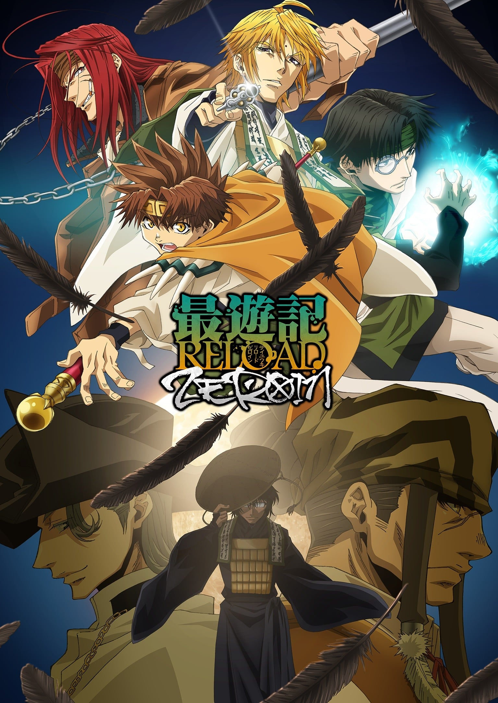
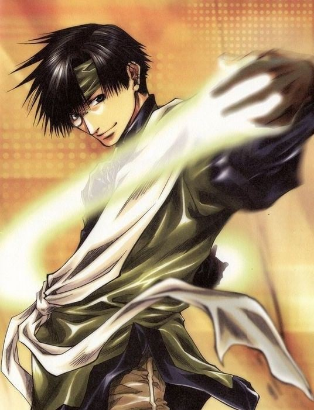
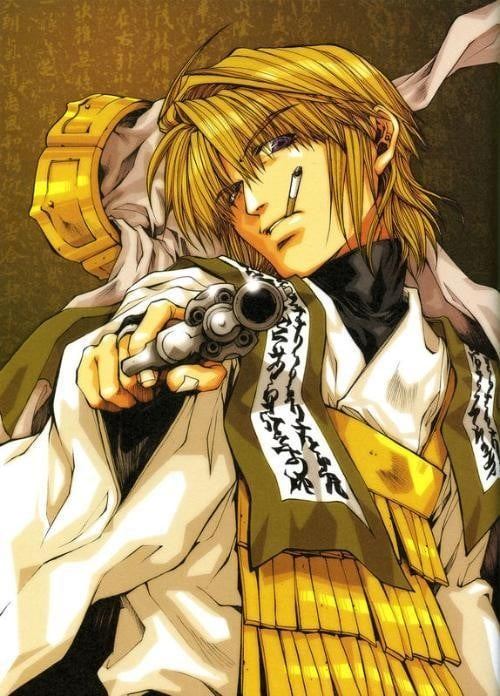
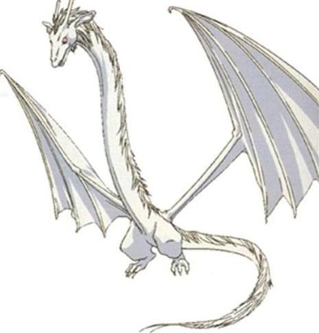
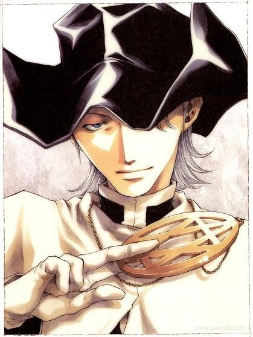
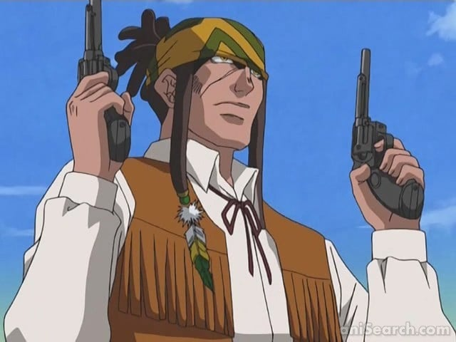

> [!bookinfo|noicon]+ **最游记 RELOAD -ZEROIN-**
> 
>
| 日文名 | 最遊記RELOAD -ZEROIN- |
|:------: |:------------------------------------------: |
| 类型 | 漫改 |
| 新番 | 2022 年 1 月 |
| 集数 | 共13话 |
| 官网 | [https://saiyuki-r-zeroin.jp](https://https://saiyuki-r-zeroin.jp) |
| 制作 | ライデンフィルム |
| 导演 | 髙田美里 |
| 脚本 | 松井亜弥,横手美智子 |
| 评分 | 6|
| 制片人 | 柴宏和 |

> [!abstract]+ **简介**
> かつては、人間と妖怪とが共存する平和な世界だった桃源郷。
しかし、500年前に闘神 ナタク太子によって、天竺国の吠登城に葬られた大妖怪「牛魔王」を禁断とされている「化学と妖術の合成」によって復活を目論む者が現れた。
　
その影響である「負の波動」が桃源郷全土に広がり、妖怪達は突如として自我を失い、凶暴化して人間を襲い始め混沌と化す桃源郷。
事態を重く見た観世音菩薩は三仏神を通じ、玄奘三蔵に孫悟空、沙悟浄、猪八戒らを連れて西へ行くように命じる。
「牛魔王」蘇生実験の阻止のため、4人の旅が始まった。
　
旅の最中、四人は西から来たという謎の異国人ヘイゼル=グロースとその従者ガトという人物に出会う。
妖怪の魂を使用して、人間を蘇生する不思議な術を使うヘイゼル達と成り行きで行動を共にする三蔵一行。
　
だが、そこに彼らにとっての因縁の人物・烏哭三蔵法師が忍び寄る―――。

> [!tip]+ **章节列表**
>- [ ] 第1话：蓝眼的天使 (2022-01-06)
>- [ ] 第2话：生命的价值 (2022-01-13)
>- [ ] 第3话：人类与妖怪 (2022-01-20)
>- [ ] 第4话：选择 (2022-01-27)
>- [ ] 第5话：回来的那个人 (2022-02-03)
>- [ ] 第6话：生命的权力 (2022-02-10)
>- [ ] 第7话：齐天大圣 (2022-02-17)
>- [ ] 第8话：绿洲 (2022-02-24)
>- [ ] 第9话：一寸虫豸也有五分魂魄 (2022-03-03)
>- [ ] 第10话：赎罪 (2022-03-10)
>- [ ] 第11话：接着升起的太阳 (2022-03-17)
>- [ ] 第12话：被揭开的记忆 (2022-03-24)
>- [ ] 第13话：三藏一行人 (2022-03-31)

> [!tip]+ **主要角色**
> 
| 角色 | CV | 简介| 角色图片 |
|:----:|:---:|:---:|:--------:|
| 孫悟空 | 保志総一朗 | 五百年前从花果山岩石中诞生的奇异生命体，观音把他交给金蝉童子（三藏前世）抚养，后与哪吒、卷帘大将、天蓬元帅成为好友。由于犯下罪过，天界上级要求观音抹去悟空的所有记忆，但观音自私地违背命令，保留了金蝉为他取的名字——孙悟空。悟空不像其它三人一样有前世，他根本就没有死过，只是在五行山被关押了五百年。五百年后被三藏释放，随后被其收养。 爱好为吃东西，而且食量异常惊人，总是肚子饿。性格单纯，思维方式简单直接。虽然看上去没有心计又很笨又很迷糊的样子，但是实际上可以在无意间准确地洞察事情和人的本质。 身材矮小但健壮，精力充沛。头上佩戴的金箍是妖力控制装置，卸下之后妖力会得到无限释放，成为妖怪“齐天大圣”。同时，他的外形也会发生变化（头发、耳朵、指甲变长变尖），整个人此时完全失去理智，无法克制自己想要杀人、破坏的欲望。这个状态下，悟空的力量、速度、恢复力都是惊人的，他通过吸收大地灵气可快速自愈。戴回金箍后会变回原来的样子，也会丧失变身这段时间的记忆。 |  |
| 猪八戒 | 石田彰 | 原名猪悟能，自幼生长在孤儿院，长大后的恋人花喃居然是自己失散多年的的姐姐（二人并不知情）。后来花喃因美貌被百眼魔王抓走做了妻子。为了救她，悟能杀光了百眼魔王府上大大小小全部的妖怪。然而花喃因为受辱怀孕的原因在他面前自尽了。由于淋了一千个妖怪的血，悟能自己也变成了妖怪。重伤的他在雨夜倒在路边，被路过的悟净所救。在逮捕他的三藏帮助下，他的谋杀罪被三佛神赦免，改名“八戒”，开始新的生活。 幼年性格孤僻冷漠，后来变得和善开朗。为人温柔善良，内心细腻，但有些腹黑。八戒博学多才，思考问题细致全面，总能观察出他人心中所想。八戒是西行的司机，照顾着全组人的饮食起居，算是个名符其实的男保姆。 八戒的右眼是义眼，所以在右侧佩戴单片镜片作为掩饰。八戒没有武器，他使用气功与体术结合作战。气功不仅可以用于进攻，还可以用气功制作防护壁以及为人疗伤。左耳的三个耳夹是妖力控制装置，卸下之后头发、耳朵、指甲变长变尖，妖力成倍释放，全身上下布满青藤花纹，可使用青藤花纹束缚对手。人与妖的两种状态之间，八戒的意识是较为清醒的。 前世为天界军中的天蓬元帅。 |  |
| 玄奘三蔵 | 関俊彦 | 原是河里漂来的弃儿，被金山寺的光明三藏所救并抚养长大，随后收为弟子。最初取名为“江流”。自幼受僧人歧视，却天赋秉异。众妖攻陷金山寺时师父被杀，三藏带着继承自师傅的“魔天经文”逃离，在江湖流浪多年寻找失去的“圣天经文”，到达长安后辗转成为庆云院的住持。在观世音菩萨与三佛神的指引下，与悟空、悟净与八戒三人前往天竺国阻止牛魔王复活实验。 完全不像个出家人的样子，嗜烟酒。性格傲慢，叛逆不羁，意志坚定，不愿受任何人的束缚。外冷内热，外表冷静，实际上冲动易怒，经常被悟空和悟净的胡闹而惹火，生气时会掏出扇子打人或是朝两人射击。 金发紫瞳，身着三藏法师标准法衣，肩上背负着五部“天地开元经文”之一的“魔天经文”，终极奥义是“魔界天净”，有着净化魔物的能力。三藏常用武器是一把手枪，枪法很准。 前世为天界的金蝉童子。 |  |
| 沙悟浄 | 平田広明 | 悟净是半妖，是妖怪（父）与人类（母）生下的“禁忌之子”。他由父亲的妖怪正妻带大，但是童年却常受她虐待。悟净八岁那年，正妻终因忍受不了而想劈死他。同父异母的哥哥沙慈燕为救悟净杀了自己的亲生母亲，随后失踪。此后悟净一人流浪四处，做过小混混。遇见八戒他们前，一直过着颓废的生活。 性格恶劣、风流好色，喜好美女、啤酒和香烟，也喜欢赌博。讲话很没口德，喜欢与人对着干。但同时又有为人豪爽直率的一面，很为他人着想，是个烂好人，常为他人打抱不平。 由于是“禁忌之子”，悟净有着红色的长发和双眼，也没有生育能力（可以肆无忌惮地纵情声色）。头顶有两根很长的呆毛，常被悟空吐槽为“蟑螂的触须”。半妖的体质赋予他很强的战斗力，四肢强健有力，使用的是锡月杖，镰刃的一头可以携带锁链飞出，杀伤力极强。 前世为天界军中的卷帘大将。 |  |
| 白竜 | 戸田めぐみ | 原作並びにOVA版では「ジープ」と呼ばれるが、『幻想魔伝 最遊記』以降のアニメ版では「白竜」と呼ばれる。 禁断の汚呪と呼ばれる、「化学と妖術の合成」によって作り出された存在であり、その証として赤紅色の眼を持つ。小説版では百眼魔王の城から紛失した宝具であることが書かれている。 普段は翼を持つ白い竜で、ジープに変身できる。変身後もある程度は自身の意思で動くことが可能。アニメ版では、火を吹いたことがある。 一度だけ、偶然出会った兄妹たちを元気付けるために内緒で夜遊びしたことがある。帰って来てから「この大きな人たち（三蔵一行）が一番放っておけない」という考えに至ったらしい。三蔵達は律儀なジープが勝手に居なくなったため、盗まれたか家出したかと心配し夜の町を探しまわっていた。 悟浄と同居していた頃に、八戒が森の中で弱っているジープを拾って以来、彼のペットになる。自動車形態での運転も基本的に八戒が行う[注 9]。悟浄とは当初、あまり仲は良くなかったが、「禁忌の存在同士」という共通点で仲良くなる。しかし、三蔵は偉い人、八戒は飼い主、悟空は自身と同等、悟浄のことは自分より下に見ているらしい。 小説版では、拾われてしばらくは「白竜」と呼ばれたが、その後“「白竜」では見た目そのままな気がする”という八戒の考えで「ジープ」と命名された経緯が書かれている。 |  |
| 你健一 | 大塚芳忠 | 牛魔王蘇生実験に携わる科学者。生命工学の第一人者とも謳われるが、得体の知れない部分が多く、紅孩児や独角兕からは警戒されている。吠登城では唯一の人間。 人を馬鹿にした口調とウサギのぬいぐるみをよく持ち歩いていることが特徴。メカいじりが趣味で、三蔵一行の妨害にも你のメカが使われている。玉面公主と愛人関係にある。 その正体は三蔵法師の一人にして、カミサマの師でもある烏哭（うこく）三蔵法師。経文はウサギのぬいぐるみに隠している。どのような意図で蘇生実験に荷担しているのか、本当の目的は何なのか、その真相は未だ判明していない。 アニメ版では原作以上に愉快犯として描かれ、様々な人間や妖怪相手に実験を行った。  修行僧時代は健邑（けんゆう）と名乗る。あらゆる分野の知識に精通し、17歳で博士号を取得した天才。大抵のことを簡単にこなせてしまうため、「最も難しいこと」である三蔵法師になることを目指して剛内三蔵の下に弟子入りする。師である剛内にその冷酷・悪心を見抜かれており、継承者候補から外されていたが、選考試験中に乱入し僧たちもろとも剛内を殺害した。師の提示した条件である「剛内を打倒し殺害する」ことを満たしたため、当時史上最年少の三蔵法師となる。継承に立ち会った光明三蔵が「烏哭」という法名を付けるが、選ばれし者の証・チャクラは額に現れず、異例の「チャクラを持たない三蔵法師」となった。 光明三蔵には一目置いていて、三蔵法師となった後の約一年間、共に旅をしたらしい。かつて、光明三蔵に「いつか自分を喰ってくれる相手を探している」と言っていた。光明との“賭け”を、今でも忘れずにいる。鳥哭の髪型のモデルは俳優の生瀬勝久であることを、作者が公式サイトの日記で明らかにした。 戦闘技能は高く、修行僧時代でも呪文なしで術を行使、一撃で師の命を奪う程。現在も三蔵一行とヘイゼルを相手にしてなお、全員を圧倒する実力を誇る。手にする「無天経文」は、万物のあらゆるものを無に帰し、それが存在した事実すらも消滅させる。悟空を陰から襲撃したり、三蔵を消そうとするなど度々暗躍。直接対決では圧倒。ガトの銃を手にした三蔵の攻撃を受けながらも、こめかみへの致命傷を避けたが、目元を撃たれたことで盲目となる。 |  |
| ヘイゼル＝グロース | 遠近孝一 | 異国からやって来た司教。京言葉を喋る。一人称は「うち」。幼い頃、烏哭三蔵法師がヘイゼルの家にホームスティしていたらしい。物腰は穏やかだがかなりの自信家であり、人の神経を逆撫でする言動が多い。八戒との仲は険悪。カード勝負は何故かいつも勝負がつかない。妖怪のことを「モンスター」と呼ぶ。 幼い頃に師であるフィルバートをモンスターに殺されて以来、モンスターを憎み、根絶やしにするために旅をしている。しかしフィルバートを殺害したのは、ヘイゼルの中に眠る妖怪ヴラハルだった。心の弱みを突かれ身体を乗っ取られかけるが、三蔵、八戒の助けもあり自力でヴラハルを抑え込み、三蔵一行と協力して翼を駆使し烏哭に立ち向かう。しかし力及ばずに叩きのめされ、隙を突いて奇襲を行うも経文の力により翼を消されて崖から落下し、行方不明となる。後に、どこかの村の村人に助けられて生存していた事が判明したが、ヘイゼル自身は記憶を失っていた。 死者の魂を抜き取り、別の死者にその魂を入れて蘇らせるという、特殊な蘇生術を持つ。蘇生術には、胸元に下げるペンダントの13の穴にストックした魂を使用。蘇生された人間は、外見は瞳が黄色になる程度だが、食事や睡眠を摂らなくても生きられるらしい。またヘイゼルの号令により、妖怪を滅することだけを目的とする兵隊にもなりうる。普段はガトに戦闘を任せているが、自身も体術は得意で足も速い。エクソシストでもあるため、妖怪を滅することも可能だが、それでは蘇生術に使う魂が得られなくなるため、ペンダントを失うまでその類の技は使わなかった。 アニメ版では原作より温和になっており、你健一との面識もなく、彼を敵視。紅孩児一行とも交戦した。幼い頃、妖怪退治で自らもモンスターと化するも、ガトにより撃ち殺されるが、ガトが自分の魂でヘイゼルを蘇らせ、自分がガトを殺したと記憶を変えられていた。その為、ガトの死によって再びモンスター化し、毒を用いて悟空たちを苦しめ、変化する際には、多大な妖力を必要としたため、ガトを含む蘇生された人間の魂が全てペンダントに戻った。最終的には自ら死ぬことを望み、三蔵の銃で最期を迎える。 |  |
| ガティ＝ネネホーク | 小山力也 | ヘイゼルと行動を共にしている、ネイティブアメリカン風の大男。その命は既に失われているが、ヘイゼルの蘇生術によって今なお生き続けている。そのため、空腹や痛み等は感じない。また、何度でも蘇生できるため、無謀な攻撃をしたり、身を盾にしてヘイゼルを守る。ただし、ある出来事の中でヘイゼルのペンダントを握り潰した後は、蘇生を前提とした従前の戦法を咎められるようになった。寡黙で無表情だが、心根の非常に優しい性格。 元々は自然崇拝思想を持ったトカチャ族の猟銃使いの青年だったが、共存していた妖怪を襲ったヘイゼルと敵対し、ヘイゼルから妖怪を庇って死亡。直後ヘイゼルの手により蘇生するが、自然の法則を捻じ曲げたとして一族を追放され、ヘイゼルの従者となったという経緯を持つ。武器は二丁の拳銃。体術にも優れていて、悟空に「ムキムキ」と言われる程筋肉質で屈強な体格を持つ。 烏哭との戦いで無天経文からヘイゼルを守る盾となり、下半身を消される。ヘイゼルが自分から解放されることを望みながら崩れ落ち、その生涯を終えた。 アニメ版では、元々「精霊」を崇め生きる分以上の殺生はしない一族の元で暮らしていたが、異大陸の人間の銃撃で死ぬ。が、精霊の力により生き返り、力を得た。拳銃はこの時に入手。その後、精霊によりヘイゼルの所へ行き、次々と妖怪を殺戮するヘイゼルを殺そうとしヘイゼルがモンスター化するも撃ち殺す。が、自分の魂を引き換えにヘイゼルを生き返らせ、自分が襲ってきて返り討ちに遭う嘘の記憶をヘイゼルに吹き込み死亡。その後、蘇生術で再び生き返らされ僕となった。最後は魂のストックがなくなり自分が死んだ後モンスター化したヘイゼルを止めることを三蔵一行に託しヘイゼルに「お前といた時間は楽しかった」と言い残し笑顔で死んでいった |  |
| 光明三蔵 | 宮本充 | 玄奘三蔵の師。彼が赤子の頃、揚子江に捨てられていたところを拾い、金山寺で育てる。玄奘三蔵の本名である「江流」の名付け親でもある。 容姿は端麗・童顔で、常に微笑みを絶やさない。隠れて煙草を吸い、皆が寝静まった夜更けに酒を飲むなど、僧侶として型破りな面も併せ持つ。長い黄金色の髪を持ち、かつてはポニーテールに、後には三つ編みにしている。 少々とぼけた掴み所のない性格だが、その内には人を見極める確かな力と厳しさを秘めている。当時史上最年少の若さで「聖天経文」を継承・三蔵法師になり、後に空位となった『魔天経文』の守り人の地位も継承、「天地開元経文」のうち2つの守護者となった。 当時12歳の江流に法名を与えた夜に妖怪の襲撃に遭い、彼と『魔天経文』を守って死亡（48歳）。 |  |