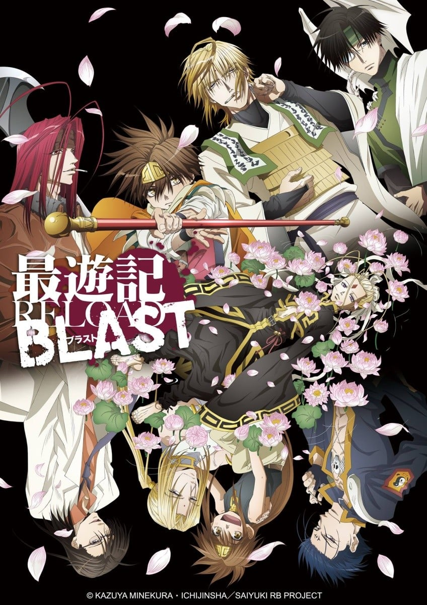
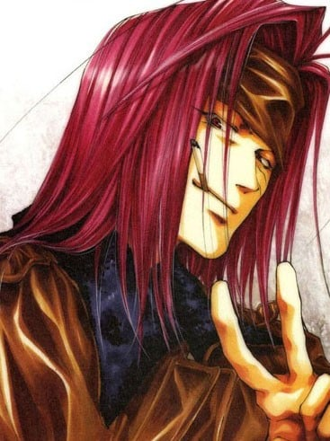
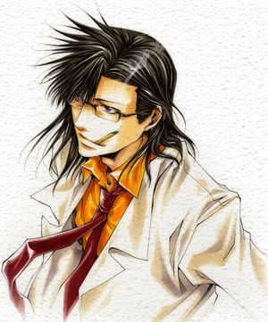
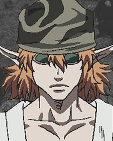
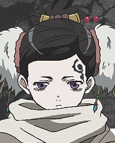

> [!bookinfo|noicon]+ **最游记 RELOAD BLAST**
> 
>
| 日文名 | 最遊記RELOAD BLAST |
|:------: |:------------------------------------------: |
| 类型 | 漫改 |
| 新番 | 2017 年 7 月 |
| 集数 | 共12话 |
| 官网 | [http://saiyuki-rb.jp/](https://http://saiyuki-rb.jp/) |
| 制作 | プラチナビジョン |
| 导演 | 中野英明 |
| 脚本 | 古怒田健志 |
| 评分 | 6.4|
| 制片人 | 米沢恵美 |

> [!abstract]+ **简介**
> 经过长久的旅行，三藏一行总算抵达西域。在那里他们遇到的是另一个三藏法师纱恪三藏。《最游记》系列最终章终于开幕！

> [!tip]+ **章节列表**
>- [ ] 第1话：突风 (2017-07-05)
>- [ ] 第2话：云镜 (2017-07-12)
>- [ ] 第3话：天葬 (2017-07-19)
>- [ ] 第4话：哪吒 (2017-07-26)
>- [ ] 第5话：花宴 (2017-08-02)
>- [ ] 第6话：约定 (2017-08-09)
>- [ ] 第7话：恒天 (2017-08-16)
>- [ ] 第8话：结界 (2017-08-23)
>- [ ] 第9话：邂逅 (2017-08-30)
>- [ ] 第10话：敕命 (2017-09-06)
>- [ ] 第11话：袭击 (2017-09-13)
>- [ ] 第12话：背天 (2017-09-20)

> [!tip]+ **主要角色**
> 
| 角色 | CV | 简介| 角色图片 |
|:----:|:---:|:---:|:--------:|
| 孫悟空 | 保志総一朗 | 五百年前从花果山岩石中诞生的奇异生命体，观音把他交给金蝉童子（三藏前世）抚养，后与哪吒、卷帘大将、天蓬元帅成为好友。由于犯下罪过，天界上级要求观音抹去悟空的所有记忆，但观音自私地违背命令，保留了金蝉为他取的名字——孙悟空。悟空不像其它三人一样有前世，他根本就没有死过，只是在五行山被关押了五百年。五百年后被三藏释放，随后被其收养。 爱好为吃东西，而且食量异常惊人，总是肚子饿。性格单纯，思维方式简单直接。虽然看上去没有心计又很笨又很迷糊的样子，但是实际上可以在无意间准确地洞察事情和人的本质。 身材矮小但健壮，精力充沛。头上佩戴的金箍是妖力控制装置，卸下之后妖力会得到无限释放，成为妖怪“齐天大圣”。同时，他的外形也会发生变化（头发、耳朵、指甲变长变尖），整个人此时完全失去理智，无法克制自己想要杀人、破坏的欲望。这个状态下，悟空的力量、速度、恢复力都是惊人的，他通过吸收大地灵气可快速自愈。戴回金箍后会变回原来的样子，也会丧失变身这段时间的记忆。 |  |
| 猪八戒 | 石田彰 | 原名猪悟能，自幼生长在孤儿院，长大后的恋人花喃居然是自己失散多年的的姐姐（二人并不知情）。后来花喃因美貌被百眼魔王抓走做了妻子。为了救她，悟能杀光了百眼魔王府上大大小小全部的妖怪。然而花喃因为受辱怀孕的原因在他面前自尽了。由于淋了一千个妖怪的血，悟能自己也变成了妖怪。重伤的他在雨夜倒在路边，被路过的悟净所救。在逮捕他的三藏帮助下，他的谋杀罪被三佛神赦免，改名“八戒”，开始新的生活。 幼年性格孤僻冷漠，后来变得和善开朗。为人温柔善良，内心细腻，但有些腹黑。八戒博学多才，思考问题细致全面，总能观察出他人心中所想。八戒是西行的司机，照顾着全组人的饮食起居，算是个名符其实的男保姆。 八戒的右眼是义眼，所以在右侧佩戴单片镜片作为掩饰。八戒没有武器，他使用气功与体术结合作战。气功不仅可以用于进攻，还可以用气功制作防护壁以及为人疗伤。左耳的三个耳夹是妖力控制装置，卸下之后头发、耳朵、指甲变长变尖，妖力成倍释放，全身上下布满青藤花纹，可使用青藤花纹束缚对手。人与妖的两种状态之间，八戒的意识是较为清醒的。 前世为天界军中的天蓬元帅。 |  |
| 玄奘三蔵 | 関俊彦 | 原是河里漂来的弃儿，被金山寺的光明三藏所救并抚养长大，随后收为弟子。最初取名为“江流”。自幼受僧人歧视，却天赋秉异。众妖攻陷金山寺时师父被杀，三藏带着继承自师傅的“魔天经文”逃离，在江湖流浪多年寻找失去的“圣天经文”，到达长安后辗转成为庆云院的住持。在观世音菩萨与三佛神的指引下，与悟空、悟净与八戒三人前往天竺国阻止牛魔王复活实验。 完全不像个出家人的样子，嗜烟酒。性格傲慢，叛逆不羁，意志坚定，不愿受任何人的束缚。外冷内热，外表冷静，实际上冲动易怒，经常被悟空和悟净的胡闹而惹火，生气时会掏出扇子打人或是朝两人射击。 金发紫瞳，身着三藏法师标准法衣，肩上背负着五部“天地开元经文”之一的“魔天经文”，终极奥义是“魔界天净”，有着净化魔物的能力。三藏常用武器是一把手枪，枪法很准。 前世为天界的金蝉童子。 |  |
| 沙悟浄 | 平田広明 | 悟净是半妖，是妖怪（父）与人类（母）生下的“禁忌之子”。他由父亲的妖怪正妻带大，但是童年却常受她虐待。悟净八岁那年，正妻终因忍受不了而想劈死他。同父异母的哥哥沙慈燕为救悟净杀了自己的亲生母亲，随后失踪。此后悟净一人流浪四处，做过小混混。遇见八戒他们前，一直过着颓废的生活。 性格恶劣、风流好色，喜好美女、啤酒和香烟，也喜欢赌博。讲话很没口德，喜欢与人对着干。但同时又有为人豪爽直率的一面，很为他人着想，是个烂好人，常为他人打抱不平。 由于是“禁忌之子”，悟净有着红色的长发和双眼，也没有生育能力（可以肆无忌惮地纵情声色）。头顶有两根很长的呆毛，常被悟空吐槽为“蟑螂的触须”。半妖的体质赋予他很强的战斗力，四肢强健有力，使用的是锡月杖，镰刃的一头可以携带锁链飞出，杀伤力极强。 前世为天界军中的卷帘大将。 |  |
| 紅孩児 | 草尾毅 | 红发红瞳的妖怪，牛魔王与罗刹女的独生子。因其超凡地位和人格魅力成为妖怪们心中的偶像型人物。500年前与其父牛魔王一同被封印于天竺国吠登城，后被玉面公主解开封印。因一心想救出被封印的母亲罗刹女而甘愿被玉面公主利用，带领手下团队收集四散各地的天地开元经文，期间与三藏一行相识，成为了亦敌亦友的对手。他与自己的团队总是正大光明地与三藏一行决斗，从不不趁人之危，尽管常常不能得手，但他遵循着自己的决斗方式。一度被你建一洗脑，丧失自我，与三藏一行再次交手后恢复神智。 性格外冷内热，看似冷漠，实则非常关心在乎家人与朋友。同时坚韧不拔，无惧失败。早先在酷酷的外表下常流露出困惑的神情，与悟空一战过后从悟空那里学到了为自己而战的道理，坚定了自己拯救母亲的信念。 作战从不使用武器，有着很强大的拳脚功夫和火焰法术，也常常召唤契约兽参与作战。 |  |
| 金蟬童子 | 関俊彦 | 观世音菩萨的侄子。在天界地位颇高。 通晓书頖，是文弱书生。 典型的默默做事，对外物感觉起伏不大。 体力很差，不甚通晓世俗。 悟空的出现，再受到天蓬和卷帘的影响，性格也开始改变。决定改变过去不理不睬的态度，追求自己想保护的东西。 |  |
| 捲簾大将 | 平田広明 | 天界西方军的大将，喜欢酒、花和女人的无赖。 原属东方军的武将，因与上司的妻子通奸而被降职至西方军，成为天蓬元帅的部下。 性格大胆，充满男子气概。 对于世事通晓，喜欢下界事物，最爱钓鱼，有恐高症。 对小孩和部下，是一个“大哥哥”的存在。 与天蓬以夫妻相称。 对天界的事物和主张存有怀疑。 动画中与转生沙悟净有相同的红发红眼，但峰仓和也在彩图中是黑发蓝眼。 |  |
| 天蓬元帥 | 石田彰 | 天界西方军元帅。 喜欢读书，房间西南楼常常被书淹埋。 喜欢下界的东西，会把下界的“美型艺术品”带回天界；但所谓“美型艺术品”在别人眼中却是怪异的造型。 飘泊不定的性格，令人难以捉摸，只相信自己。 有书卷气息，常穿着实验室白袍，头发及肩，相貌端正，但会因读书而不打理自己。 是一位有名的军人，战斗时冷静沈著，有很高的战斗力和洞察力。 别人眼中的怪胎。 动画中与转生猪八戒有相同的绿眼，但峰仓和也在彩图中眼睛有多种颜色，有琥珀色、紫色，其中紫色最常见。 |  |
| 白竜 |  | 原作並びにOVA版では「ジープ」と呼ばれるが、『幻想魔伝 最遊記』以降のアニメ版では「白竜」と呼ばれる。 禁断の汚呪と呼ばれる、「化学と妖術の合成」によって作り出された存在であり、その証として赤紅色の眼を持つ。小説版では百眼魔王の城から紛失した宝具であることが書かれている。 普段は翼を持つ白い竜で、ジープに変身できる。変身後もある程度は自身の意思で動くことが可能。アニメ版では、火を吹いたことがある。 一度だけ、偶然出会った兄妹たちを元気付けるために内緒で夜遊びしたことがある。帰って来てから「この大きな人たち（三蔵一行）が一番放っておけない」という考えに至ったらしい。三蔵達は律儀なジープが勝手に居なくなったため、盗まれたか家出したかと心配し夜の町を探しまわっていた。 悟浄と同居していた頃に、八戒が森の中で弱っているジープを拾って以来、彼のペットになる。自動車形態での運転も基本的に八戒が行う[注 9]。悟浄とは当初、あまり仲は良くなかったが、「禁忌の存在同士」という共通点で仲良くなる。しかし、三蔵は偉い人、八戒は飼い主、悟空は自身と同等、悟浄のことは自分より下に見ているらしい。 小説版では、拾われてしばらくは「白竜」と呼ばれたが、その後“「白竜」では見た目そのままな気がする”という八戒の考えで「ジープ」と命名された経緯が書かれている。 |  |
| 独角兕 | 山野井仁 | 黑发黑瞳的纯血妖怪，红孩儿的手下直属剑客。原名沙尔燕，是悟净同父异母的兄长。因为长相酷似父亲，所以曾与母亲发生过不伦的关系。为保护弟弟，亲手杀死了自己的亲生母亲。后来被红孩儿收为近身剑客，改名“独角兕”。与八百鼠一样视红孩儿为唯一主人，以性命托付。在生活里把红孩儿看做自己的弟弟，对其爱称为“红”。由于各为其主，不得已与异母弟弟悟净成为对手（但在其心底还是很爱护弟弟的）。最后，为了救红孩儿被哪吒杀死。 独角兕的武器为一把长着一只眼睛的怪刀。 |  |
| 賽太歳 | 諏訪部順一 | 謎の青年。 |  |
| タルチエ | 斎藤千和 | 正体不明の謎の少女。 |  |