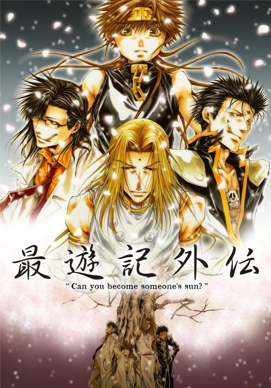
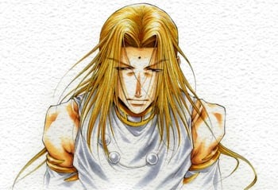
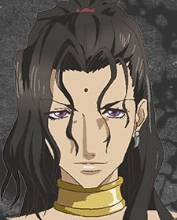
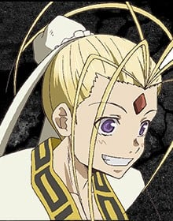
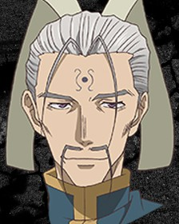
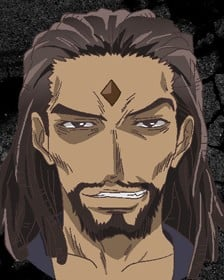
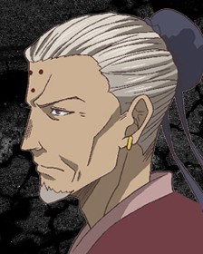
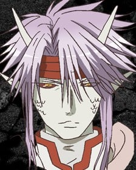

> [!bookinfo|noicon]+ **最游记外传**
> 
>
| 日文名 | 最遊記外伝 |
|:------: |:------------------------------------------: |
| 类型 | 漫改 |
| 新番 | 2011 年 3 月 |
| 集数 | 共3话 |
| 官网 | [[{'k': '官网', 'v': 'http://saiyuki-gaiden.com/'}, {'k': '东京电视台', 'v': 'https://www.tv-tokyo.co.jp/anime/info_dvd/saiyuki_gaiden/index.html'}]](https://[{'k': '官网', 'v': 'http://saiyuki-gaiden.com/'}, {'k': '东京电视台', 'v': 'https://www.tv-tokyo.co.jp/anime/info_dvd/saiyuki_gaiden/index.html'}]) |
| 制作 | ぴえろ |
| 导演 | 葛谷直行 |
| 脚本 | 代々木一 |
| 评分 | 7.1|
| 制片人 | 野田直彦 |

> [!abstract]+ **简介**
> 由天上人居住的天界是一个不存在“死亡”的世界，金蝉童子百无聊赖的生活在这个世界。有一天，观世音菩萨给他带来了一个下界的少年，这个少年据说是从岩石中诞生的，有着金色眼瞳的少年给金蝉童子的生活带来了变化。这个天真烂漫的少年，虽然时常让负责照顾他的金蝉童子感到焦头烂额，但也改变了金蝉童子千篇一律的枯燥生活。
金蝉童子给这名少年取名“悟空”，随后，悟空结识了天界西方军的天蓬元帅和卷帘大将，几个人渐渐的结成至交。悟空还在天界认识了他的第一个朋友——哪咤太子。哪咤太子是天界唯一一个被允许可以不遵守“无杀生”原则的“不净之人”。他不断的接受出战的命令和敌人生死交战。指使这一切的，就是利用他不断在天界上层加深影响力的父亲李塔天。
李塔天得知悟空的存在之后，觉得悟空妨碍了他，于是命令哪咤太子杀掉悟空。将李塔天视为绝对存在的哪咤太子遵从了父亲的命令。将剑对准了悟空，这时候，悟空把一直想要告诉他的自己的名字告诉了哪咤，并且告诉哪咤他坚信他们之间的友情。被悟空的纯粹和真诚唤醒意识的哪咤在两难的抉择下，把剑斩向了自己。
哪咤濒死的样子让悟空受到了严重的刺激。他冲破了“紧箍咒”的封印释放出了“齐天大圣”的力量，压倒性的力量让在场的人都死于非命。而后，凭着本能进行残酷杀戮的“齐天大圣”被观世音菩萨宣布死刑，金蝉童子出面阻止。
为了保护悟空，与天界为敌的金蝉童子、卷帘大将、天蓬元帅挟持着人质西海龙王敖润逃亡了下界……

> [!tip]+ **章节列表**
>- [ ] 第1话：樱云之章 (2011-03-25)
>- [ ] 第2话：散华之章 (2011-06-24)
>- [ ] 第3话：萌芽之章 (2011-11-25)
>- [ ] 第0话：迷蝶之章
>- [ ] 第1话：特别篇 香花之章 (2013-04-26)

> [!tip]+ **主要角色**
> 
| 角色 | CV | 简介| 角色图片 |
|:----:|:---:|:---:|:--------:|
| 孫悟空 | 保志総一朗 | 五百年前从花果山岩石中诞生的奇异生命体，观音把他交给金蝉童子（三藏前世）抚养，后与哪吒、卷帘大将、天蓬元帅成为好友。由于犯下罪过，天界上级要求观音抹去悟空的所有记忆，但观音自私地违背命令，保留了金蝉为他取的名字——孙悟空。悟空不像其它三人一样有前世，他根本就没有死过，只是在五行山被关押了五百年。五百年后被三藏释放，随后被其收养。 爱好为吃东西，而且食量异常惊人，总是肚子饿。性格单纯，思维方式简单直接。虽然看上去没有心计又很笨又很迷糊的样子，但是实际上可以在无意间准确地洞察事情和人的本质。 身材矮小但健壮，精力充沛。头上佩戴的金箍是妖力控制装置，卸下之后妖力会得到无限释放，成为妖怪“齐天大圣”。同时，他的外形也会发生变化（头发、耳朵、指甲变长变尖），整个人此时完全失去理智，无法克制自己想要杀人、破坏的欲望。这个状态下，悟空的力量、速度、恢复力都是惊人的，他通过吸收大地灵气可快速自愈。戴回金箍后会变回原来的样子，也会丧失变身这段时间的记忆。 |  |
| 金蟬童子 | 関俊彦 | 观世音菩萨的侄子。在天界地位颇高。 通晓书頖，是文弱书生。 典型的默默做事，对外物感觉起伏不大。 体力很差，不甚通晓世俗。 悟空的出现，再受到天蓬和卷帘的影响，性格也开始改变。决定改变过去不理不睬的态度，追求自己想保护的东西。 |  |
| 捲簾大将 | 平田広明 | 天界西方军的大将，喜欢酒、花和女人的无赖。 原属东方军的武将，因与上司的妻子通奸而被降职至西方军，成为天蓬元帅的部下。 性格大胆，充满男子气概。 对于世事通晓，喜欢下界事物，最爱钓鱼，有恐高症。 对小孩和部下，是一个“大哥哥”的存在。 与天蓬以夫妻相称。 对天界的事物和主张存有怀疑。 动画中与转生沙悟净有相同的红发红眼，但峰仓和也在彩图中是黑发蓝眼。 |  |
| 天蓬元帥 | 石田彰 | 天界西方军元帅。 喜欢读书，房间西南楼常常被书淹埋。 喜欢下界的东西，会把下界的“美型艺术品”带回天界；但所谓“美型艺术品”在别人眼中却是怪异的造型。 飘泊不定的性格，令人难以捉摸，只相信自己。 有书卷气息，常穿着实验室白袍，头发及肩，相貌端正，但会因读书而不打理自己。 是一位有名的军人，战斗时冷静沈著，有很高的战斗力和洞察力。 别人眼中的怪胎。 动画中与转生猪八戒有相同的绿眼，但峰仓和也在彩图中眼睛有多种颜色，有琥珀色、紫色，其中紫色最常见。 |  |
| 観世音菩薩 | 五十嵐麗 | 天界を司る五大菩薩の一人。慈愛と慈悲の象徴の神であるが、言葉づかいも悪く、思うままに振る舞う唯我独尊的性格。三蔵一行を西へ向かうよう仕向けた張本人。三蔵一行の旅路を楽しんでいるように見えるが、五百年前からずっとその生き様を「見守る」役に徹している。 |  |
| 哪吒太子 | 幸田夏穂 | 天界で唯一殺生を許された「闘神太子」。 本来は子どもらしいヤンチャで明るい少年だが、その特殊な立場のため周りに心を許せる者はいなかった。しかし、悟空と出会い、始めて友達と呼べる存在を得る。父である李塔天の存在を絶対としているため、李塔天の命令と悟空への友情の間で苦悩することとなる。 |  |
| 二郎神 | 石井隆夫 | 観世音菩薩のお目付役。いつも観世音菩薩には振り回されている。 |  |
| 李塔天 | 稲葉実 | 哪吒太子の父。己の出世の道具として哪吒を利用している。 |  |
| 天帝 |  | 天界の王。 |  |
| 西海竜王敖潤 | 東地宏樹 | 天界西方軍の総責任者。天蓬と捲簾の上官であり、規律に厳しく、天界の命を絶対として疑わない。 |  |