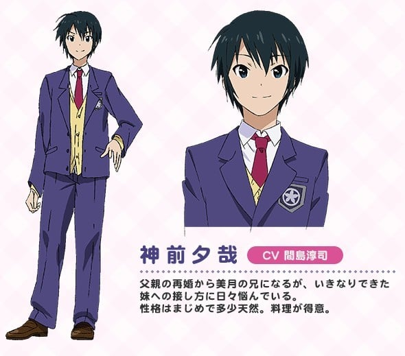
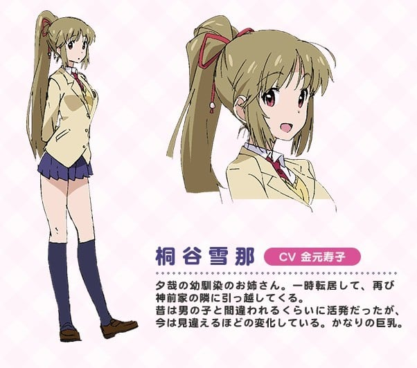

> [!bookinfo|noicon]+ **最近，妹妹的样子有点怪？**
> 
>
| 日文名 | 最近、妹のようすがちょっとおかしいんだが。 |
|:------: |:------------------------------------------: |
| 类型 | 漫改 |
| 新番 | 2014 年 1 月 |
| 集数 | 共12话 |
| 官网 | [http://www.imocyo-anime.com](https://http://www.imocyo-anime.com) |
| 制作 | project No.9 |
| 导演 | 畑博之 |
| 脚本 | 倉田英之 |
| 评分 | 5.8|
| 制片人 | 里見哲朗（barnum studio）、糀谷智司,糀谷智司,里見哲朗 |

> [!abstract]+ **简介**
> 母亲再婚，与新“哥哥”夕哉一起生活——光是生活上的剧变就已经烦恼不已的神前美月，某日突然出现一名自称是幽灵的神秘少女日和，并且附身在美月身上。能让日和成佛的条件，竟然是要和她爱慕的“哥哥”相亲相爱。最过分的是被迫穿上一件奇怪的内裤……

> [!tip]+ **章节列表**
>- [ ] 第1话：美月SOS (2014-01-04)
>- [ ] 第2话：在暴风雨中闪耀光辉 (2014-01-11)
>- [ ] 第3话：丰满的果实 (2014-01-18)
>- [ ] 第4话：爱情捕手日和 (2014-01-25)
>- [ ] 第5话：糟糕的异形基地 (2014-02-01)
>- [ ] 第6话：哇！幽灵啊 (2014-02-08)
>- [ ] 第7话：摸索吧？部活剧 (2014-02-15)
>- [ ] 第8话：只有两人的水族馆 (2014-02-22)
>- [ ] 第9话：食人被炉&amp;料理铁人 (2014-03-01)
>- [ ] 第10话：神前美月想平静度日 (2014-03-08)
>- [ ] 第11话：幽灵~入浴的幻境~ (2014-03-15)
>- [ ] 第12话：再见了日和 (2014-03-22)

> [!tip]+ **主要角色**
> 
| 角色 | CV | 简介| 角色图片 |
|:----:|:---:|:---:|:--------:|
| 马赛克君 |  | 重点是让趣味的图片来打码。。。 |  |
| 神前美月 | 橋本ちなみ | 美桜高校1年A組。12月21日生まれ。身長156センチ、B76/W55/H78。 物語の主人公の一人兼メインヒロインで、夕哉の義妹。二学期の半ばごろとある歩道橋にて寿日和と出会い、彼女が成仏する手伝いをさせられることになった。当初は「自分だけの母親が取られた」と感じて夕哉につれない態度を取っていたが、徐々に打ち解け距離を縮めてゆく。 夕哉に対しては素直じゃない態度を取ることもあるが、基本的に礼儀正しく心優しい。バストは小さめ。かなり過敏な性感の持ち主であり、TSTゲージが溜まるたびに感じてしまっている。ファンシーなものが好き。運動神経は良い方ではなく、勉強においては数学が苦手。 |  |
| 神前夕哉 | 間島淳司 | 美桜高校2年。 物語の主人公の一人で、美月の義兄。突然増えた家族に戸惑いつつも、素直に喜びを覚えている。 まじめで、若干の天然。日和を時々であるが視認することができ（視認できる理由と条件は不明だが、美月のそばにいるときに限られる）、二人のことをコスプレ友達だと誤解している。美月の装着しているTSTを目撃する機会がたびたびあり、「エグいパンツ」と認識して、義妹の趣味を案じている。父子家庭時代が長かったため、家事炊事は一通りこなせる。 |  |
| 寿日和 | 小倉唯 | 歩道橋で事故にあった女の子。記憶がほとんどなく夕哉のことが好きだったことしか覚えていない。背中に羽を模した飾りのある服を愛用している。 自身も夕哉に恋心を抱いているはずだが、美月の義兄に対する恋心を後押しする一方、雪那に対しては敵愾心を見せる。 |  |
| 桐谷雪那 | 金元寿子 | 美桜高校3年。 夕哉の幼馴染のお姉さん。幼少期は男の子と間違われるほどのお転婆だったが、転居する際に泣き虫だった夕哉が「男らしくなる」と約束してくれたため、それに見合うようにと女らしくなることを決意した。時折霊感の強い者が生まれる家系であり、日和の存在を認識している（気配を感じているだけであり、日和が喋っている内容などは認識できない）。 現在は気立てもよく家事万能の様相を見せるが、怒った際などにかつての男勝りな性格と口調が飛び出ることもある。幼少期から祖父に習っていた剣道は「女らしくなる」ために自重、最近は竹刀を握ることも少ない。かなりの巨乳。勉学の成績は良く、すでに推薦で大学への入試を終えている。 |  |
| 鳥井萌亜 | 愛美 |  |  |
| 根子 | 佐々木未来 |  |  |
| 鳥井正太郎 | 内匠靖明 |  |  |
| 明坂七海 | 佐久間紅美 |  |  |
| 神前哲也 | 青山穣 |  |  |
| 神前香子 | 伊藤美紀 |  |  |
| 橘彩花 | 田中真奈美 |  |  |