> [!bookinfo|noicon]+ **月刊少女野崎君**
> 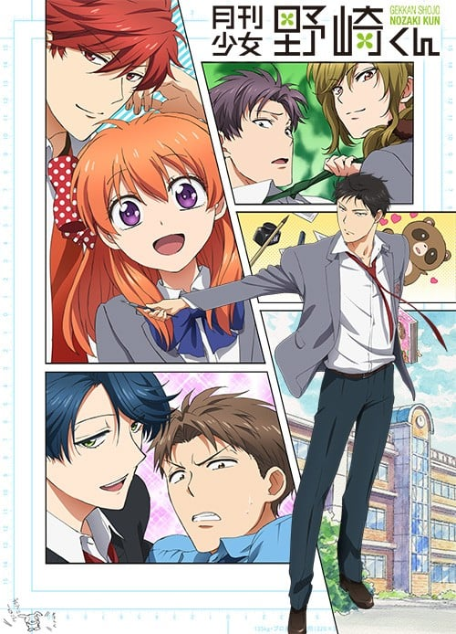
>
| 日文名 | 月刊少女野崎くん |
|:------: |:------------------------------------------: |
| 类型 | 漫改 |
| 新番 | 2014 年 7 月 |
| 集数 | 共12话 |
| 官网 | [http://www.nozakikun.tv/](https://http://www.nozakikun.tv/) |
| 制作 | 動画工房 |
| 导演 | 山﨑みつえ |
| 脚本 | 中村能子 |
| 评分 | 7.8|
| 制片人 | 中村陽介 |

> [!abstract]+ **简介**
> 高中女生佐仓千代好不容易提起勇气向同年级的野崎梅太郎告白，得到的却是野崎的亲笔签名，和“要不要来我家？”的邀请。佐仓虽然对意料之外的展开感到困惑，却还是带着期待来到野崎家，没想到等着她的却是漫画原稿，不知不觉间就顺着野崎的指示开始进行涂黑作业。到这时佐仓才发现野崎是知名少女漫画家梦野咲子。

> [!tip]+ **章节列表**
>- [ ] 第1话：这场恋爱，越来越像少女漫画。 (2014-07-06)
>- [ ] 第2话：新（NEW）女主角请多指教♪ (2014-07-13)
>- [ ] 第3话：暴力VS王子（Violence VS Prince） (2014-07-20)
>- [ ] 第4话：男人有时非战斗不可。 (2014-07-27)
>- [ ] 第5话：「思考」「描绘」恋情的男子。 (2014-08-03)
>- [ ] 第6话：对你施·魔·法♡ (2014-08-10)
>- [ ] 第7话：满脑子都是漫画的野崎同学 (2014-08-17)
>- [ ] 第8话：学园的王子（女生）的烦恼 (2014-08-24)
>- [ ] 第9话：心跳不已的感觉，还足够吗？ (2014-08-31)
>- [ ] 第10话：日益坚固的，是羁绊跟缰绳。 (2014-09-07)
>- [ ] 第11话：萌米♡ (2014-09-14)
>- [ ] 第12话：若这心情不是恋爱，这世上就没有恋爱可言了。 (2014-09-21)
>- [ ] 第1话：这个美男子、男性朋友？?她的男朋友？? (2014-09-24)
>- [ ] 第2话：续・这个美男子、男性朋友？?她的男朋友？? (2014-10-29)
>- [ ] 第3话：连接一切的关系图 (2014-11-26)
>- [ ] 第4话：夏天! 大海! 合宿! (2014-12-24)
>- [ ] 第5话：我和太阳、哪个更耀眼？ (2015-01-28)
>- [ ] 第6话：那件事被渐渐少女漫画化了。 (2015-02-25)

> [!tip]+ **主要角色**
> 
| 角色 | CV | 简介| 角色图片 |
|:----:|:---:|:---:|:--------:|
| 野崎梅太郎 | 中村悠一 | 并不是很受欢迎。外表很普通。 被班里的女生指责「个头太大了碍事!」。 跟班里的所有男生相处得都挺好。 属于相较于女生还是在男生中人气比较高的类型。 讨厌前野。 超喜欢剑先生！ 虽然过程艰辛、但最终还是会画出普通的浪漫少女漫画。 虽然对作品怀有自豪感，却不知为何有些粗率。 不会画背景。 并没有特意隐瞒自己是漫画家的事情。只是大家都不信。 是因为兴趣而画漫画的。 一个人住在作为工作室的公寓里(在学校附近)。 手很巧。擅长料理。 在家里的时候只是有给妈妈打下手的料理经验，一个人住之后能力得到了提升。 有时候因为想要有谁来尝尝自己下足功夫做的料理，会把千代或者御子柴叫到家里来吃。 没有博客·推特。 | 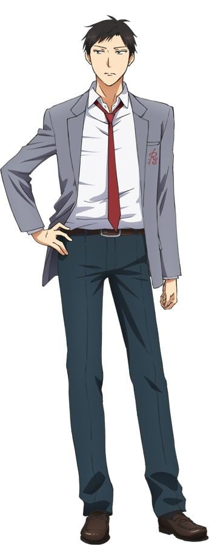 |
| 佐倉千代 | 小澤亜李 | 最喜欢野崎！ 因为是野崎拥护者所以不管野崎做什么基本都会说「喜欢!」。 总体上来说有些迟钝的感觉。 虽然喜欢少女漫画、但并没有特定喜欢的作家，是普通的读者。 美术部除了需要共同制作或是需要大家一起行动(素描之类的)的时候之外基本上是自由参加。 不需要去野琦家帮忙的时候会好好地出席社团活动。 虽说涂黑时用勾线笔的人比较多，但千代用的是画水彩的笔。 佩戴的缎带很有自己的特色、家中有各式各样的缎带(也有奇怪图案的收藏)。 但因为本人似乎是无意识地在收集，所以缎带的收集并不属于兴趣爱好。 | 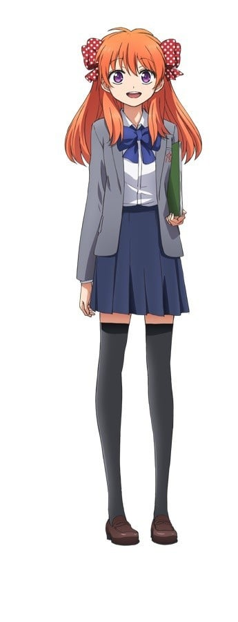 |
| 御子柴実琴 | 岡本信彦 | 耍酷后会害羞。 喜欢萌系的宅男。(美少女游戏、手办等二次元) 与鹿岛是挚友。 大多数时候都很怕生、但面对比自己小的同性(真由·若松等)并不会怕生。 (因为是独生子所以很想尝试当哥哥的感觉) 喜欢的女孩子类型虽然是清纯的类型(二次元幻想) 实际上很受辣妹型女孩的欢迎。 温柔的女孩子反而会怕他。 班里的同学都认为他是个「受女生欢迎的帅哥」。 有时露出难为情的一面也会被善意地认为是「坦率的家伙」。 因为是隐宅所以会保密作为野琦的助手一事。 只是、好像会把其他的助手认作是同类，很容易地就向其敞开心扉。 被女生围住时，会以鹿岛作盾牌逃走。 | 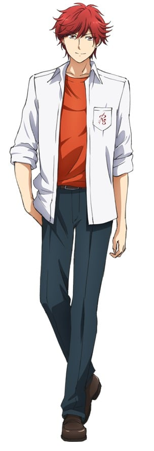 |
| 瀬尾結月 | 沢城みゆき | 被称为「声乐部的罗蕾莱」 KY。但是没有恶意。 身边的朋友虽然时常对结月感到火大、但是能很正常地做朋友。 头发是天然卷。蓬蓬松松。解开辫子后长度到胸部附近。 因为家离学校较近、基本上是骑自行车上学。 心血来潮时也会坐电车上学。 | 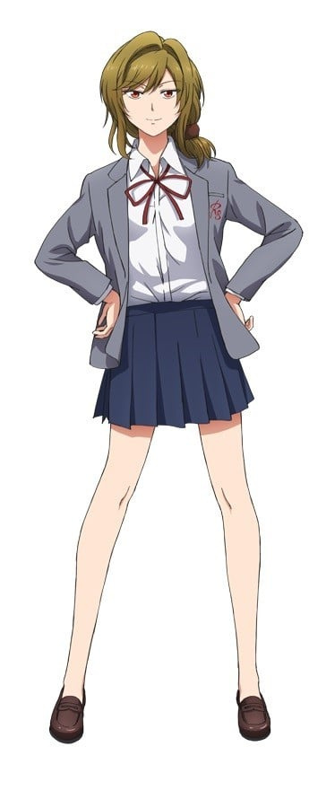 |
| 若松博隆 | 木村良平 | 野琦中学时代的学弟。与初一的若松在篮球部相识。是后辈里关系最好的一个。 因为觉得「打篮球的学长超级帅!」 所以对转行当漫画家的野琦抱有复杂的感情 最近不知道是不是已经放弃了 开始帮野琦的忙了。 但是一有机会还是会邀请野琦「去打篮球吧!!」。 因为是体育系、对于前辈的命令会二话不说地服从。  在贴网点方面展现出意外的才能，但是如果不指定好网点就贴不好(会选择奇怪的网点) 擅长细致的作业。也擅长不考验应用能力的简单作业。 会参加过去的少女漫画采取行动。  患有失眠症、不过现在靠结月的录音带总算有所缓解。 虽然只要是罗蕾莱的歌就算不是新曲也会睡着 但是无论如何也想听新曲。 | 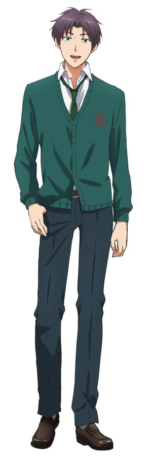 |
| 鹿島遊 | 中原麻衣 | 被称为「学校的王子殿下」。 初三的时候去观看高中的文化祭，在那时看到了堀的演技，因此决定入学浪漫学园以及加入戏剧部。 不擅长勤勉用功却看起来是个天才。 被女孩子包围会很单纯地感到高兴。 平时的声线是普通女孩子的声调，装酷的时候会压低声音。 | 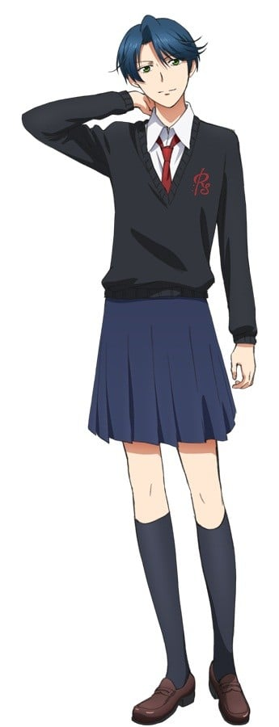 |
| 堀政行 | 小野友樹 | 对演戏十分敬业就算是练习的时候也绝不含糊、总是十分认真。 演员时代时，因演技力+有磁性的嗓音 导致不管说什么台词都会被公认为看起来很帅气。 最近在舞台布景制作上感受到了成就感。  原·演员，现·部长。 因为鹿岛的入部而找到了完美的主角人选、所以辞去了演员一职。 尝试了一次导演和后台工作后，发现比登台表演还要有趣，所以开始专门负责那方面了。 看到那些以鹿岛为目的而来的女孩子们最终被剧情所左右 而或哭泣或微笑后会很有成就感地会心而笑。  对得奖完全没兴趣，只面向学校的普通学生进行戏剧创作。 因此并没有做社会性质或者呼吁性质为话题的剧目，而是在做让所有人都能开心观看的大众戏剧。 所以恋爱方面的戏剧很多、王子殿下也很多。  虽然公开声明过「不吃手工料理」(小学的时候吃了从班里女生那里收到的手工巧克力后闹了肚子，所以从那之后对手工料理敬而远之) 实际上关系好的人做的东西还是可以吃的。 情人节那一话，鹿岛偷偷地送过他手工巧克力，但其实就算不偷偷地给堀也会吃的。 | 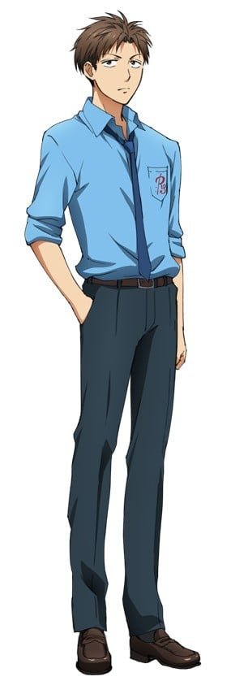 |
| マミコ | 三宅麻理恵 | 内気なヒロイン。モデルは御子柴。 |  |
| 鈴木三郎 | 宮野真守 |  | 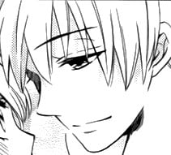 |
| 宮前剣 | 三宅健太 | 野崎的责任编辑，讨厌和人接触，对工作以外的事几乎都不感兴趣，也很讨厌和别人对话。野崎将他的个性视为优点，非常仰慕也常常将他的意见异常正面化。对工作很认真，回信回的很快，对野崎的评价也一针见血。 | 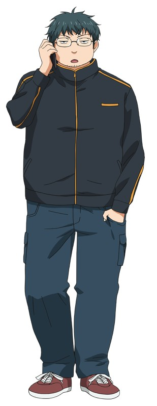 |
| 前野蜜也 | 小野大輔 | 野崎的前任责任编辑，目前是都的责任编辑。 品味奇特，对编辑漫画可说一无所知，但会很得意的提出大家都想得到的建议，还认为是自己的功劳，让野崎变的很讨厌他。 喜欢狸猫，负责的作品经常出现狸猫。 负责《少女罗曼史》的编辑部网志更新，但几乎变成是前野的私人网志。 | 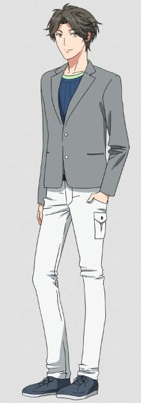 |
| 都ゆかり | 川澄綾子 | 少女漫画家兼女大学生，在《别册少女罗曼史》上连载，用本名当笔名。 和野崎住在同一栋公寓的楼上。 能够画各种类型的少女漫画，因为责任编辑是前野，漫画也受到狸猫入侵，甚至让其他人都认为狸猫才是主角。 | 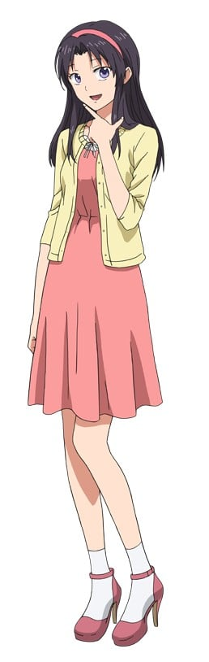 |