> [!bookinfo|noicon]+ **极黑的布伦希尔德**
> 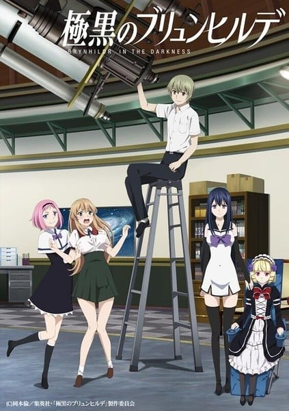
>
| 日文名 | 極黒のブリュンヒルデ |
|:------: |:------------------------------------------: |
| 类型 | 漫改 |
| 新番 | 2014 年 4 月 |
| 集数 | 共13话 |
| 官网 | [http://www.vap.co.jp/gokukoku/](https://http://www.vap.co.jp/gokukoku/) |
| 制作 | ARMS |
| 导演 | 今泉賢一 |
| 脚本 | 北島行徳 |
| 评分 | 5.9|
| 制片人 | 小澤一由,小澤一由、川上竜太郎 |

> [!abstract]+ **简介**
> 高中生・村上良太始终忘不了自己儿时意外害死的青梅竹马。为了完成两人的约定，良太加入天文社继续寻找外星人。某日，班上来了一个跟他青梅竹马长得一模一样的美少女转学生・黑羽宁子。彷佛不食人间烟火的她，究竟有何秘密？

> [!tip]+ **章节列表**
>- [ ] 第1话：因为我在等你 (2014-04-06)
>- [ ] 第2话：魔法使 (2014-04-13)
>- [ ] 第3话：镇死剂 (2014-04-20)
>- [ ] 第4话：消失的记忆 (2014-04-27)
>- [ ] 第5话：天体观测 (2014-05-04)
>- [ ] 第6话：微笑的理由 (2014-05-11)
>- [ ] 第7话：希望的碎片 (2014-05-18)
>- [ ] 第8话：遗留的线索 (2014-05-25)
>- [ ] 第9话：仿制的记忆 (2014-06-01)
>- [ ] 第10话：活着的证明 (2014-06-08)
>- [ ] 第11话：突然的再会 (2014-06-15)
>- [ ] 第12话：魔女猎人 (2014-06-22)
>- [ ] 第13话：想要守护的东西 (2014-06-29)
>- [ ] 第11.5话：无事生非 (2014-09-24)

> [!tip]+ **主要角色**
> 
| 角色 | CV | 简介| 角色图片 |
|:----:|:---:|:---:|:--------:|
| 橘佳奈 | 洲崎綾 | 与宁子一起从研究所中脱逃的“魔法使”，因为魔法使实验导致全身不遂，只有左手手指稍微可以移动，使用机械才能与人对话，身穿哥德萝莉服装。 是一位预知能力者，可以看见死亡相关的未来影像、预知准确度为100%。预知死亡的范围从数秒之后到2日之间、距离太远的场所无法预知。得知预知后，只要改变的行动对未来造成影响就会改变预知的内容。被霞指出“其实想要动就能动，但是宁子会死”。  橘 佳奈（たちばな かな） 声 - 洲崎綾 寧子と研究所を脱走して一緒に暮らす魔法使い。14歳。口が悪いが根は心優しい性格。髪型は縦ロールでゴスロリ服を着ている。実験で全身不随になり呼吸するのも困難だが、左手の指が少し動くためにキーボード付きの機械を使って会話はできる。食べ物を噛むことはできないが飲むことはできるため、食事はミキサーにかけたものを食べている。 「予知」の魔法は発作的に未来の映像を受信し、その予知は100%の確率で当たる。予知は人の死に関わるものだけであり、範囲は数秒後から2日後程度までで、遠く離れた場所の予知はできない。また、予知は行動により未来を変えることが可能で、変わると別の未来が見える。 カズミによると、「動こうと思えば実は動けるが、その代償として寧子が死んでしまう」と言われており、ハーネストの一番上にある非常ボタンを押すことで動けるようになるが、代償として予知が使えなくなってしまうため、寧子を守るため不自由に耐えていた。 | 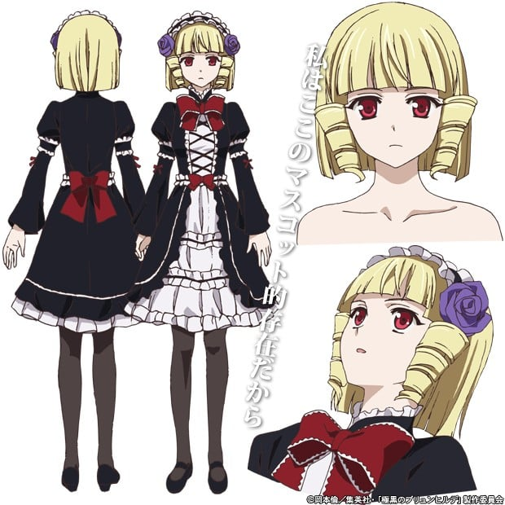 |
| 鷹鳥小鳥 | 田所あずさ | 良太的一年级学妹，与霞同一天转入良太所在的学校。虽然同样从研究所中脱逃，但宁子等人都不记得在研究所中有看过她，识别号1107号的魔法使，身怀秘密而被研究所积极追捕。童颜巨乳，略有天然的性格，紧张时说话会有口吃的现象。在九所长与真子突袭天文台的事件中被九带走。身体内的特拉希尔是九所长特别制造、名为格拉尼的特制品。 曾因佳奈预见她出现在宁子和良太尸体旁并微笑，而被误认为是研究所派来的杀手。事实上会微笑是因为死去的千绘希望她在悲伤的时候也能露出笑容。 可以使用“转换位置”魔法，将自己与其他人的位置对调，但在对方戴墨镜的状况下无法发动。对调后双方的动能都会重置，但是本人似乎不清楚这项特性。能力消耗很大，使用一次之后就会直接挂起。 鷹鳥 小鳥（たかとり ことり） 声 - 田所あずさ カズミと同じ日に転校してきた高校1年生。輸送中の事故で逃走したが、寧子たちとは全く面識がない。風貌はロングヘアで巨乳。天然ボケでおっとりしていて丁寧語を話す。料理と水泳が得意。普段は温厚な人柄だが、やや食いしん坊で、食べ物のことになると目の色が変わるほど執着する。キカコ戦の後、薬が切れていたために山荘で孤独に死のうとしたが、良太と寧子の説得により生きることを決断した。研究所から"1107番"として追われている。 自分と他人の位置を入れ替える「転位」の魔法を使用するが、この魔法は一度使うと必ずハングアップする。他人と手を繋いで発動すれば一緒に移動できる。また、人間以外の動物とも入れ替わることが可能。 その正体は九の妹である怜那を宿主としたグラーネそのもの。天文台襲撃の際に九達に連れ去られ、自身が怜那を生き返らせるための計画に不可欠な存在だと知る。ヴァルキュリアからカズミと初菜を殺した事を知り激高。グラーネの力が覚醒し、ヴァルキュリアをも凌駕する力を身に付ける。しかし同時にグラーネ孵卵の予兆が始まり、女神イズンへ進化が進んでしまう。覚醒による人類滅亡を避けるため、自身のイジェクトを良太に要求。苦悩の末に決断した良太によってイジェクトされ覚醒は未遂に終わり、自身と人類の救済、そして良太達と過ごした日々に感謝する。九には黙っていたものの、自分に怜那の意識があることは知っており、死の間際に兄へ本心を吐露して絶命した。 | 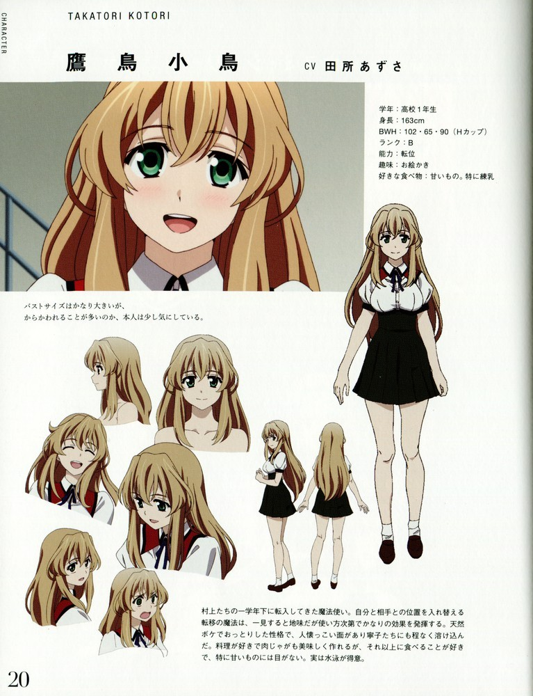 |
| 藤崎真子 | 能登麻美子 | S级，最强大的魔女，代号瓦尔基丽。长得和宁子十分相像，拥有8种魔法，因为太过强大长期以来一直被关在研究所的最深处，并在这期间又衍生出第9和第10种魔法。为回收1107号而被研究所所长独断派出执行任务，由于其危险性，研究所派出了7名A级与AA级擅长防御、压制系魔法的魔女加以监视，但全数被歼灭。脱离管制后，利用搜索魔女的魔法，找出其他魔女并抢夺对方的镇死剂。在研究所一次实验的过程中差点性命不保，但因九不顾自己的性命救她而喜欢上九，得知就算是被九利用的道具也依然喜欢。 已使用的魔法包括破坏、探知（搜索魔女）、空间移动与制造反物质。 藤崎 真子（ふじさき まこ） Sクラスの魔法使い。コードネームは「ヴァルキュリア」。容姿は髪の色を除いて寧子に瓜二つ。人間でも魔法使いでも命を軽く扱うため、研究所の人間からも恐れられていたが、1107番を捕獲するために九所長が独断で外部に出した。 人体を容易く破壊出来る念力をはじめ、魔法使いの探知魔法や瞬間移動魔法、反物質を生み出して山を削るほどの威力の魔法など、様々な魔法を使うことができる究極のハイブリッドであり、封印されている間に9個目と10個目の魔力を発現させた。監視としてつけられていた防御・制圧系の魔法を持つAおよびAAクラスの魔女7人を殺害して鎮死剤を奪い、天文部を強襲した。その後、九と合流し再度天文部を強襲したが、魔女狩りの妨害に遭って小鳥をさらい、九の別荘に逃亡した。 冷酷な性格だが、寧子を殺すことは躊躇いを見せている。また、九にはかつて命懸けで助けられたことで好意を抱き、死んでも命令に従うつもりでいる。九からは単に利用するための存在としか思われていないが、当の本人はまんざらでもなく、むしろ彼のそういった考えに満足している模様。 九が死亡したことにより世界に絶望、人類を滅ぼそうと決意する。 高千穂からは死の女神、「二ヴルヘル」への入口であり、ソーサリアンの生成に必要なものとされている。 | 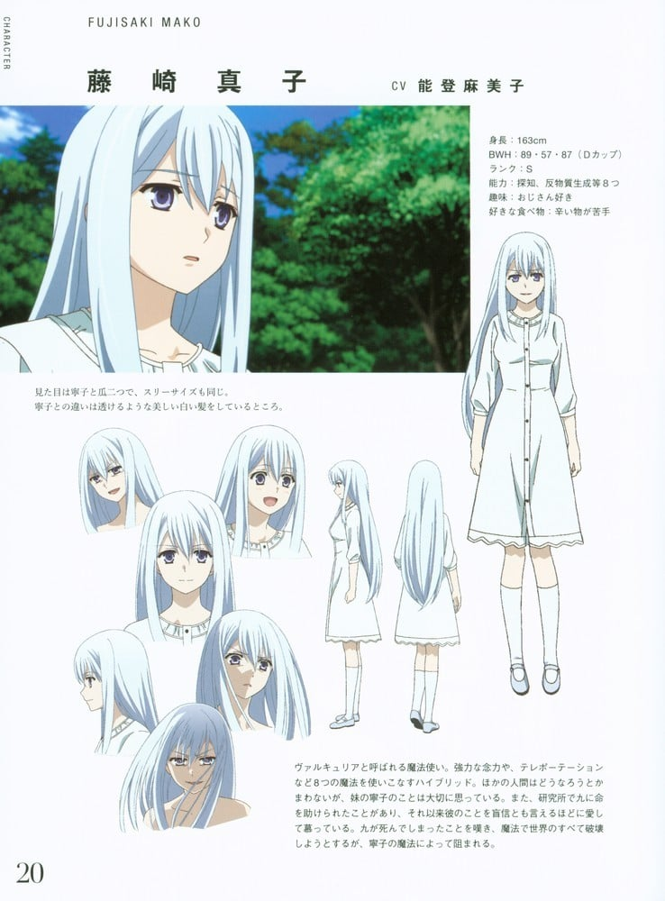 |
| カズミ＝シュリーレンツァウアー | M・A・O | 等级：B级（由于隐藏自己的能力，实际至少有A级） 识别号：2670  与宁子一起从研究所中脱逃的“魔法使”，是一个会说德语的混血儿，很在意自己是个贫乳处女。后来使用名字和美·施里恩曹尔（カズミ・シュリーレンツァウアー，Kazumi Schlierenzauet）以来自奥地利国立学院学生的身份转入良太的班级，成为良太的同班同学。 因为父亲是关西人，操著一口关西腔。喜欢良太，并经常跟他开色情玩笑。 在等级判定时，研究所要求让仪器失误杀人，所以故意放水，造成判定为B级。 能够瞬时计算出质因数分解，因此可以破解网络加密，是可以“操作网络”的魔法使。 | 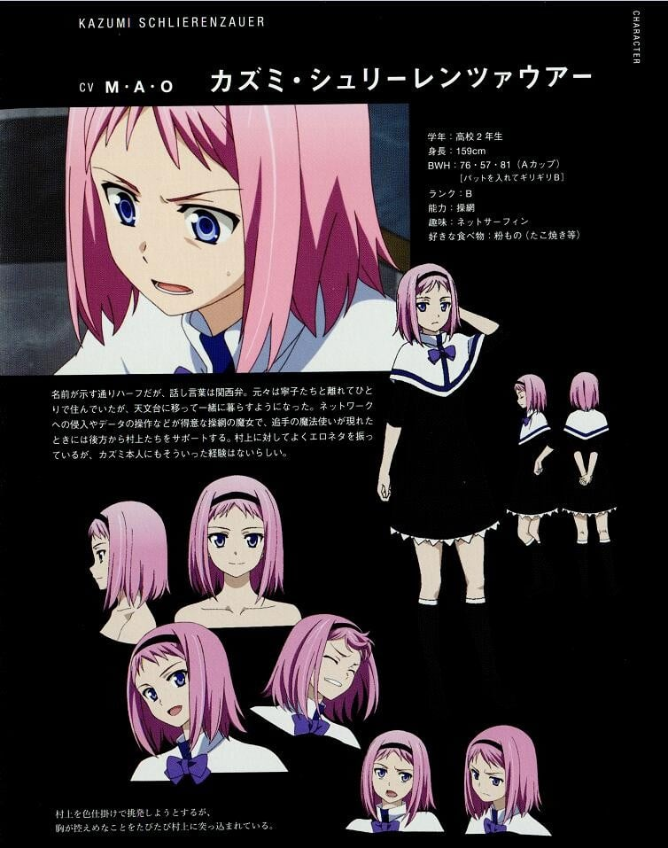 |
| 黒羽寧子 | 種田梨沙 | 良太的同班同学，是转学生，身穿无袖的水手服。容貌酷似他死去的青梅竹马黑猫，身体经过改造后成为“魔法使”，识别号为7620号，作为实验体在研究所中度过了十年，在从研究所移送的途中脱逃。心地善良，总想着帮助别人，并且因为认为自己寿命所剩不多，若能多救一人，自己的生命就发挥了更大的作用，因此有即使失去性命也要救人的倾向。喜欢良太，在良太赞赏其他女生或者跟其他女生亲密接触时眼神便呈现已死状态。 能够一瞬间破坏目视可及的物体，但是无法细微调节力量大小。若对象是人类则无法发挥作用，必须直接接触目标才能发动，曾经使用魔法将自己的腕力短时间内强化。只要使用魔法就会导致记忆像被虫蛀般消失，所以过去的记忆大多已经不见了。因为长期与社会隔絶加上记忆丧失，常识所知甚少，甚至连九九乘法表和小学一年级程度的汉字都不会。最后知道自己的过去，但仍然没有想起任何与良太有关的记忆。 黒羽 寧子（くろは ねこ） 声 - 種田梨沙 本作のメインヒロイン。良太のクラスに転校してきた女子生徒。容姿がクロネコと酷似しており、当初良太は気づいていなかったが胸の辺りに同じようなホクロもある。身体を改造された「魔法使い」であり、実験台として10年間研究所にいたが移送中に脱走し、捕まると殺されるという状況に追い込まれている。 自らの周辺に力を伝えて大きな物体をも一瞬で破壊する、「破撃」の魔法を使う。ただし、細かい調節はできず小さなものには向かない。基本的に生き物には通じないが、腕相撲など人間に直接触れた場合には自らの腕力を一時的に強化することができる。近くにある物体を操作して飛ばすことも可能である。ガラス越しでも見えているものには効果がある。 魔法を使用する度に虫食いのような形で記憶が欠けてしまい、過去の記憶の多くが抜け落ちている。長期間一般社会と隔絶した生活を送っていたこともあり、一般常識に疎く、簡単な漢字も読めず九九も知らないという状態になっているが、頭が悪いわけではなくむしろ明晰かつ優秀で、後に高校の授業にもついていけるようになったうえ、期末試験では良太を抜いて学年1位となった。 カズミによると、元Sクラスの「ヴァルキュリア」と呼ばれる魔法使いであり、最強の破壊魔法を持っていたが、記憶と共に力も失ってしまい、他のBクラスと同様に処分されそうになった。 良太が絶体絶命の窮地に陥った時に現れた奈波の記憶によると、ハーネストの一番上にある非常ボタンを押すことで封印を解除できるが、99.9％の確率で解除に失敗して溶けて死んでしまうと言われている。 | 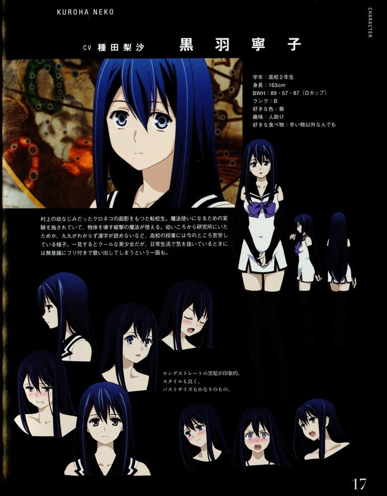 |
| 村上良太 | 佐藤利奈 | 男主角，是一位想要加入NASA的高中2年生。他是天文社唯一的社员，每天使用天文台望远镜観察星空。他讨厌女生在学校中相当有名，但其实只是不擅长应付。学业成绩相当出色，全国模拟考试排名全国第3位，拥有见过一次就忘不掉的记忆能力。父亲和弟弟在其2岁时因意外死去。与母亲一起生活，因为母亲工作繁忙，负责家中杂务。以做家庭教师赚外快，最近收入变成魔女们的伙食费来源。曾经认出宁子就是黑猫，但由于让沙织发动“时间倒回”而失去这部分的记忆。被奈波约谈时可能是记忆力太强又或者魔法使用失效成功骗过奈波，想帮助奈波但最后仍来不及，奈波将她的意识转移到良太的记忆里，可能消耗良太脑袋大半的内存。在霞被预知死亡时成功运用战术帮助霞逃过死劫，之后意外的发现原来宁子就是黑猫。在天文台被九跟瓦尔基里突袭时为了保护宁子而受重伤，但被初菜救回。天文台被突袭后将阵地转移至小五郎的家，利用PDA连络魔女猎人，以外星人的受精卵为交换条件询问有关小鸟的事。 村上 良太（むらかみ りょうた） 声 - 逢坂良太、佐藤利奈(幼少期) 本作の主人公。NASAの研究員を目指す高校2年生。唯一の天文部員であり、毎日天文台の望遠鏡で星を観察している。学校では女嫌いとして有名だが、クロネコとの過去から接するのが苦手なだけであり、巨乳好きな一面も見せる。全国模試で全国3位になるほど学業の成績は良く、一度見たものを全て脳が記憶する能力がある。2歳の頃に父親と弟は事故で他界しているため、厳格な母親と2人で暮らしており、家事全般を担当している。家庭教師のアルバイトをしている。 | 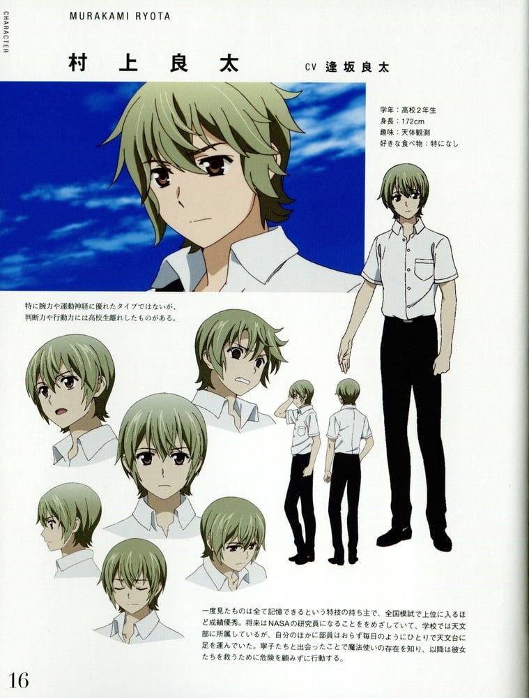 |
| 九怜奈 |  | 九 怜奈（いちじく れな） 千怜の妹。千怜を慕っていたが、病気で死んでしまった。 | 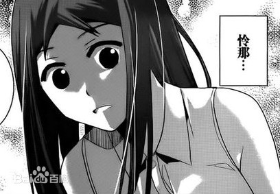 |
| 斗光奈波 | 沼倉愛美 | 斗光 奈波（とこう　ななみ） 対象の目を見ることで記憶を覗き、削除できる「視憶」と、記憶を書き込む「操憶」の魔法を持つ魔法使い。クラスは視憶だけならAA+、操憶を加味すればAAAとされている。サングラスをかけている相手には効果が無い。また、記憶削除の魔法は良太には効かない。識別番号は5210番。グラーネ、1107番を回収するために九が用いた。無類の甘党。 1日の自由を得るために研究所の監視役の記憶を操作し、単独で天文部の魔法使いたちの居場所をつかむものの、寧子の人の良さに触れたことで良太らの仲間となった。しかし、直後に記憶を取り戻した監視役によりイジェクトされて死亡した。その際、天文部の魔法使いたちから自身の記憶を削除し、良太には自身の人格を書き込むことで研究所の秘密を伝えた。 | 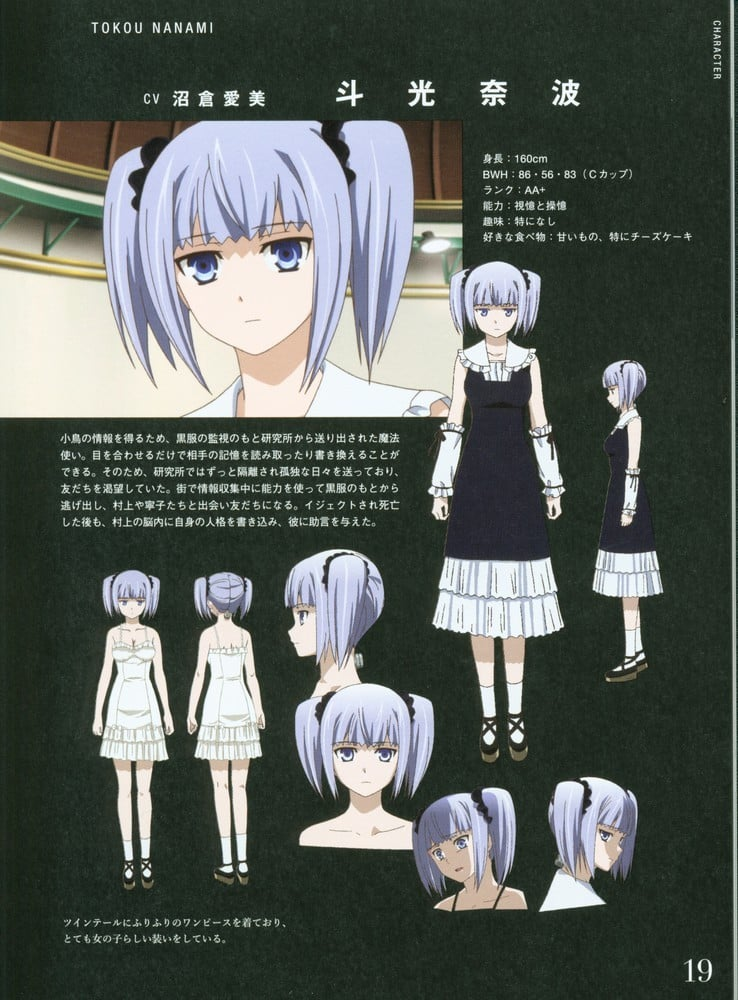 |
| 若林初菜 | 内山夕実 | 若林 初菜（わかばやし はつな） 寧子たちと一緒に研究所を脱走し、別行動していた魔法使い。ショートヘアで左側に一房のお下げがある。脱走時に逃げ遅れたことで大量の鎮死剤を入手していたため、一人で生活していた。その後、ヴァルキュリアに襲撃され級友に魔法を見られたことと、鎮死剤を奪われたことで、天文部の魔法使いを頼って合流した。 合流直後に良太が信用できる人間かどうか試したが、自分を犠牲にしても助けようとしてくれた良太に好意を抱き、その場で告白しキスしている。 頭を潰されても死なない「再生」の魔法を使用する。イジェクトされたり鎮死剤切れになると死んでしまうが、脱走後に他人の怪我を治すことも可能になっており、自分の体が溶けることを代償に、死んだ直後の人間を生き返らせることもできる。 小鳥を救出すべく、寧子達と九邸へ侵入するもヴァルキュリアによって、自らの魔法で再生が出来ない程に全身を粉砕される。しかしハーネストから再生されるような描写があるため生死不明。 |  |
| 柱谷小五郎 | 伊藤健太郎 | 柱谷 小五郎（はしらたに こごろう） 声 - 伊藤健太郎 良太の叔父。32歳の独身。アメリカの研究機関から招聘を断り、地方の大学で生化学の教授をしている。超常現象には否定的だったが、寧子の魔法を直接見たことで興味を示して良太に協力し、彼から鎮死剤の複製と宇宙人の受精卵の調査を頼まれた。髪は長めで黒く、背が高くフルリムのセルフレーム眼鏡をかけている。普段は瞑ったかのような細く水平な目をしているが、瞼を開くと鋭い吊り目である。父親を亡くしている。研究所所長である九とは学生時代の旧友であるが、現在は疎遠となっている。 本人いわく独身なのは「モテないからではなく女はバカなので嫌いだから」とのこと。自転車に乗っても吐いてしまうほど、極度の乗り物酔い体質でもある。 | 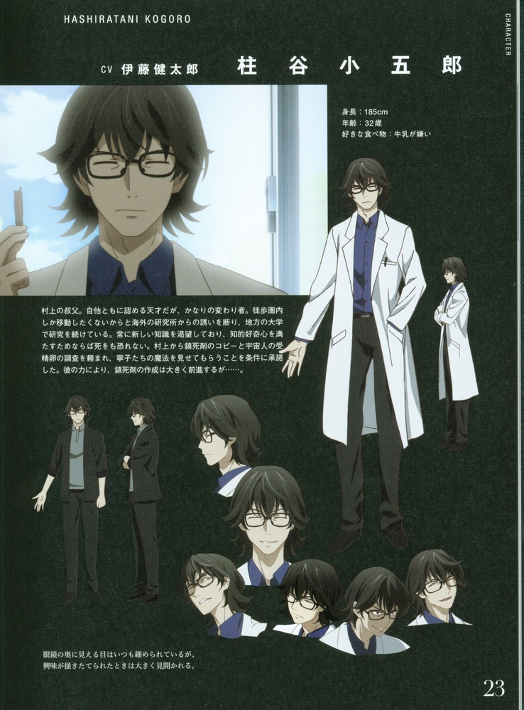 |
| キカコ | 濱頭優 | キカコ 寧子たちが恐れているAA+クラスの魔法使い。識別番号は5010番。ワニのように縦長の瞳孔で目の周りには鱗があり、歯も鋭く尖っている。あまり言葉を話さない。シノたち脱走魔法使いのハーネストを回収する任務の際、寧子たちと交戦した。良太に拘束されたが見逃され、研究所へ戻った。 ハイブリッドではないが、「砲撃」の魔法により口からビームを吐き、広域を破壊する。射程距離も長く威力も強力だが、射出までに数秒のタイムラグがあり、攻撃中の本人は隙だらけになる。「ハーネスト」を素手で引きちぎるほどの腕力もある。右腕の服の中から鏃の付いたロープを発射でき、主に相手を捕らえるために使用する。 | 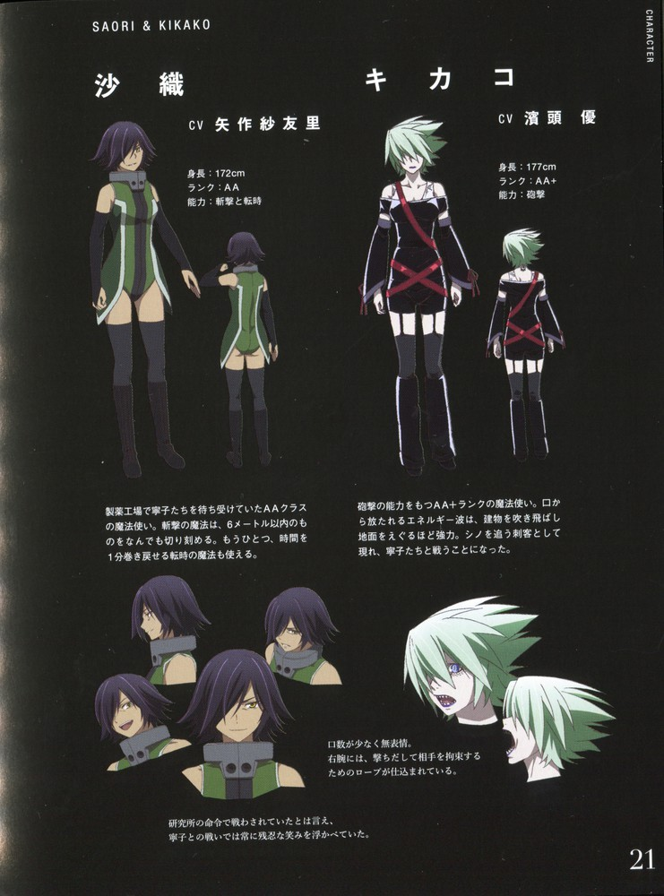 |
| 九千怜 | 東地宏樹 | 九 千怜（いちじく ちさと） 声 - 東地宏樹 研究所の所長を任されている淡い色の髪をした男性。魔女の管理とソーサリアンの組成が仕事だが、寧子らの逃走により作業が遅れている。高千穂からは優秀な研究者であり、計画に欠かせない人物であると一定の評価を受けている。 東大出身であり、小五郎とは同じゼミの出身で、史上最高の成績で大学院に進み、研究所に入った。 脱走したヴァルキュリアの回収のため研究所を出るが、真の目的はヴァルキュリアと1107番を独占し、死んだ妹を蘇らせるためだった。 妹の怜那を女神イズンとして蘇らせるためにグラーネの宿る小鳥を拉致し、素体として失敗作（小鳥に怜那の意識が存在していないと思われていたため）である彼女の内部にあるグラーネを別の素体に移し替え、復活の時を狙っていた。やがて小鳥のドラシルが孵卵し、怜那の意識が存在しない素体でグラーネが覚醒してしまったため、計画は失敗に終わる。しかし小鳥が死に際に発した言葉によって、彼女の意識は怜那のものであったと再認。その後、ヘクセンヤクトの銃撃から怜那の意思に基づき、ヴァルキュリアを庇って致命傷を負う。人間の感情を蔑んでいた自身もまた、妹を救うための情を持って動いていたことを情けなく思い、同時に計画の失敗を嘆きながら絶命した。 | 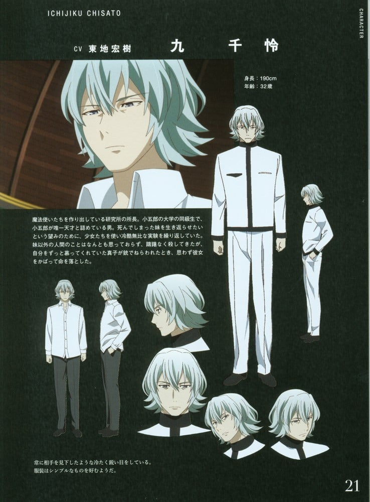 |