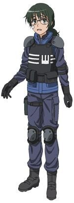

> [!bookinfo|noicon]+ **某科学的超电磁炮**
> 
>
| 日文名 | とある科学の超電磁砲 |
|:------: |:------------------------------------------: |
| 类型 | 小说改 |
| 新番 | 2009 年 10 月 |
| 集数 | 共24话 |
| 官网 | [http://toaru-project.com/railgun/](https://http://toaru-project.com/railgun/) |
| 制作 | J.C.STAFF |
| 导演 | 長井龍雪 |
| 脚本 | 國澤真理子,水上清資,大野木寛,浅川美也,天河信彦,砂山蔵澄,伊藤美智子 |
| 评分 | 7.5|
| 制片人 | 柏田真一郎 |

> [!abstract]+ **简介**
> 故事发生在面积占据东京都的三分之一，居住着230万名人口且其中八成人口是学生的巨大都市“学园都市”。学园都市的所有学生均会接受超能力开发，借由药物、催眠术与通电刺激等方式取得超能力。能力者以范围和威力分为LV0至LV5。

主角御坂美琴是学园都市中仅七位LV5（超能力者）的其中一人，排行第三。她是拥有操纵电击能力的“电击使”，站在电击能力的顶峰，因而被称为“超电磁炮”。

本作不但通过美琴的视角来描绘学园都市的平常而不平凡的日常生活，也叙述了学园都市秘密进行非人道性质的实验，从而使大家对于本作及本篇《魔法禁书目录》的背景（世界观）的认识也慢慢变得清楚。

> [!tip]+ **章节列表**
>- [ ] 第1话：电击使 Electro Master (2009-10-02)
>- [ ] 第2话：炎日下工作 必须补充水分 (2009-10-09)
>- [ ] 第3话：被盯上的常磐台 (2009-10-16)
>- [ ] 第4话：都市传说 (2009-10-23)
>- [ ] 第5话：某两人的新人研修 (2009-10-30)
>- [ ] 第6话：这种事大家都很积极哦 (2009-11-06)
>- [ ] 第7话：能力与力量 (2009-11-13)
>- [ ] 第8话：幻想御手（Lever Upper） (2009-11-20)
>- [ ] 第9话：多数派报告 (2009-11-27)
>- [ ] 第10话：沉默的多数派 (2009-12-04)
>- [ ] 第11话：木山老师 (2009-12-11)
>- [ ] 第12话：ＡＩＭ猛兽 (2009-12-18)
>- [ ] 第13话：虽说比基尼很招人目光不过连衣裙很能衬出身体的线条只适合苗条的人穿呢 (2009-12-25)
>- [ ] 第14话：特别训练 (2010-01-08)
>- [ ] 第15话：武装无能力集团 (2010-01-15)
>- [ ] 第16话：学园都市 (2010-01-22)
>- [ ] 第17话：暑假的一些事 (2010-01-29)
>- [ ] 第18话：罗汉柏园 (2010-02-05)
>- [ ] 第19话：盛夏祭典 (2010-02-12)
>- [ ] 第20话：乱杂开放 (2010-02-19)
>- [ ] 第21话：声音 (2010-02-26)
>- [ ] 第22话：Level6（以非神之身到达天上意思者） (2010-03-05)
>- [ ] 第23话：现在、你眼中看到什么? (2010-03-12)
>- [ ] 第24话：亲爱的朋友 (2010-03-19)
>- [ ] 第1话：MMR ～更加完整的超电磁炮～ (2010-01-29)
>- [ ] 第2话：MMRⅡ ～更加完整的超电磁炮Ⅱ～ (2010-05-28)

> [!tip]+ **主要角色**
> 
| 角色 | CV | 简介| 角色图片 |
|:----:|:---:|:---:|:--------:|
| 佐天涙子 | 伊藤かな恵 | 栅川中学一年级，初春饰利的同班同学，表面上是无能力者（LV0），实质上是掀裙能力（underwear-peeking)LV5的超能力者。留着长发及肩的黑发，发饰是樱花。以掀裙子代替打招呼，并且每天都这样对待初春。拥有天真烂漫、充满幻想的性格。对于初春的内裤有着强烈的憧憬，也对掀裙子能力没有进步的事比较烦恼，所以对于“幻想御手（LEVELUPPER,可以使能力升级)”很有兴趣。  后宫有：正妻初春，爱人1号炮姐，3P希望潜在者白井读作变态。 |  |
| インデックス | 井口裕香 | 隶属于英国清教第零圣堂区“必要之恶教会”的修女。正式名称为“Index-Librorum-Prohibitorum”（禁书目录），年龄约14-15岁，外表是12-13岁的幼儿体型。平常穿着有金色刺绣的纯白修女服。描写时经常使用纯白修女。 她是使用完全记忆能力记忆了10万3000本魔道书的魔道图书馆。虽然书籍内容是一般人只要看就会发疯的危险物品，却能够改写世界的常识，企图夺取内容的人前仆后继的到来。逃亡途中从屋顶上摔下来，挂在上条房间的阳台上，在此和上条相遇。 有生气时咬别人头的坏习惯（都是上条）。喜欢吃东西的食欲少女。因为必须读各种语言的魔道书，精通各种语言。反之，拿科学与机械没辄。 魔法名为“Dedicatus545”（献身的羔羊守护强者的知识）。本身无法使用魔术，不过可以使用介入他人咏唱阻碍发动与效果的“强制咏唱”与抓出对手教义的矛盾之处，使对方的精神暂时受到破坏的“魔灭之声”。 能够做出某种程度的自卫行为。同时能够从广大的魔道书知识中取得情报，把握局势和定订作战计划。 |  |
| 上条当麻 | 阿部敦 | 高中1年级生，拥有能消除一切异能之力的右手“幻想杀手”（Imagine Breaker）。由于机器无法测量，被当作LV0的无能力者。（科学势力所重点“看护”的原石之一）因其右手，接二连三被卷入各种灾难事件。如果用守恒定律解释的话、他的好运并不是无缘无故的消失了，而是转移给别人（桃花运的原因）。常用“让我打碎这个幻想！”作为使用“幻想杀手”时的台词。其“幻想杀手”被亚雷斯塔认为阻碍自我计划的误差与意外，在保持着中立态度的同时用其右手帮助并救赎了不少角色（收入后宫），目前仍对其真实能力不明，上条当麻也开始准备去了解自己的右手（新约2结尾）目前与一方通行滨面一同面对新的敌人~ |  |
| 御坂美琴 | 佐藤利奈 | 在学园都市中只有七人的等级五超能力者排行第三。拥有“超电磁炮(Railgun)”称号的电击超能力者。对电流和电磁力的控制出神入化。独有招牌特技“超电磁炮”，以电磁力将金属作为电磁炮以3倍音速射出，一般使用方便携带的游戏币，但也可控制更大的物体。使用电击产生的电磁波对机器有不好的影响，在本作中破坏了手机、有线电视，警备机器人等无数机械。还可放出高压电流枪、使用电磁力自由控制金属，招来真正的雷击或是制造电磁爆。  即使在贵族女校就读，行动却相当粗鲁，有以“四十五度斜角攻击机械维修法”（主要是踹自动贩卖机喝免钱饮料）的行为，对年纪较大的上条依旧口气狂妄。因此，主角曾说她完全没有大小姐该有的风范。但实际上是直率单纯且暗藏着自己特有的笨拙温柔（傲娇）的人。  性格好胜，每次向上条当麻挑战都被随便应付过去。随着屡次的接触，变得相当在意上条。  初期上条称她为“放电国中妹（Bilibili）”，茵蒂克丝则称她为“短发”。相当喜欢呱太为主题的饰品，爱好很低龄化，喜欢穿孩子气的内裤，或是在常盘台初中的制服裙下穿白色短裤。受到学妹白井黑子的爱慕。很喜欢动物，尤其是猫。其实每天都会偷偷去喂聚集在宿舍后面的野猫，但由于身体会放出微弱电磁波的关系被猫讨厌，每次野猫都跑的一只不剩，只剩美琴自己孤单一人拿着猫食，不过本人仍然不肯放弃的每天都去喂猫。  “这本轻小说真厉害！2010年”年度人气女角色首名。 “这本轻小说真厉害！2011年”人气女性角色排名首名。  在2010年拿下国际最萌联盟比赛的亚军。 在华人读者群中的绰号是“傲娇超电磁炮”，简称“傲娇炮”。 |  |
| 白井黒子 | 新井里美 | 《魔法禁书目录》系列配角、外传《科学超电磁炮》主角，学园都市中名校常盘台女子中学的一年级生，御坂美琴的学妹兼室友，能力为Level 4的空间移动，双马尾茶色头发的少女。 平常举止都很“淑女”，句尾有“~ですの（是哦）”的独特大小姐腔调。非常仰慕御坂美琴，甚至到近乎变态的程度，称呼美琴为“姐姐大人”。喜欢冲击力极强、布料很少的泳衣和内衣裤。第177活动支部所属风纪委员，具有很强的责任感和正义感。 |  |
| 姫神秋沙 | 能登麻美子 | 就读学园都市名校“雾之丘女子学院”。穿着巫女服的长发美人。拥有非常稀有的原石类能力“吸血杀手（Deep Blood）”，血液能吸引吸血鬼，但吸血鬼一接触她的血就会被立刻死去（母亲、好友也因此被害），小时候住在京都的小村，但因吸血杀手的能力而引来外来的吸血鬼，因此村民被吸血而成为吸血鬼村民后也去吸姬神的血，所以全部村民也死亡，后来姬神被三泽补习班带走（因想研究吸血杀手），因而被卷入三泽补习班的争斗。事件结束后，配戴简易版的“移动教会”凯尔特十字架，封住能力并寄住小萌老师家中（小说SS时搬入学生宿舍），同时转入上条班上。在大霸星季被欧莉安娜·汤森误认为敌人而被打成重伤[2]。虽然表情变化少，但也不是完全面无表情，否认自己是电波系，最初和上条等人见面时自称是魔法师，原因是因为有带着魔杖（但其实这魔杖是一根警棍）以及因为小时候的梦想是成为魔法师，声称自己的魔杖（警棍）是新素材。拥有十分强劲的医疗知识（特别有关血液方面）及医疗技术。 对上条当麻怀有类似恋爱般的情感，不过本人其实对此没有什么自觉。 之所以穿巫女服是因为在三泽补习班中是以巫女为学习课程。 每天在午休时都是吃自己带的便当，料理能力十分之好。 |  |
| 月詠小萌 | こやまきみこ | 上条的班导（所教的科目是化学）。外表怎么看都是个小学生（身高135厘米），实际是二十岁以上、早已大学毕业的成人，被誉为学院都市七大不可思议事件之一。喜欢抽烟喝酒，被黄泉川称为“堆积如山的人体烟灰缸”，酒量非常好，能轻松饮最少5升的酒。主要教授的科目是化学，喜欢照顾别人，兴趣是保护离家出走的少女，因本人精通社会心理学、环境心理学、行动心理学及交通心理学，所以经常出现在离家出走的少女的场所，找到离家出走的少女就会去帮助。一般的车脚踩不到油门和煞车，只能开残障者用车。非常喜欢教导学生，失去教学机会时会相当难过。上条曰：“越看到坏孩子就越开心”。经常和黄泉川和铁装一起去澡堂以及去酒会。 记得救茵蒂克丝及姬神的治愈魔法，但因为本身并不懂使用魔法，所以就算记得也不能用。 史提尔·马格努斯曾说过小萌是一位十分厉害的人，因为在史提尔·马格努斯所设置的不让人接着的符文中，只要史提尔一走出符文的有效范围，小萌就能立即找到，以及史提尔曾想过，小萌和茵蒂克丝非常相似，身材娇小，天真烂漫，为了他人而生气，为了他人而哭泣，染上了他人的血，因此泪流不止的样子，及是完全不在意体格的差别，无视人与人之间的距离来踏入他人心中，看似旁若无人的举动，其实都在为他人着想，为了阻止他人受伤，会一直执著地大声骂人。 用了“薛定谔猫箱”来解释超能力的原理。 目前让结标淡希住在她家。现在受到史提尔的影响，抽烟时会用嘴角叼著烟。 |  |
| 初春飾利 | 豊崎愛生 | 栅川初中一年级，和黑子同为第177支部的风纪委员。留着黑色短发，头戴花圈，远看好像头顶着花瓶。白井的好友兼拍挡。对贵族大小姐的生活相当憧憬，很喜欢婚后光子所饲养名叫爱卡迪莉娜的蟒蛇。害羞谦逊，喜欢吃甜食，体能很差。但对风纪委员这项工作很认真。 能力为等级一的定温保存（Thermal Hand），只能做到使拿着的物体保持一定温度。黑客能力高超，工作时负责运用电脑处理信息，技术让专业人员都为之吃惊。独力设计“书库”的防火墙，击败许多网络黑客的入侵，是都市传说中“守护神（Gatekeeper）”的正体（但本人并不知晓）。 |  |
| 婚后光子 | 寿美菜子 | 常盘台中学2年级生，暑假期间转学进来的转学生，是努力系少女。等级4的空气控制类能力者（空力使い（エアロハンド／Aero Hand）），可以将碰触的物体使其像导弹一样射出。能够轻易将一台大卡车甚至重达几十吨重的电波塔喷射出去。 出身名门的她平时总是展现一副自信的模样，为人倒是十分和善，私底下却因交不到朋友而落寞，想建立派系成为领袖也是为了能交到朋友，但在想通之后放弃。在一场机缘下跟御坂美琴成了朋友。个性善良，会擦拭初次见面的弃童沾上霜淇淋脸庞。是一位观察力高的能力者，能够看出美琴和御坂妹的不同，以为御坂妹是美琴的双胞胎妹妹。 在大霸星祭中与美琴搭挡出赛两人三脚比赛，以绝佳的默契获得第一。而在后来在代替受伤的黑子与美琴再度搭挡参赛时，得知了御坂妹遭人掳走一事，自愿代替身陷囹圄的美琴去查探食蜂的目的以及救出御坂妹妹。为此展现出她能力强大的破坏性。 |  |
| 鉄装綴里 | 遠藤綾 |  |  |
| 湾内絹保 | 戸松遥 | 常盘台初中一年级生，游泳部社员，白井黑子的同班同学。能力为水流操作系（Hydro hand），Level 3。曾在被混混调戏时为御坂美琴搭救，之后对美琴抱有仰慕之情。和泡浮一起成为婚后光子的朋友。 性格温驯，难以对别人发脾气，对负面情绪管理得十分好，甚至已经到完全呆掉的情况（例如要求泡浮向她发脾气）。十分重视朋友。 在战斗时和泡浮有十分良好的默契。在有水的地方战斗会提高战斗力。能无视水量地控制液态水，但不能对多个水球作控制（最多只能控制4个），不过可以不断地以“分裂”和“融合”水块去隐瞒。 |  |
| 泡浮万彬 | 南條愛乃 | 常盘台初中一年级生，游泳部社员，白井黑子的同班同学。能力为流体反发（フロートダイヤル，Floatdial），Level 3。对御坂美琴抱有仰慕之情。湾内绢保的好友，和湾内一起成为婚后光子的朋友。 性格和湾内一样温驯，难以被惹怒。 在战斗时和湾内有十分良好的默契。能够控制自身及四周的浮力，改变事物的流动方向，增加或减少人和物件的重量。能够运用能力增强跳跃力，也可于水面上行走。 |  |