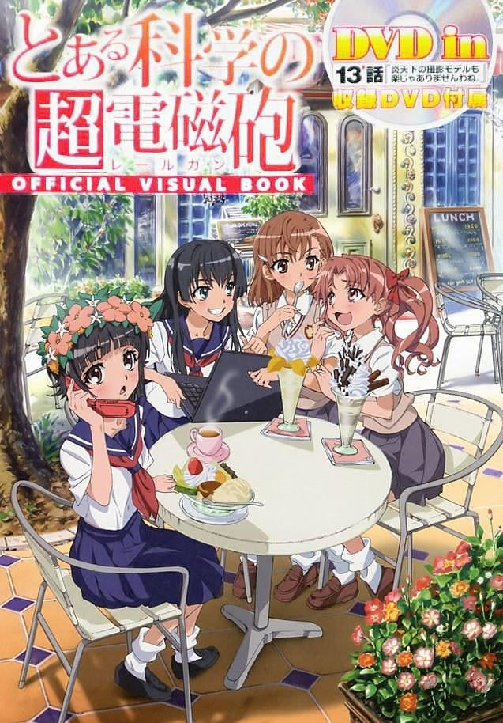
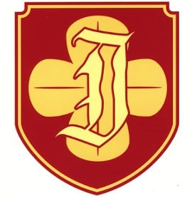

> [!bookinfo|noicon]+ **某科学的超电磁炮 OVA**
> 
>
| 日文名 | とある科学の超電磁砲 炎天下の撮影モデルも楽じゃありませんわね |
|:------: |:------------------------------------------: |
| 类型 | 小说改 |
| 新番 | 2010 年 10 月 |
| 集数 | 共1话 |
| 官网 | [http://www.project-railgun.net/](https://http://www.project-railgun.net/) |
| 制作 | J.C.STAFF |
| 导演 | 長井龍雪 |
| 脚本 | 水上清資,ヤスカワショウゴ |
| 评分 | 7.2|
| 制片人 | 田部谷昌宏 |

> [!abstract]+ **简介**
> 由镰池和马撰写的轻小说《魔法禁书目录》作为电击文库最畅销的作品不仅公布了动画第二期的消息，其由冬川基连载的漫画外传作品《某科学的超电磁炮》由于炮姐的高人气其受欢迎程度也一点不亚于本篇作品。传出在7月24日发售的《某科学的超电磁炮OFFICIAL VISUAL BOOK》中将附赠一话OVA《第13話 – 炎天下の撮影モデルも楽じゃありませんわね。》当作DVD的特典。如今，在炮姐漫画的第5卷上又公布了《某科学的电磁炮》在10月29日即将发售OVA的消息。

> [!tip]+ **章节列表**
>- [ ] 第1话：#EX 御坂学姐现在是焦点人物 (2010-10-29)
>- [ ] 第1话：#13' 炎炎酷日下做摄影模特也不轻松呢 (2010-07-24)

> [!tip]+ **主要角色**
> 
| 角色 | CV | 简介| 角色图片 |
|:----:|:---:|:---:|:--------:|
| 佐天涙子 | 伊藤かな恵 | 栅川中学一年级，初春饰利的同班同学，表面上是无能力者（LV0），实质上是掀裙能力（underwear-peeking)LV5的超能力者。留着长发及肩的黑发，发饰是樱花。以掀裙子代替打招呼，并且每天都这样对待初春。拥有天真烂漫、充满幻想的性格。对于初春的内裤有着强烈的憧憬，也对掀裙子能力没有进步的事比较烦恼，所以对于“幻想御手（LEVELUPPER,可以使能力升级)”很有兴趣。  后宫有：正妻初春，爱人1号炮姐，3P希望潜在者白井读作变态。 |  |
| 上条当麻 | 阿部敦 | 高中1年级生，拥有能消除一切异能之力的右手“幻想杀手”（Imagine Breaker）。由于机器无法测量，被当作LV0的无能力者。（科学势力所重点“看护”的原石之一）因其右手，接二连三被卷入各种灾难事件。如果用守恒定律解释的话、他的好运并不是无缘无故的消失了，而是转移给别人（桃花运的原因）。常用“让我打碎这个幻想！”作为使用“幻想杀手”时的台词。其“幻想杀手”被亚雷斯塔认为阻碍自我计划的误差与意外，在保持着中立态度的同时用其右手帮助并救赎了不少角色（收入后宫），目前仍对其真实能力不明，上条当麻也开始准备去了解自己的右手（新约2结尾）目前与一方通行滨面一同面对新的敌人~ |  |
| 御坂美琴 | 佐藤利奈 | 在学园都市中只有七人的等级五超能力者排行第三。拥有“超电磁炮(Railgun)”称号的电击超能力者。对电流和电磁力的控制出神入化。独有招牌特技“超电磁炮”，以电磁力将金属作为电磁炮以3倍音速射出，一般使用方便携带的游戏币，但也可控制更大的物体。使用电击产生的电磁波对机器有不好的影响，在本作中破坏了手机、有线电视，警备机器人等无数机械。还可放出高压电流枪、使用电磁力自由控制金属，招来真正的雷击或是制造电磁爆。  即使在贵族女校就读，行动却相当粗鲁，有以“四十五度斜角攻击机械维修法”（主要是踹自动贩卖机喝免钱饮料）的行为，对年纪较大的上条依旧口气狂妄。因此，主角曾说她完全没有大小姐该有的风范。但实际上是直率单纯且暗藏着自己特有的笨拙温柔（傲娇）的人。  性格好胜，每次向上条当麻挑战都被随便应付过去。随着屡次的接触，变得相当在意上条。  初期上条称她为“放电国中妹（Bilibili）”，茵蒂克丝则称她为“短发”。相当喜欢呱太为主题的饰品，爱好很低龄化，喜欢穿孩子气的内裤，或是在常盘台初中的制服裙下穿白色短裤。受到学妹白井黑子的爱慕。很喜欢动物，尤其是猫。其实每天都会偷偷去喂聚集在宿舍后面的野猫，但由于身体会放出微弱电磁波的关系被猫讨厌，每次野猫都跑的一只不剩，只剩美琴自己孤单一人拿着猫食，不过本人仍然不肯放弃的每天都去喂猫。  “这本轻小说真厉害！2010年”年度人气女角色首名。 “这本轻小说真厉害！2011年”人气女性角色排名首名。  在2010年拿下国际最萌联盟比赛的亚军。 在华人读者群中的绰号是“傲娇超电磁炮”，简称“傲娇炮”。 |  |
| 白井黒子 | 新井里美 | 《魔法禁书目录》系列配角、外传《科学超电磁炮》主角，学园都市中名校常盘台女子中学的一年级生，御坂美琴的学妹兼室友，能力为Level 4的空间移动，双马尾茶色头发的少女。 平常举止都很“淑女”，句尾有“~ですの（是哦）”的独特大小姐腔调。非常仰慕御坂美琴，甚至到近乎变态的程度，称呼美琴为“姐姐大人”。喜欢冲击力极强、布料很少的泳衣和内衣裤。第177活动支部所属风纪委员，具有很强的责任感和正义感。 |  |
| 初春飾利 | 豊崎愛生 | 栅川初中一年级，和黑子同为第177支部的风纪委员。留着黑色短发，头戴花圈，远看好像头顶着花瓶。白井的好友兼拍挡。对贵族大小姐的生活相当憧憬，很喜欢婚后光子所饲养名叫爱卡迪莉娜的蟒蛇。害羞谦逊，喜欢吃甜食，体能很差。但对风纪委员这项工作很认真。 能力为等级一的定温保存（Thermal Hand），只能做到使拿着的物体保持一定温度。黑客能力高超，工作时负责运用电脑处理信息，技术让专业人员都为之吃惊。独力设计“书库”的防火墙，击败许多网络黑客的入侵，是都市传说中“守护神（Gatekeeper）”的正体（但本人并不知晓）。 |  |
| 婚后光子 | 寿美菜子 | 常盘台中学2年级生，暑假期间转学进来的转学生，是努力系少女。等级4的空气控制类能力者（空力使い（エアロハンド／Aero Hand）），可以将碰触的物体使其像导弹一样射出。能够轻易将一台大卡车甚至重达几十吨重的电波塔喷射出去。 出身名门的她平时总是展现一副自信的模样，为人倒是十分和善，私底下却因交不到朋友而落寞，想建立派系成为领袖也是为了能交到朋友，但在想通之后放弃。在一场机缘下跟御坂美琴成了朋友。个性善良，会擦拭初次见面的弃童沾上霜淇淋脸庞。是一位观察力高的能力者，能够看出美琴和御坂妹的不同，以为御坂妹是美琴的双胞胎妹妹。 在大霸星祭中与美琴搭挡出赛两人三脚比赛，以绝佳的默契获得第一。而在后来在代替受伤的黑子与美琴再度搭挡参赛时，得知了御坂妹遭人掳走一事，自愿代替身陷囹圄的美琴去查探食蜂的目的以及救出御坂妹妹。为此展现出她能力强大的破坏性。 |  |
| 湾内絹保 | 戸松遥 | 常盘台初中一年级生，游泳部社员，白井黑子的同班同学。能力为水流操作系（Hydro hand），Level 3。曾在被混混调戏时为御坂美琴搭救，之后对美琴抱有仰慕之情。和泡浮一起成为婚后光子的朋友。 性格温驯，难以对别人发脾气，对负面情绪管理得十分好，甚至已经到完全呆掉的情况（例如要求泡浮向她发脾气）。十分重视朋友。 在战斗时和泡浮有十分良好的默契。在有水的地方战斗会提高战斗力。能无视水量地控制液态水，但不能对多个水球作控制（最多只能控制4个），不过可以不断地以“分裂”和“融合”水块去隐瞒。 |  |
| 泡浮万彬 | 南條愛乃 | 常盘台初中一年级生，游泳部社员，白井黑子的同班同学。能力为流体反发（フロートダイヤル，Floatdial），Level 3。对御坂美琴抱有仰慕之情。湾内绢保的好友，和湾内一起成为婚后光子的朋友。 性格和湾内一样温驯，难以被惹怒。 在战斗时和湾内有十分良好的默契。能够控制自身及四周的浮力，改变事物的流动方向，增加或减少人和物件的重量。能够运用能力增强跳跃力，也可于水面上行走。 |  |
| 固法美偉 | 植田佳奈 |  |  |
| 私立常盤台中学校 |  | 私立常盘台中学校，简称常盘台中学，是一所私立女子贵族学校，位于学园都市第七学区的学舍之园内，御坂美琴、白井黑子、食蜂操祈等均就读于此。私立常盘台中学校是学园都市的五大名校之一，只有初中部，教学采用精英政策，学生人数约为180人，在能力开发方面处于学园都市前列。风纪委员第三支部设立于此。  原则与概念 常盘台中学的能力开发注重实用性，实行精英教育，以“于义务教育期间创造国际化顶尖人才”为理念，有不少学生于就学时期，就在各研究领域闯下了响亮的名号。为了一毕业就能够站上第一线，上课的内容跟大学程度一样。另外，学校的教学不仅注重能力开发，还具备了多方面的教育内容，例如在家政课中教导散掉的波斯毛毯的修复方法，在音乐课中加入钢琴和小提琴等内容。在寒暑假期间则不会给学生留假期作业。 常盘台中学的食宿非常高级，就连在地下街的“学校食堂餐厅”中提供的营养套餐也可达40000日元一份。 虽然常盘台中学是一所大小姐学校，但并非有钱就能就读，基本上超能力水平至少要到强能力者（Level 3）的程度。曾经因为拒绝某国王室子女入学，而引发外交纠纷。另外对于转学生也是要进行入学考试的，甚至更加严格。 不过常盘台中学也有招收异能力者（Level 2）的特例，北条彩铃就是被常盘台中学以“技术交换留学生”名义录取的学生。 常盘台中学一共有180名左右的学生，目前拥有两名超能力者（Level 5），以及47名大能力者（Level 4）。  校规 常盘台的校规十分严格，学生即使是在校外、宿舍和假期期间也必须穿着制服。宿舍的时间表，起床（7:00）、点名（7:30）、早餐（8:00前）、晚餐、熄灯等都非常严格。特别外出时必须提出申请书，其上需要有本人签名和本人、舍监和10位干部的盖章才能批准，而且在宿舍内部禁止使用能力，也禁止养宠物。 常盘台中学极其看重学生的隐私与安全保护，有着极其细致的措施。比如理发都要经校方和老师指定专门的美容院，以防头发、血液等生物样本外泄。而且指定美容院还会安装无数大小监视器。 常盘台基本上禁止学生化妆，别说是鲜艳的口红或睫毛膏，就连讲求实用性的药用护唇膏，以及应该不算化妆品的护手霜都遭到禁止。所以对学生而言，“旁人几乎看不出来的淡妆”成了一种传统，这种不得已的策略反而在常盘台周围区域形成了一阵小小的潮流，并称之为“淑女之礼”。 由于过度减肥会阻碍发育进而可能影响超能力开发，因此常盘台中学还禁止学生减肥。 在学舍之园外的宿舍有着舍监把门，外来人员很难进入。 常盘台提倡搭乘校园巴士，超过8:20就会被视为迟到。常盘台的校园巴士是由“学舍之园”的五间学校所共有，各校打着“在安全的前提下，尽量让学生与社会多接触”的理念，故意将巴士系统合并为一。五校共有的校园巴士有既豪华又宽敞的内部空间，因而赢得了“双层游行礼车”的称号，学生的座位皆集中在下层，上层部分则是咖啡厅。而常盘台中学的校园巴士是防爆防弹的设计，据说就是炮弹击中了也不怕。  设施 学生宿舍 学生宿舍有两个，一个位于“学舍之园”内，另一个位于“学舍之园”外，正式名称是“常盘台中学第7学区生徒寮”，御坂美琴和白井黑子便住在“学舍之园”外。  淋浴设施 常盘台有三处淋浴设施，其中之一是校舍附属的淋浴室，被称为“返家浴院”，专供学生在放学后离开学校前整顿仪容之用，相当于五间教室大小，共有将近90个莲蓬头，使用的水是半导体工厂提供的纯净水，各自以白色隔板与拉门区隔开来。  制服 常盘台使用西式制服，分冬夏两季，学园都市的所有学校会在9月30日统一进行制服的换季，用以习惯新衣服。 夏季制服 上衣为白色短袖衬衣，套上无袖米色V领针织毛背心，领口附近有平行于领口的红色线条，左胸前绣有校徽。下衣为灰色百褶裙。无领部装饰，对袜子无要求，着棕色制服皮鞋。 冬季制服 上衣为白色长袖衬衣，米色三粒扣西装外套。外套左右下摆各有一个挖袋，左胸前绣有校徽并有一个挖袋，袖口三粒金色扣。下衣为深蓝色细格子纹百褶裙。其底色为深浅蓝色交错的方格，上有橙色格子线条。系红色领结，对袜子无要求，着棕色制服皮鞋。 体操服 上衣为无袖运动衫，左胸前绣有校徽。下衣为白底红边短裤，露出至大腿根部。 泳衣 常盘台中学能力测试用指定泳衣，像鲸鲨一般以黑色为基调、白色条纹，后背敞开一个大大的口子，用H型的带子的固定，是连奥运选手都会为里面包含的各种高科技而惊叹的泳衣。然而美琴并不是很喜欢，因为里面的高性能反而让她产生什么都没穿的感觉。  活动 常盘台中学曾经连续两年获得大霸星祭的优胜，但是在上一年度被五大名校之一的长点上机学园终结，本年度的“大霸星祭”中再次不敌长点上机学园屈居第二。 “大霸星祭”期间的常盘台中学并不对外界开放，但是在一端览祭会部分的对外开放。 原创内容：暑假期间女子宿舍会举办每年一度对外部开放的“盛夏祭”。  派阀 常盘台中学中有着许多由学生自主成立、拥有同样目的（如学习、研究方面）的团体，称之为“派阀”。规模较大的派阀拥有可观的人脉、经费与内部知识，所以绝大部分活跃于尖端领域的学生背后都有派阀当靠山。当然，坚持不参加“派阀”，而以个人身份从事活动的学生也不是没有。但是就商借设备及申请经费这一点上，透过派阀向学校提出申请的成功率较高。人数越多、成绩越丰硕的派阀，在学校里的地位与权力也越大。这部分的性质也跟一般的社团活动没太大差别。巨大的派阀甚至在学校之外也能发挥影响力。加入大型派阀对学生的资历相当有帮助，至于派阀的创设者，所能获得的名声自然更是惊人。 目前，常盘台中学最大派阀的首领是学园都市排名第五位的超能力者（Level 5）“心理掌握”的食蜂操祈，同时也存在有例如“雅王院派阀”等其他派阀。 而在一年前，常盘台中学内呈沙、水镜与支仓三大派阀鼎立之势，当时各派阀间竞争非常激烈，甚至爆发过流血冲突。 |  |
| 風紀委員 |  | 风纪委员是学园都市中以学生为基础的纪律维持机构。风纪委员由不同年级、拥有不同强度超能力的学生组成，除了警备员外，他们的任务是维护学校系统内的和平与秩序。可以通过他们右袖子上的臂章来识别风纪委员的成员——他们的臂章是绿色的，有白色条纹和盾牌符号。  原则与概念 职责 由于学园都市的人口中绝大多数是学生，因此，抓捕那些滥用超能力的违法者和其他违法者，保护学生，是风纪委员的职责。虽然通常只有警备员才能逮捕犯人，但是风纪委员偶尔也可以逮捕犯人。 一旦出现风纪委员无法处理的情况，他们的上级单位，学园都市的安全部队警备员将接管一切。总的来说，风纪委员的角色更像是一个兼职的民间巡逻官，经常被用于社区服务，例如清理街道上的垃圾（当没有清洁机器人的时候）、帮助寻找丢失的物品、交通值班等。 风纪委员是分散的，在每所学校都有一个支部，各个学校的支部是自治的，他们的权限通常被限制在学校的范围之内。另一分支机构的风纪委员可以请求控制一个地区的风纪委员分支机构，以暂时延长其在该地区的管辖权；而且，只有在上级命令或紧急情况下，他们才能在外部使用其权力。 此外，风纪委员还负有监督警备员的责任，对警备员来说亦如此。这是一个能防止两个组织的内部腐败的制衡系统。  组织 只要是学园都市的学生，就能加入风纪委员。由于小学生也能成为风纪委员，所以目前尚不能判断学园都市官方对风纪委员有没有年龄限制。另外，需要通过13种长达4个月的考核和训练（比如说前往风纪委员训练中心），在正式成为风纪委员之前签署9份合同。 较年轻的风纪委员要和较年长的风纪委员一起巡逻，但当一名风纪委员达到一定年龄时，可以单独巡逻或与同一部门的其他风纪委员结成伙伴。在大规模作战中，同一支队的几个风纪委员可以组成一个小组进行巡逻，比如风纪委员对Green Mart进行探索。 学园都市目前已知的风纪委员支部至少有177个，每个支部都有自己的领导者——固法美伟是风纪委员第177支部现在的领导人。  能力 除了每个人的超能力外，风纪委员的成员还接受如何实施急救的培训——他们还可能接受过基本的紧急情况应对训练，以及基本的体能训练。  衣着 所有风纪委员在执行任务时都需要佩戴具有风纪委员标志的臂章；当他们意图隐藏身份的时候也可以将其藏匿起来，比如固法美伟就在办案过程中这么做过。  装备 风纪委员可以使用警备员的防爆盾和防护头盔。  其他 巡逻时可以携带声音记录装置方便录下录音，在发生纠纷的时候是很便利的装置。 风纪委员会携带手铐以逮捕犯人。他们也可以使用信号弹进行清场。 在分析犯罪现场时，风纪委员还可以使用各种设备。  已知成员 第3支部 牧上小牧 白井黑子 第49支部 木原那由他 第105支部 飞绪由美 第177支部 固法美伟（领导者、动画限定） 白井黑子（动画限定） 初春饰利 柳迫碧美（动画限定） 御坂美琴（一日限定） 未知 四叶 |  |
| 城南朝来 | 緒乃冬華 | OVA动画《科学超电磁炮》中原创人物，也是都市传说中“某个人在注视你（日文：誰かが見てる?）”的正体。 日常生活 城南朝来作为警备员，经常和一名男性警备员一起行动，以掩盖自己的犯罪行为。 作中行动 事后据黑子分析，城南朝来的动机为：她作为长点上机学园能力开发的负责人，却一直拿不出事关超能力者的成绩，而竞争对手却坐拥两人，令她长期积累的压力最终转化成了妒忌心理。 |  |