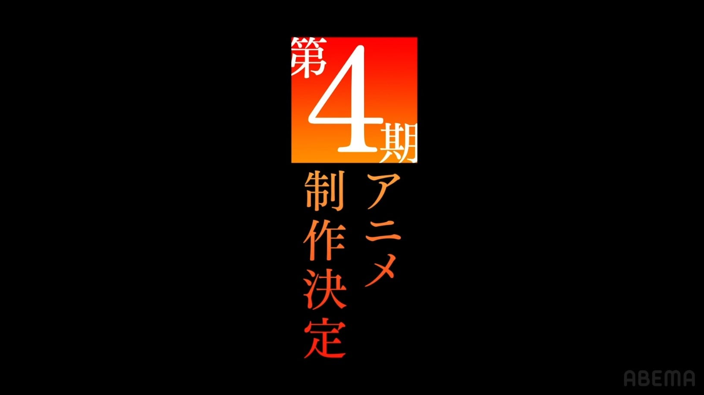
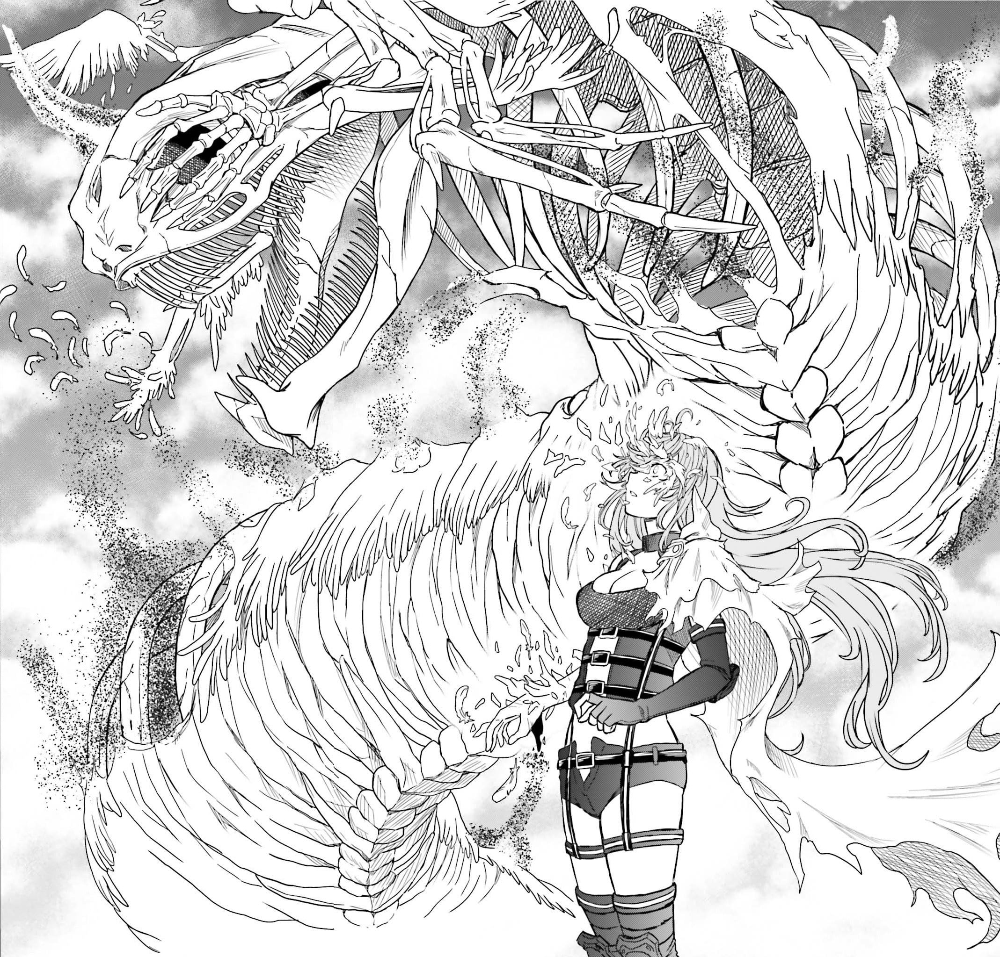

> [!bookinfo|noicon]+ **某科学的超电磁炮 第四季**
> 
>
| 日文名 | とある科学の超電磁砲 第4期 |
|:------: |:------------------------------------------: |
| 类型 | 小说改 |
| 新番 | 0 年 0 月 |
| 集数 | 共0话 |
| 官网 | [https://toaru-project.com/railgun_t/](https://https://toaru-project.com/railgun_t/) |
| 制作 | J.C.STAFF |
| 导演 | 長井龍雪 |
| 脚本 |  |
| 评分 | 9.6|
| 制片人 |  |

> [!abstract]+ **简介**
> 

> [!tip]+ **章节列表**
- 暂无章节信息

> [!tip]+ **主要角色**
> 
| 角色 | CV | 简介| 角色图片 |
|:----:|:---:|:---:|:--------:|
| 鰐河雷斧 |  |  |  |
| 佐天涙子 | 伊藤かな恵 | 栅川中学一年级，初春饰利的同班同学，表面上是无能力者（LV0），实质上是掀裙能力（underwear-peeking)LV5的超能力者。留着长发及肩的黑发，发饰是樱花。以掀裙子代替打招呼，并且每天都这样对待初春。拥有天真烂漫、充满幻想的性格。对于初春的内裤有着强烈的憧憬，也对掀裙子能力没有进步的事比较烦恼，所以对于“幻想御手（LEVELUPPER,可以使能力升级)”很有兴趣。  后宫有：正妻初春，爱人1号炮姐，3P希望潜在者白井读作变态。 |  |
| 御坂美琴 | 佐藤利奈 | 在学园都市中只有七人的等级五超能力者排行第三。拥有“超电磁炮(Railgun)”称号的电击超能力者。对电流和电磁力的控制出神入化。独有招牌特技“超电磁炮”，以电磁力将金属作为电磁炮以3倍音速射出，一般使用方便携带的游戏币，但也可控制更大的物体。使用电击产生的电磁波对机器有不好的影响，在本作中破坏了手机、有线电视，警备机器人等无数机械。还可放出高压电流枪、使用电磁力自由控制金属，招来真正的雷击或是制造电磁爆。  即使在贵族女校就读，行动却相当粗鲁，有以“四十五度斜角攻击机械维修法”（主要是踹自动贩卖机喝免钱饮料）的行为，对年纪较大的上条依旧口气狂妄。因此，主角曾说她完全没有大小姐该有的风范。但实际上是直率单纯且暗藏着自己特有的笨拙温柔（傲娇）的人。  性格好胜，每次向上条当麻挑战都被随便应付过去。随着屡次的接触，变得相当在意上条。  初期上条称她为“放电国中妹（Bilibili）”，茵蒂克丝则称她为“短发”。相当喜欢呱太为主题的饰品，爱好很低龄化，喜欢穿孩子气的内裤，或是在常盘台初中的制服裙下穿白色短裤。受到学妹白井黑子的爱慕。很喜欢动物，尤其是猫。其实每天都会偷偷去喂聚集在宿舍后面的野猫，但由于身体会放出微弱电磁波的关系被猫讨厌，每次野猫都跑的一只不剩，只剩美琴自己孤单一人拿着猫食，不过本人仍然不肯放弃的每天都去喂猫。  “这本轻小说真厉害！2010年”年度人气女角色首名。 “这本轻小说真厉害！2011年”人气女性角色排名首名。  在2010年拿下国际最萌联盟比赛的亚军。 在华人读者群中的绰号是“傲娇超电磁炮”，简称“傲娇炮”。 |  |
| 白井黒子 | 新井里美 | 《魔法禁书目录》系列配角、外传《科学超电磁炮》主角，学园都市中名校常盘台女子中学的一年级生，御坂美琴的学妹兼室友，能力为Level 4的空间移动，双马尾茶色头发的少女。 平常举止都很“淑女”，句尾有“~ですの（是哦）”的独特大小姐腔调。非常仰慕御坂美琴，甚至到近乎变态的程度，称呼美琴为“姐姐大人”。喜欢冲击力极强、布料很少的泳衣和内衣裤。第177活动支部所属风纪委员，具有很强的责任感和正义感。 |  |
| 初春飾利 | 豊崎愛生 | 栅川初中一年级，和黑子同为第177支部的风纪委员。留着黑色短发，头戴花圈，远看好像头顶着花瓶。白井的好友兼拍挡。对贵族大小姐的生活相当憧憬，很喜欢婚后光子所饲养名叫爱卡迪莉娜的蟒蛇。害羞谦逊，喜欢吃甜食，体能很差。但对风纪委员这项工作很认真。 能力为等级一的定温保存（Thermal Hand），只能做到使拿着的物体保持一定温度。黑客能力高超，工作时负责运用电脑处理信息，技术让专业人员都为之吃惊。独力设计“书库”的防火墙，击败许多网络黑客的入侵，是都市传说中“守护神（Gatekeeper）”的正体（但本人并不知晓）。 |  |
| 食蜂操祈 | 浅倉杏美 | 主要在《科学超电磁炮》中登场，在小说《新约》第六集第一次登场。刚登场时便操控大量人士追逐美琴。 有着一头漂亮的金发且身材很好，眼睛有闪亮的色泽，是学园都市的七名等级五超能力者中，排名第五的精神系超能力者，即史上最强“心理掌握”（Mental Out）：记忆改写、读心能力、人格洗脑、心电感应、回忆消去、意志增幅、思考再现、感情移植、精神控制，甚至可以同时对多数人发动能力。美琴曰：能将各种精神现象都可以一手包办、如同瑞士刀一样的万能超能力者。 其隶属于常盘台初中最大派阀，是君临常盘台的女王大人。个性腹黑，有对部下使用能力恶作剧的行为，平时常背着一个女性包包，内有着一个用来做为能力施放媒介的遥控器，曾对美琴提出不可威胁自己地位的警告。 在大霸星祭中遇见御坂美琴和上条当麻时，还没让御坂美琴介绍上条当麻时就轻松叫出“上条同学”并开始跟当麻卿卿我我，当下令美琴非常生气放出电击攻击当麻。似乎认识上条当麻的样子。 木原事件和美琴合作，意外是一个不善运动角色。在回忆中曾经参与研究计划，和美琴的疑似复制体如同朋友，由于该复制体的死亡和对自己的能力被研究者所利用，所以由此产生了对周围人们的不信任。后来通过对研究计划的研究人员洗脑逃出，并进入常盘台就读。 在新约七为了追着从“学舍之园”中冲出的当麻，因此一路来到了“博览百科”，最后与除了第二位以外的所有Level5一起对抗“人力资源”计划中的英雄们。 |  |
| ミサカ0号 | 小原好美 | 幼少期的食蜂操祈在“才人工房”遇到的少女，爱称“多莉”。是试造的0号御坂。外表年龄是中学生，在体内埋有机械来维持生命。研究者要求食蜂利用能力将食蜂冒充为小咪，利用食蜂的能力来安定心理，与食蜂十分友好，但由于为复制体，体质较差，最终被宣称死亡。死前曾问过食蜂的真名，令食蜂十分惊讶。  在魔法禁书目录外传SS2中提到了00000号御坂“全面调整(フルチューニング)”，是除了最后之作外，由天井亚雄所培育的特别个体，由于这名个体并未与御坂网络连结，所以目前所在地与现况不明。 |  |
| 春暖嬉美 |  | 某科学的超电磁炮引入的角色，目前已经被重新关押在第二少年院。在伙伴的帮助下，她一度引发了一场越狱风暴事件。   春暖嬉美是是一名留精弃粗，也是黑暗的五月计划的受试者之一。她在逃离某个研究所后，为了不被其他组织注意而化名白绢仄火，来到了同一个孤儿院出身的青星铃兰所工作的第二少年院，并一直暗中支配着第二少年院。 与白绢仄火、鳄河雷斧、钓钟茶寮、青星铃兰是关系密切的好朋友。  嬉美原本说话的风格十分粗野，但随着龙的力量增强，说话的风格相对偏向了古风。 据嬉美自己所说，她在经历了大脑改造实验后影响了她的味觉感受，导致她吃饭时感觉不出味道。她在对待别人的情感方面出现了障碍，难以感受到诸如快乐或悲伤等一系列感情，只能感受到终日的百无聊赖，唯有打架时能让她感受到一丝畅快与满足感，所以她会时常出没于有其他混混们所混迹的小巷子里。   除却超能力与龙之力，嬉美长期混迹于学园都市的底层之中，积累了丰富的打群架经验，仅凭肉搏战就一度压制过御坂美琴。她惯用武器是匕首，也会捡起地上的砖块拍别人，仅凭拳头她也能打倒多位男性混混。她下手风格颇为狠毒，在面对佐天泪子等人时也会毫无顾忌地施以重手。 |  |