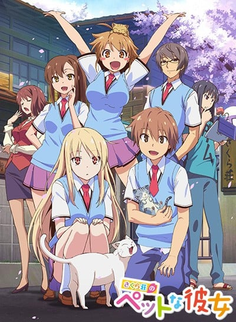
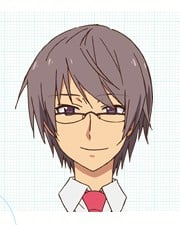

> [!bookinfo|noicon]+ **樱花庄的宠物女孩**
> 
>
| 日文名 | さくら荘のペットな彼女 |
|:------: |:------------------------------------------: |
| 类型 | 小说改 |
| 新番 | 2012 年 10 月 |
| 集数 | 共24话 |
| 官网 | [http://sakurasou.tv](https://http://sakurasou.tv) |
| 制作 | J.C.STAFF |
| 导演 | いしづかあつこ |
| 脚本 | 志茂文彦,小柳啓伍,岡田麿里,鴨志田一,花田十輝,伊藤美智子 |
| 评分 | 7.4|
| 制片人 | 鈴木薫 |

> [!abstract]+ **简介**
> 　　就读水明艺术大学附属高中的神田空太，一年级夏天时在宿舍养猫，而被校长叫去问话，并要他把猫赶走，不然就搬出宿舍。身为爱猫一族的空太，企图反抗权威，结果被撵出宿舍，流落到恶名昭彰的“樱花庄”。 隔年春天，随着世界级天才画家椎名真白搬进了樱花庄，空太开始过著被这名缺乏常识的少女耍得团团转的日子

> [!tip]+ **章节列表**
>- [ ] 第1话：猫、白、真白 (2012-10-08)
>- [ ] 第2话：都在画画 (2012-10-15)
>- [ ] 第3话：近在咫尺却又很遥远… (2012-10-22)
>- [ ] 第4话：色彩改变的世界 (2012-10-29)
>- [ ] 第5话：樱花庄的认真女孩 (2012-11-05)
>- [ ] 第6话：雨后青空 (2012-11-12)
>- [ ] 第7话：少女的强袭 (2012-11-19)
>- [ ] 第8话：放个巨大的烟花吧 (2012-11-26)
>- [ ] 第9话：秋季暴风雨袭来 (2012-12-03)
>- [ ] 第10话：讨厌讨厌，最喜欢了 (2012-12-10)
>- [ ] 第11话：银河喵喵波隆 (2012-12-17)
>- [ ] 第12话：爱的力量in文化祭 (2012-12-24)
>- [ ] 第13话：咫尺之外的冬季 (2013-01-07)
>- [ ] 第14话：圣诞夜的窗边与万家灯火 (2013-01-14)
>- [ ] 第15话：往常的自己在哪里？ (2013-01-21)
>- [ ] 第16话：一直以来都喜欢你······ (2013-01-28)
>- [ ] 第17话：情人节是巧克力的节日哦 (2013-02-04)
>- [ ] 第18话：赐予外星人初恋 (2013-02-11)
>- [ ] 第19话：住惯了的话也是很舒心的樱花庄 (2013-02-18)
>- [ ] 第20话：为了今后能有家可归 (2013-02-25)
>- [ ] 第21话：雨下不由人 (2013-03-04)
>- [ ] 第22话：那闪耀的每一天飞驰而过 (2013-03-11)
>- [ ] 第23话：毕业典礼 (2013-03-18)
>- [ ] 第24话：欢迎来到樱花庄 (2013-03-25)

> [!tip]+ **主要角色**
> 
| 角色 | CV | 简介| 角色图片 |
|:----:|:---:|:---:|:--------:|
| 神田空太 | 松岡禎丞 | さくら荘101号室の住人。水明芸術大学付属高校普通科の2年生。ひょんなことからさくら荘に入居することになり、面倒見の良い事からましろ当番に任命される。猫好きで飼い主のいない猫たちと暮らしている。 |  |
| 椎名ましろ | 茅野愛衣 | さくら荘202号室の住人。編入してきた美術科の2年生。性格はおとなしく世界的な天才画家だが、常識の無さから空太に介護されている。両親は外国に住んでいる。 |  |
| 上井草美咲 | 高森奈津美 | さくら荘201号室の住人で美術科の3年生。ここ10年で唯一特待生と認められた実力者。趣味はアニメやゲームで、自作アニメも多数制作している。仁のことが好き。 |  |
| 三鷹仁 | 櫻井孝宏 | さくら荘105号室の住人で美咲とは幼馴染。女性と遊んでいることが多い。将来は脚本家を目指している。 |  |
| 千石千尋 | 豊口めぐみ | さくら荘の監視要員として暮らしている美術の教員で、自称29歳と23ヶ月。ましろとは従姉妹の関係にある。  作为樱花庄的监督人在其中生活的美术老师，自称29岁23个月。与真白是表姐妹的关系。 |  |
| 赤坂龍之介 | 堀江由衣 | さくら荘102号室の住人で空太と同学年。家に引き篭っているため、さくら荘の住人たちとはパソコンでやりとりしている。3巻で初めて顔をだした。腰まで髪がある。授業中にパソコンを使い、トマトにかぶりついた。プログラマー。 |  |
| 青山七海 | 中津真莉 | 空太のクラスメイトで普通科の2年生。声優を目指していて養成所に通っている。さらに生活費や養成所の授業料を捻出するためバイトもしている。髪型はポニーテール。 |  |
| リタ・エインワーズ | 川澄綾子 | ましろがイギリスにいた頃のルームメイト。 |  |
| 中野乙羽 | 大坪由佳 | スイコー一年生。さくら荘の住人ではないが、空太たちの作品を見て感動し、「お手伝いしたい」と空太に声をかけてきた。今回の「スーパークリエイター発掘コンテスト」への参加の誘いをかけてきたのも彼女。好物の酢こんぶをいつも持ち歩いており「疲労回復によい」と、ゲーム制作に疲れたさくら荘メンバーに差し入れてくれることもしばしば。 |  |
| メイドちゃん | 堀江由衣 | 自動メール返信 プログラムAI |  |
| 深谷志穂 | 大西沙織 | 美術科の2年生→3年生。ましろには勝てないとは感じつつも、自分の道を行くと前向きな考えを持つ。美咲の存在や、にゃぼろんを見たことで感化されたのか独学でCGについて勉強しており、空太に自分もゲーム作りのメンバーに誘うように持ち掛けていて、水明芸術大学進学後にメンバー入りする。 髪型はおさげで、親しみやすい性格であるが、空太からは「アホの子」と思われたり、空太とましろをからかうことも多々ある。 苗字のモデルは高崎線深谷駅。 |  |
| 上井草風香 | 早見沙織 | 大学生。美咲の姉で、仁の元彼女。美咲と容姿が似ているが、妹とは正反対の落ち着いた性格。 |  |