> [!bookinfo|noicon]+ **欢迎加入NHK！**
> 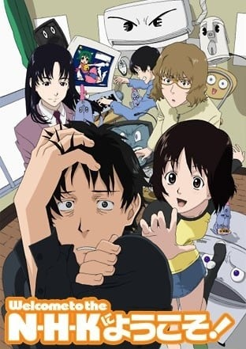
>
| 日文名 | N・H・Kにようこそ！ |
|:------: |:------------------------------------------: |
| 类型 | 小说改 |
| 新番 | 2006 年 7 月 |
| 集数 | 共24话 |
| 官网 | [http://gonzo.co.jp/archives/nhk](https://http://gonzo.co.jp/archives/nhk) |
| 制作 | GONZO |
| 导演 | 山本裕介 |
| 脚本 | 西園悟 |
| 评分 | 8.2|
| 制片人 | 柴田知典 |

> [!abstract]+ **简介**
> 大学退学第二年的春天，主角家里蹲废材佐藤达广在一事无成下，妄想认为自己的退学跟无职是NHK的全国性阴谋，就在这个时候在他面前出现了之前遇到过叫做中原岬的神秘美少女，并坚持达广一定要加入计划治好只会窝在家里的毛病……

> [!tip]+ **章节列表**
>- [ ] 第1话：欢迎加入本计划! (2006-07-09)
>- [ ] 第2话：欢迎成为创作者! (2006-07-16)
>- [ ] 第3话：欢迎注视美少女! (2006-07-23)
>- [ ] 第4话：欢迎来到新世界! (2006-07-30)
>- [ ] 第5话：欢迎接受辅导! (2006-08-06)
>- [ ] 第6话：欢迎来到教室! (2006-08-13)
>- [ ] 第7话：欢迎来延期偿还! (2006-08-20)
>- [ ] 第8话：欢迎来到中华街! (2006-08-27)
>- [ ] 第9话：欢迎来到夏日! (2006-09-03)
>- [ ] 第10话：欢迎来到黑暗面! (2006-09-10)
>- [ ] 第11话：欢迎掉入阴谋! (2006-09-17)
>- [ ] 第12话：欢迎来到网聚! (2006-09-24)
>- [ ] 第13话：欢迎来到天国! (2006-10-01)
>- [ ] 第14话：欢迎来到现实! (2006-10-08)
>- [ ] 第15话：欢迎来到幻想世界! (2006-10-15)
>- [ ] 第16话：欢迎来结束游戏! (2006-10-22)
>- [ ] 第17话：欢迎来感受幸福! (2006-10-29)
>- [ ] 第18话：欢迎来感受前途无亮! (2006-11-05)
>- [ ] 第19话：欢迎来寻找青鸟! (2006-11-12)
>- [ ] 第20话：欢迎来到冬天! (2006-11-19)
>- [ ] 第21话：欢迎来重头开始! (2006-11-26)
>- [ ] 第22话：欢迎来成为神! (2006-12-03)
>- [ ] 第23话：欢迎来寻找岬! (2006-12-10)
>- [ ] 第24话：欢迎来到NHK! (2006-12-17)

> [!tip]+ **主要角色**
> 
| 角色 | CV | 简介| 角色图片 |
|:----:|:---:|:---:|:--------:|
| 佐藤達広 | 小泉豊 | 本作的主角，故事开始时为22岁，4年前被大学开除，不经不觉间当了四年的家里蹲，很容易陷入自己的妄想之中，特别是性幻想，靠着跟老家伸手住在出租屋过日子。  跟邻居的学弟山崎薫计划从事H-Game设计制作的工作，主要负责写剧本。  是一个废材，典型的NEET；沉迷网游；严重的交流障碍等种种精神变态现象。 | 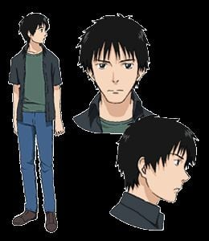 |
| 中原岬 | 牧野由依 | 家庭背景不明的神秘美少女，自称从事义工性质的工作要负责协助达广，常常在达广身边突然出现，并且帮他打理一些日常琐事。  也会进行一些莫名奇妙的治疗，但是总会把内容记错了，不知为何一心要帮助达广，为了逃避一名非常憎恨的女同学，休学了两年，曾经遇到在学生时代认识的同学，并自称现时在美国留学，现时已经复学。  18岁。 | 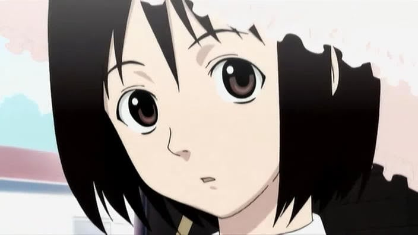 |
| 山崎薫 | 阪口大助 | 佐藤的学弟。由于其眼神在生气时非常凶狠，所以他在高中时经常被人欺负。  21岁。住在佐藤房间隔壁，深夜里大声播放着动画歌曲。  喜欢美少女角色。萝莉控、御宅族。  因为初恋的心理创伤而抱着扭曲的爱情观。  有着七菜子（菜菜子）这个傲娇的女友（大致）。  老家在北海道经营农业，因为是长子的关系时常被迫继承家业。  希望朝H-Game设计制作的工作发展，他负责绘画的部份。 | 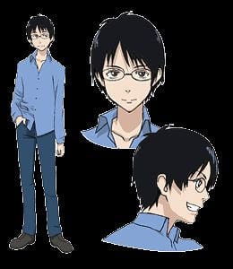 |
| 柏瞳 | 小林沙苗 | 佐藤高中时代的学姊。有药物成瘾。  漫画版中的职业是国家公务员。但压力极大，常常失眠且滥用药物，剧中曾带达广去参加自杀网聚。后来因为男友打电话来求婚而放弃轻生，反而导致达广萌生自杀的意念。在婚后找过达广出来，似乎是余情末了。 | 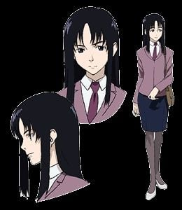 |
| 小林恵 | 早水リサ | 佐藤高中时代的同班同学。小说版中未登场。  高中时代是位认真的班级委员长。  高中毕业一段时间后，成为层压式推销公司的下线推销员。  有着友一（漫画版里的名称是四郎）这个重度家里蹲的哥哥。 | 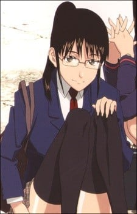 |
| torotoro／小林友一 | 竹本英史 | 小林惠的哥哥。漫画版中为四郎。小说版并未登场。  比佐藤还要重度的家里蹲。于网络游戏里和佐藤认识。 | 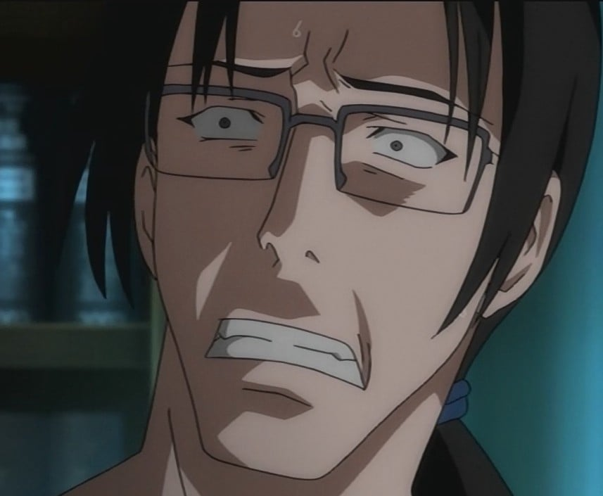 |
| 緑川七菜子 | 宍戸留美 | 漫画版里为菜菜子。小说中并未登场（只有名称出现）。  和山崎同样是动画学院声优科学生的女孩子。傲娇。山崎的女朋友（大致）。  喜欢美少年、美少女。  自称不喜欢御宅族 | 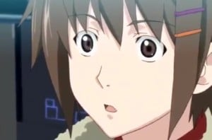 |
| ひきこもり星人 |  | 漫画、动画版的吉祥物。有着紫色的外表。  达广妄想中的外星人。达广认为他们是属于日本家里蹲协会的，就是他们的阴谋把达广变成了家里蹲。 | 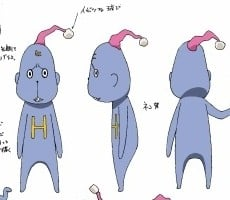 |
| 城ヶ崎彰 | 飛田展男 | 瞳的丈夫，漫画中是一名心理医生，动画中则是IT产业的工程师，但是与瞳的关系好像不太好。 | 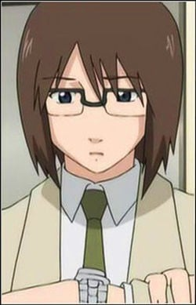 |
| プルリン | 宍戸留美 | TVアニメのヒロイン。魔呆の星からやってきた「マジ軽異星人」。困った人を見つけると何にでも変身して人助けをするのだが、感謝される事もなく、むしろ不気味がられる。語尾に「〜ぷりん」がつく。 | 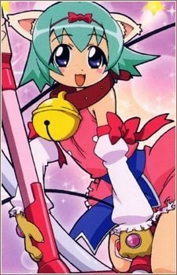 |
| 佐藤シヅエ | 荘真由美 | 佐藤达广的妈妈。 | 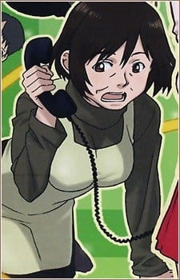 |