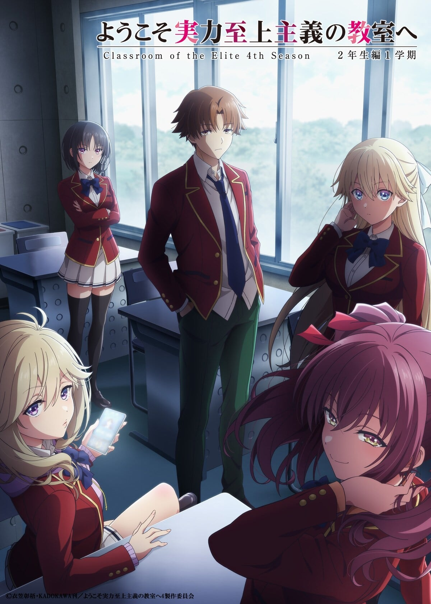
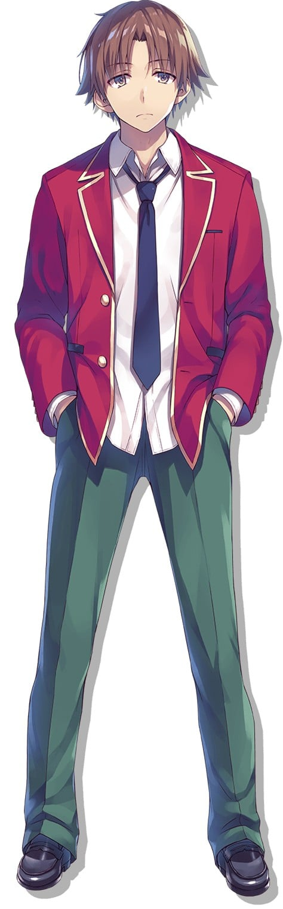
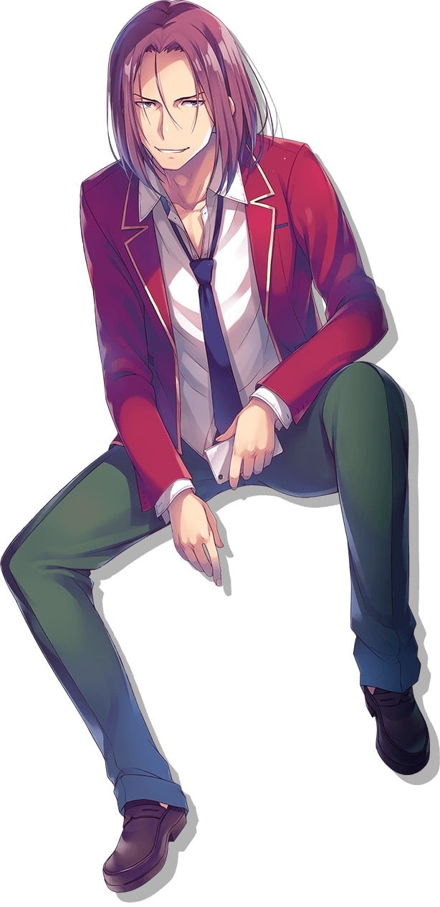

> [!bookinfo|noicon]+ **欢迎来到实力至上主义教室 第四季**
> 
>
| 日文名 | ようこそ実力至上主義の教室へ 4th Season |
|:------: |:------------------------------------------: |
| 类型 | 小说改 |
| 新番 | 2026 年 4 月 |
| 集数 | 共0话 |
| 官网 | [http://you-zitsu.com/](https://http://you-zitsu.com/) |
| 制作 | ラルケ |
| 导演 | 野亦則行 |
| 脚本 | 重信康,勝冶京子 |
| 评分 | 6|
| 制片人 |  |

> [!abstract]+ **简介**
> 东京都高度育成高等中学，标榜升学率、就职率达百分之百，而且每个月会提供相当于十万圆金钱的点数，是一间梦幻学校。但其实是一间只有少部分成绩优秀的人，才拥有优良待遇的实力至上主义学校。
绫小路等人在一年级第三学期升上C班，但最后一场特别考试却惜败A班，再度降格D班。二年级将从D班重新起跑。春假过后，绫小路和轻井泽成为男女朋友，堀北则是与憧憬学这个优秀兄长的自己诀别。在人际关系渐渐产生变化的情况下，他们升上二年级。绫小路他们新二年级生的第一场特别考试，是与新生一组进行笔试。然而，新生中有月城找来的White room刺客混入其中——
跨越学年的新关系，将招来狂风暴雨还是风平浪静？第二年的学校生活现在拉开序幕。

[简介原文]
東京都高度育成高等学校、それは進学率・就職率100％を誇り、毎月10万円の金銭に相当するポイントが支給される夢のような学校。しかし、その内実は一部の成績優秀者のみが好待遇を受けられる実力至上主義の学校であった。1年生3学期にCクラスへと昇格した綾小路たちだったが、1学年最終特別試験の結果、Aクラスに惜敗し、再びDクラスへと降格。2年生はDクラスからの再スタートとなった。春休みを経て、綾小路は軽井沢と恋人関係となり、堀北は優秀な兄・学にあこがれていた自分と決別。少しずつ人間関係が変化する中で、2年生へと進級する。綾小路たち新2年生の最初の特別試験は、新入生とパートナーを組んで行う筆記試験。しかし、新入生の中には、月城が手配したホワイトルームからの刺客が紛れており──。学年を超えた新たな関係が呼ぶのは、嵐か凪か。2年目の学校生活の幕が今、切って落とされる。

> [!tip]+ **章节列表**
>- [ ] 第1话：ホワイトルームからの刺客 (2026-04-01)
>- [ ] 第2话： (2026-04-01)
>- [ ] 第3话： (2026-04-01)
>- [ ] 第4话： (2026-04-01)
>- [ ] 第5话： (2026-04-08)
>- [ ] 第6话： (2026-04-15)
>- [ ] 第7话： (2026-04-22)
>- [ ] 第8话： (2026-04-29)
>- [ ] 第9话： (2026-05-06)
>- [ ] 第10话： (2026-05-13)
>- [ ] 第11话： (2026-05-20)
>- [ ] 第12话： (2026-05-27)

> [!tip]+ **主要角色**
> 
| 角色 | CV | 简介| 角色图片 |
|:----:|:---:|:---:|:--------:|
| 堀北鈴音 | 鬼頭明里 | 本作的女主角，D班的领军人物，学习成绩优异，但不愿意与其他人交流，常常表现的很冷漠、毫不留情。为了追赶自己的哥哥堀北学而来到学校。在学校的特殊考试中的出色发挥使她渐渐成为领头人物，在失败中渐渐成长，试图不再依赖绫小路，而是靠自己赢得考试。 |  |
| 綾小路清隆 | 千葉翔也 | 本作的主人公。虽然帅气程度在男生中排第五，但不善与人交流，一直试图交更多的朋友。D班真正的王牌与幕后，以堀北铃音作为掩护隐藏了自己的实力，虽然经常暗中帮助堀北，但也会为了自己的目的让她吃苦头。为了胜利不择手段，会利用可以利用的一切资源，不管是敌方或是友方。 |  |
| 櫛田桔梗 | 久保ユリカ | D班的中心人物之一，虽然外表可爱但也有隐藏在底下的真实面目，曾经被绫小路看到自己发泄情绪的一面。擅长与人交流，试图和所有人成为朋友。但与此同时也积累了相当大的压力。 |  |
| 一之瀬帆波 | 東山奈央 | B班班长，性格活泼的美少女，深受B班学生们的爱戴。也在其他班级结交了一些朋友，是十分乐于助人的滥好人。 入学测验全年级第一，拥有对高一学生而言非常高的能力，推测与同年级A班的葛城康平、坂柳有栖拥有同样潜力，但因中学时代长时间缺席等不安因素所以被分到B班。 拥有高达数百万的个人点数，都是从正当渠道获取。 |  |
| 龍園翔 | 水中雅章 | C班的统治者，以暴力与智慧在C班独裁，同时被C的所有人轻蔑以及尊敬。虽然小学初中引发了很多事端，但都没有任何证据。有着和绫小路清隆类似的思考方法，将堀北玩弄于股掌之间。 |  |
| 軽井沢恵 | 竹達彩奈 | D班女同学的主要领袖，深受女生信赖，朋友也很多。积极的辣妹系金发蓝瞳不良少女，微微晒黑的皮肤，显得十分可爱。性格强势，受到同学、特别是女生们的信赖。所有层面的成绩皆为平均之下的水准，却具有若向心力一般的特质，小学、国中期间曾是班级活跃的核心人物。 |  |
| 茶柱佐枝 | 佐藤利奈 | D班班主任，教授日本史。 30岁，为人冷淡，教学态度消极。 早期就已经看出来绫小路的异常，曾经是这所学校的学生。 |  |
| 坂柳有栖 | 日高里菜 | A班的核心人物之一，和葛城各据一方。与葛城的冲突使A班一分为二成“坂柳派”和“葛城派”，所掌握的“坂柳派”在激烈的派系斗争中处于明显优势。即便自己缺席了旅行中的无人岛生存、干支考试和之后的体育祭，仍能遥控党羽掣肘葛城。且由于葛城未能领导A班在这些竞赛中取得突出的实绩，其核心地位在A班不降反升。 腿脚不灵便，身体也比较虚弱。虽然在外面表现的和蔼可亲，但在A班中并非如此。性格沉着冷静，拥有不可估量的思维能力，深受A班同学的信赖。 知道绫小路清隆的背景，对绫小路说过：“好久不见，有8年243天之久了呢”。并宣言要亲手埋葬他。 |  |
| 七瀬翼 | 佐藤未奈子 | ２年Dクラスの生徒。明るく前向きな優等生だが、[mask]月城から綾小路の詳細を聞かされており、ホワイトルームなど一部の関係者しか知らない情報を持っている。[/mask] |  |
| 天沢一夏 | 瀬戸桃子 | ２年Ａクラスの生徒。学力、身体能力ともに非常に高水準。ホワイトルームの出身で、感情を学んだため明るくポジティブ、かつ積極的に人との交流が出来る万能な生徒。 |  |
| 椿桜子 | 佐伯伊織 | ２年Cクラスの生徒。ちょっとミステリアスな部分を持つ女子生徒で、綾小路に対しては何らかの感情を抱いているが、その詳細、理由は不明。 |  |
| 宝泉和臣 | 江頭宏哉 | 初中是和龙园翔与三宅明人同一地区的不良少年，初一曾把大自己两个年级的别校（三宅读的初中）不良少年打到住院。拥有强大的身体能力和大量的打架经验，与须藤打架在力量跟速度上压制了对方，绫小路认为就连山田阿尔贝特和堀北学也不是他的对手。  ２年Dクラスの生徒。龍園と同じ超が付くほどの問題児。暴力と恐怖による支配がベストだと考えていて、卑怯な手段も堂々と行う。地頭が良く、授業は真面目に受けていないが、勉強はそれなりに出来る。 |  |