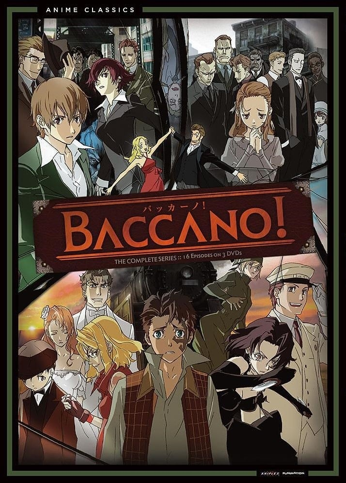
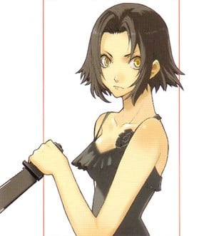
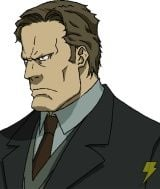
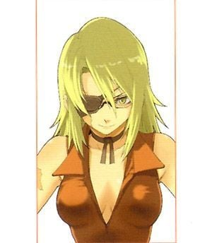
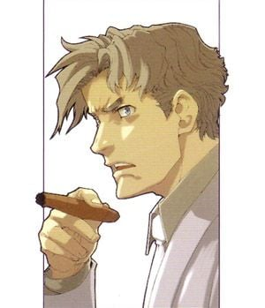
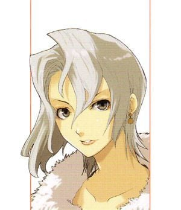
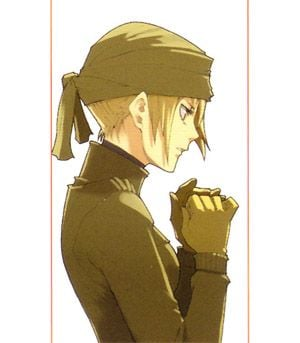
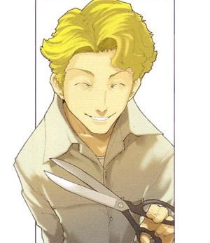

> [!bookinfo|noicon]+ **永生之酒**
> 
>
| 日文名 | BACCANO! -バッカーノ!- |
|:------: |:------------------------------------------: |
| 类型 | 小说改 |
| 新番 | 2007 年 7 月 |
| 集数 | 共16话 |
| 官网 | [http://www.baccano.jp/](https://http://www.baccano.jp/) |
| 制作 | Brain's Base |
| 导演 | 大森貴弘 |
| 脚本 | 高木登 |
| 评分 | 8.2|
| 制片人 | 佐藤由美 |

> [!abstract]+ **简介**
> 　　1711年在大西洋上，背井离乡的炼金术师们从恶魔手中得到了一样东西——那便是永生之酒。为了独占永生之酒的配方，在秘密之船上的众人开始互相残杀。1930年代的纽约的黑道中，年少有为的菲洛、傻瓜盗贼夫妇、200年老不死的炼金术士和他的助手，以及菲洛从小的玩伴、豪门千金、恐怖组织成员、年轻的列车长……这一群原本毫不相干的人却因永生之酒的复苏让他们的命运开始复杂交错起来。
　　以纽约作为目的地，从芝加哥出发穿越美洲大陆的列车上，命运之轮将所有人聚集到了一起。而在这辆列车上的不仅仅是“人类”而已。传说中的幽灵再次出现，车上的旅客从最后一节车厢开始一个一个接连消失……

> [!tip]+ **章节列表**
>- [ ] 第1话：副社长不谈论自己是主角的可能性
>- [ ] 第2话：无视老妇人的不安 大路横断铁路号驶出
>- [ ] 第3话：蓝迪和贝乔忙着派对的准备
>- [ ] 第4话：拉德·卢梭非常享受高谈阔论与杀戮
>- [ ] 第5话：贾格西·史普罗德边哭边发抖边蛮干
>- [ ] 第6话：铁路追踪者在车内暗中反复虐杀
>- [ ] 第7话：全部都是从亚特威纳·奥伊斯号的船上开始
>- [ ] 第8话：艾萨克和蜜莉雅不知不觉的在周围散播幸福
>- [ ] 第9话：克雷亚·史坦菲尔德忠实的完成职务
>- [ ] 第10话：察斯沃夫·梅耶鲁畏惧著不死者的身影思考策略
>- [ ] 第11话：夏涅·拉弗雷特在两个怪人前保持沉默
>- [ ] 第12话：费洛和甘德鲁三兄弟被凶手枪杀了
>- [ ] 第13话：不死者与普通人同样歌颂人生
>- [ ] 第14话：葛兰哈姆·史贝库塔的爱与和平
>- [ ] 第15话：抵达高级住宅区的不良少年们仍然与平时没有不同
>- [ ] 第16话：卡萝醒悟到这个故事不可能完结

> [!tip]+ **主要角色**
> 
| 角色 | CV | 简介| 角色图片 |
|:----:|:---:|:---:|:--------:|
| シャーネ・ラフォレット | 広橋涼 | 外观：黑短发，有着深邃的金色眼瞳 简介：修伊·拉弗雷特的女儿，无法说话的少女。原为“幽灵”成员，火车事件后被“葡萄酒”求婚，其后答应。原觉得世界重要的事物只有父亲，认识“葡萄酒”和贾格西等人后慢慢有所改变，将之认定为重要的事物。 |  |
| ミリア・ハーヴェント | あおきさやか | 外观：二十岁左右。金发白人女性，比费洛矮一些。 性格：积极乐观，但有点秀逗。经常附和著艾萨克的话语。 简介：盗贼。艾萨克的伴侣。 |  |
| マイザー・アヴァーロ | 宮本充 | 外观：戴着眼镜，身材修长的斯文男士。栗子色头发。 性格：温和，有礼，被评为“很不像卡莫拉”。 经历：不死者，亚特威纳．奥伊斯号的成员。召唤出恶魔的人，因此懂得制作完整不死之酒的方法。 　　由于告诉过一半方法给弟弟，导致弟弟成为被吞食的对象，对此事非常后悔。 简介：玛尔汀乔家族的出纳员，用刀高手。费洛的上司。 |  |
| ベルガ・ガンドール | 三宅健太 | 甘德鲁家族的次男。家族中处于“攻击”的角色。 |  |
| セラード・クェーツ | 有本欽隆 | 吞食了麦莎的弟弟以及许多炼金术士。于1930年，利用调剂师—邦兹成功完成永生之酒。 |  |
| ダラス・ジェノアード | 伊丸岡篤 | 外观：大概二十岁的不良少年 性格：傲慢，自以为是。温柔的一面只会向妹妹表露。 富豪杰诺亚德家的次男。伊芙的哥哥。在他心中，伤害伊芙的人比利用或伤害自已的人，罪行更重。 |  |
| ニース・ホーリーストーン | 小林ゆう | 外观：身上有烧伤疤痕，载着眼罩及眼镜。 性格：有礼，除了贾格西以外无论对什么人也用敬语。 经历：小时在调制炸药时被炸伤，失去右眼，左眼丧失大部分视力。由于当时只能看见模糊的影子，认为一生也无法到清别人的脸，就不见别人和整日哭泣。后来贾格西为了她而在面上刺上刺青，使她就算无法分辨他人也能清楚地分辨贾格西。 简介：贾格西的青梅竹马兼情人。炸弹狂 |  |
| ラッド・ルッソ | 藤原啓治 | 外观：个子偏高，除此以外都很普通。 性格：用词异常轻浮浮，不懂何谓礼貌 经历：卢梭家族首领的侄子。喜欢杀害的只有相信自已不会死的人。 　　　小时是一个普通少年，但经过一次思考生死后，才变成现在的样子。 　　　于故事前一直也帮忙卢梭家族杀害敌对的人(虽然卢梭家族一直也要为他善后)。 　　　行动时没有计划，虽然是没有制定计划，但随着事态发展，再通过瞬间计算，强行使行动成功。 |  |
| シルヴィ・リュミエール | 高垣彩陽 | 格雷多的女友。拿到永生之酒后并未立即喝下，因此逃过了圣拉多的吞噬。1930年代在酒廊当歌手。 |  |
| レイチェル | 伊藤静 | 穿工作服的女人，身手矫健，擅长逃票。实际上是Daily Days新闻社的情报员，经常坐火车收集来自世界各地的情报。父亲曾是铁路技师，后被铁路公司陷害被迫为一次事故承担责任。为了报复铁路公司，瑞秋一直逃票乘车。火车事件后，用意外得到的一大笔钱补上以前所逃的票。 |  |
| チック・ジェファーソン | 山口勝平 | 性格：天真烂漫，心地善良，拷问后会关心被拷问的人。 经历：小时家中是一家钟表店，后来因后父欠债而被卖到甘德鲁家族。 简介：以“拷问魔”闻名。性格天真无邪，所以才会毫无恐惧地用剪刀来拷问人。 |  |
| アイザック・ディアン | 小野坂昌也 | 外观：二十岁左右。咖啡色头发，身材高眺的男士。经常穿着引人瞩目的衣装。 性格：积极乐观，但有点秀逗。缺少危机感，无论发生什么事也会向前进。 简介：盗贼。曾盗窃过博物馆的入口大门、糖果店的糖果巧克力、富豪子孙的不幸来源(庞大遗产)。一共87次左右(1930年后未计算在内) 　　　虽然性情古怪，却因此拯救过不少人(如察斯)，也为很多人带来欢笑。 |  |