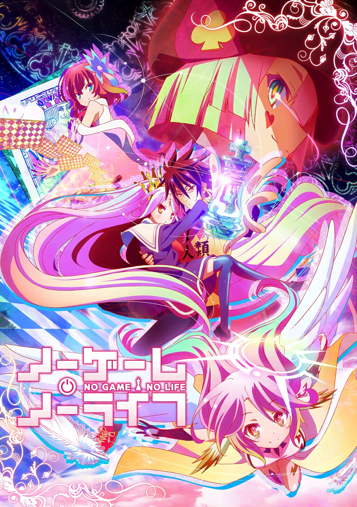
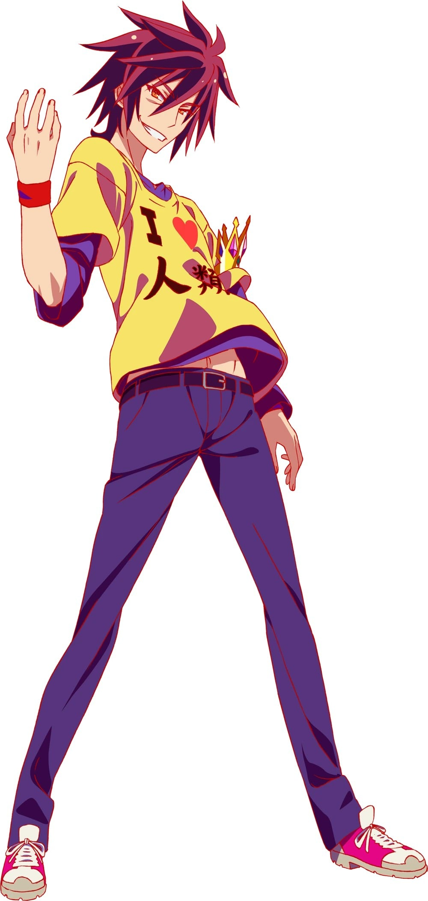
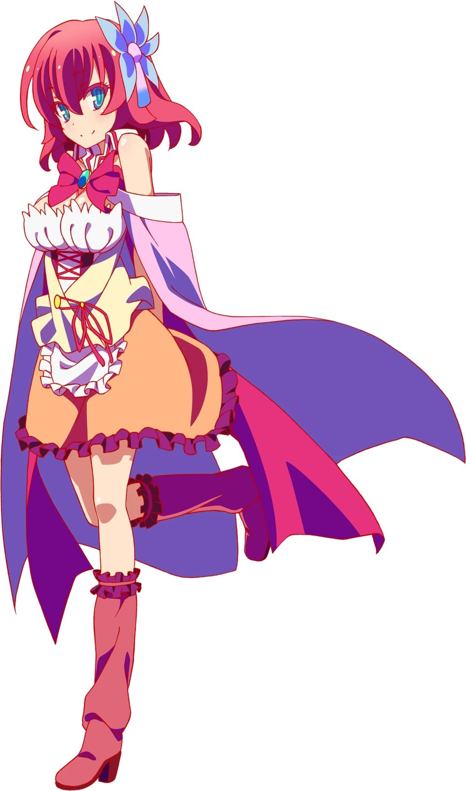
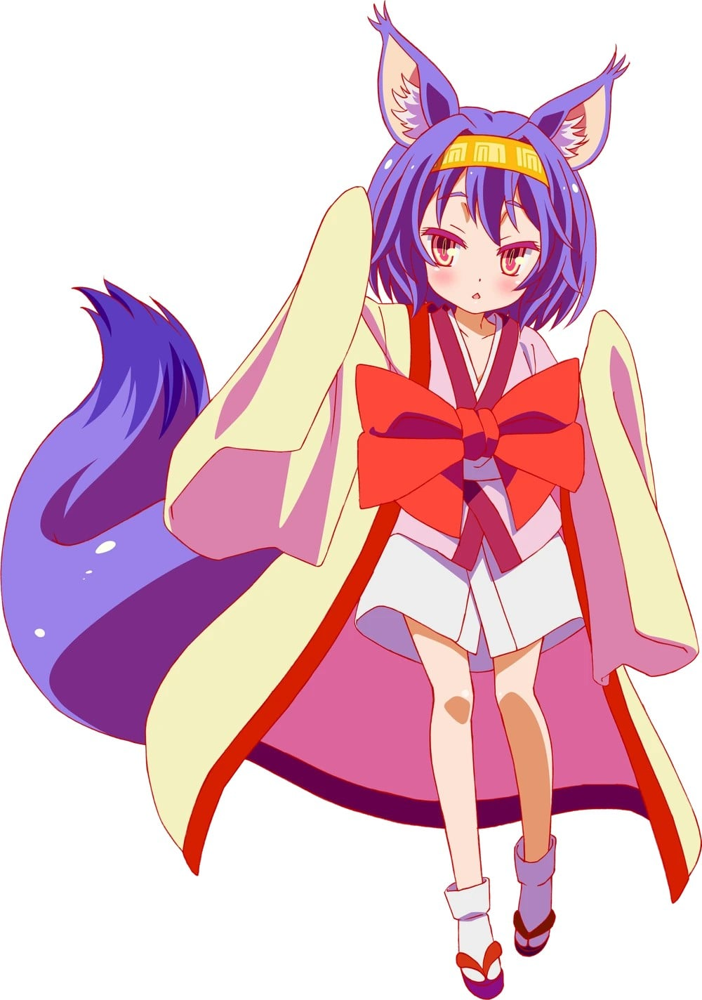
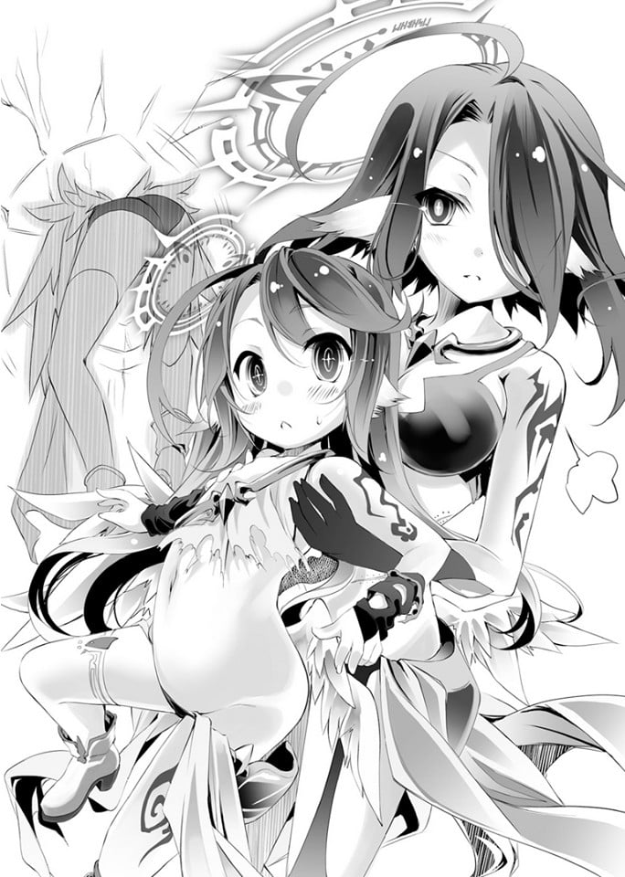
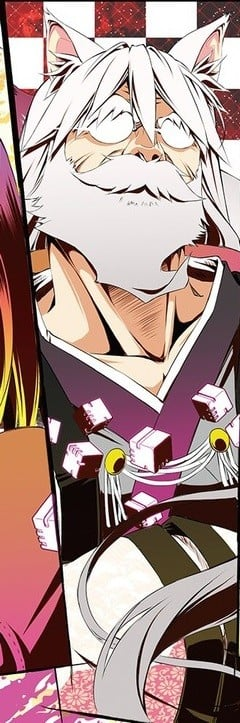
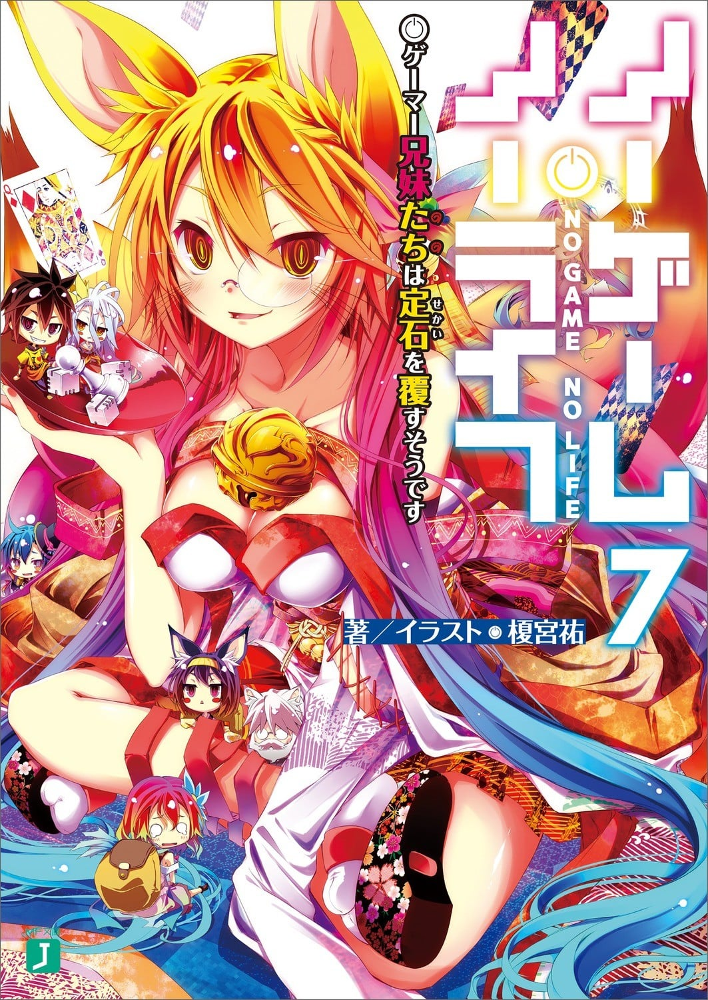

> [!bookinfo|noicon]+ **游戏人生**
> 
>
| 日文名 | ノーゲーム・ノーライフ |
|:------: |:------------------------------------------: |
| 类型 | 小说改 |
| 新番 | 2014 年 4 月 |
| 集数 | 共12话 |
| 官网 | [http://ngnl.jp/tv](https://http://ngnl.jp/tv) |
| 制作 | MADHOUSE |
| 导演 | いしづかあつこ |
| 脚本 | あおしまたかし,下山健人,榎宮祐,花田十輝 |
| 评分 | 7.7|
| 制片人 | 中本健二 |

> [!abstract]+ **简介**
> “听说游戏玩家兄妹要征服幻想世界”空与白既是尼特族又是家里蹲，但是在网路上却是被奉为都市传说的天才游戏玩家兄妹。称世界为「烂游戏」的两人，某一天被自称是“神”的少年召唤至异世界，那是个战争为神所禁止，“游戏决定一切”的世界──没错，甚至连国界也一样。
被其他种族逼至绝境，只剩下最后都市的『人类种』，空与白这两个废人兄妹能够成为异世界的『人类救世主』吗？“──来吧，游戏开始了。”

> [!tip]+ **章节列表**
>- [ ] 第1话：外行人（Beginner） (2014-04-09)
>- [ ] 第2话：挑战者（Challenger） (2014-04-16)
>- [ ] 第3话：老手（Expert） (2014-04-23)
>- [ ] 第4话：国王（Grand Master） (2014-04-30)
>- [ ] 第5话：布局（Weak Square） (2014-05-07)
>- [ ] 第6话：一步（Interesting） (2014-05-14)
>- [ ] 第7话：弃子（Sacrifice） (2014-05-21)
>- [ ] 第8话：起死回生（Fake End） (2014-05-28)
>- [ ] 第9话：解离法（Sky Walk） (2014-06-04)
>- [ ] 第10话：指向法（Blue Rose） (2014-06-11)
>- [ ] 第11话：诱导法（Killing Giant） (2014-06-18)
>- [ ] 第12话：收束法（Rule Number 10） (2014-06-25)
>- [ ] 第1话：妄想（Wild fancy） (2014-06-25)
>- [ ] 第2话：监督（Director） (2014-07-30)
>- [ ] 第3话：复仇（Revenge） (2014-08-27)
>- [ ] 第4话：人形（Dress Up / Doll） (2014-09-24)
>- [ ] 第5话：成长（Growth） (2014-10-29)
>- [ ] 第6话：食欲（appetite） (2014-11-26)

> [!tip]+ **主要角色**
> 
| 角色 | CV | 简介| 角色图片 |
|:----:|:---:|:---:|:--------:|
| モブキャラクター | 横山遵 | 闲角，常称作路人，在电视剧、电影等作品中，指戏份薄弱的副角、不相关的小人物、串场的闲杂人等。可能用来表达地方民众的声音，或是充当背景。 モブキャラクター（mob character）とは、漫画、アニメ、映画、コンピュータゲームなどに描かれる端役のこと。群衆（群集）、または主要キャラクター以外の、その他大勢のこと。群集キャラ、背景キャラともいう。 |  |
| 空 | 松岡禎丞 | 童貞、コミュ障、ニート、ゲーム廃人。『』(くうはく)の一人で白の兄。駆け引きに長けており、卓越した読心術を身につけている。前提の覆し、発想を転換させ、閃きを駆使して戦うゲームスタイルから、不確定性要素を多く含むゲームが得意。 |  |
| 白 | 茅野愛衣 | 不登校、コミュ障、ヒキコモリ、ゲーム廃人。『』(くうはく)の一人で空の妹。真っ白な髪と赤い瞳が特徴的な美少女。生後1年で言葉を発し、3歳の頃には複数言語と高等数学を修学した天才で、計算による先読みは予知にさえ到達する。 |  |
| ステファニー・ドーラ | 日笠陽子 | 人類種(イマニティ)の国であるエルキアのお姫様。負けず嫌いでプライドが高く、後先を考えずに行動することが多い。前国王である祖父の思いを継ぎ、滅亡寸前のエルキアを救いたいと願っている。お菓子作りが得意。 |  |
| ジブリール | 田村ゆかり | 位階序列第6位である天翼種(フリューゲル)の少女。大戦末期に造られた神殺しの兵器で、絶大な戦闘能力を誇る。極めて血の気が多く、例え上位種であっても自らが認めた相手でない限り、従うことはない。 |  |
| クラミー・ツェル | 井口裕香 | 国王を決めるゲームを行っている際、ステファニーが敗れた相手。森精種と手を結んでいた。 黒いベールで顔を覆っており暗い印象を与えるが、緊張の糸が切れるとすぐに泣き出す子供のような一面もある。 七位の森精種に隷属する状態が曾祖父の時代から続いている。人類種であるが、所属はエルヴン・ガルド。 『　　』との2回目のゲームに敗北してからは空に協力するようになり、今はエルヴン・ガンドを内部から切り崩しにかかっている。 |  |
| フィール・ニルヴァレン | 能登麻美子 | エルヴン・ガルド上院議員代行。見た目は十代半ばだが、実年齢は52歳。胸が大きい。     クラミーの主にあたり、彼女を隷属させている。だが、『奴隷制度』を採用する現在のエルヴン・ガルドには辟易しており、クラミーを守るためなら国が滅んでもかまわないと言うほど、彼女を大切に思っている。そのため陰でこっそり泣いているクラミーをいつも気にかけている。     高位魔法の術式を編むことに長け、その腕は上位の天翼種であるジブリールですら認めるほど。周囲からは二重術者と思われているが、実際は同時に6つの魔法を発動させることができる六重術者である。     空が一目置くほど頭の回転が速い。      エルヴン・ガンドが負けるように空に改竄された東部連合のゲーム内容をエルヴン・ガンドに報告してからは、エルヴン・ガルドを中から切り崩すため、クラミーとともに暗躍中 |  |
| テト | 釘宮理恵 | かつて《遊戯の神》と呼ばれた神。 不戦勝で唯一神になった。 自分にゲームを挑む条件を全く整えない十六種族に飽きたため、異世界のネット世界で『　　（くうはく）』と呼ばれ、都市伝説と化していた空と白を呼び出す |  |
| 初瀬いづな | 沢城みゆき | 黒髪黒目でフェネックのような大きく長い耳と尾を持つ。見た目年齢は一桁台の幼女。在エルキア東部連合大使。     祖父・初瀬いのの影響か、間違った丁寧語を使う。     電子ゲームが好きで、負けず嫌いな一面を持ち、空と白にはたびたび勝負を挑んでいる。     他国とのゲームに関してはいのから引き継いでからは常に彼女が戦っていたようで、国を守るために戦おうする使命から、楽しむということはほとんどなかった。     数少ない『血壊』個体で、対エルキア戦においてはその力を全て出し切り空たちと戦った。その中でゲームの本当の楽しさというものに触れていく。     空と白以外にいづなの喉を鳴らさせた撫でスキル持ちはいない。 |  |
| ラフィール |  | 天翼种第四号个体，在第六卷中天翼种迎战机凯种时被提及名字，在BD特典VOL.3及VOL.5《幕间 Highcard all Raise》前后篇中再次出场。 在吉普莉尔被创造之前，与阿兹莉尔带领天翼种挑战神灵种，曾一度战胜消灭了神灵，传说是拉菲尔击穿了神灵的神髓，实际上是阿兹莉尔以拉菲尔为盾，将她连同神髓一起击穿，导致拉菲尔身受连主神加护都无法修复的重创。出场时头顶残缺的光环，只剩单眼单翼。 因传说的关系加上阿兹莉尔表面上个性的转变，使得包括吉普莉尔在内的天翼种对她的尊重更胜阿兹莉尔，本人也对阿兹莉尔的转变感到诧异。 曾猜度战神阿尔特休赐与吉普莉尔自由意志，单独挑战上位种族的用意；亦曾借出龙精种的遗骨，以协助吉普莉尔研究挑战龙精种的方法。 |  |
| 初瀬いの | 麦人 | 初濑伊纲的爷爷，巫女的得力助手，前任兽人种驻艾尔奇亚大使馆大使，后任东部联合驻艾尔奇亚大使馆次使。 有着白色的头发，以及狐狸耳朵和尾巴。带着眼镜。九十八岁，和艾尔奇亚的先王交战过。平常说话时举止端庄，但是一遇到关于伊纲的事情就会暴露本性（孙女控）。 |  |
| 巫女 | 進藤尚美 | 东部联合的全权代理者，实质上的兽人种女王。 拥有闪耀着光辉的金色长发和金色修长兽耳，金色的两尾狐，身上穿着由白、赤、黑三色编织而成的，有如巫女服的衣饰。 眼镜娘。外貌是不过二十岁的美少女。但因为动作和语调的关系，给人年长的感觉。谈到年龄问题会很生气。 血坏个体，使用血坏后通过空白抚摸尾巴能减轻疲劳感。因为血坏个体的关系，老化十分缓慢。发动能力时可以强行突破物理极限的五感，捕捉到半径五百公尺内的一切动静，甚至抵抗20倍的大气压，短暂地在水面上奔驰。 |  |