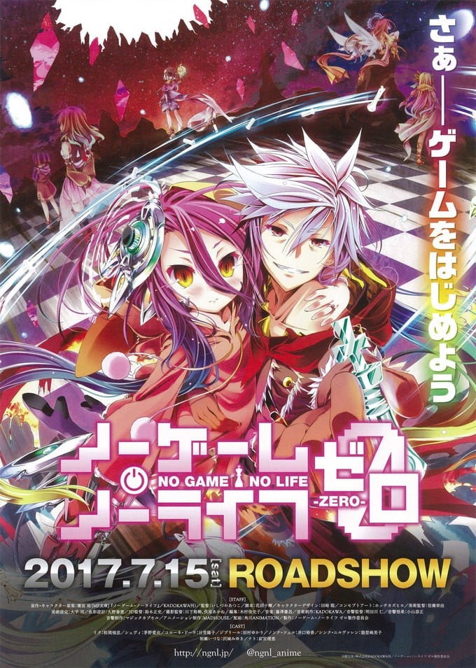
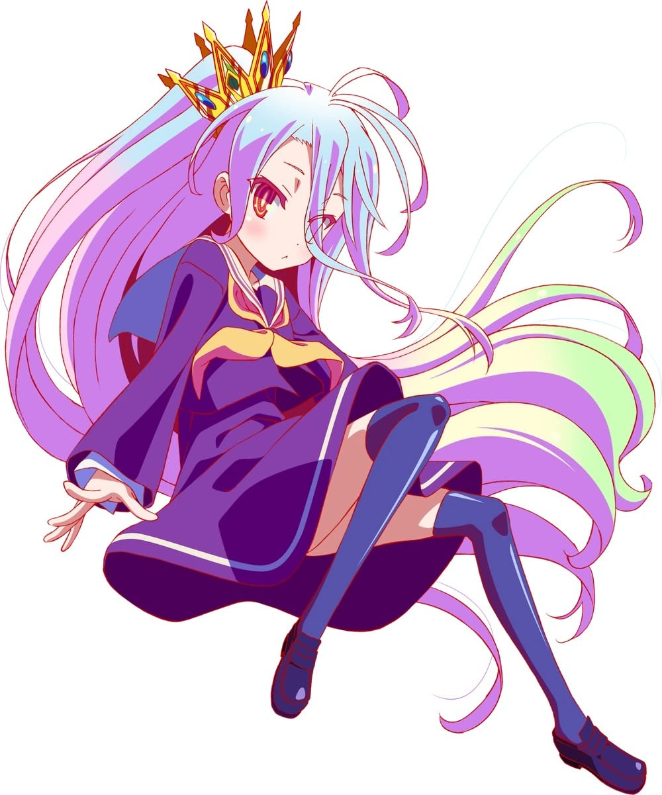
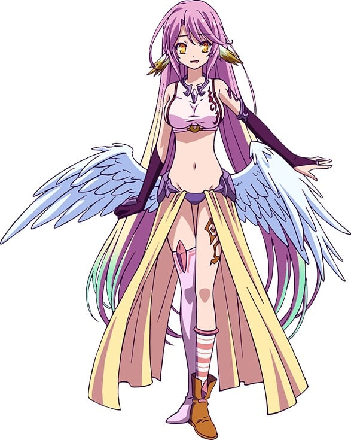
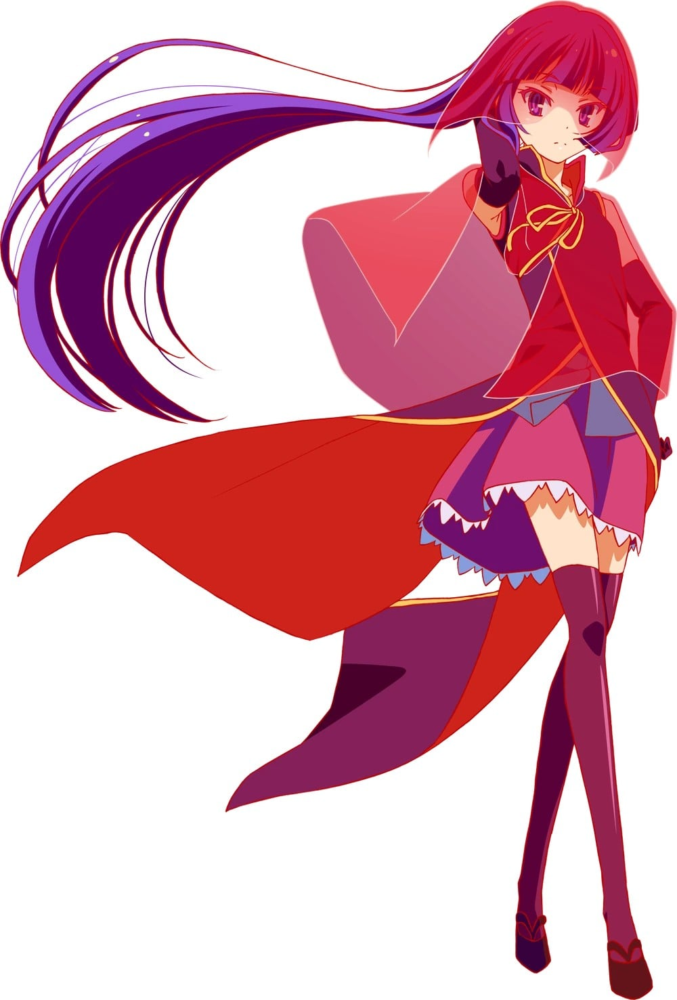
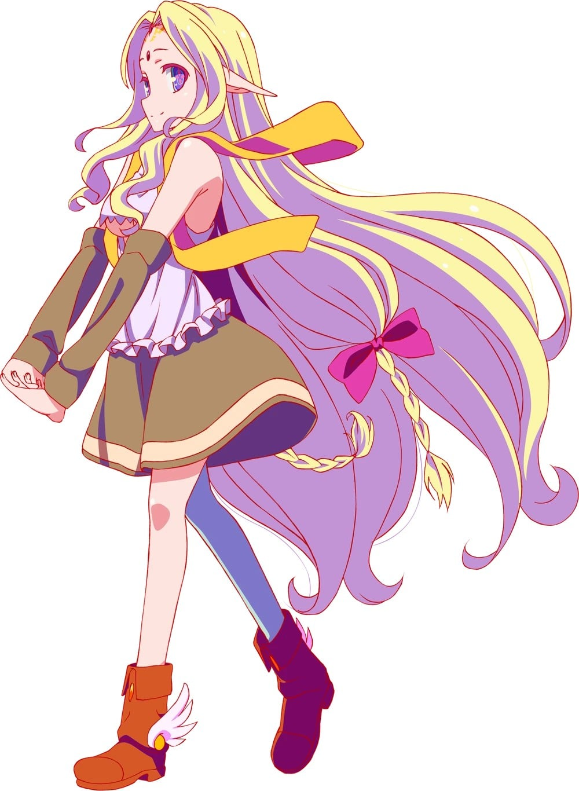
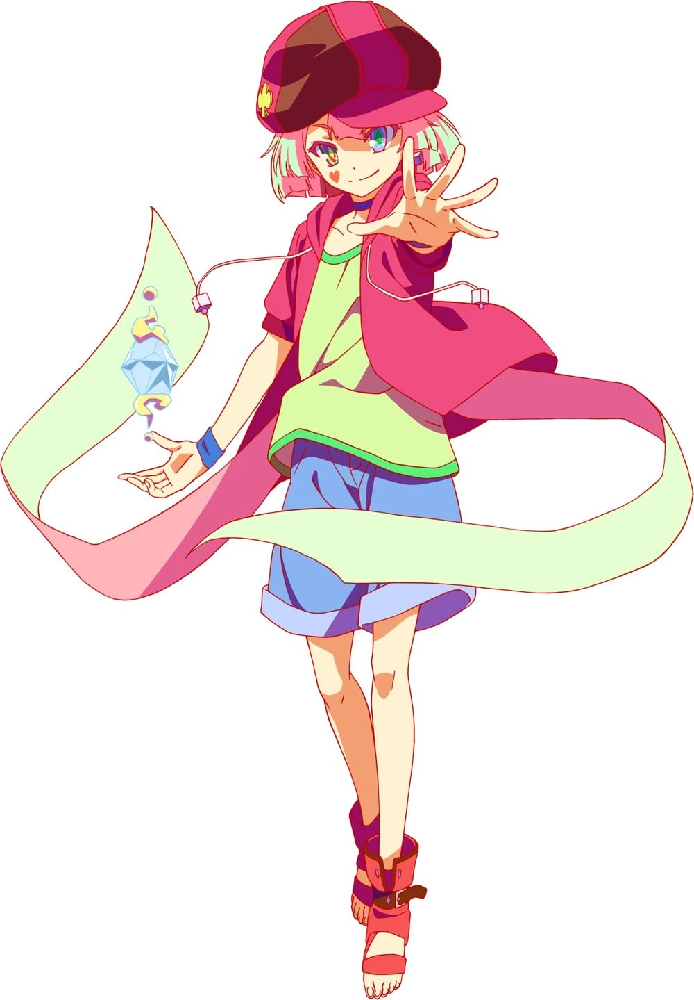
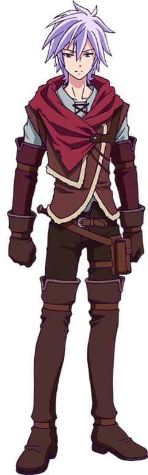
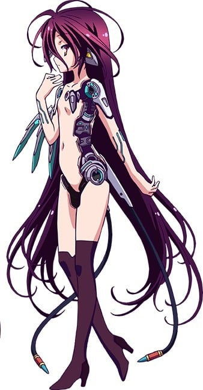
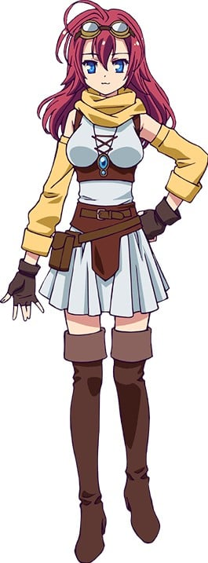
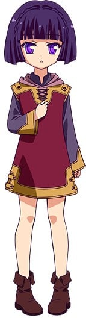

> [!bookinfo|noicon]+ **游戏人生 零**
> 
>
| 日文名 | ノーゲーム・ノーライフ ゼロ |
|:------: |:------------------------------------------: |
| 类型 | 小说改 |
| 新番 | 2017 年 7 月 |
| 集数 | 共1话 |
| 官网 | [http://ngnl.jp](https://http://ngnl.jp) |
| 制作 | MADHOUSE |
| 导演 | いしづかあつこ |
| 脚本 | 花田十輝 |
| 评分 | 8.1|
| 制片人 | 中本健二 |

> [!abstract]+ **简介**
> 那是个战争和暴力皆被神所禁止，由“游戏”决定一切的「盘上世界」。
战无不胜的兄妹玩家，空和白降临这个世界的六千余年前，有着诞生悠久大战，开天杀星的少年和少女。
这是影响至今的最古老的神话。
那不曾被人传颂的故事，现在拉开帷幕……。

> [!tip]+ **章节列表**
>- [ ] 第1话：NO GAME NO LIFE 游戏人生 ZERO (2017-07-15)
>- [ ] 第1话：マナー映像 (2017-07-15)

> [!tip]+ **主要角色**
> 
| 角色 | CV | 简介| 角色图片 |
|:----:|:---:|:---:|:--------:|
| 空 | 松岡禎丞 | 童貞、コミュ障、ニート、ゲーム廃人。『』(くうはく)の一人で白の兄。駆け引きに長けており、卓越した読心術を身につけている。前提の覆し、発想を転換させ、閃きを駆使して戦うゲームスタイルから、不確定性要素を多く含むゲームが得意。 |  |
| 白 | 茅野愛衣 | 不登校、コミュ障、ヒキコモリ、ゲーム廃人。『』(くうはく)の一人で空の妹。真っ白な髪と赤い瞳が特徴的な美少女。生後1年で言葉を発し、3歳の頃には複数言語と高等数学を修学した天才で、計算による先読みは予知にさえ到達する。 |  |
| ステファニー・ドーラ | 日笠陽子 | 人類種(イマニティ)の国であるエルキアのお姫様。負けず嫌いでプライドが高く、後先を考えずに行動することが多い。前国王である祖父の思いを継ぎ、滅亡寸前のエルキアを救いたいと願っている。お菓子作りが得意。 |  |
| ジブリール | 田村ゆかり | 位階序列第6位である天翼種(フリューゲル)の少女。大戦末期に造られた神殺しの兵器で、絶大な戦闘能力を誇る。極めて血の気が多く、例え上位種であっても自らが認めた相手でない限り、従うことはない。 |  |
| クラミー・ツェル |  | 国王を決めるゲームを行っている際、ステファニーが敗れた相手。森精種と手を結んでいた。 黒いベールで顔を覆っており暗い印象を与えるが、緊張の糸が切れるとすぐに泣き出す子供のような一面もある。 七位の森精種に隷属する状態が曾祖父の時代から続いている。人類種であるが、所属はエルヴン・ガルド。 『　　』との2回目のゲームに敗北してからは空に協力するようになり、今はエルヴン・ガンドを内部から切り崩しにかかっている。 |  |
| フィール・ニルヴァレン |  | エルヴン・ガルド上院議員代行。見た目は十代半ばだが、実年齢は52歳。胸が大きい。     クラミーの主にあたり、彼女を隷属させている。だが、『奴隷制度』を採用する現在のエルヴン・ガルドには辟易しており、クラミーを守るためなら国が滅んでもかまわないと言うほど、彼女を大切に思っている。そのため陰でこっそり泣いているクラミーをいつも気にかけている。     高位魔法の術式を編むことに長け、その腕は上位の天翼種であるジブリールですら認めるほど。周囲からは二重術者と思われているが、実際は同時に6つの魔法を発動させることができる六重術者である。     空が一目置くほど頭の回転が速い。      エルヴン・ガンドが負けるように空に改竄された東部連合のゲーム内容をエルヴン・ガンドに報告してからは、エルヴン・ガルドを中から切り崩すため、クラミーとともに暗躍中 |  |
| テト | 釘宮理恵 | かつて《遊戯の神》と呼ばれた神。 不戦勝で唯一神になった。 自分にゲームを挑む条件を全く整えない十六種族に飽きたため、異世界のネット世界で『　　（くうはく）』と呼ばれ、都市伝説と化していた空と白を呼び出す |  |
| 初瀬いづな | 沢城みゆき | 黒髪黒目でフェネックのような大きく長い耳と尾を持つ。見た目年齢は一桁台の幼女。在エルキア東部連合大使。     祖父・初瀬いのの影響か、間違った丁寧語を使う。     電子ゲームが好きで、負けず嫌いな一面を持ち、空と白にはたびたび勝負を挑んでいる。     他国とのゲームに関してはいのから引き継いでからは常に彼女が戦っていたようで、国を守るために戦おうする使命から、楽しむということはほとんどなかった。     数少ない『血壊』個体で、対エルキア戦においてはその力を全て出し切り空たちと戦った。その中でゲームの本当の楽しさというものに触れていく。     空と白以外にいづなの喉を鳴らさせた撫でスキル持ちはいない。 |  |
| リク | 松岡禎丞 | 大战时期的人类，十八岁时率领着近二千人的聚落作战，通哓地精语、森精语、妖精语、妖魔语及兽人语。 七岁时遇上龙精种与机凯种交战，“焉龙”亚兰雷夫发射的“崩哮”因机凯种的“通行管制”而偏离目标，直接毁灭了里克的故乡，使他失去双亲，之后被克洛妮·多拉（克珑）收留。十三岁时聚落再次在天翼种和龙精种交战中被毁，因表现异常冷静而成为部落领袖。为了让部落能够继续存活，五年内命令一共四十八人为部落而牺牲生命，却因为始终无法避免牺牲感到内疚。平时隐藏自己的真心，在外忍耐著扮演虚假的自己，只有自己单独在房间时才发泄自己真实的情绪。  人間たちの集落を率いる若きリーダー。 集落を守るためなら、どんな犠牲も厭わずに 実行する強い意志を持った少年。 |  |
| シュヴィ | 茅野愛衣 | 外表看起来只有十岁左右的机凯种少女。黑发。机体识别码是“Üc207号机Pr型4f57t9机”。休比的名字是由里克·多拉把她自己所提出的“休瓦尔扎”（Schwarzer，是德文黑色之意）所改而成。在机凯种之中属于性能在平均以下的“解析体”。 在机凯种与“焉龙”亚兰雷夫带领七只随从龙大规模交战之际，首次发现身处已毁部落、当时七岁的里克，对他以生存为优先的行动有所不解，于是产生名为“惊愕”的错误讯号，为了解析机凯种是否有“心”、“自我”和“灵魂”，过度对里克的行为解析而产生大量错误讯号，自体判定为会对全体机凯种带来不良影响，因而被切断与机凯种的连结，遭到报废。 为了知道“心”为何物，在十八岁的里克探查森精种被毁的废都时，强行推倒里克并且夺去其初吻，之后与里克一同行动和生活，并告诉他关于大战开始和结束的关键——唯一神的宝座“星杯”的资料。  リクが出会う機械仕掛けの少女。 機凱種(エクスマキナ)と呼ばれる種族で 高い戦闘能力と様々な兵装を有している。 |  |
| コローネ・ドーラ | 日笠陽子 | 大战时期的人类，聚落居民之一，与里克同龄，七岁时收留了避难而来的里克，一直自视为他姐姐。里克一直只叫她“克珑”，直到和她诀别时才肯叫她全名及以“姐姐”相称。 具有很好的理解能力以及知性，能够修理地精种的望远镜，并且只听一次有关于星杯的机制便理解。 对里克完全信任。 大战结束后于艾尔奇亚建国领导人类种，是原王族史蒂芙的直系祖先，并被称颂为“生涯没有人见过她哭泣的模样，充满知性与笑容，引导‘大战’终结后的人类种才女，是多拉家的骄傲”。  リクが率いる集落の住人で、 リクの義理の姉を自称する女の子。 いつも明るく、集落のムードメーカー的な存在。 |  |
| ノンナ・ツェル | 井口裕香 | 聚落居民之一，伊旺与玛露妲的女儿。  リクが率いる集落に住む女の子。 リクと共に集落の外に出て、 物資や情報を探しているイワンの娘。 父の帰りを心待ちにしている。 |  |